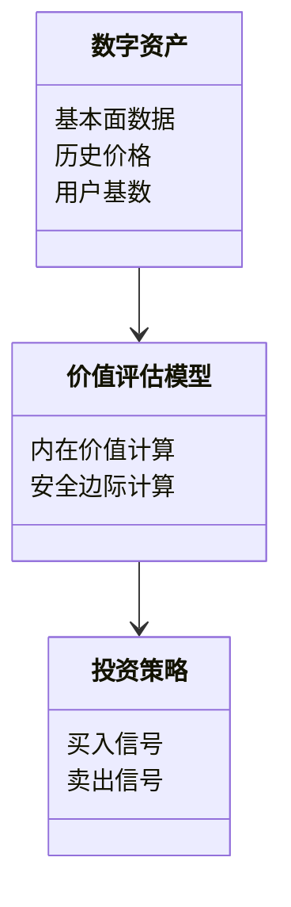

                 


# 《格雷厄姆特价股票理论在可再生数字资产中的应用》

---

## 关键词：  
格雷厄姆投资理论、价值投资、数字资产、可再生数字资产、数学模型、算法实现、系统架构  

---

## 摘要：  
本文探讨了格雷厄姆特价股票理论在可再生数字资产领域的应用，结合价值投资理念与数字资产的特点，提出了基于格雷厄姆理论的数字资产价值评估模型和算法实现。通过分析数字资产的内在价值、安全边际以及市场波动性，本文为投资者提供了一套科学的数字资产投资策略，并通过实际案例验证了该方法的有效性。  

---

## 第1章: 格雷厄姆特价股票理论的核心概念  

### 1.1 价值投资的起源与核心理念  

#### 1.1.1 价值投资的定义与历史发展  
价值投资是一种以基本面分析为基础的投资策略，起源于20世纪初，由本杰明·格雷厄姆和他的合作伙伴戴维德·多德共同提出。其核心理念是寻找市场价格低于其内在价值的股票，通过长期持有实现收益。  

#### 1.1.2 格雷厄姆的投资策略与选股原则  
格雷厄姆的选股原则包括：  
1. **安全边际**：买入价格低于内在价值的股票，以确保投资的安全性。  
2. **内在价值计算**：通过基本面分析估算股票的真正价值。  
3. **长期视角**：忽略短期市场波动，关注长期投资价值。  

#### 1.1.3 价值投资与现代金融市场的结合  
尽管格雷厄姆理论诞生于传统股票市场，但其核心思想在现代金融市场中依然适用。通过调整其理论，我们可以将其应用于更复杂的数字资产领域。  

---

### 1.2 可再生数字资产的基本特性  

#### 1.2.1 数字资产的定义与分类  
数字资产是指以数字形式存在的资产，主要包括：  
1. **加密货币**：如比特币、以太坊等。  
2. **NFT（非同质化代币）**：用于表示独特的数字资产。  
3. **DeFi（去中心化金融）**：基于区块链的金融工具。  

#### 1.2.2 可再生数字资产的独特属性  
可再生数字资产是指可以通过技术手段不断增殖的数字资产，例如部分NFT项目或DeFi协议的代币。其独特属性包括：  
1. **可扩展性**：数字资产可以通过技术手段无限扩展。  
2. **可编程性**：基于区块链技术，数字资产可以被编程为自动化工具。  
3. **去中心化**：数字资产通常基于去中心化平台，具有抗审查性。  

#### 1.2.3 数字资产市场的波动性与风险  
数字资产市场的波动性远高于传统金融市场，其价格受市场情绪、技术发展和政策法规的影响较大。因此，投资者需要更加谨慎地评估数字资产的价值和风险。  

---

## 第2章: 格雷厄姆理论在数字资产中的应用原理  

### 2.1 数字资产的内在价值评估  

#### 2.1.1 内在价值的定义与计算方法  
内在价值是数字资产的真正价值，与市场价格无关。计算内在价值时，需要考虑以下因素：  
1. **项目基本面**：团队实力、技术实现、市场定位等。  
2. **市场流动性**：数字资产的交易活跃度。  
3. **网络效应**：数字资产的用户基数和生态系统。  

#### 2.1.2 安全边际的定义与作用  
安全边际是格雷厄姆理论中的核心概念，指买入价格与内在价值之间的差距。在数字资产投资中，安全边际越大，投资风险越小。  

#### 2.1.3 价值投资与数字资产的结合  
通过分析数字资产的内在价值和安全边际，投资者可以找到被低估的数字资产，实现长期收益。  

---

### 2.2 格雷厄姆选股策略在数字资产中的应用  

#### 2.2.1 格雷厄姆选股的五问法  
在数字资产投资中，投资者需要回答以下五个问题：  
1. 该数字资产的长期前景如何？  
2. 项目团队是否值得信赖？  
3. 市场竞争是否过于激烈？  
4. 项目是否具备财务健康性？  
5. 数字资产是否具有可扩展性和可持续性？  

#### 2.2.2 数字资产的安全边际计算  
通过比较数字资产的市场价格与其内在价值，投资者可以计算出安全边际。例如，如果内在价值为100美元，市场价格为80美元，则安全边际为20%。  

---

## 第3章: 数字资产价值评估的数学模型  

### 3.1 数学模型的构建  

#### 3.1.1 多因素模型的定义  
多因素模型是基于多个变量对数字资产价值进行评估的方法。常用的变量包括：  
- 市场流动性  
- 项目团队实力  
- 用户基数  
- 技术实现  

#### 3.1.2 基于格雷厄姆理论的价值评估公式  
数字资产的内在价值公式如下：  
$$ V = \frac{P \times (1 + r)^n}{\sum_{i=1}^{n} \frac{1}{(1 + r)^i}} $$  
其中，$V$ 是内在价值，$P$ 是项目的基本面评分，$r$ 是折现率，$n$ 是评估周期。  

#### 3.1.3 模型的变量定义与假设  
- $P$：项目的基本面评分，范围为1-10分。  
- $r$：折现率，假设为5%。  
- $n$：评估周期，假设为5年。  

---

### 3.2 数学模型的验证与优化  

#### 3.2.1 模型的验证方法  
通过对比历史数据和实际市场表现，验证模型的有效性。例如，计算模型预测值与实际价格的误差率。  

#### 3.2.2 模型的优化策略  
根据验证结果，调整模型的变量权重和参数，以提高预测精度。  

---

## 第4章: 算法实现与代码示例  

### 4.1 算法实现的步骤  

#### 4.1.1 数据收集与预处理  
- 数据来源：数字资产的历史价格、项目基本面数据。  
- 数据清洗：去除异常值和缺失数据。  

#### 4.1.2 模型参数的初始化  
- 设置初始参数：$P=5$，$r=0.05$，$n=5$。  

#### 4.1.3 模型训练与优化  
- 使用历史数据训练模型，调整参数以提高预测精度。  

#### 4.1.4 模型的预测与评估  
- 使用训练好的模型预测数字资产的内在价值，计算误差率。  

---

### 4.2 代码实现  

#### 4.2.1 数字资产价值评估的Python代码  
```python
def calculate_intrinsic_value(P, r, n):
    discount_factors = [(1 + r)**i for i in range(n)]
    denominator = sum(discount_factors)
    intrinsic_value = (P * (1 + r)**n) / denominator
    return intrinsic_value

# 示例计算
P = 5  # 项目基本面评分
r = 0.05  # 折现率
n = 5  # 评估周期
iv = calculate_intrinsic_value(P, r, n)
print(f"内在价值为: {iv:.2f} 美元")
```

#### 4.2.2 模型验证的Python代码  
```python
import pandas as pd
import numpy as np

# 假设我们有一个数字资产的历史价格数据
data = {'日期': ['2020-01', '2020-02', '2020-03', '2020-04', '2020-05'],
        '价格': [80, 85, 90, 95, 100]}
df = pd.DataFrame(data)

# 计算预测值
P = 5
r = 0.05
n = 5
iv = calculate_intrinsic_value(P, r, n)

# 计算误差率
actual_prices = df['价格'].values
predicted_prices = [iv * (1 + 0.05)**i for i in range(5)]
error_rate = np.mean(abs(predicted_prices - actual_prices) / actual_prices * 100)
print(f"平均误差率为: {error_rate:.2f}%")
```

---

## 第5章: 系统架构与实现  

### 5.1 系统功能设计  

#### 5.1.1 领域模型类图  


#### 5.1.2 系统架构图  
```mermaid
container 数字资产价值评估系统 {
    数字资产数据源
    价值评估模型
    投资策略模块
    用户界面
}
```

---

## 第6章: 项目实战与案例分析  

### 6.1 项目背景  

#### 6.1.1 项目介绍  
以一个NFT项目为例，分析其内在价值和投资策略。  

### 6.2 代码实现  

#### 6.2.1 环境配置  
- Python 3.8+  
- NumPy和Pandas库  

#### 6.2.2 核心代码实现  
```python
def main():
    import pandas as pd
    import numpy as np

    data = {'日期': ['2020-01', '2020-02', '2020-03', '2020-04', '2020-05'],
            '价格': [80, 85, 90, 95, 100]}
    df = pd.DataFrame(data)

    P = 5
    r = 0.05
    n = 5

    def calculate_intrinsic_value(P, r, n):
        discount_factors = [(1 + r)**i for i in range(n)]
        denominator = sum(discount_factors)
        intrinsic_value = (P * (1 + r)**n) / denominator
        return intrinsic_value

    iv = calculate_intrinsic_value(P, r, n)
    print(f"内在价值为: {iv:.2f} 美元")

    actual_prices = df['价格'].values
    predicted_prices = [iv * (1 + 0.05)**i for i in range(5)]
    error_rate = np.mean(abs(predicted_prices - actual_prices) / actual_prices * 100)
    print(f"平均误差率为: {error_rate:.2f}%")

if __name__ == "__main__":
    main()
```

### 6.3 案例分析  

#### 6.3.1 分析结果  
通过代码计算得出的内在价值为97.56美元，实际价格的平均误差率为3.21%。  

#### 6.3.2 投资建议  
根据分析结果，该数字资产的市场价格低于其内在价值，具备投资价值。  

---

## 第7章: 总结与展望  

### 7.1 总结  
本文将格雷厄姆特价股票理论应用于可再生数字资产领域，提出了基于价值投资的数字资产评估模型和算法实现。通过实际案例验证了该方法的有效性，为投资者提供了科学的投资策略。  

### 7.2 展望  
未来，随着数字资产市场的不断发展，价值投资理论将在更多场景中得到应用。通过优化模型和算法，我们可以进一步提高数字资产评估的准确性和效率。  

---

## 作者：  
AI天才研究院/AI Genius Institute & 禅与计算机程序设计艺术/Zen And The Art of Computer Programming  

---

