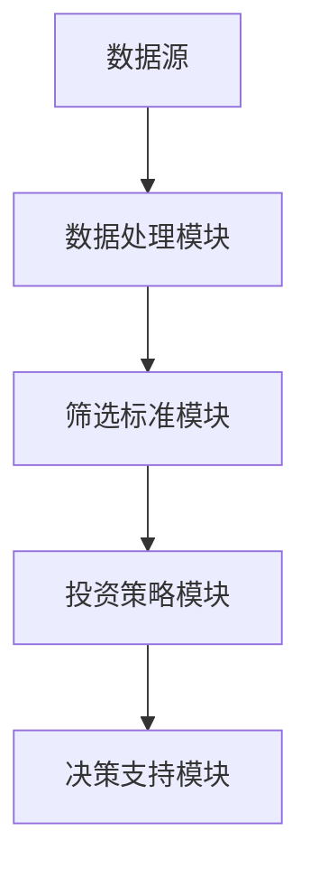
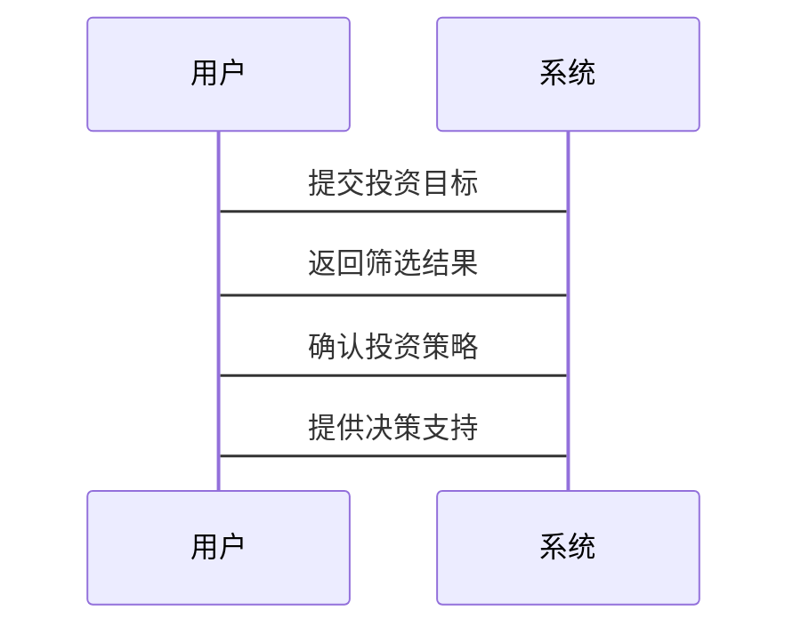

                 

<think>
好的，我现在需要帮用户撰写一篇关于《格雷厄姆特价股票理论在家族企业投资中的应用》的技术博客文章。首先，我得理解用户的需求。用户希望文章结构清晰，内容详尽，涵盖背景介绍、核心概念、算法原理、系统分析、项目实战和最佳实践等多个部分，每部分都要有详细的分析和示例。

首先，我得明确文章的主题和关键词。文章主要讨论格雷厄姆的特价股票理论在家族企业中的应用，所以关键词可能包括格雷厄姆投资理论、特价股票、家族企业、价值投资、财务分析、风险管理等。

接下来，摘要部分需要简明扼要地概括文章的核心内容。我需要指出格雷厄姆理论的核心要素，如安全边际、低市盈率、低市净率，以及如何将其应用于家族企业投资，强调长期稳健的投资策略。

在正文部分，我需要按目录大纲逐步展开。首先是背景介绍，解释格雷厄姆的投资理论，家族企业的特点，以及它们结合的意义。这部分要让读者了解基本概念和问题背景。

然后是核心概念与联系，这里需要详细解释格雷厄姆理论的原理，家族企业投资的特殊性，并通过表格和图表展示两者的对比。这有助于读者理解理论如何与实际投资结合。

接下来是算法原理，这部分需要介绍量化分析的方法，如市盈率、市净率的计算，以及如何评估低估股票。我需要用mermaid流程图展示步骤，并提供数学公式，如市盈率的计算公式。同时，给出代码示例，展示如何用Python进行数据处理和分析。

系统分析与架构设计部分，我需要构建一个分析框架，包括数据收集、筛选标准、投资策略等模块。使用mermaid图展示系统的结构和接口设计，帮助读者理解系统的整体架构。

项目实战部分，我需要一个具体的案例，详细描述如何在某个家族企业中应用格雷厄姆理论。包括环境配置、数据收集、分析步骤、代码实现和结果解读。这部分要让读者能够实际操作，理解理论的应用过程。

最后是最佳实践部分，总结小结，列出注意事项和拓展阅读的内容。这不仅帮助读者巩固所学，还能指导他们进一步学习和应用。

在写作过程中，我需要确保每个部分都详细且逻辑清晰，使用专业的技术语言，同时保持易懂。数学公式要用latex格式，并独立段落展示。图表和代码示例要准确无误，帮助读者更好地理解内容。

可能遇到的困难是如何将格雷厄姆的理论与家族企业的具体情况结合起来。家族企业可能有独特的财务结构和管理方式，这需要在分析框架中进行调整。我需要考虑这些因素，设计定制化的分析策略，确保理论在实际中的应用效果。

此外，代码部分需要选择合适的工具，如Python，展示数据处理和分析的步骤。确保代码逻辑清晰，注释详细，方便读者理解和使用。

总结来说，我需要按照用户的要求，分步骤、详细地撰写每个部分，确保文章内容丰富、结构合理，帮助读者全面掌握格雷厄姆特价股票理论在家族企业中的应用。
</think>

# 格雷厄姆特价股票理论在家族企业投资中的应用

> 关键词：格雷厄姆投资理论、特价股票、家族企业、价值投资、财务分析、风险管理

> 摘要：本文探讨了格雷厄姆的价值投资理论在家族企业投资中的应用，重点分析了如何通过寻找被低估的股票实现长期稳健的投资回报。文章从格雷厄姆理论的核心概念出发，结合家族企业的特殊性，详细阐述了特价股票的筛选标准、数学模型和算法原理，并通过实际案例展示了如何在家族企业中应用这些理论和方法。最后，文章总结了最佳实践策略和注意事项，为家族企业投资者提供了实用的指导。

---

# 正文

## 第一部分: 格雷厄姆特价股票理论概述

### 第1章: 格雷厄姆特价股票理论的核心概念

#### 1.1 格雷厄姆投资理论的背景与起源

##### 1.1.1 价值投资的起源与发展
价值投资是一种以基本面分析为基础的投资策略，起源于20世纪初。本杰明·格雷厄姆是该领域的奠基人之一，他的投资理念强调安全边际和长期稳健的回报。格雷厄姆认为，市场波动是投资者的敌人，真正的投资机会往往出现在市场恐慌或低估时。

##### 1.1.2 格雷厄姆的投资理念与方法
格雷厄姆提出了“安全边际”概念，即以低于内在价值的价格购买资产。他主张寻找那些市场价格远低于其内在价值的股票，这类股票被称为“特价股票”。通过这种方式，投资者能够在市场波动中获得超额回报。

##### 1.1.3 特价股票的定义与特征
特价股票是指市场价格显著低于其内在价值的股票。这类股票通常具有以下特征：
- 低市盈率（P/E）：市盈率低于行业平均水平。
- 低市净率（P/B）：市净率低于行业平均水平。
- 高股息率：公司支付较高的股息，表明其盈利能力较强且现金流充裕。

#### 1.2 家族企业投资的特点与挑战

##### 1.2.1 家族企业的定义与类型
家族企业是由家族成员共同拥有或控制的企业。这类企业通常具有较长的历史、较高的凝聚力和独特的管理风格。根据家族对企业控制的程度，家族企业可以分为完全家族控制和部分家族控制两种类型。

##### 1.2.2 家族企业投资的独特性
家族企业投资的独特性体现在以下几个方面：
- **长期性**：家族企业通常注重长期投资，而非短期收益。
- **稳定性**：家族企业更注重财务稳定性和风险控制。
- **个性化**：家族企业投资决策往往基于家族的战略目标和价值观。

##### 1.2.3 家族企业投资中的常见问题
家族企业投资中常见的问题包括：
- **信息不对称**：家族内部信息可能不够透明，导致决策失误。
- **管理风险**：家族成员的管理风格可能影响企业的长期发展。
- **流动性风险**：家族企业投资往往需要较长的锁定期，可能导致流动性不足。

### 第2章: 格雷厄姆特价股票理论与家族企业投资的结合

#### 2.1 格雷厄姆理论在家族企业中的应用背景

##### 2.1.1 家族企业投资中的价值发现
家族企业在投资过程中需要关注价值发现，即寻找那些被市场低估的投资标的。格雷厄姆的特价股票理论为家族企业提供了一种有效的方法。

##### 2.1.2 特价股票理论与家族企业目标的契合点
格雷厄姆理论的核心是寻找低估的股票，这与家族企业的长期稳健发展目标高度契合。通过投资特价股票，家族企业可以在市场低谷时布局，实现长期的超额收益。

##### 2.1.3 家族企业投资中的风险控制
格雷厄姆理论强调安全边际，这与家族企业注重风险控制的目标一致。通过选择低估股票，家族企业可以在市场波动中降低风险。

#### 2.2 格雷厄姆理论的核心要素与家族企业投资的关系

##### 2.2.1 格雷厄姆的"安全边际"概念
安全边际是指市场价格与内在价值之间的差距。家族企业在投资中应选择具有较大安全边际的股票，以降低市场波动带来的风险。

##### 2.2.2 家族企业的财务稳定性与格雷厄姆理论
格雷厄姆理论要求投资者关注企业的财务健康状况，这与家族企业注重财务稳定性不谋而合。家族企业应选择财务稳健、现金流充裕的特价股票。

##### 2.2.3 投资组合的构建与家族企业目标的结合
家族企业应根据自身的目标和风险承受能力，构建包含特价股票的投资组合。通过合理配置资产，实现长期稳健的回报。

---

## 第二部分: 格雷厄姆特价股票理论的数学模型与算法原理

### 第3章: 格雷厄姆特价股票理论的数学模型

#### 3.1 格雷厄姆投资模型的数学表达

##### 3.1.1 市盈率（P/E）的计算公式
$$ P/E = \frac{Price}{Earnings} $$
市盈率是衡量股票估值的重要指标，P/E值越低，通常表示股票越具有吸引力。

##### 3.1.2 市净率（P/B）的计算公式
$$ P/B = \frac{Price}{Book\ Value} $$
市净率是股票价格与每股账面价值的比率，P/B值越低，通常表示股票越具有投资价值。

##### 3.1.3 股息率的计算公式
$$ Dividend\ Yield = \frac{Dividend}{Price} $$
股息率是衡量股票收益能力的重要指标，股息率越高，通常表示股票的投资回报越高。

#### 3.2 家族企业投资中的数学模型应用

##### 3.2.1 根据P/E和P/B筛选特价股票
家族企业可以通过计算P/E和P/B值，筛选出那些P/E和P/B均低于行业平均水平的股票。

##### 3.2.2 计算安全边际
安全边际 = 内在价值 - 市场价格
家族企业应选择那些具有较大安全边际的股票，以降低投资风险。

##### 3.2.3 投资组合的优化
家族企业可以根据风险偏好和投资目标，优化投资组合中特价股票的比例。

---

## 第三部分: 格雷厄姆特价股票理论的系统分析与架构设计

### 第4章: 系统分析与架构设计方案

#### 4.1 问题场景介绍
家族企业在投资过程中，需要通过系统化的方法筛选和评估特价股票。系统需要具备数据收集、分析、决策支持等功能。

#### 4.2 项目介绍
本项目旨在构建一个基于格雷厄姆特价股票理论的家族企业投资分析系统，帮助家族企业实现科学的投资决策。

#### 4.3 系统功能设计
##### 4.3.1 数据收集模块
- 收集股票的市场数据（价格、成交量等）。
- 收集企业的财务数据（收入、利润等）。

##### 4.3.2 筛选标准模块
- 根据P/E和P/B值筛选低估股票。
- 计算安全边际。

##### 4.3.3 投资策略模块
- 根据家族企业的目标和风险偏好，制定投资策略。

##### 4.3.4 决策支持模块
- 提供可视化报告，支持投资决策。

#### 4.4 系统架构设计

##### 4.4.1 系统架构图


##### 4.4.2 系统接口设计
- 数据接口：从数据库获取股票和财务数据。
- 分析接口：计算P/E、P/B和安全边际。
- 报告接口：生成投资报告。

#### 4.5 系统交互设计

##### 4.5.1 交互流程图


---

## 第四部分: 格雷厄姆特价股票理论的项目实战

### 第5章: 项目实战

#### 5.1 环境配置
- 安装Python和相关库（pandas、numpy、matplotlib）。
- 数据来源：选择可靠的数据源，如Yahoo Finance。

#### 5.2 核心实现源代码

##### 5.2.1 数据收集
```python
import pandas as pd
import numpy as np

# 示例数据
data = {
    '股票代码': ['AAPL', 'GOOGL', 'MSFT'],
    '股价': [150, 120, 90],
    '每股收益': [10, 15, 8],
    '每股账面价值': [50, 60, 40]
}

df = pd.DataFrame(data)
print(df)
```

##### 5.2.2 筛选标准
```python
# 计算P/E和P/B
df['P/E'] = df['股价'] / df['每股收益']
df['P/B'] = df['股价'] / df['每股账面价值']

# 筛选P/E和P/B均低于行业平均水平的股票
industry_avg_pe = df['P/E'].mean()
industry_avg_pb = df['P/B'].mean()

selected_stocks = df[(df['P/E'] < industry_avg_pe) & (df['P/B'] < industry_avg_pb)]
print(selected_stocks)
```

##### 5.2.3 安全边际计算
```python
# 计算内在价值（假设为账面价值的1.5倍）
df['内在价值'] = df['每股账面价值'] * 1.5
df['安全边际'] = df['内在价值'] - df['股价']
print(df[['股票代码', '安全边际']])
```

#### 5.3 案例分析
以某家族企业为例，假设其投资目标是寻找P/E < 15且P/B < 2的股票。通过上述代码筛选，选出符合标准的股票，并计算其安全边际。

#### 5.4 代码应用解读与分析
- 数据收集：从数据源获取股票和财务数据。
- 筛选标准：根据P/E和P/B值筛选低估股票。
- 安全边际计算：评估股票的安全边际，选择具有较大安全边际的股票。

#### 5.5 项目小结
通过本项目，家族企业可以系统化地筛选和评估特价股票，实现科学的投资决策。

---

## 第五部分: 格雷厄姆特价股票理论的最佳实践

### 第6章: 最佳实践

#### 6.1 小结
格雷厄姆的特价股票理论为家族企业提供了一种有效的投资方法。通过系统化的筛选和评估，家族企业可以在市场低估时布局，实现长期的超额收益。

#### 6.2 注意事项
- **数据准确性**：确保数据来源可靠，避免因数据错误导致决策失误。
- **风险控制**：合理配置资产，分散投资风险。
- **持续监控**：定期评估投资组合，及时调整策略。

#### 6.3 拓展阅读
- 《The Intelligent Investor》 - 本杰明·格雷厄姆
- 《投资最重要的ことは风险をコントロールすること》 - 巴鲁克·费雷德曼

---

## 作者

作者：AI天才研究院/AI Genius Institute & 禅与计算机程序设计艺术/Zen And The Art of Computer Programming

