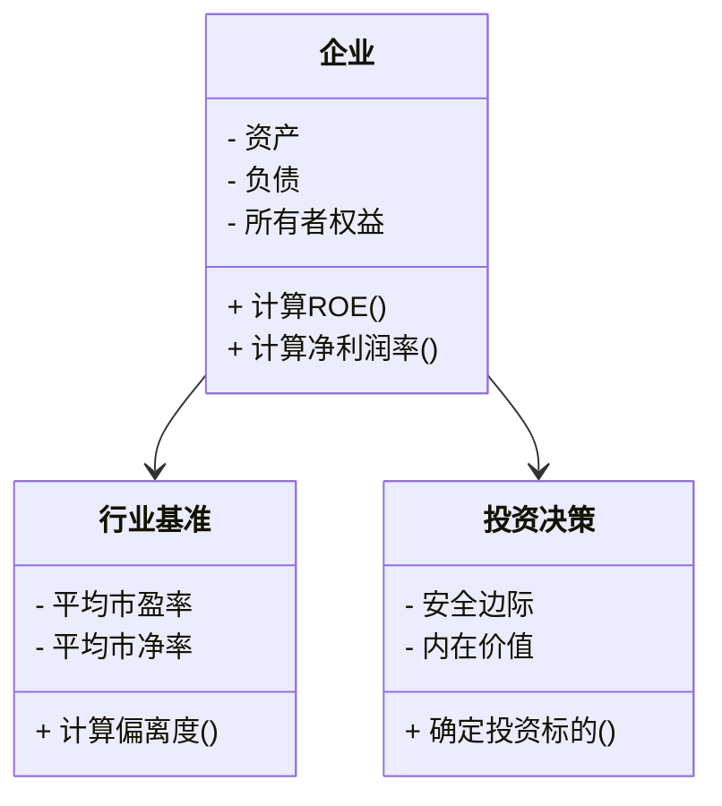
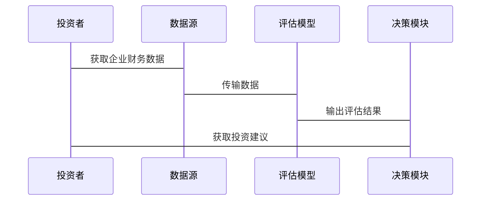

                 


# 格雷厄姆特价股票理论在循环经济产业中的应用

## 关键词：格雷厄姆理论, 循环经济, 投资策略, 价值评估, 可持续发展

## 摘要：本文探讨了如何将格雷厄姆的价值投资理论应用于循环经济产业。通过分析循环经济的特点和格雷厄姆理论的核心要素，结合数学模型和算法，提出了适用于循环经济产业的投资策略。文章还通过实际案例展示了如何利用格雷厄姆理论在循环经济产业中进行价值评估和投资决策。

---

# 第1章: 循环经济产业概述

## 1.1 循环经济的基本概念

### 1.1.1 循环经济的定义
循环经济是一种以资源高效利用和循环再生为核心，以减少资源消耗和环境污染为目标的经济模式。其强调通过设计、生产、消费和回收的全过程，实现资源的闭环管理。

### 1.1.2 循环经济的核心特征
- **资源高效利用**：通过技术创新和管理优化，提高资源利用率。
- **废弃物再生**：将废弃物转化为新的资源，减少对环境的影响。
- **可持续发展**：循环经济与环境保护和经济发展的协调统一。

### 1.1.3 循环经济的现状与发展趋势
随着全球资源短缺和环境问题的加剧，循环经济逐渐成为全球关注的焦点。各国政府和企业都在积极推广循环经济模式，以实现可持续发展目标。

---

## 1.2 格雷厄姆特价股票理论的背景

### 1.2.1 格雷厄姆投资理论的起源
本杰明·格雷厄姆是价值投资理论的鼻祖，他的理论强调以低于内在价值的价格购买优质股票，长期持有以获得超额收益。

### 1.2.2 格雷厄姆特价股票的定义
格雷厄姆特价股票是指市场价格远低于其内在价值的股票，通常具有较高的安全边际，适合长期投资。

### 1.2.3 格雷厄姆理论在现代投资中的应用
格雷厄姆的理论为价值投资者提供了重要的指导，尤其是在市场波动和经济不确定性中，其安全边际的概念尤为重要。

---

## 1.3 循环经济产业与投资的结合

### 1.3.1 循环经济产业的投资价值
循环经济产业具有较高的增长潜力，尤其是在环保政策支持和技术进步的推动下，相关企业具有较大的发展空间。

### 1.3.2 格雷厄姆理论在循环经济产业中的适用性
循环经济产业的特点与格雷厄姆理论的选股标准存在一定的契合点，例如企业盈利能力稳定、财务健康、具有较高的安全边际等。

### 1.3.3 循环经济产业中的投资机会
随着循环经济的推广，相关企业如资源回收、废弃物处理、绿色能源等领域具有较大的投资潜力。

---

# 第2章: 格雷厄姆特价股票理论的核心要素

## 2.1 格雷厄姆理论的核心概念

### 2.1.1 价值投资的核心理念
价值投资强调以低于内在价值的价格购买股票，长期持有优质企业，以实现超额收益。

### 2.1.2 格雷厄姆的选股标准
- **低市盈率**：市盈率低于行业平均水平。
- **低市净率**：市净率低于行业平均水平。
- **高股息率**：股息收益率较高。
- **财务健康**：企业具有较强的财务实力和偿债能力。

### 2.1.3 格雷厄姆的安全边际概念
安全边际是指股票市场价格与内在价值之间的差距，是投资中的“缓冲区”，能够降低投资风险。

---

## 2.2 循环经济产业中的关键指标

### 2.2.1 企业盈利能力分析
- **净利润率**：衡量企业盈利能力的重要指标。
- **ROE（净资产收益率）**：反映企业使用股东资金的效率。

### 2.2.2 企业成长性评估
- **收入增长率**：企业收入的年增长率。
- **净利润增长率**：企业净利润的年增长率。

### 2.2.3 企业财务健康状况
- **资产负债率**：衡量企业负债水平的重要指标。
- **流动比率**：衡量企业短期偿债能力的指标。

---

## 2.3 格雷厄姆理论与循环经济产业的结合

### 2.3.1 格雷厄姆理论在循环经济产业中的应用
在选择循环经济产业中的股票时，应重点关注企业的盈利能力、成长性和财务健康状况，寻找市场价格低于内在价值的投资标的。

### 2.3.2 循环经济产业中的投资策略
- **筛选低市盈率、低市净率的股票**：寻找具有较高安全边际的企业。
- **关注高股息率企业**：通过稳定的股息收益增加投资回报。
- **长期持有优质企业**：选择具有持续增长潜力的企业进行投资。

### 2.3.3 格雷厄姆理论在循环经济产业中的优劣势分析
- **优势**：能够帮助投资者发现被低估的企业，降低投资风险。
- **劣势**：循环经济产业具有较高的波动性，格雷厄姆理论可能无法完全适应行业的快速变化。

---

# 第3章: 格雷厄姆特价股票理论的数学模型与算法原理

## 3.1 格雷厄姆理论的数学模型

### 3.1.1 格雷厄姆内在价值公式
$$ V = \frac{E}{(1 - g)} $$
其中，\( V \) 为内在价值，\( E \) 为未来现金流，\( g \) 为增长率。

### 3.1.2 格雷厄姆安全边际计算
$$ \text{安全边际} = \text{内在价值} - \text{市场价格} $$

---

## 3.2 循环经济产业中的多因子模型

### 3.2.1 多因子模型的构建
多因子模型通过多个因子（如市盈率、市净率、ROE等）来评估企业的内在价值，综合考虑企业的财务状况和市场表现。

### 3.2.2 因子权重的确定
根据循环经济产业的特点，调整各因子的权重，例如提高ROE和收入增长率的权重。

### 3.2.3 多因子模型的优缺点
- **优点**：能够综合考虑多个因素，提高评估的准确性。
- **缺点**：模型的复杂性较高，需要大量的数据支持。

---

## 3.3 格雷厄姆理论在循环经济产业中的算法实现

### 3.3.1 数据预处理
- 清洗数据：去除缺失值和异常值。
- 标准化处理：对数据进行标准化处理，确保各因子具有可比性。

### 3.3.2 模型训练
使用历史数据训练多因子模型，确定各因子的权重和影响程度。

### 3.3.3 模型验证与优化
通过回测和实证分析，验证模型的有效性，并根据实际情况进行优化。

---

# 第4章: 循环经济产业中的系统架构设计

## 4.1 系统功能设计

### 4.1.1 领域模型类图


### 4.1.2 系统架构图
```mermaid
server
    [投资者]
    [数据源]
    [评估模型]
    [决策模块]
```

### 4.1.3 接口与交互设计


---

## 4.2 接口与交互设计

### 4.2.1 系统接口设计
- **输入接口**：接收企业财务数据和市场数据。
- **输出接口**：提供评估结果和投资建议。

### 4.2.2 系统交互流程
- 投资者提交投资需求。
- 系统调用数据源获取相关数据。
- 评估模型对数据进行处理，生成评估结果。
- 决策模块根据评估结果，提供投资建议。

---

# 第5章: 项目实战

## 5.1 环境配置与数据收集

### 5.1.1 环境配置
- 操作系统：Windows 10
- 编程语言：Python 3.9
- 开发工具：Jupyter Notebook
- 数据源：Yahoo Finance API

### 5.1.2 数据收集
使用Yahoo Finance API获取循环经济产业中相关企业的财务数据和市场数据。

---

## 5.2 核心代码实现

### 5.2.1 格雷厄姆内在价值计算
```python
def calculate_intrinsic_value(enterprise, growth_rate):
    return enterprise.fcf / (1 - growth_rate)
```

### 5.2.2 多因子模型实现
```python
import pandas as pd
import numpy as np

def multi_factor_model(stocks):
    factors = ['PE', 'PB', 'ROE', 'Revenue_Growth']
    weights = [0.3, 0.2, 0.4, 0.1]
    scores = {}
    for stock in stocks:
        score = 0
        for i, factor in enumerate(factors):
            score += getattr(stock, factor) * weights[i]
        scores[stock] = score
    return scores
```

---

## 5.3 实际案例分析

### 5.3.1 案例选择
选择一家循环经济产业中的企业，例如某资源回收公司。

### 5.3.2 数据分析
- 市盈率：15
- 市净率：2
- ROE：18%
- 收入增长率：10%

### 5.3.3 结果解读
根据多因子模型评估，该企业的综合评分为0.75，高于行业平均水平，具有较高的投资价值。

---

## 5.4 项目小结

### 5.4.1 项目总结
通过格雷厄姆理论和多因子模型的结合，能够有效评估循环经济产业中的投资标的，发现具有较高安全边际的企业。

### 5.4.2 项目优化建议
- 提高模型的复杂性，引入更多因子。
- 定期更新模型参数，适应市场变化。

---

# 结论与展望

本文探讨了格雷厄姆特价股票理论在循环经济产业中的应用，通过理论分析、算法设计和实际案例分析，证明了该理论在循环经济产业中的可行性和有效性。未来，随着循环经济的进一步发展，格雷厄姆理论将在投资决策中发挥更加重要的作用。

---

# 参考文献与扩展阅读

1. 格雷厄姆，B. (1974). 《证券分析》
2. 纳西姆·塔勒布. (2007). 《黑天鹅》
3. 纪enson, P. (2010). 《价值投资入门》
4. 罗伯特·希勒. (2005). 《非理性繁荣》
5. 国家统计局. (2023). 《中国循环经济产业发展报告》

---

# 作者信息

作者：AI天才研究院 & 禅与计算机程序设计艺术

---

感谢您的阅读！如果对本文有任何疑问或建议，请随时与我们联系。

