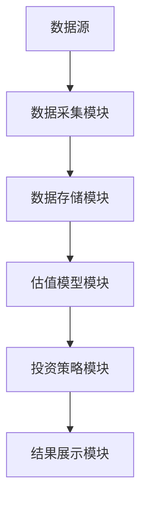

                 

<think>
好的，我现在需要撰写一篇关于《格雷厄姆特价股票理论在数字平台经济产业中的应用》的技术博客文章。首先，我得理解格雷厄姆的投资理论，特别是特价股票的概念。格雷厄姆是价值投资的鼻祖，他强调以低于内在价值的价格买入股票，寻找被市场低估的企业。接下来，我要考虑数字平台经济的特点，比如双边市场、网络效应、数据驱动等。

首先，我需要明确文章的结构。用户已经提供了大纲，我需要按照这个大纲逐步展开。第一章介绍格雷厄姆理论，包括核心思想、选股标准等。第二章分析数字平台经济，包括定义、商业模式、估值挑战等。第三章将两者结合起来，探讨如何在数字平台中应用格雷厄姆的理论。接下来是投资策略、案例分析、系统架构和技术实现。最后是总结与展望。

在写作过程中，我需要确保每个部分都详细且有深度。例如，在介绍格雷厄姆的选股标准时，要详细解释低市盈率、高市净率和高股息率，并结合数字平台企业的特点进行分析。同时，我需要考虑读者的理解，使用简单易懂的语言，避免过于专业的术语，或者在必要时进行解释。

在系统架构部分，可能需要绘制一些图表，比如领域模型类图、系统架构图、数据流图等。这些图表能够帮助读者更好地理解理论的应用和系统的实现。我需要使用Mermaid语法来绘制这些图表，并确保它们清晰易懂。

在项目实战部分，我需要选择一个具体的数字平台企业作为案例，比如亚马逊、微软等，分析它们的财务数据，应用格雷厄姆的选股标准进行评估。同时，编写Python代码来实现数据收集、分析和可视化，展示如何自动化筛选符合条件的股票。

最后，我需要总结全文，指出格雷厄姆理论在数字平台经济中的应用价值，以及未来的趋势和挑战。同时，给出一些建议，比如如何结合人工智能进行更精准的投资分析。

在写作过程中，我需要保持逻辑清晰，每个章节之间有良好的衔接。同时，确保内容完整，涵盖所有必要的部分，包括背景介绍、核心概念、算法原理、系统架构、项目实战等。这样，读者可以一步步理解格雷厄姆理论在数字平台经济中的应用，并能够实际操作。

总之，我需要一步步展开每个部分，确保内容详实，结构合理，语言通俗易懂，同时结合实际案例和技术实现，让读者能够真正理解并应用这些理论。
</think>

# 格雷厄姆特价股票理论在数字平台经济产业中的应用

> 关键词：格雷厄姆投资理论，数字平台经济，价值投资，股票分析，平台企业估值

> 摘要：本文探讨了格雷厄姆特价股票理论在数字平台经济中的应用，分析了数字平台企业的价值评估、投资策略及风险管理，并通过案例分析和系统架构设计，展示了如何将格雷厄姆理论与现代数字平台经济相结合，为投资者提供新的视角和方法。

---

## 第一章: 格雷厄姆特价股票理论概述

### 1.1 格雷厄姆投资理论的核心思想

#### 1.1.1 价值投资的基本概念
价值投资是一种长期投资策略，强调以低于内在价值的价格购买优质资产。格雷厄姆认为市场短期是投票器，长期是称重机。投资者应关注企业的内在价值，而非短期市场波动。

#### 1.1.2 格雷厄姆的"安全边际"理论
安全边际是指购买价格与内在价值之间的差距。通过安全边际，投资者可以降低投资风险，确保在市场波动中仍有获利空间。

#### 1.1.3 投资与投机的区分
格雷厄姆区分了投资和投机：投资是基于充分研究和合理估值，而投机是基于市场情绪和短期波动。

### 1.2 格雷厄姆选股标准

#### 1.2.1 低市盈率与高市净率
格雷厄姆倾向于选择市盈率低于市场平均水平的企业，同时关注市净率，以确保企业资产的合理估值。

#### 1.2.2 高股息率与稳定的股息支付
高股息率企业通常财务健康，股息支付稳定，能够为投资者提供稳定的现金流。

#### 1.2.3 企业财务健康状况的评估
格雷厄姆强调企业的财务健康，包括低负债率、稳定的收入和利润增长，以及充足的现金流。

### 1.3 格雷厄姆投资策略的现代发展

#### 1.3.1 从传统股票到数字平台经济的延伸
随着数字化转型，数字平台企业成为新的投资标的。格雷厄姆的理论需要适应这一变化。

#### 1.3.2 数字平台经济的特点与投资机会
数字平台经济具有双边市场、网络效应和数据驱动等特点，为投资者提供了新的机会。

#### 1.3.3 格雷厄姆理论在新时代的适用性
格雷厄姆理论的核心思想依然适用，但需要结合数字平台的特点进行调整。

---

## 第二章: 数字平台经济的特征与模式

### 2.1 数字平台经济的定义与特征

#### 2.1.1 数字平台的双边市场模式
数字平台连接供需双方，形成双边市场。例如，电商平台连接买家和卖家。

#### 2.1.2 网络效应与平台的自我强化
用户数量增加会提升平台价值，形成正反馈效应。例如，社交媒体平台用户越多，吸引力越大。

#### 2.1.3 数字平台的轻资产与高扩展性
数字平台企业通常固定资产较少，但可以通过数据和技术快速扩展。

### 2.2 数字平台经济的商业模式

#### 2.2.1 平台佣金与广告收入
平台通过收取交易佣金或广告费获得收入。例如，淘宝通过佣金和广告收入盈利。

#### 2.2.2 数据驱动的增值服务
平台利用数据分析提供个性化服务，如推荐系统、精准营销等。

#### 2.2.3 生态系统整合与协同效应
通过整合上下游资源，平台形成生态系统，产生协同效应。例如，苹果的App Store整合了开发者、用户和设备。

### 2.3 数字平台经济的估值挑战

#### 2.3.1 传统估值方法的局限性
传统估值方法如市盈率和市净率在评估数字平台时可能失效，因为平台的收入和利润可能波动较大。

#### 2.3.2 新兴平台的动态估值模型
采用动态估值模型，考虑平台的用户增长、网络效应和数据价值。

#### 2.3.3 用户粘性与平台护城河的量化
用户粘性和平台护城河是数字平台的核心竞争优势，需要量化评估。

---

## 第三章: 格雷厄姆理论与数字平台经济的结合

### 3.1 数字平台企业的价值评估

#### 3.1.1 格雷厄姆选股标准的适用性分析
将格雷厄姆的选股标准应用于数字平台企业，需考虑其独特的商业模式和估值方法。

#### 3.1.2 平台经济中的"安全边际"重新定义
在数字平台中，安全边际可能体现在用户增长、网络效应和数据优势上。

#### 3.1.3 数字平台企业的长期投资价值
优质数字平台企业具有持续增长潜力，适合长期投资。

### 3.2 数字平台经济中的投资策略

#### 3.2.1 低市盈率平台企业的筛选标准
选择市盈率低于行业平均水平的数字平台企业，关注其用户增长和盈利能力。

#### 3.2.2 高股息率与平台经济的结合
部分数字平台企业开始分红，高股息率企业值得长期关注。

#### 3.2.3 平台企业的财务健康评估
评估平台企业的财务健康，关注其现金流、负债率和盈利能力。

### 3.3 数字平台经济中的风险管理

#### 3.3.1 格雷厄姆安全边际在风险控制中的应用
通过安全边际控制投资风险，确保在市场波动中仍有获利空间。

#### 3.3.2 平台经济波动中的投资策略调整
根据市场变化调整投资策略，避免过度集中投资单一平台。

#### 3.3.3 平台企业的竞争风险与应对策略
关注平台的竞争优势，避免投资于竞争优势弱的企业。

---

## 第四章: 数字平台经济中的投资策略与风险管理

### 4.1 投资策略

#### 4.1.1 长期投资与价值发现
数字平台企业具有长期增长潜力，适合长期投资。

#### 4.1.2 分散投资与资产配置
通过分散投资降低风险，避免过度集中于单一平台。

#### 4.1.3 定期复盘与策略调整
定期评估投资组合，根据市场变化调整策略。

### 4.2 风险管理

#### 4.2.1 宏观经济风险
关注宏观经济政策和行业趋势，避免系统性风险。

#### 4.2.2 平台竞争风险
评估平台的竞争优势，避免投资于竞争力弱的企业。

#### 4.2.3 技术与数据风险
关注平台的技术创新和数据安全，避免因技术落后或数据泄露导致损失。

---

## 第五章: 实际案例分析

### 5.1 亚马逊的案例分析

#### 5.1.1 亚马逊的商业模式与估值
亚马逊通过电商平台和云计算服务实现高速增长，估值模型需考虑其未来的收入增长潜力。

#### 5.1.2 格雷厄姆理论的应用
亚马逊的低市盈率和高市净率符合格雷厄姆的选股标准，同时其网络效应和护城河提供了较高的安全边际。

#### 5.1.3 投资策略与风险控制
通过长期持有亚马逊股票，结合分散投资降低风险。

### 5.2 微软的案例分析

#### 5.2.1 微软的云服务与生态系统
微软通过Azure和Office 365构建了强大的生态系统，具有较高的用户粘性和网络效应。

#### 5.2.2 格雷厄姆理论的应用
微软的高股息率和稳定的财务表现符合格雷厄姆的选股标准，同时其技术优势提供了长期增长潜力。

#### 5.2.3 投资策略与风险控制
长期持有微软股票，关注其技术创新和市场竞争。

---

## 第六章: 系统架构与技术实现

### 6.1 系统架构设计

#### 6.1.1 系统功能设计
- 数据采集模块：收集数字平台企业的财务数据和市场数据。
- 估值模型模块：基于格雷厄姆理论构建估值模型。
- 投资策略模块：根据估值结果制定投资策略。

#### 6.1.2 系统架构图

### 6.2 数据流图

### 6.3 技术实现

#### 6.3.1 数据采集
使用Python编写爬虫，从公开数据源获取数字平台企业的财务数据和市场数据。

#### 6.3.2 估值模型
基于格雷厄姆理论，构建动态估值模型，考虑平台的用户增长、网络效应和数据价值。

#### 6.3.3 投资策略
根据估值结果，制定投资策略，包括股票筛选、组合优化和风险控制。

---

## 第七章: 总结与展望

### 7.1 全文总结
本文探讨了格雷厄姆特价股票理论在数字平台经济中的应用，分析了数字平台企业的价值评估、投资策略及风险管理，并通过案例分析和系统架构设计，展示了如何将格雷厄姆理论与现代数字平台经济相结合。

### 7.2 未来展望
未来，随着数字平台经济的不断发展，格雷厄姆理论的应用将更加广泛。结合人工智能和大数据技术，投资者可以更精准地评估平台企业价值，制定更有效的投资策略。

---

## 参考文献
1. 格雷厄姆，本杰明. 《股票作手回忆录》
2. 红杉资本研究报告：数字平台经济的发展趋势
3. 麦肯锡咨询：数字平台企业的估值方法

---

## 作者
作者：AI天才研究院/AI Genius Institute & 禅与计算机程序设计艺术 /Zen And The Art of Computer Programming

