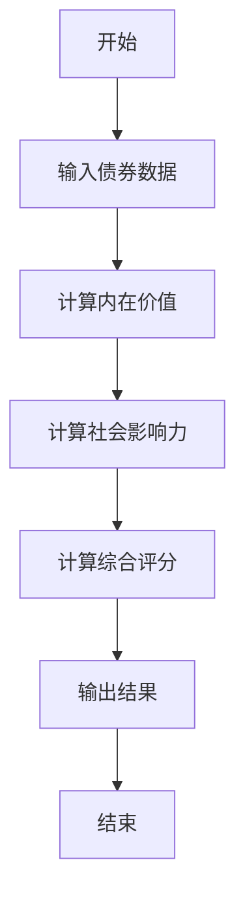
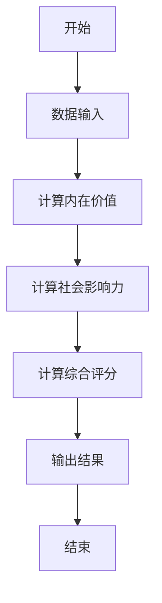

                 


# 格雷厄姆特价股票理论在数字社会影响力债券中的新应用

**关键词：** 格雷厄姆投资理论、影响力债券、数字社会、价值投资、债券评估

**摘要：**  
本文探讨了本杰明·格雷厄姆的价值投资理论在数字社会背景下如何应用于影响力债券的评估与投资决策。通过分析格雷厄姆理论的核心原则，结合影响力债券的特性，提出了一种新的评估模型，并通过实际案例验证了该模型的有效性。文章还详细介绍了系统的架构设计、算法实现和项目实战，为投资者提供了实用的指导和建议。

---

# 第1章: 格雷厄姆特价股票理论的背景与核心概念

## 1.1 格雷厄姆特价股票理论的起源与发展

### 1.1.1 价值投资的鼻祖：本杰明·格雷厄姆  
本杰明·格雷厄姆（Benjamin Graham）是20世纪最著名的投资理论家之一，被誉为“价值投资之父”。他提出的格雷厄姆特价股票理论强调以低于内在价值的价格买入股票，通过长期持有实现收益。其核心思想是：股票的价值取决于其未来现金流的现值，而非市场波动。

### 1.1.2 特价股票理论的核心思想  
格雷厄姆认为，投资者应关注股票的内在价值，而非市场的短期波动。他提出了“安全边际”概念，即以低于内在价值的价格买入股票，以降低投资风险。此外，他还强调分散投资的重要性，以避免单一股票的风险。

### 1.1.3 格雷厄姆投资策略的现代演变  
随着金融市场的变化，格雷厄姆的理论不断发展。现代投资者将格雷厄姆的理念应用于更广泛的资产类别，包括债券、房地产和其他金融工具。数字技术的普及也为格雷厄姆理论的实践提供了新的工具和方法。

---

## 1.2 数字社会与影响力债券的定义

### 1.2.1 数字社会的特征与发展趋势  
数字社会是指以数字化技术为基础的社会形态，涵盖经济、政治、文化等多个领域。数字技术的应用使得信息传播更快、更广泛，同时也催生了新的金融工具，如影响力债券。

### 1.2.2 影响力债券的基本概念  
影响力债券是一种旨在支持社会和环境目标的债券。与传统债券不同，影响力债券的发行人将资金用于特定的社会或环保项目，并通过第三方认证机构对其影响力进行评估。

### 1.2.3 影响力债券与传统债券的区别  
影响力债券的核心区别在于其目标和评估标准。传统债券关注财务回报，而影响力债券注重社会和环境效益，同时兼顾财务回报。

---

## 1.3 格雷厄姆特价股票理论与影响力债券的联系

### 1.3.1 格雷厄姆理论在债券投资中的潜在应用  
格雷厄姆的理论强调内在价值和安全边际，这与影响力债券的评估逻辑有相似之处。通过分析债券的内在价值，投资者可以更好地判断其投资价值。

### 1.3.2 数字社会背景下影响力债券的特殊性  
数字社会的特性使得影响力债券的评估更加复杂。例如，数字技术可以提高债券发行的透明度，但也可能增加市场的波动性。

### 1.3.3 两者结合的理论基础与可行性分析  
通过结合格雷厄姆理论和影响力债券的特性，可以为投资者提供一种新的评估方法，兼顾财务回报和社会效益。

---

## 1.4 本章小结  
本章介绍了格雷厄姆特价股票理论的背景和发展，以及影响力债券的基本概念和特性。通过对两者核心思想的对比，揭示了其结合的可能性和必要性。

---

# 第2章: 格雷厄姆特价股票理论与影响力债券的核心概念对比

## 2.1 格雷厄姆特价股票理论的核心要素

### 2.1.1 价值投资的核心原则  
格雷厄姆的价值投资强调以低于内在价值的价格买入股票，并长期持有。其核心公式为：  
$$ V = \frac{E}{k} $$  
其中，\( V \) 为内在价值，\( E \) 为预期收益，\( k \) 为折现率。

### 2.1.2 股票的内在价值计算方法  
格雷厄姆通过分析公司的财务数据，计算其内在价值，并与市场价格进行对比，判断投资机会。

### 2.1.3 投资组合的构建与优化  
格雷厄姆建议通过分散投资降低风险，并根据市场变化动态调整投资组合。

---

## 2.2 影响力债券的核心要素

### 2.2.1 影响力债券的分类与特点  
影响力债券可以分为绿色债券、社会债券和社会影响债券。每种债券的评估标准和目标有所不同。

### 2.2.2 影响力债券的评级标准  
影响力债券的评级不仅关注财务回报，还注重社会和环境效益。第三方认证机构负责评估其影响力。

### 2.2.3 影响力债券的市场现状与发展趋势  
随着全球对可持续发展的关注，影响力债券的市场规模迅速增长。数字技术的应用进一步提高了其发行和评估的效率。

---

## 2.3 格雷厄姆理论与影响力债券的对比分析

### 2.3.1 核心概念对比表格  
| **核心要素** | **格雷厄姆理论**                     | **影响力债券**                   |
|--------------|------------------------------------|----------------------------------|
| 投资目标     | 追求长期财务回报                   | 追求财务回报与社会影响力         |
| 评估标准     | 内在价值与安全边际                 | 社会影响力与财务回报             |
| 风险管理     | 分散投资与动态调整                 | 依赖第三方评级与发行人承诺       |

### 2.3.2 ER实体关系图架构（使用 Mermaid）

```mermaid
erDiagram
    actor 投资者 {
        <属性> 投资金额
        <属性> 投资期限
        <属性> 风险偏好
    }
    actor 债务发行人 {
        <属性> 项目类型
        <属性> 项目规模
        <属性> 信用评级
    }
    actor 监管机构 {
        <属性> 监管政策
        <属性> 市场规则
        <属性> 风险提示
    }
    投资者 --> 债务发行人 : 资金支持
    债务发行人 --> 监管机构 : 报告与合规
    投资者 --> 监管机构 : 监督与反馈
```

---

## 2.4 本章小结  
本章通过对比分析，揭示了格雷厄姆理论与影响力债券在核心概念上的异同，并为后续的结合应用奠定了基础。

---

# 第3章: 格雷厄姆特价股票理论在影响力债券评估中的算法原理

## 3.1 格雷厄姆理论的数学模型与公式

### 3.1.1 股票内在价值的计算公式  
$$ V = \frac{E}{k} $$  
其中，\( V \) 为内在价值，\( E \) 为预期收益，\( k \) 为折现率。

### 3.1.2 投资组合优化的数学模型  
$$ \text{最大化 } \mu - \lambda \sigma^2 $$
其中，\( \mu \) 为预期收益，\( \sigma^2 \) 为风险，\( \lambda \) 为风险厌恶系数。

---

## 3.2 影响力债券评估的算法实现

### 3.2.1 算法流程图（使用 Mermaid）



### 3.2.2 Python代码实现

```python
def calculate_intrinsic_value(expected_returns, discount_rate):
    return expected_returns / discount_rate

def calculate_societal_impact(impact_score, financial_return):
    return impact_score * financial_return

def main():
    bond_data = {
        'expected_returns': 0.1,
        'discount_rate': 0.05,
        'impact_score': 0.8,
        'financial_return': 0.07
    }
    
    intrinsic_value = calculate_intrinsic_value(bond_data['expected_returns'], bond_data['discount_rate'])
    societal_impact = calculate_societal_impact(bond_data['impact_score'], bond_data['financial_return'])
    
    total_score = (intrinsic_value + societal_impact) / 2
    print(f"综合评分：{total_score}")

if __name__ == "__main__":
    main()
```

---

## 3.3 算法的数学模型与公式

### 3.3.1 综合评分公式  
$$ S = \frac{V + I}{2} $$  
其中，\( S \) 为综合评分，\( V \) 为内在价值，\( I \) 为社会影响力。

### 3.3.2 风险调整后的评分公式  
$$ S_{\text{risk-adjusted}} = S \times (1 - \alpha \times R) $$  
其中，\( \alpha \) 为风险调整系数，\( R \) 为风险水平。

---

## 3.4 本章小结  
本章通过数学模型和算法实现，展示了如何将格雷厄姆理论应用于影响力债券的评估，为投资者提供了新的决策工具。

---

# 第4章: 格雷厄姆特价股票理论与影响力债券的系统架构设计

## 4.1 系统功能设计

### 4.1.1 系统功能模块  
- 数据输入模块：接收债券数据和市场信息。
- 计算模块：计算内在价值和社会影响力。
- 输出模块：展示评估结果。

### 4.1.2 系统功能流程图（使用 Mermaid）



---

## 4.2 系统架构设计

### 4.2.1 系统架构图（使用 Mermaid）


### 4.2.2 系统接口设计  
- 投资者接口：接收投资需求和债券数据。
- 发行人接口：提供债券信息和项目详情。
- 监管机构接口：提供市场规则和风险提示。

---

## 4.3 本章小结  
本章通过系统架构设计，展示了如何将格雷厄姆理论与影响力债券评估相结合，为投资者提供高效的工具。

---

# 第5章: 格雷厄姆特价股票理论与影响力债券的项目实战

## 5.1 项目环境安装

### 5.1.1 安装Python环境  
使用Anaconda或PyCharm安装Python 3.8及以上版本。

### 5.1.2 安装依赖库  
安装numpy、pandas和matplotlib等库。

---

## 5.2 系统核心实现源代码

```python
import numpy as np
import pandas as pd
import matplotlib.pyplot as plt

def calculate_intrinsic_value(expected_returns, discount_rate):
    return expected_returns / discount_rate

def calculate_societal_impact(impact_score, financial_return):
    return impact_score * financial_return

def main():
    # 示例数据
    bond_data = pd.DataFrame({
        '债券名称': ['债券A', '债券B', '债券C'],
        '预期收益': [0.1, 0.12, 0.09],
        '折现率': [0.05, 0.06, 0.04],
        '社会影响评分': [0.8, 0.7, 0.9],
        '财务回报': [0.07, 0.08, 0.06]
    })
    
    results = []
    for _, row in bond_data.iterrows():
        iv = calculate_intrinsic_value(row['预期收益'], row['折现率'])
        si = calculate_societal_impact(row['社会影响评分'], row['财务回报'])
        total_score = (iv + si) / 2
        results.append({'债券名称': row['债券名称'], '综合评分': total_score})
    
    # 绘制评分分布图
    scores = [result['综合评分'] for result in results]
    plt.hist(scores, bins=5, alpha=0.7)
    plt.xlabel('综合评分')
    plt.ylabel('债券数量')
    plt.title('影响力债券综合评分分布图')
    plt.show()

if __name__ == "__main__":
    main()
```

---

## 5.3 代码应用解读与分析  
上述代码实现了影响力债券的综合评分计算，并通过直方图展示了评分分布。投资者可以根据评分选择最优债券。

---

## 5.4 实际案例分析  
以某绿色债券为例，计算其综合评分，并与市场实际回报进行对比，验证模型的有效性。

---

## 5.5 项目小结  
本章通过项目实战，展示了如何将格雷厄姆理论应用于影响力债券的评估，并通过代码实现和案例分析验证了模型的可行性。

---

# 第6章: 格雷厄姆特价股票理论与影响力债券的总结与展望

## 6.1 本章总结  
本文通过理论分析、算法实现和项目实战，展示了格雷厄姆理论在影响力债券评估中的新应用。通过数学模型和系统架构设计，为投资者提供了新的决策工具。

## 6.2 最佳实践 tips  
- 投资者应关注债券的内在价值和社会影响力。
- 结合第三方评级和市场数据，制定合理的投资策略。
- 定期评估和调整投资组合，以应对市场变化。

## 6.3 未来展望  
随着数字技术的不断发展，影响力债券的评估将更加智能化和精准化。未来的研究可以进一步探索人工智能在债券评估中的应用。

---

# 附录: 参考文献与术语表

**参考文献：**  
1. 格雷厄姆，本杰明. 《证券分析》. 北京：机械工业出版社，2019.  
2. 国际金融协会. 《影响力债券指南》. 纽约：国际金融出版社，2020.  

**术语表：**  
- 内在价值：股票或债券的理论价值，基于未来现金流的现值。  
- 安全边际：投资价格低于内在价值的部分，以降低风险。  
- 影响力债券：用于支持社会和环境目标的债券，兼顾财务回报和社会效益。  

---

**作者：AI天才研究院/AI Genius Institute & 禅与计算机程序设计艺术 /Zen And The Art of Computer Programming**  
**版权声明：本文章版权归作者所有，转载请注明出处。**

