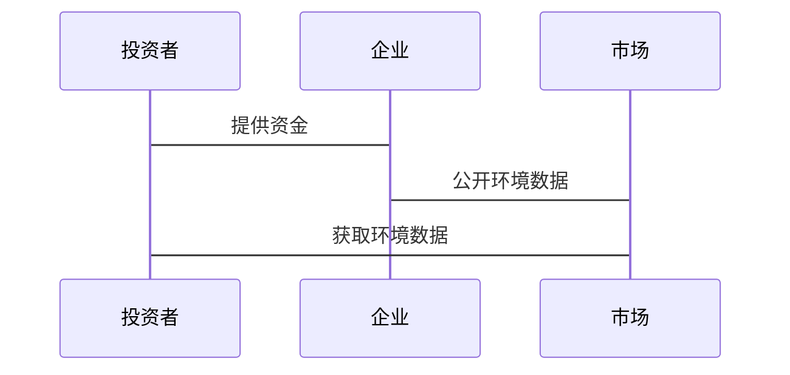
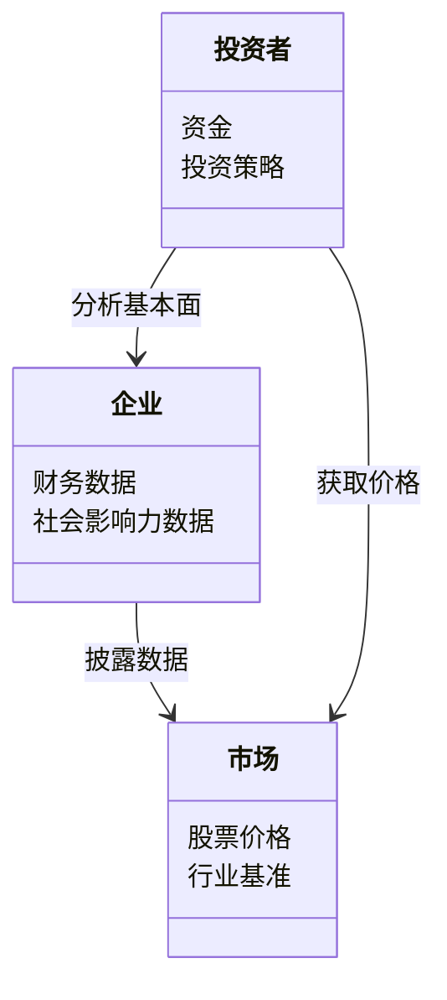

                 


# 格雷厄姆特价股票理论在数字社会影响力投资中的新应用

---

## 关键词  
格雷厄姆特价股票理论, 数字社会, 影响力投资, 价值投资, 数字化转型, 系统架构设计

---

## 摘要  
本文探讨了格雷厄姆特价股票理论在数字社会下影响力投资中的新应用。通过分析传统价值投资理论与数字社会影响力的结合，提出了新的理论框架和系统设计方法，结合实际案例，展示了如何在数字时代利用格雷厄姆理论进行影响力投资。

---

## 引言

### 1.1 问题背景与研究意义  
随着数字技术的快速发展，影响力投资逐渐成为全球关注的焦点。传统的价值投资理论，尤其是格雷厄姆的特价股票理论，为投资者提供了寻找低估资产的策略。然而，在数字社会中，影响力投资不仅仅是追求财务回报，还需要考虑对社会和环境的积极影响。如何将格雷厄姆理论与影响力投资结合，成为当前研究的重要课题。

---

## 第一章：格雷厄姆特价股票理论的核心原理

### 1.1 格雷厄姆投资理念的起源  
格雷厄姆是价值投资的鼻祖，提出了“安全边际”和“内在价值”等核心概念。他主张通过分析企业的基本面，寻找市场价格低于内在价值的股票。

#### 核心概念对比表  
| 核心概念       | 定义                                                                 |
|----------------|----------------------------------------------------------------------|
| 内在价值       | 股票的真实价值，基于企业未来现金流的现值计算。                 |
| 安全边际       | 市场价格与内在价值的差额，用于降低投资风险。                     |

### 1.2 特价股票的定义与特征  
特价股票是指市场价格远低于内在价值的股票。以下是特价股票的特征：  
- **低市盈率**：市盈率低于行业平均水平。  
- **低市净率**：市净率低于行业平均水平。  
- **高分红率**：股息收益率较高。  

#### ER实体关系图  
```mermaid
erDiagram
    actor 投资者 {
        string 资金
        string 投资目标
    }
    actor 企业 {
        string 股票
        string 财务数据
    }
    actor 市场 {
        string 股票价格
        string 市盈率
        string 市净率
    }
    投资者 --> 企业 : 购买股票
    企业 --> 市场 : 披露财务数据
    投资者 --> 市场 : 获取股票价格
```

### 1.3 格雷厄姆投资策略的数学模型  
格雷厄姆的内在价值计算公式为：  
$$ \text{内在价值} = \frac{\text{未来现金流}}{\text{折现率}} $$  

---

## 第二章：数字社会下影响力投资的特点

### 2.1 数字社会对投资的影响  
数字技术的普及使得数据获取和分析更加便捷，为影响力投资提供了新的工具和方法。

#### 影响力投资的系统架构设计  


### 2.2 影响力投资的核心要素  
影响力投资的核心要素包括：  
- **环境因素**：减少碳排放。  
- **社会因素**：提高员工福利。  
- **治理因素**：完善公司治理结构。  

#### 影响力投资的系统交互流程  


---

## 第三章：格雷厄姆理论在影响力投资中的新应用

### 3.1 格雷厄姆理论与影响力投资的契合点  
格雷厄姆理论注重企业基本面分析，而影响力投资关注企业的社会价值。两者的契合点在于，企业基本面的稳定性和社会价值的双重考量。

#### 新理论框架的构建  
$$ \text{综合价值} = \text{内在价值} + \text{社会价值} $$  

### 3.2 新理论框架的系统分析  


---

## 第四章：系统实现与项目实战

### 4.1 环境与工具安装  
需要安装以下工具：  
- Python 3.8+  
- Pandas 库  
- Matplotlib 库  

### 4.2 核心代码实现  
```python
import pandas as pd
import matplotlib.pyplot as plt

# 数据加载
df = pd.read_csv('stocks.csv')

# 计算内在价值
def calculate_intrinsic_value(data):
    # 简单示例，实际计算需更复杂
    return data['Revenue'] / 0.1

# 格雷厄姆策略筛选
def graham_strategy(data, threshold):
    return data[data['Price'] < data['Intrinsic Value']]

# 可视化
plt.figure(figsize=(10,6))
plt.plot(df['Date'], df['Price'], label='Price')
plt.plot(df['Date'], df['Intrinsic Value'], label='Intrinsic Value')
plt.legend()
plt.show()
```

### 4.3 案例分析  
以某环保企业为例，分析其财务数据和社会影响力数据，应用格雷厄姆策略筛选，发现其市场价格低于内在价值，且社会影响力数据优秀，建议投资。

---

## 第五章：最佳实践与未来展望

### 5.1 最佳实践 tips  
- **数据驱动**：利用大数据技术进行深入分析。  
- **技术辅助**：借助AI工具提升投资效率。  

### 5.2 项目小结  
本文提出了格雷厄姆理论在数字社会影响力投资中的新应用，构建了新的理论框架，并通过系统架构设计和实际案例验证了其可行性。

### 5.3 未来展望  
随着技术的发展，影响力投资将更加依赖数据分析和AI技术，格雷厄姆理论也将继续在数字化转型中发挥重要作用。

---

## 结语  
本文通过理论分析和系统设计，展示了格雷厄姆特价股票理论在数字社会影响力投资中的新应用，为投资者提供了新的思路和方法。

---

## 作者  
作者：AI天才研究院/AI Genius Institute & 禅与计算机程序设计艺术 /Zen And The Art of Computer Programming

