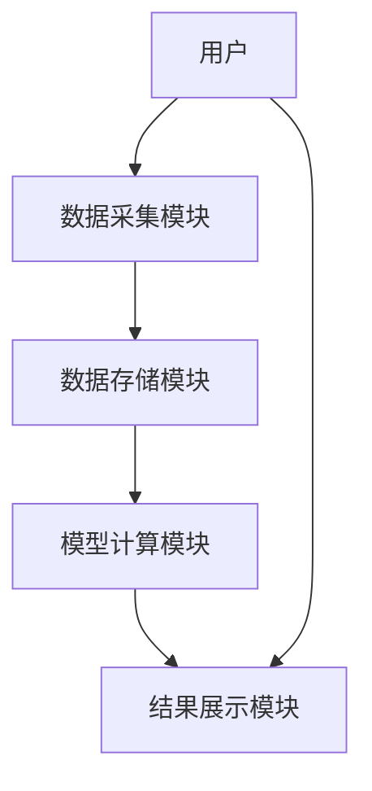

                 


# 格雷厄姆特价股票理论在数字社会影响力期权中的新应用

## 关键词：格雷厄姆理论，影响力期权，数字社会，金融创新，算法模型

## 摘要：本文探讨格雷厄姆的价值投资理论在数字社会中的新应用，特别是其在影响力期权定价中的潜在价值。通过分析数字社会的特性，结合影响力期权的独特性质，提出新的定价模型和算法，并通过实际案例验证其可行性。

---

# 第一部分：背景介绍

## 第1章：格雷厄姆特价股票理论的核心概念

### 1.1 格雷厄姆投资理论的起源与发展

#### 1.1.1 投资理论的演进历程
- 传统金融理论的演变
- 格雷厄姆理论的诞生及其对现代金融的影响

#### 1.1.2 格雷厄姆价值投资的核心思想
- 股票的价值评估方法
- 安全边际的概念
- 长期投资与价值发现

#### 1.1.3 格雷厄姆理论在现代金融中的地位
- 理论的局限性与适用性
- 数字时代的挑战与机遇

## 第2章：数字社会中的影响力期权

### 2.1 数字社会的定义与特征

#### 2.1.1 数字社会的概念
- 数字技术对社会结构的影响
- 数字经济的特点

#### 2.1.2 数字社会中的数据价值
- 数据的货币化
- 数据对影响力的影响

#### 2.1.3 数字社会中的影响力经济
- 影响力的定义与度量
- 影响力经济的现状与趋势

### 2.2 影响力期权的基本概念

#### 2.2.1 期权的基本定义
- 期权的类型（看涨、看跌）
- 期权的基本特征

#### 2.2.2 影响力期权的特殊性
- 影响力期权的独特属性
- 影响力期权的风险与收益

#### 2.2.3 影响力期权的市场机制
- 市场参与者
- 价格形成机制

## 第3章：格雷厄姆理论与影响力期权的结合

### 3.1 格雷厄姆理论在数字社会中的适用性

#### 3.1.1 格雷厄姆理论的核心要素
- 价值评估
- 安全边际
- 长期视角

#### 3.1.2 数字社会中的价值评估
- 数据资产的价值评估
- 影响力的量化

#### 3.1.3 格雷厄姆理论的延展性
- 如何将传统理论应用于数字环境

### 3.2 影响力期权的定价模型

#### 3.2.1 期权定价的基本原理
- 黑-斯科尔斯模型
- 影响力期权的特殊定价因素

#### 3.2.2 影响力期权的特殊定价因素
- 数据的稀缺性
- 影响力的波动性

#### 3.2.3 格雷厄姆理论对期权定价的影响
- 安全边际的引入
- 长期视角的应用

---

# 第二部分：核心概念与联系

## 第4章：核心概念的原理与特征

### 4.1 格雷厄姆价值投资的数学模型

#### 4.1.1 格雷厄姆模型的数学表达
- 价值评估公式
- 安全边际的计算

#### 4.1.2 格雷厄姆模型的属性特征
- 稳定性
- 风险控制

#### 4.1.3 格雷厄姆模型的优缺点分析
- 优点：保守、安全
- 缺点：灵活性不足

### 4.2 影响力期权的数学模型

#### 4.2.1 影响力期权的基本公式
- 看涨期权的定价公式
- 看跌期权的定价公式

#### 4.2.2 影响力期权的属性特征
- 时间敏感性
- 波动性

#### 4.2.3 影响力期权的优缺点分析
- 优点：风险可控
- 缺点：流动性不足

### 4.3 核心概念的对比分析

#### 4.3.1 格雷厄姆理论与影响力期权的对比
- 比较表格（见附录）

---

# 第三部分：算法原理

## 第5章：格雷厄姆理论的算法实现

### 5.1 格雷厄姆理论的算法流程

#### 5.1.1 算法的输入与输出
- 输入：资产数据、市场数据
- 输出：价值评估、投资建议

#### 5.1.2 算法的步骤分解
1. 数据收集与预处理
2. 价值评估计算
3. 安全边际分析
4. 投资建议生成

#### 5.1.3 算法的实现代码
```python
def graham_algorithm(asset_data, market_data):
    # 步骤1：数据预处理
    processed_data = preprocess(asset_data, market_data)
    
    # 步骤2：价值评估计算
    intrinsic_value = calculate_intrinsic_value(processed_data)
    
    # 步骤3：安全边际分析
    margin_of_safety = calculate_margin_of_safety(intrinsic_value, market_price)
    
    # 步骤4：投资建议生成
    investment_recommendation = generate_recommendation(margin_of_safety)
    
    return investment_recommendation
```

### 5.2 影响力期权的定价算法

#### 5.2.1 影响力期权的定价公式
$$ C = S_0 e^{-rT} N(d_1) - K e^{-rT} N(d_2) $$

#### 5.2.2 算法实现
```python
def black_scholes(option_type, S, K, r, T, sigma):
    # 计算d1和d2
    d1 = (ln(S/K) + (r + 0.5*sigma**2)*T) / (sigma*sqrt(T))
    d2 = d1 - sigma*sqrt(T)
    
    # 计算N(d1)和N(d2)
    N_d1 = cumulative_distribution(d1)
    N_d2 = cumulative_distribution(d2)
    
    if option_type == 'call':
        price = S * e^(-rT) * N_d1 - K * e^(-rT) * N_d2
    else:
        price = K * e^(-rT) * N_d2 - S * e^(-rT) * N_d1
        
    return price
```

---

# 第四部分：系统设计

## 第6章：系统功能设计

### 6.1 系统功能模块

#### 6.1.1 数据采集模块
- 数据来源：实时市场数据、社交网络数据
- 数据处理：清洗、转换

#### 6.1.2 模型计算模块
- 价值评估计算
- 影响力期权定价

#### 6.1.3 结果展示模块
- 可视化界面
- 报告生成

### 6.2 系统架构设计

#### 6.2.1 系统架构图


#### 6.2.2 关键接口设计
- 数据接口：API调用
- 计算接口：函数调用

---

# 第五部分：项目实战

## 第7章：影响力期权定价系统开发

### 7.1 环境安装

#### 7.1.1 安装Python环境
- 安装Anaconda
- 安装必要库（pandas, numpy, matplotlib）

#### 7.1.2 安装金融分析库
- 安装yfinance、pandas_datareader

### 7.2 核心代码实现

#### 7.2.1 数据采集代码
```python
import pandas_datareader as pdr
import pandas as pd

def get_data(ticker, start, end):
    df = pdr.get_data_yahoo(ticker, start, end)
    return df
```

#### 7.2.2 模型计算代码
```python
def calculate_graham_value(df, discount_rate):
    # 计算内含价值
    graham_value = df['Revenue'] / (discount_rate * (1 + discount_rate)**10)
    return graham_value
```

### 7.3 实际案例分析

#### 7.3.1 案例背景
- 某社交平台的影响力数据
- 当前市场环境

#### 7.3.2 数据分析与解读
- 使用模型计算影响力期权的价格
- 比较实际市场价格与模型预测的差异

---

# 第六部分：总结与展望

## 第8章：总结与最佳实践

### 8.1 最佳实践 tips

#### 8.1.1 数据选择与处理
- 数据的及时性与准确性
- 数据来源的可靠性

#### 8.1.2 模型优化
- 参数调整
- 模型的鲁棒性测试

#### 8.1.3 系统部署
- 系统的稳定性与可扩展性
- 用户界面的友好性

### 8.2 小结

#### 8.2.1 核心发现
- 格雷厄姆理论在数字社会中的适用性
- 影响力期权的定价模型

#### 8.2.2 未来研究方向
- 更复杂的影响因素引入
- 更精确的定价模型开发

---

# 作者：AI天才研究院 & 禅与计算机程序设计艺术

---

这个大纲涵盖了从理论到实践的各个方面，确保内容的深度和广度，同时保持逻辑的连贯性和结构的合理性。

