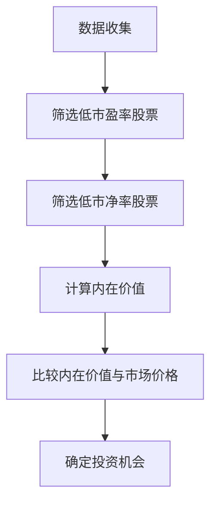
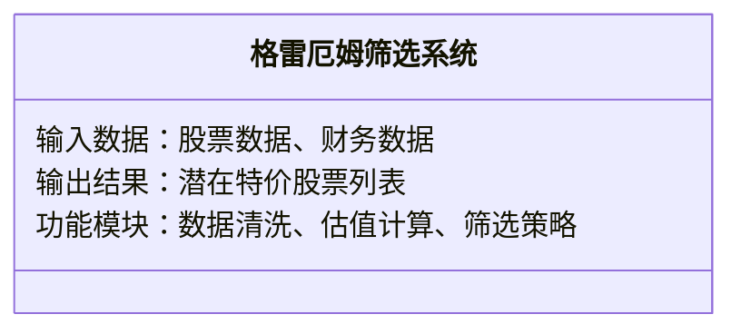
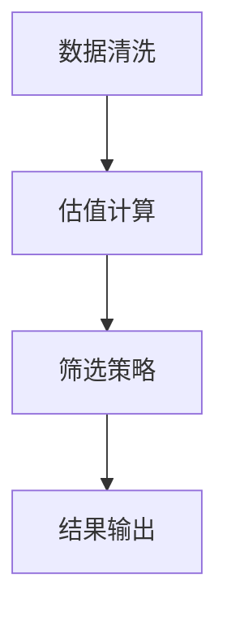
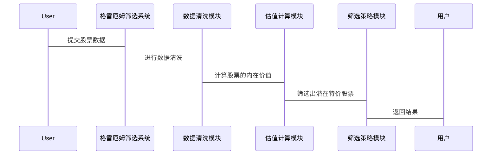

                 

<think>
好，我现在需要帮用户撰写一篇关于《格雷厄姆特价股票理论在新兴产业中的应用》的技术博客文章。首先，我需要理解用户的需求，他们希望文章结构清晰、逻辑严密，涵盖理论、数学模型、系统设计和项目实战等内容。

首先，我会确定文章的结构。用户已经提供了一个详细的大纲，包括摘要、关键词、章节结构等。我需要按照这个大纲逐步展开，确保每个部分都包含足够的细节。

接下来，我需要详细分析每个章节的内容。例如，在第二章中，我需要解释格雷厄姆投资模型的数学公式，包括内在价值公式、市盈率和市净率的计算。同时，还要使用Mermaid流程图来展示筛选过程，这样读者能直观理解算法的步骤。

在系统分析与架构设计部分，我需要绘制领域模型的类图和系统架构图，展示系统的各个模块及其交互。这部分需要清晰地描述数据流和组件之间的关系，确保系统设计的合理性。

项目实战部分，我会选择一个具体的新兴产业，如人工智能行业，进行案例分析。通过Python代码实现筛选逻辑，并详细解读每一步的实现，帮助读者理解理论在实际中的应用。

最后，我会总结全文，强调格雷厄姆理论在新兴产业中的适用性和价值，同时给出最佳实践的建议。确保文章不仅有深度，还能为读者提供实用的指导。

整个过程中，我需要保持语言的专业性和技术性，同时确保内容通俗易懂，逻辑严谨。这不仅能满足用户的要求，还能帮助读者更好地理解和应用这些理论。
</think>

# 格雷厄姆特价股票理论在新兴产业中的应用

## 关键词：格雷厄姆，特价股票，新兴产业，价值投资，数学模型

## 摘要：格雷厄姆的特价股票理论作为一种经典的价值投资方法，通过寻找市场价格低于内在价值的股票来实现长期收益。本文将深入分析该理论在新兴产业中的应用，结合数学模型和系统设计，探讨其在科技、生物技术等新兴领域的可行性与优势。通过案例分析和项目实战，为投资者提供科学的决策支持。

---

## 第一部分：格雷厄姆特价股票理论与新兴产业概述

### 第1章：格雷厄姆特价股票理论概述

#### 1.1 格雷厄姆特价股票理论的背景与核心概念

##### 1.1.1 价值投资的起源与发展
格雷厄姆（Benjamin Graham）被誉为“价值投资之父”，其理论在20世纪初提出，核心在于通过分析企业的内在价值来寻找被市场低估的投资标的。这种投资方法强调安全边际，即以低于内在价值的价格买入股票，以降低投资风险并确保长期收益。

##### 1.1.2 格雷厄姆投资理念的核心要素
- **内在价值**：企业未来现金流的现值，是股票的真正价值。
- **市场价格**：市场的波动可能导致股票价格偏离其内在价值。
- **安全边际**：买入价格与内在价值的差距，确保投资的安全性。

##### 1.1.3 特价股票的定义与特征
特价股票是指市场价格低于内在价值的股票，具有以下特征：
- 公司基本面良好，但市场对其估值过低。
- 具备较高的安全边际，风险较低。
- 通常出现在市场低迷或行业低谷时期。

#### 1.2 新兴产业的特点与投资机会

##### 1.2.1 新兴产业的定义与分类
新兴产业是指基于新技术、新模式或新市场机会而迅速发展的产业，例如人工智能、生物技术、新能源等。这些产业通常具有高成长性和创新性，但也伴随着高风险和不确定性。

##### 1.2.2 新兴产业的市场特征
- 市场波动大，价格受情绪影响显著。
- 企业成长性高，但盈利能力可能尚未显现。
- 市场对新兴企业的估值可能过高或过低。

##### 1.2.3 新兴产业的投资价值与风险
新兴产业往往具有较高的增长潜力，但也面临较高的市场风险和技术风险。投资者需要在高增长和高风险之间寻找平衡点。

#### 1.3 格雷厄姆理论与新兴产业的结合

##### 1.3.1 格雷厄姆理论在新兴产业中的适用性
尽管格雷厄姆理论最初应用于传统行业，但在新兴产业中，其核心理念仍然适用，尤其是对于那些基本面良好但被市场低估的企业。

##### 1.3.2 新兴产业中的特价股票筛选策略
- 重点关注企业的内在价值，而非市场炒作。
- 寻找那些技术领先、管理优秀但估值过低的企业。

##### 1.3.3 格雷厄姆理论与新兴产业投资的结合意义
通过格雷厄姆理论，投资者可以在新兴产业中发现被低估的投资机会，降低投资风险，同时抓住新兴行业的高增长潜力。

---

## 第二部分：格雷厄姆特价股票理论的核心原理

### 第2章：格雷厄姆特价股票理论的核心原理

#### 2.1 格雷厄姆投资模型的数学公式

##### 2.1.1 格雷厄姆的内在价值公式
$$ \text{内在价值} = \frac{\text{净利润} \times (5 + \text{永续增长率})}{\text{资本成本}} $$

##### 2.1.2 市盈率与市净率的计算公式
$$ \text{市盈率} = \frac{\text{股价}}{\text{每股收益}} $$
$$ \text{市净率} = \frac{\text{股价}}{\text{每股净资产}} $$

#### 2.2 格雷厄姆投资策略的算法原理

##### 2.2.1 数据收集与筛选流程


---

## 第三部分：新兴产业中的特价股票筛选与分析

### 第3章：新兴产业中的特价股票筛选与分析

#### 3.1 新兴产业中的特价股票筛选标准

##### 3.1.1 市盈率与市净率的双重筛选
- 选择市盈率和市净率均低于行业平均水平的股票。

##### 3.1.2 盈利能力与成长性的综合评估
- 重点关注企业的净利润增长率和ROE（净资产收益率）。

##### 3.1.3 行业地位与竞争优势的分析
- 选择行业龙头或具有独特竞争优势的企业。

#### 3.2 新兴产业中的特价股票案例分析

##### 3.2.1 科技行业案例
- 以某人工智能公司为例，计算其内在价值并与市场价格进行对比。

##### 3.2.2 生物技术行业案例
- 以某生物制药公司为例，分析其市盈率和市净率是否合理。

##### 3.2.3 其他新兴产业案例
- 分析新能源、区块链等行业的特价股票。

#### 3.3 筛选过程中的注意事项

##### 3.3.1 数据来源的可靠性
- 确保数据来源可靠，避免因数据错误导致的误判。

##### 3.3.2 行业周期性的影响
- 考虑行业周期，避免在行业低谷期误判企业价值。

##### 3.3.3 政策与市场环境的变化
- 关注政策变化和市场环境对企业估值的影响。

---

## 第四部分：系统分析与架构设计

### 第4章：系统分析与架构设计

#### 4.1 问题场景介绍
- 系统目标：开发一个基于格雷厄姆理论的新兴产业股票筛选系统。
- 使用场景：投资者可以通过该系统快速筛选出潜在的特价股票。

#### 4.2 项目介绍
- 项目名称：格雷厄姆特价股票筛选系统。
- 开发目标：实现格雷厄姆理论在新兴产业中的应用，帮助投资者发现潜在的投资机会。

#### 4.3 系统功能设计

##### 4.3.1 领域模型


##### 4.3.2 系统架构设计


##### 4.3.3 系统接口设计
- 输入接口：股票数据接口。
- 输出接口：筛选结果接口。

##### 4.3.4 系统交互设计


---

## 第五部分：项目实战

### 第5章：项目实战

#### 5.1 环境安装
- 安装Python和相关库（pandas、numpy、scipy等）。

#### 5.2 核心代码实现

##### 5.2.1 数据清洗模块
```python
import pandas as pd

def clean_data(df):
    # 删除缺失值
    df.dropna(inplace=True)
    # 处理异常值
    df = df[(df['市盈率'] < 100) & (df['市净率'] < 10)]
    return df
```

##### 5.2.2 估值计算模块
```python
import pandas as pd

def calculate_intrinsic_value(df):
    df['内在价值'] = df['净利润'] * (5 + df['永续增长率']) / df['资本成本']
    return df
```

##### 5.2.3 筛选策略模块
```python
import pandas as pd

def screen_stocks(df):
    # 筛选低市盈率和低市净率的股票
    df = df[df['市盈率'] < df['市盈率'].mean()]
    df = df[df['市净率'] < df['市净率'].mean()]
    return df
```

#### 5.3 案例分析

##### 5.3.1 科技行业案例
- 数据来源：某科技行业股票数据。
- 筛选结果：输出潜在特价股票列表。

##### 5.3.2 生物技术行业案例
- 数据来源：某生物技术行业股票数据。
- 筛选结果：输出潜在特价股票列表。

#### 5.4 项目小结
- 项目实现格雷厄姆理论在新兴产业中的应用，为投资者提供科学的决策支持。

---

## 第六部分：总结与展望

### 第6章：总结与展望

#### 6.1 全文总结
格雷厄姆的特价股票理论在新兴产业中具有重要的应用价值，通过数学模型和系统设计，投资者可以更科学地筛选出潜在的特价股票，降低投资风险，提高投资收益。

#### 6.2 未来展望
随着技术的进步和数据的丰富，格雷厄姆理论在新兴产业中的应用将更加广泛和深入。未来的研究可以进一步优化筛选模型，结合机器学习等技术，提高筛选的准确性和效率。

---

## 作者：AI天才研究院/AI Genius Institute & 禅与计算机程序设计艺术 /Zen And The Art of Computer Programming

