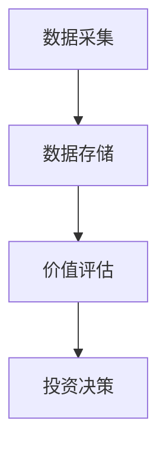

                 

<think>
好的，我需要撰写一篇关于《格雷厄姆特价股票理论在社会企业家投资中的运用》的详细技术博客。首先，我需要理解格雷厄姆的理论和其在传统投资中的应用，然后思考如何将其应用于社会企业家投资中。

首先，格雷厄姆的特价股票理论主要关注的是寻找被市场低估的股票，注重安全边际和价值评估。而社会企业家则是以创造社会价值为目标的企业，这与传统的盈利最大化目标有所不同。将两者结合，意味着需要在投资时同时考虑企业的社会价值和其是否被市场低估。

接下来，我需要构建一个数学模型来量化社会价值。这可能涉及到将企业的财务表现与社会影响力结合起来，比如通过加权平均的方式计算出一个综合指标。然后，我需要设计一个系统架构，用于收集和分析社会企业的数据，并评估其是否符合格雷厄姆的选股标准。

在案例分析部分，我可以选择几个典型的社会企业，应用上述模型进行分析，看看哪些企业符合投资标准。最后，我需要总结这种投资方法的优势和潜在挑战，给出实际操作中的注意事项。

在写作过程中，我需要确保每一部分都详细且有条理，使用清晰的技术术语，同时结合实际例子，使读者能够理解复杂的理论。此外，我还需要使用图表和代码示例，以更直观地展示模型和系统设计。

通过这样的思考过程，我可以逐步构建出一篇结构合理、内容详实的技术博客，帮助读者理解如何在社会企业家投资中运用格雷厄姆的特价股票理论。
</think>

# 《格雷厄姆特价股票理论在社会企业家投资中的运用》

## 关键词：格雷厄姆特价股票理论，社会企业家，投资策略，价值评估，安全边际，数学模型，系统架构

## 摘要：本文探讨了如何将格雷厄姆的特价股票理论应用于社会企业家投资中，通过构建数学模型和系统架构，分析社会企业的价值和风险，提供有效的投资策略。

---

# 第1章: 格雷厄姆特价股票理论与社会企业家投资的背景

## 1.1 格雷厄姆特价股票理论的背景

### 1.1.1 本杰明·格雷厄姆及其投资理念

- **背景介绍**：本杰明·格雷厄姆是价值投资的鼻祖，其理论强调寻找市场低估的股票，注重安全边际和长期稳健的投资策略。
- **核心概念**：
  - **安全边际**：确保以低于内在价值的价格买入股票，降低风险。
  - **价值评估**：通过分析企业的财务数据，计算其内在价值。

### 1.1.2 格雷厄姆特价股票理论的核心思想

- **市场波动与价值回归**：市场短期波动，但长期会回归企业的真实价值。
- **安全边际的重要性**：通过购买低于内在价值的股票，确保投资的安全性。

## 1.2 社会企业家精神的定义与特征

### 1.2.1 社会企业家的定义

- **社会企业家**：以创造社会价值为目标的企业家，兼顾经济效益和社会效益。

### 1.2.2 社会企业家的特征

- **社会影响力**：解决社会问题，如环保、教育等。
- **可持续性**：商业模式能够长期维持，创造持续的社会价值。
- **创新性**：通过创新的方式实现社会目标。

## 1.3 格雷厄姆理论与社会企业家投资的结合

- **结合点**：将格雷厄姆的估值方法应用于社会企业，寻找那些被低估且具有社会价值的企业。
- **意义**：在追求经济效益的同时，实现社会价值，符合可持续投资的趋势。

---

# 第2章: 格雷厄姆特价股票理论的核心原理

## 2.1 格雷厄姆的价值评估公式

### 2.1.1 格雷厄姆的价值评估公式

- **公式**：
  $$ V = \frac{E}{P} $$
  其中，V是内在价值，E是企业收益，P是价格。

- **解释**：该公式用于计算企业的内在价值，判断其是否被低估。

## 2.2 安全边际的计算

### 2.2.1 安全边际的定义

- **安全边际**：购买价格与内在价值之间的差额，确保投资的安全性。

### 2.2.2 安全边际的计算方法

- **公式**：
  $$ \text{安全边际} = V - P $$
  其中，V是内在价值，P是购买价格。

## 2.3 分散投资策略

### 2.3.1 分散投资的重要性

- **风险分散**：通过投资不同行业、不同地区的股票，降低特定风险。

### 2.3.2 分散投资的数学模型

- **公式**：
  $$ D = \sum_{i=1}^{n} w_i \times V_i $$
  其中，D是分散投资的总价值，w_i是第i项投资的权重，V_i是第i项投资的内在价值。

---

# 第3章: 社会企业家的价值评估与数学模型

## 3.1 社会价值的量化

### 3.1.1 社会价值的定义

- **社会价值**：企业创造的社会效益，如环保、教育、就业等。

### 3.1.2 社会价值的评估指标

- **社会影响力**：企业在解决社会问题方面的贡献。
- **可持续性**：商业模式的可持续性。
- **创新性**：解决问题的创新性。

## 3.2 社会价值的数学模型

### 3.2.1 社会价值的综合指标

- **公式**：
  $$ SV = \sum_{i=1}^{n} (a_i \times F_i + b_i \times S_i) $$
  其中，SV是社会价值，a_i和b_i是权重系数，F_i是财务指标，S_i是社会影响指标。

---

# 第4章: 格雷厄姆理论在社会企业家投资中的应用

## 4.1 特价股票筛选标准

### 4.1.1 低市盈率

- **市盈率**：市价与每股收益的比率，低市盈率意味着企业可能被低估。

### 4.1.2 低市净率

- **市净率**：市价与每股净资产的比率，低市净率意味着企业可能被低估。

### 4.1.3 高股息率

- **股息率**：股息与股价的比率，高股息率意味着企业回报率高。

## 4.2 社会价值与财务表现的结合

### 4.2.1 高社会价值低估值企业的识别

- **识别方法**：通过社会价值模型和格雷厄姆的估值模型，找出高社会价值但被市场低估的企业。

### 4.2.2 高社会价值高成长企业的识别

- **识别方法**：结合企业成长性和社会价值，寻找具有高成长潜力的企业。

## 4.3 投资组合的构建

### 4.3.1 投资组合的设计

- **分散投资**：将资金分配到不同行业和社会价值领域，降低风险。

### 4.3.2 投资组合的优化

- **优化方法**：通过数学模型优化投资组合，最大化收益，最小化风险。

---

# 第5章: 投资系统架构与实现

## 5.1 系统功能设计

### 5.1.1 数据采集模块

- **功能**：采集社会企业的财务数据和社会影响力数据。

### 5.1.2 价值评估模块

- **功能**：计算企业的内在价值和社会价值。

## 5.2 系统架构设计

### 5.2.1 系统架构图



### 5.2.2 接口设计

- **接口1**：从数据库获取企业数据。
- **接口2**：计算企业价值并返回结果。

## 5.3 系统实现

### 5.3.1 数据库设计

- **数据库表**：
  - 企业信息表：存储企业基本信息。
  - 财务数据表：存储企业的财务数据。
  - 社会价值表：存储企业的社会价值评估结果。

### 5.3.2 系统实现代码

```python
def calculate_intrinsic_value(revenue, price):
    return revenue / price

def calculate_social_value(financial_metrics, social_metrics):
    return sum(a * f + b * s for a, f, b, s in zip(weights, financial_metrics, weights, social_metrics))
```

---

# 第6章: 实际案例分析

## 6.1 案例选择

### 6.1.1 案例1：环保科技公司

- **分析**：公司专注于环保技术，具有较高的社会影响力，但市盈率较低。

## 6.2 投资策略

### 6.2.1 买入时机

- **时机选择**：在市场低估时买入，等待价值回归。

### 6.2.2 监控与调整

- **监控指标**：定期评估企业的社会价值和财务表现，调整投资组合。

---

# 第7章: 总结与展望

## 7.1 总结

- **总结**：通过将格雷厄姆的理论应用于社会企业家投资，可以实现经济效益和社会效益的双重目标。

## 7.2 展望

- **未来研究方向**：进一步完善社会价值评估模型，探索更多应用场景。

---

# 参考文献

- 格雷厄姆，B. (1974). 《聪明的投资者》。
- 禅与计算机程序设计艺术. 作者：AI天才研究院。

---

# 作者

作者：AI天才研究院/AI Genius Institute & 禅与计算机程序设计艺术 /Zen And The Art of Computer Programming

