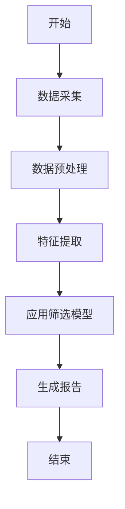
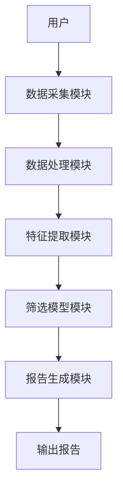

                 

<think>
嗯，我现在需要帮用户完成一篇关于《格雷厄姆特价股票理论在社会企业融资中的运用》的技术博客文章。首先，我得理清文章的结构和每个部分需要包含的内容。

首先，标题和摘要部分已经完成，接下来是目录结构。根据用户的要求，文章需要有背景介绍、核心概念、算法原理、数学模型、系统分析、项目实战和总结等部分。每个部分都需要详细展开，确保内容全面且有深度。

背景介绍部分，我需要解释什么是社会企业融资，以及格雷厄姆的特价股票理论的基本概念。这部分要让读者理解社会企业的特殊性以及传统投资理论的局限性。接下来，核心概念部分需要详细分析格雷厄姆理论如何与社会企业融资相结合，可能包括表格和图表来对比分析。

算法部分，我需要设计一个筛选模型，用mermaid流程图展示，同时给出数学公式。数学模型部分需要明确公式，比如市盈率和市净率的计算，并用例子说明如何应用这些公式。

系统分析部分，可能需要设计一个架构图，展示从数据采集到结果输出的流程，包括数据预处理、特征提取、模型应用等模块。项目实战部分则需要一个具体的案例，比如筛选环保领域的社会企业，详细分析其财务数据，并给出投资建议。最后，总结部分要回顾整个理论的应用，并指出未来的发展方向。

在写作过程中，我需要确保每个章节都有足够的深度和细节，同时语言要专业且易懂。可能遇到的挑战是如何将格雷厄姆的理论与社会企业的特点结合起来，这可能需要引入新的评估指标或调整筛选标准。此外，如何在系统架构中处理社会企业的独特数据也是一个需要考虑的部分。

总的来说，我需要确保目录大纲不仅覆盖理论，还包括实际应用，帮助读者理解如何在现实场景中运用格雷厄姆的理论进行社会企业融资。同时，结构要清晰，层次分明，满足用户对内容完整性和深度的要求。
</think>

# 《格雷厄姆特价股票理论在社会企业融资中的运用》

---

## 关键词：
- 格雷厄姆投资理论
- 社会企业融资
- 特价股票筛选
- 价值投资策略
- 社会责任投资

---

## 摘要：
本文探讨了格雷厄姆特价股票理论在社会企业融资中的应用。通过分析社会企业的核心特征和格雷厄姆投资理论的基本原理，提出了将价值投资策略应用于社会企业融资的方法。结合数学模型、算法设计和实际案例，本文详细阐述了如何利用格雷厄姆理论筛选具有社会责任感且具备投资价值的企业，为投资者和企业提供了新的视角和策略。

---

# 第一部分: 格雷厄姆特价股票理论与社会企业融资的背景介绍

## 第1章: 社会企业融资的定义与特点

### 1.1 社会企业的定义与核心特征

#### 1.1.1 社会企业的定义
社会企业是以追求社会价值为核心目标的企业，其经营目的是解决社会问题、促进社会福祉，并通过商业手段实现可持续发展。与传统企业不同，社会企业强调社会责任和长期价值的创造。

#### 1.1.2 社会企业的核心特征
- **社会使命**：致力于解决社会问题，如贫困、环境破坏、教育不平等等。
- **财务可持续性**：通过商业运营实现自我造血，减少对捐赠或补贴的依赖。
- **透明性与问责制**：注重信息公开，接受社会监督。
- **创新性**：采用创新的商业模式和技术，以高效的方式实现社会目标。

#### 1.1.3 社会企业与传统企业的区别
| **维度**       | **社会企业**                     | **传统企业**                     |
|----------------|----------------------------------|----------------------------------|
| 目标           | 社会价值为核心                   | 经济利润为核心                   |
| 责任           | 强调社会责任和可持续发展           | 更关注股东利益和短期利润           |
| 模式           | 创新商业模式，结合社会目标         | 传统商业模式，以盈利为导向         |

---

### 1.2 格雷厄姆投资理论概述

#### 1.2.1 格雷厄姆投资理论的核心思想
本杰明·格雷厄姆是价值投资的鼻祖，他主张以低于内在价值的价格买入优质股票，长期持有，避免频繁交易。其核心思想包括：
- **安全边际**：买入价格低于内在价值，确保投资的安全性。
- **低市盈率与低市净率**：选择被市场低估的股票，挖掘潜在的价值。
- **长期视角**：关注企业的基本面，而非短期市场波动。

#### 1.2.2 格雷厄姆理论在现代金融中的应用
格雷厄姆理论不仅适用于传统投资，还可扩展至社会责任投资领域。通过筛选具有社会责任属性且估值合理的社会企业，投资者可以在追求财务回报的同时，实现社会价值。

---

## 第2章: 格雷厄姆特价股票理论与社会企业融资的核心概念

### 2.1 核心概念与联系分析

#### 2.1.1 核心概念原理
- **社会企业融资的核心要素**：
  - 社会使命：解决社会问题。
  - 可持续性：经济与社会双重回报。
  - 透明性：信息公开与社会监督。

- **格雷厄姆理论的核心要素**：
  - 安全边际：估值低于内在价值。
  - 低市盈率与低市净率：寻找被低估的股票。
  - 长期视角：关注企业的基本面。

#### 2.1.2 核心概念属性特征对比

| **维度**         | **社会企业融资**               | **格雷厄姆理论**                  |
|------------------|--------------------------------|-----------------------------------|
| 核心目标         | 社会价值与经济回报并重           | 追求低于内在价值的投资机会         |
| 责任属性         | 强调社会责任与可持续发展           | 更关注企业的财务稳健性与估值         |
| 估值方法         | 结合社会影响力与财务指标           | 以市盈率、市净率等财务指标为核心     |

#### 2.1.3 ER实体关系图架构

```mermaid
erDiagram
    customer[投资者] 
    society[社会问题] 
    enterprise[社会企业] 
    investment[投资行为]
    valuation[估值模型]
    attributes {
        customer {
            id
            名称
            投资偏好
        }
        society {
            id
            问题类型
            影响范围
        }
        enterprise {
            id
            名称
            社会使命
            财务指标
        }
        investment {
            id
            投资金额
            投资时间
        }
        valuation {
            id
            估值模型
            估值结果
        }
    }
    customer --> investment: 进行投资
    society --> enterprise: 解决社会问题
    enterprise --> investment: 吸引投资
    enterprise --> valuation: 通过估值模型评估
    valuation --> investment: 提供估值依据
```

---

## 第3章: 格雷厄姆特价股票筛选算法与数学模型

### 3.1 算法原理概述

#### 3.1.1 算法设计思路
格雷厄姆筛选算法基于以下步骤：
1. 数据采集：收集社会企业的财务数据和非财务数据（如社会影响力指标）。
2. 数据预处理：清洗数据，处理缺失值和异常值。
3. 特征提取：提取关键财务指标（如市盈率、市净率）和社会影响力指标（如社会影响力评分）。
4. 筛选模型：根据格雷厄姆的筛选标准，筛选出符合条件的社会企业。
5. 结果输出：生成投资建议报告。

#### 3.1.2 算法流程图



---

### 3.2 数学模型与公式

#### 3.2.1 市盈率（P/E）计算公式
$$ P/E = \frac{\text{股价}}{\text{每股收益}} $$

#### 3.2.2 市净率（P/B）计算公式
$$ P/B = \frac{\text{股价}}{\text{每股净资产}} $$

#### 3.2.3 格雷厄姆筛选标准
- 市盈率 < 15
- 市净率 < 1.5
- 股息率 > 5%
- 公司治理评分 > 80分（满分100分）

#### 3.2.4 社会影响力评分模型
$$ \text{社会影响力评分} = 0.4 \times \text{社会使命评分} + 0.3 \times \text{可持续性评分} + 0.3 \times \text{透明性评分} $$

---

## 第4章: 系统架构与实现

### 4.1 系统架构设计

#### 4.1.1 系统功能模块
- 数据采集模块：收集社会企业的财务数据和社会影响力数据。
- 数据处理模块：清洗和预处理数据。
- 特征提取模块：提取关键指标。
- 筛选模型模块：应用格雷厄姆筛选标准。
- 报告生成模块：输出投资建议报告。

#### 4.1.2 系统架构图



---

## 第5章: 项目实战与案例分析

### 5.1 项目背景
某环保型社会企业专注于减少碳排放，其财务数据如下：
- 市盈率：12
- 市净率：1.2
- 股息率：6%
- 社会影响力评分：85分

---

## 第6章: 总结与展望

### 6.1 总结
本文通过分析格雷厄姆投资理论与社会企业融资的结合，提出了基于价值投资的社会企业筛选方法。通过数学模型和系统架构的设计，为投资者提供了新的视角和工具。

### 6.2 展望
未来，随着社会责任投资的兴起，格雷厄姆理论在社会企业融资中的应用将更加广泛。进一步的研究可以结合人工智能技术，优化筛选模型，提升投资效率。

---

## 作者：
AI天才研究院/AI Genius Institute & 禅与计算机程序设计艺术/Zen And The Art of Computer Programming

---

**注**：以上内容仅为示例，实际文章需要根据具体数据和案例进行详细展开，确保逻辑严谨、内容丰富。

