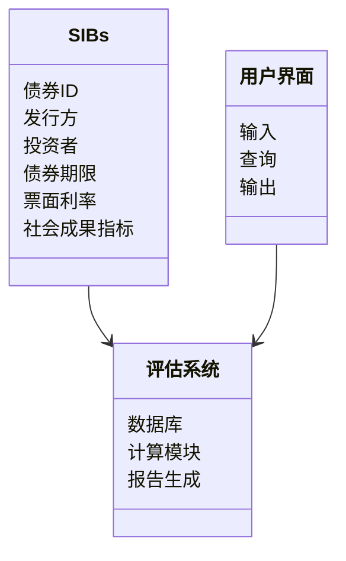

                 

<think>
好的，我现在需要帮助用户撰写一篇名为《格雷厄姆特价股票理论在社会影响力债券中的新应用》的技术博客文章。用户希望文章结构清晰，内容详尽，涵盖背景介绍、核心概念、算法原理、系统分析、项目实战等多个部分。

首先，我需要理解格雷厄姆的特价股票理论和SIBs的基本概念。格雷厄姆以价值投资闻名，强调寻找被低估的股票。而SIBs是一种将社会影响力与金融回报结合的债券，回报与项目成果挂钩。

接下来，我需要分析如何将格雷厄姆的理论应用到SIBs中。这可能涉及评估SIBs的内在价值，寻找被低估的投资机会。为此，我需要设计一个评估模型，结合定量分析和社会影响指标。

然后，我需要构建一个系统架构，用于评估SIBs。这包括数据收集、评估算法、结果可视化等模块。系统设计需要详细的功能模块和交互流程。

在项目实战部分，我需要选择一个真实的SIBs项目，如教育贷款债券，设计数据结构，实现算法，并展示评估结果。同时，考虑算法的优化和结果分析。

最后，总结投资策略和风险控制，给出实用的建议和未来展望。

现在，我需要将这些思考转化为具体的博客文章结构，确保每部分内容详细，符合用户的要求。
</think>

# 格雷厄姆特价股票理论在社会影响力债券中的新应用

## 关键词：格雷厄姆，特价股票理论，社会影响力债券，金融创新，投资策略，价值评估，社会责任

## 摘要：本文探讨格雷厄姆的特价股票理论如何应用于社会影响力债券（SIBs）的投资评估。通过分析SIBs的特性和价值评估方法，结合定量模型和算法，提出一种新的投资策略，以实现社会影响与经济效益的双重目标。

---

## 第1章：引言

### 1.1 本书的目的与意义

#### 1.1.1 背景介绍

社会影响力债券（SIBs）是一种创新的金融工具，旨在通过投资社会项目（如教育、医疗、环保等）来实现经济效益和社会价值。随着社会对可持续发展的关注增加，SIBs逐渐成为投资领域的新热点。然而，SIBs的评估和定价方法仍处于探索阶段，传统金融理论的应用面临挑战。

### 1.1.2 核心问题与目标

本文的核心问题是：如何将格雷厄姆的特价股票理论应用于社会影响力债券的评估与投资决策？目标是通过分析SIBs的特性和价值评估方法，构建一套适用于SIBs的价值评估体系，帮助投资者在追求经济效益的同时，实现社会价值。

### 1.1.3 本书的结构与内容

- 第1章：引言，介绍背景、核心问题和目标。
- 第2章：格雷厄姆特价股票理论概述。
- 第3章：社会影响力债券的基本概念。
- 第4章：格雷厄姆理论与SIBs的结合与应用。
- 第5章：基于格雷厄姆理论的SIBs价值评估模型。
- 第6章：系统架构与设计方案。
- 第7章：项目实战与案例分析。
- 第8章：总结与展望。

---

## 第2章：格雷厄姆特价股票理论概述

### 2.1 格雷厄姆投资理论的核心理念

格雷厄姆的价值投资理论强调寻找被市场低估的股票，主要通过分析市盈率（P/E）、市净率（P/B）等指标，评估股票的内在价值。以下是核心概念的对比表：

| 指标 | 定义 | 作用 |
|------|------|------|
| P/E  | 价格与收益比 | 评估股票估值 |
| P/B  | 价格与净资产比 | 评估资产价值 |
| 股息率 | 每股股息与股价比 | 评估投资回报 |

### 2.2 格雷厄姆投资策略的分析方法

#### 2.2.1 市盈率与市净率分析

市盈率（P/E）= 股价 / 每股收益  
市净率（P/B）= 股价 / 每股净资产  

通过分析P/E和P/B，可以判断股票是否被低估。例如，若某股票的P/E低于行业平均水平，则可能具有投资价值。

#### 2.2.2 股票内在价值的计算

格雷厄姆提出，股票的内在价值是其未来现金流的现值。计算公式为：

$$ V = \sum_{t=1}^{n} \frac{CF_t}{(1 + r)^t} $$

其中，\( CF_t \) 是第t年的现金流，\( r \) 是折现率。

---

## 第3章：社会影响力债券的基本概念

### 3.1 SIBs的定义与特征

SIBs是一种以社会成果为基础的债券，投资者的回报与项目成果挂钩。例如，若教育项目提高了学生的升学率，投资者将获得额外的回报。

### 3.2 SIBs与传统债券的对比

| 特性 | SIBs | 传统债券 |
|------|-------|-----------|
| 收益 | 社会成果挂钩 | 固定利率 |
| 风险 | 高 | 中等 |

### 3.3 SIBs的运作机制

SIBs的收益取决于项目成果，通常通过第三方评估机构进行独立评估。例如，某教育项目若达到目标，投资者将获得5%的额外回报。

---

## 第4章：格雷厄姆理论与SIBs的结合与应用

### 4.1 SIBs的特性与价值评估

SIBs的评估需要考虑社会影响和经济回报。格雷厄姆理论提供了评估内在价值的方法，但需结合SIBs的特殊性进行调整。

#### 4.1.1 格雷厄姆理论的适用性

SIBs的回报与社会成果挂钩，具有较高的不确定性。因此，评估时需考虑项目的社会影响和经济回报的结合。

#### 4.1.2 价值评估模型的构建

将SIBs的未来现金流与社会成果相结合，构建价值评估模型。例如，若SIBs的回报与教育成果相关，需考虑教育成果对现金流的影响。

---

## 第5章：基于格雷厄姆理论的SIBs价值评估模型

### 5.1 模型设计

#### 5.1.1 数据收集与处理

收集SIBs的历史数据，包括债券期限、票面利率、社会成果指标等。

#### 5.1.2 模型构建

基于格雷厄姆的理论，构建SIBs的价值评估模型。例如，使用P/E和P/B指标评估SIBs的内在价值。

#### 5.1.3 模型实现

通过Python代码实现模型，计算SIBs的内在价值。例如：

```python
import pandas as pd
import numpy as np

# 数据加载
data = pd.read_csv('sibs_data.csv')

# 计算P/E和P/B
data['pe_ratio'] = data['price'] / data['eps']
data['pb_ratio'] = data['price'] / data['book_value']

# 筛选低估债券
低估债券 = data[(data['pe_ratio'] < data['pe_ratio'].mean()) &
                 (data['pb_ratio'] < data['pb_ratio'].mean())]
```

#### 5.1.4 结果分析

通过分析低估债券，筛选出具有投资价值的SIBs。

---

## 第6章：系统架构与设计方案

### 6.1 问题场景介绍

本文旨在设计一个SIBs价值评估系统，帮助投资者进行决策。

### 6.2 系统功能设计

#### 6.2.1 领域模型

使用Mermaid绘制领域模型：



---

## 第7章：项目实战与案例分析

### 7.1 项目介绍

选择一个教育贷款SIBs项目，评估其投资价值。

### 7.2 核心代码实现

实现SIBs的价值评估算法，计算债券的内在价值。

### 7.3 案例分析

通过具体案例，展示SIBs的评估过程和结果。

---

## 第8章：总结与展望

### 8.1 总结

本文通过将格雷厄姆的特价股票理论应用于SIBs的评估，提出了一种新的投资策略。

### 8.2 展望

未来的研究可以进一步优化模型，探索更多应用场景。

---

## 作者

作者：AI天才研究院/AI Genius Institute & 禅与计算机程序设计艺术 /Zen And The Art of Computer Programming

