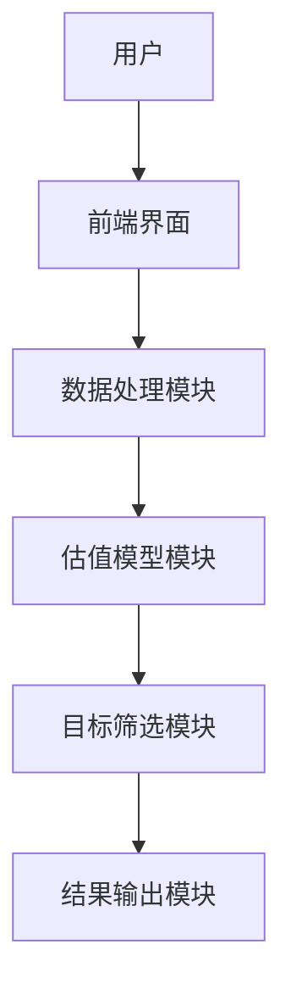

                 


```markdown
# 格雷厄姆特价股票理论在私募股权投资中的新应用

> 关键词：格雷厄姆投资理论，私募股权投资，股票估值，价值投资，企业分析，金融模型

> 摘要：本文探讨了格雷厄姆的廉价股理论在私募股权投资中的创新应用，通过系统分析和实际案例，详细阐述了如何利用格雷厄姆的投资理念进行企业估值、目标筛选和投资决策优化，为私募股权投资者提供了新的视角和方法。

---

# 第一部分: 格雷厄姆特价股票理论与私募股权投资概述

## 第1章: 格雷厄姆投资理论的核心概念

### 1.1 格雷厄姆投资理论的背景与起源

#### 1.1.1 价值投资的起源与发展
- **价值投资**：起源于20世纪初，由本杰明·格雷厄姆和大卫·多德共同提出。
- **核心思想**：寻找市场价格低于其内在价值的股票，即“廉价股”。
- **发展史**：
  - 1934年，格雷厄姆与多德合著《证券分析》，系统阐述了价值投资理论。
  - 20世纪70年代，巴菲特等人将格雷厄姆理论发扬光大，使其成为现代投资学的重要流派。

#### 1.1.2 格雷厄姆对价值投资的贡献
- **安全边际**：格雷厄姆提出“安全边际”概念，即以低于内在价值的价格买入股票，以降低投资风险。
- **逆向思维**：在市场恐慌时买入，市场狂热时卖出。
- **长期视角**：注重企业的长期价值，而非短期市场波动。

#### 1.1.3 特价股票的定义与特征
- **定义**：市场价格显著低于企业内在价值的股票。
- **特征**：
  - 低市盈率（P/E）和低市净率（P/B）。
  - 高股息率。
  - 企业基本面稳定，具备长期增长潜力。

---

## 第2章: 私募股权投资的基本概念

### 2.1 私募股权投资的定义
- **私募股权**：指通过非公开市场进行的企业投资，投资者通常是机构或高净值个人。
- **运作模式**：私募基金通过收购企业股权，进行价值挖掘和增值，最终通过上市或出售退出。

### 2.2 私募股权投资的市场特点
- **高风险高回报**：私募股权投资通常涉及高成长企业，风险较高，但潜在回报也较高。
- **专业性要求高**：需要深入的企业分析和行业研究。
- **流动性低**：私募股权通常需要较长时间才能退出，流动性较低。

---

# 第二部分: 格雷厄姆理论在私募股权投资中的应用

## 第3章: 格雷厄姆理论在私募股权投资中的创新

### 3.1 格雷厄姆理论在私募股权投资中的适用性

#### 3.1.1 格雷厄姆理论的核心思想
- **核心思想**：寻找市场价格低于内在价值的企业，注重安全边际。
- **私募股权视角**：将格雷厄姆的廉价股理论应用于企业并购和投资决策。

#### 3.1.2 私募股权投资中的价值发现
- **价值发现**：通过分析企业的财务数据，识别其内在价值。
- **市场低估**：寻找市场价格低于内在价值的企业，作为投资标的。

#### 3.1.3 格雷厄姆理论与私募股权投资的契合点
- **契合点**：
  - 两者都强调企业内在价值的评估。
  - 两者都注重安全边际，降低投资风险。

---

## 第4章: 私募股权投资中的估值方法

### 4.1 格雷厄姆理论与私募股权投资的结合

#### 4.1.1 市盈率与市净率分析
- **市盈率（P/E）**：企业市值与净利润的比值。
  - 公式：$$P/E = \frac{Market\ Value}{Net\ Income}$$
- **市净率（P/B）**：企业市值与净资产的比值。
  - 公式：$$P/B = \frac{Market\ Value}{Book\ Value}$$

#### 4.1.2 现金流折现法（DCF）模型
- **现金流折现法**：通过预测企业未来现金流，计算其现值，评估企业内在价值。
  - 公式：$$Value = \sum_{t=1}^{n} \frac{CF_t}{(1+r)^t}$$
  - 其中，\( r \) 为折现率，\( CF_t \) 为第 \( t \) 年的现金流。

#### 4.1.3 企业价值倍数（EV/EBITDA）分析
- **EV/EBITDA**：企业价值与息税折旧及摊销前利润的比值。
  - 公式：$$EV/EBITDA = \frac{Enterprise\ Value}{EBITDA}$$

---

## 第5章: 格雷厄姆理论与私募股权投资的系统分析

### 5.1 系统分析与架构设计方案

#### 5.1.1 问题场景介绍
- **问题背景**：私募股权投资需要对企业进行深入分析，寻找具有投资价值的企业。
- **目标**：利用格雷厄姆理论，构建一个企业筛选和估值的系统。

#### 5.1.2 系统功能设计（领域模型）
- **核心功能**：
  - 数据收集与处理：收集企业的财务数据、行业信息等。
  - 估值模型：基于格雷厄姆理论，构建估值模型。
  - 目标筛选：根据估值结果，筛选出具有投资价值的企业。

#### 5.1.3 系统架构设计（mermaid架构图）


---

## 第6章: 格雷厄姆理论与私募股权投资的项目实战

### 6.1 环境安装与数据准备

#### 6.1.1 数据源的选择与获取
- 数据来源：企业财务报表、行业报告、市场数据等。
- 数据处理：清洗、转换和存储。

#### 6.1.2 数据处理与分析
- 使用Python进行数据清洗和分析。
  ```python
  import pandas as pd
  data = pd.read_csv('enterprise_data.csv')
  data_cleaned = data.dropna()
  ```

---

## 第7章: 格雷厄姆理论与私募股权投资的总结与展望

### 7.1 总结
- 格雷厄姆理论为私募股权投资提供了新的视角，通过深入分析企业的内在价值，识别市场低估的企业。
- 结合现代金融模型和系统分析方法，可以提高投资决策的科学性和准确性。

### 7.2 展望
- **技术进步**：人工智能和大数据技术的应用将推动格雷厄姆理论在私募股权投资中的进一步发展。
- **未来研究**：探索更多基于格雷厄姆理论的投资策略，优化企业估值模型。

---

# 结语

格雷厄姆特价股票理论在私募股权投资中的新应用，不仅丰富了私募股权投资的理论体系，也为投资者提供了新的工具和方法。通过结合现代技术手段，如大数据分析和人工智能，格雷厄姆理论的应用将更加广泛和深入。

---

作者：AI天才研究院/AI Genius Institute & 禅与计算机程序设计艺术 /Zen And The Art of Computer Programming
```

