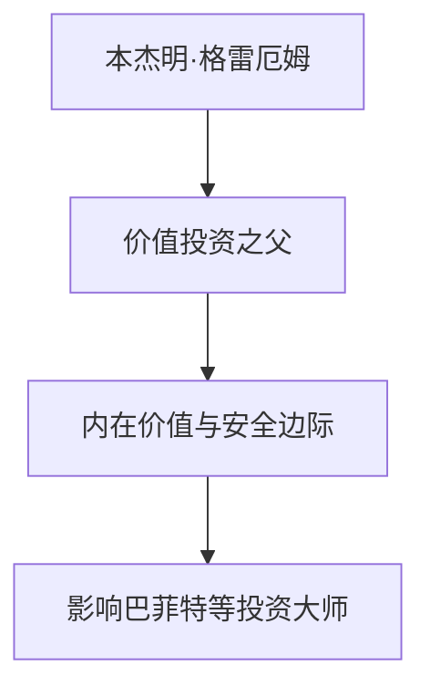
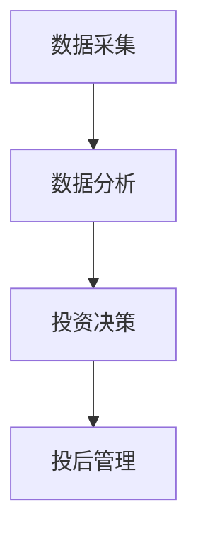
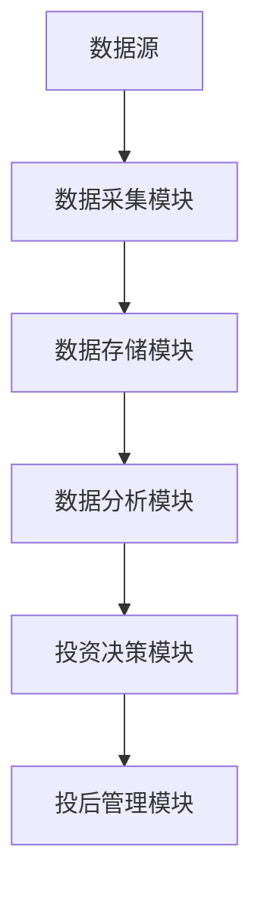

                 


# 《格雷厄姆特价股票理论在私募股权投资中的运用》

> 关键词：格雷厄姆投资理论，私募股权投资，价值投资，安全边际，数学模型

> 摘要：本文深入探讨了本杰明·格雷厄姆的价值投资理论，特别是其在私募股权投资中的应用。通过分析格雷厄姆的选股标准和私募股权投资的核心策略，本文构建了一个基于格雷厄姆理论的私募投资系统，并通过数学模型和实际案例展示了该系统的实现和应用。

---

# 第一部分: 格雷厄姆特价股票理论基础

## 第1章: 格雷厄姆特价股票理论概述

### 1.1 格雷厄姆投资理论的起源与发展

#### 1.1.1 价值投资的鼻祖——本杰明·格雷厄姆

格雷厄姆（Benjamin Graham）是价值投资的鼻祖，他的投资理念深刻影响了包括巴菲特在内的众多投资者。格雷厄姆的核心思想是“安全边际”和“内在价值”。他认为，股票不仅仅是一个交易的工具，更是一个企业的所有权证书。投资者应该以低于其内在价值的价格买入股票，并长期持有，直到其价值被市场充分认识到为止。

**图1-1：格雷厄姆投资理论的起源与发展**



#### 1.1.2 格雷厄姆投资理论的核心思想

格雷厄姆的投资理论可以总结为以下几点：

1. **安全边际**：买入价格远低于内在价值的股票，以确保即使市场波动，也能获得超额收益。
2. **内在价值**：股票的内在价值是其未来现金流的现值，可以通过基本面分析来估算。
3. **逆向投资**：在市场恐慌时买入，在市场狂热时卖出。

#### 1.1.3 格雷厄姆理论在现代投资中的地位

格雷厄姆的理论奠定了现代价值投资的基础。尽管金融市场环境不断变化，但格雷厄姆的核心思想依然适用。他的理论尤其适合私募股权投资，因为私募股权注重长期价值创造，而格雷厄姆的理论正好提供了如何寻找被低估企业的方法。

### 1.2 特价股票的定义与特点

#### 1.2.1 特价股票的定义

特价股票是指市场价格远低于其内在价值的股票。格雷厄姆认为，这类股票通常是由于市场恐慌、投资者情绪低落或市场信息不对称导致的。因此，这类股票为投资者提供了极好的买入机会。

#### 1.2.2 特价股票的核心特征

- **低市盈率**：市盈率（P/E）远低于行业平均水平。
- **低市净率**：市净率（P/B）远低于行业平均水平。
- **股价低于净资产价值**：股价（P）低于每股净资产（BPS）。

#### 1.2.3 特价股票与普通股票的区别

| 特性         | 特价股票                 | 普通股票                 |
|--------------|--------------------------|--------------------------|
| 市盈率       | 低于行业平均水平         | 接近或高于行业平均水平   |
| 市净率       | 低于行业平均水平         | 接近或高于行业平均水平   |
| 股价与净资产价值比 | 低于1                   | 接近或高于1             |
| 投资价值     | 高，存在安全边际         | 中等或低，存在较大波动   |

### 1.3 格雷厄姆选股标准

#### 1.3.1 低市盈率策略

市盈率（P/E）是衡量股票价值的重要指标。格雷厄姆建议投资者选择市盈率低于行业平均水平的股票。

$$ P/E = \frac{\text{股价}}{\text{每股收益}} $$

#### 1.3.2 高市净率策略

市净率（P/B）是另一个重要的指标。格雷厄姆认为，市净率低于1的股票具有较高的投资价值。

$$ P/B = \frac{\text{股价}}{\text{每股净资产}} $$

#### 1.3.3 股价低于净资产价值策略

格雷厄姆建议投资者选择股价低于每股净资产的股票。

$$ P < \text{BPS} $$

---

## 第2章: 私募股权投资的基本概念

### 2.1 私募股权投资的定义与特点

#### 2.1.1 私募股权投资的定义

私募股权投资（Private Equity, PE）是指通过私募基金投资于非公开交易的企业股权。私募股权投资者通常通过杠杆收购、夹层融资等方式，获得目标企业的控制权，并通过改善管理和运营，提升企业价值，最终通过出售或上市退出。

#### 2.1.2 私募股权投资的核心特征

- **高杠杆**：私募股权通常使用杠杆收购，即通过债务融资放大投资收益。
- **长期持有**：私募股权投资者通常会长期持有企业股权，直到企业价值提升。
- **高风险高收益**：私募股权投资风险较高，但潜在收益也较大。

#### 2.1.3 私募股权投资与公募投资的区别

| 特性         | 私募股权投资           | 公募投资               |
|--------------|-----------------------|------------------------|
| 投资对象     | 非公开交易的企业股权   | 公开交易的股票         |
| 投资门槛     | 高                    | 低                    |
| 投资期限     | 长                    | 短                    |
| 风险与收益   | 高风险，高收益        | 中等风险，中等收益    |

### 2.2 私募股权投资的主要策略

#### 2.2.1 股权投资策略

股权投资策略是指通过直接购买企业股权，成为企业的股东，通过企业价值的提升获得收益。

#### 2.2.2 杠杆收购策略

杠杆收购策略是指通过使用大量债务融资，收购目标企业，利用企业的现金流偿还债务，并通过企业价值的提升获得收益。

#### 2.2.3 夹层融资策略

夹层融资策略是指在目标企业的股权结构中，插入一层优先股或可转换债券，以获得较高的收益。

### 2.3 私募股权投资的流程

#### 2.3.1 项目筛选与尽职调查

私募股权投资者需要对目标企业进行全面的尽职调查，包括财务、法律、管理等方面。

#### 2.3.2 投资决策与资金募集

根据尽职调查结果，私募股权基金做出投资决策，并募集必要的资金。

#### 2.3.3 投资后管理与退出机制

私募股权基金在投资后，通常会派出管理团队对目标企业进行管理，提升企业价值。最终通过出售或上市退出。

---

## 第3章: 格雷厄姆理论在私募股权投资中的应用

### 3.1 格雷厄姆理论与私募股权投资的结合

格雷厄姆的价值投资理论为私募股权投资提供了重要的指导。私募股权投资者可以通过寻找被低估的企业，利用杠杆收购等方式，提升企业价值，最终实现收益。

### 3.2 格雷厄姆选股模型在私募股权投资中的应用

#### 3.2.1 格雷厄姆选股模型的数学表达

格雷厄姆选股模型可以通过以下公式进行量化：

$$ \text{安全边际} = \text{内在价值} - \text{市场价格} $$

$$ \text{内在价值} = \sum_{t=1}^{\infty} \frac{\text{现金流}_t}{(1+r)^t} $$

其中，r为折现率。

#### 3.2.2 格雷厄姆选股模型的实现

以下是一个简单的Python代码示例，用于计算股票的市盈率和市净率：

```python
import pandas as pd

# 假设df为股票数据
def calculate_pe_pb(df):
    df['PE'] = df['股价'] / df['每股收益']
    df['PB'] = df['股价'] / df['每股净资产']
    return df

# 示例数据
data = {
    '股价': [10, 20, 30],
    '每股收益': [2, 3, 4],
    '每股净资产': [5, 6, 7]
}
df = pd.DataFrame(data)
result = calculate_pe_pb(df)
print(result)
```

### 3.3 私募股权投资中的风险控制

#### 3.3.1 安全边际的应用

在私募股权投资中，投资者需要设定安全边际，即买入价格远低于内在价值。这样可以在市场波动中确保收益。

#### 3.3.2 风险分散策略

通过投资多个项目，分散投资风险。

#### 3.3.3 投后管理中的风险监控

私募股权基金需要对目标企业进行持续监控，确保企业价值的提升。

---

## 第4章: 格雷厄姆理论在私募股权投资中的数学模型

### 4.1 格雷厄姆选股模型的数学表达

格雷厄姆选股模型可以通过以下公式进行量化：

$$ \text{安全边际} = \text{内在价值} - \text{市场价格} $$

$$ \text{内在价值} = \sum_{t=1}^{\infty} \frac{\text{现金流}_t}{(1+r)^t} $$

其中，r为折现率。

### 4.2 私募股权投资中的收益预测模型

#### 4.2.1 内部收益率（IRR）计算公式

内部收益率（IRR）是私募股权投资中常用的收益指标：

$$ IRR = r \text{ 满足 } \sum_{t=1}^{n} \frac{CF_t}{(1+r)^t} = 0 $$

其中，CF_t为第t年的现金流。

---

## 第5章: 基于格雷厄姆理论的私募投资系统设计

### 5.1 系统功能设计

#### 5.1.1 系统模块划分

- 数据采集模块：采集股票数据。
- 数据分析模块：计算市盈率、市净率等指标。
- 投资决策模块：基于格雷厄姆理论筛选目标股票。
- 投后管理模块：监控投资组合。

#### 5.1.2 系统功能流程



### 5.2 系统架构设计

#### 5.2.1 系统架构图



### 5.3 系统接口设计

#### 5.3.1 数据接口

- 数据输入接口：接收股票数据。
- 数据输出接口：输出分析结果。

#### 5.3.2 交互接口

- 用户输入接口：用户输入投资参数。
- 系统输出接口：系统输出投资建议。

---

## 第6章: 项目实战

### 6.1 环境安装与配置

需要安装Python、Pandas、Matplotlib等库。

### 6.2 核心实现代码

```python
import pandas as pd
import numpy as np

# 数据采集模块
def fetch_data(tickers):
    # 假设tickers为股票代码列表
    data = {}
    for ticker in tickers:
        # 从数据库或API获取数据
        pass
    return data

# 数据分析模块
def calculate_metrics(data):
    df = pd.DataFrame(data)
    df['PE'] = df['股价'] / df['每股收益']
    df['PB'] = df['股价'] / df['每股净资产']
    return df

# 投资决策模块
def screen_stocks(df):
    # 筛选市盈率低于行业平均水平且股价低于净资产价值的股票
    industry_pe = df['PE'].mean()
    industry_pb = df['PB'].mean()
    df['符合标准'] = (df['PE'] < industry_pe) & (df['PB'] < industry_pb)
    return df
```

### 6.3 代码应用与解读

通过上述代码，我们可以筛选出符合格雷厄姆选股标准的股票，作为私募股权投资的目标。

---

## 第7章: 总结与最佳实践

### 7.1 小结

格雷厄姆的价值投资理论为私募股权投资提供了重要的指导。通过结合格雷厄姆的选股标准和私募股权投资的策略，投资者可以更好地实现价值投资。

### 7.2 注意事项

- **风险控制**：私募股权投资风险较高，需要严格控制风险。
- **长期持有**：私募股权需要长期持有，耐心等待企业价值的提升。
- **持续学习**：市场环境不断变化，需要持续学习和调整策略。

### 7.3 拓展阅读

- 《格雷厄姆投资经典》
- 《私募股权基金》
- 《价值投资实战》

---

# 作者信息

作者：AI天才研究院/AI Genius Institute & 禅与计算机程序设计艺术/Zen And The Art of Computer Programming

---

**注**：以上内容为示例，实际文章需要根据具体要求进一步完善和扩展。

