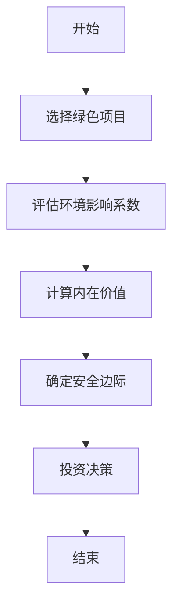
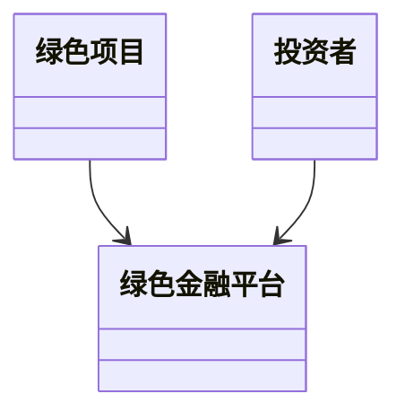

                 


# 格雷厄姆特价股票理论在绿色金融中的应用

> 关键词：格雷厄姆特价股票理论，绿色金融，价值投资，可持续发展，金融创新

> 摘要：本文探讨了如何将格雷厄姆的价值投资理论应用于绿色金融领域，分析了绿色金融的核心概念、投资策略及系统架构，并通过案例分析和代码实现，展示了如何在实践中应用这些理论。文章结合理论与实践，提出了一套创新的解决方案，并展望了未来的发展方向。

---

# 第1章: 格雷厄姆特价股票理论与绿色金融的背景介绍

## 1.1 格雷厄姆特价股票理论的核心概念

### 1.1.1 价值投资的基本原理
价值投资是一种投资策略，强调以低于内在价值的价格购买优质资产。格雷厄姆在其著作中提出，市场价格往往偏离内在价值，投资者应寻找市场低估的股票。

### 1.1.2 特价股票的定义与特征
特价股票是指市场价格显著低于其内在价值的股票。格雷厄姆认为，这类股票具有安全边际，能够为投资者提供较高的风险调整后收益。

### 1.1.3 格雷厄姆投资策略的历史演变
格雷厄姆的投资策略从早期的“捡烟蒂”策略逐渐演变为更系统化的价值评估方法，强调对公司的基本面分析和安全边际计算。

## 1.2 绿色金融的概念与内涵

### 1.2.1 绿色金融的定义
绿色金融是指将资金投资于支持环境保护和可持续发展的项目、企业和产品。它旨在通过金融手段促进环境改善和资源高效利用。

### 1.2.2 绿色金融的核心要素
绿色金融的核心要素包括绿色债券、绿色股票、绿色基金等金融工具，以及环境评估、碳排放交易等机制。

### 1.2.3 绿色金融与可持续发展的关系
绿色金融是实现可持续发展的重要手段，通过引导资金流向环保项目，推动经济向低碳、可持续方向转型。

## 1.3 格雷厄姆理论与绿色金融的结合背景

### 1.3.1 绿色金融发展的现状与挑战
尽管绿色金融发展迅速，但在实践中仍面临信息不对称、评估标准不统一等问题，导致投资者难以准确评估绿色项目的内在价值。

### 1.3.2 格雷厄姆理论在现代金融中的应用价值
格雷厄姆的价值投资理论强调基本面分析和安全边际，为绿色金融提供了有效的评估工具和投资策略。

### 1.3.3 理论结合绿色金融的可行性分析
通过结合格雷厄姆理论，绿色金融可以在投资决策中更加注重内在价值和长期可持续性，从而提高投资的科学性和可持续性。

## 1.4 本章小结
本章介绍了格雷厄姆特价股票理论和绿色金融的基本概念，并分析了两者结合的背景和可行性。接下来的章节将深入探讨两者的关联性及应用方法。

---

# 第2章: 格雷厄姆特价股票理论与绿色金融的核心概念

## 2.1 格雷厄姆理论的核心原理

### 2.1.1 现价与内含价值的计算方法
格雷厄姆强调内在价值的计算，主要通过资产价值、盈利能力等指标进行评估。例如，内在价值公式为：
$$ \text{内在价值} = \text{资产价值} + \text{盈利能力} - \text{负债} $$

### 2.1.2 安全边际的概念与应用
安全边际是市场价格与内在价值的差异，公式为：
$$ \text{安全边际} = \text{内在价值} - \text{市场价格} $$
安全边际越大，投资风险越小。

### 2.1.3 价值投资的长期视角
格雷厄姆倡导长期投资，避免短期市场波动的影响，注重企业的长期盈利能力。

## 2.2 绿色金融的核心要素

### 2.2.1 绿色项目的评估标准
绿色项目需要符合环境和社会治理（ESG）标准，具体包括环境影响、社会责任等方面。

### 2.2.2 绿色金融产品的分类
绿色金融产品包括绿色债券、绿色基金、绿色保险等，每种产品都有其独特的评估标准。

### 2.2.3 绿色投资的风险与收益分析
绿色投资通常具有较高的社会回报，但可能面临较高的政策和市场风险。

## 2.3 格雷厄姆理论与绿色金融的关联性分析

### 2.3.1 核心概念的对比表格
| 核心概念 | 格雷厄姆理论 | 绿色金融 |
|----------|--------------|-----------|
| 投资目标 | 内在价值最大化 | 环境效益最大化 |
| 评估指标 | 内在价值、安全边际 | ESG评分、碳排放 |
| 投资策略 | 价值投资 | 绿色投资 |

### 2.3.2 ER实体关系图架构
```mermaid
er
    entity 投资者
    entity 绿色项目
    entity 格雷厄姆理论
    entity 绿色金融产品
    relation 投资者 --> 格雷厄姆理论: 依据
    relation 绿色项目 --> 绿色金融产品: 支持
    relation 格雷厄姆理论 --> 绿色金融产品: 指导
```

## 2.4 本章小结
本章通过对比分析，揭示了格雷厄姆理论与绿色金融的核心概念及其关联性。下一章将探讨理论在绿色金融中的具体应用方法。

---

# 第3章: 格雷厄姆特价股票理论在绿色金融中的算法原理

## 3.1 理论基础

### 3.1.1 格雷厄姆安全边际计算公式
$$ \text{安全边际} = \text{内在价值} - \text{市场价格} $$

### 3.1.2 绿色项目价值评估模型
$$ \text{绿色价值} = \text{内在价值} \times \text{环境影响系数} $$

### 3.1.3 价值投资与绿色金融的数学模型
$$ \text{投资收益} = \text{安全边际} \times \text{绿色项目收益} $$

## 3.2 算法流程

### 3.2.1 格雷厄姆理论的量化方法
1. 计算目标公司的内在价值。
2. 比较市场价格与内在价值，确定安全边际。
3. 选择具有正安全边际的股票进行投资。

### 3.2.2 绿色金融项目的筛选算法
1. 评估项目的环境影响系数。
2. 计算绿色项目的内在价值。
3. 筛选出具有正安全边际的绿色项目。

### 3.2.3 投资组合优化的数学模型
$$ \text{最优组合} = \argmax_{i} \left( \text{收益} - \text{风险} \right) $$

## 3.3 算法实现

### 3.3.1 格雷厄姆安全边际计算代码
```python
def calculate_margin_of_safety(intrinsic_value, market_price):
    return intrinsic_value - market_price

# 示例
intrinsic_value = 50
market_price = 40
margin = calculate_margin_of_safety(intrinsic_value, market_price)
print("安全边际为:", margin)
```

### 3.3.2 绿色项目评估流程


## 3.4 本章小结
本章通过数学模型和算法流程，详细阐述了格雷厄姆理论在绿色金融中的应用方法。下一章将从系统设计的角度深入探讨其实现细节。

---

# 第4章: 格雷厄姆特价股票理论在绿色金融中的系统分析与架构设计

## 4.1 系统应用场景

### 4.1.1 绿色金融平台的功能需求
绿色金融平台需要支持绿色项目评估、投资组合优化、风险评估等功能。

### 4.1.2 系统架构的总体思路
采用模块化设计，分为数据采集、评估计算、用户界面三个主要模块。

## 4.2 系统功能设计

### 4.2.1 领域模型设计


### 4.2.2 系统架构设计


## 4.3 系统接口设计

### 4.3.1 系统交互流程
1. 投资者提交投资需求。
2. 平台采集绿色项目数据。
3. 评估模块计算内在价值和安全边际。
4. 平台生成投资建议。

### 4.3.2 核心接口实现
```python
def assess_green_project(project_data):
    # 评估环境影响系数
    environment_impact = project_data['环境影响系数']
    # 计算内在价值
    intrinsic_value = project_data['资产价值'] * environment_impact
    return intrinsic_value

# 示例
project_data = {
    '资产价值': 100,
    '环境影响系数': 0.8
}
assess_result = assess_green_project(project_data)
print("项目内在价值为:", assess_result)
```

## 4.4 本章小结
本章从系统设计的角度，详细阐述了绿色金融平台的架构和功能设计。下一章将通过实际案例分析，展示系统的实际应用。

---

# 第5章: 格雷厄姆特价股票理论在绿色金融中的项目实战

## 5.1 环境影响系数的计算

### 5.1.1 环境影响系数的定义
环境影响系数是衡量绿色项目对环境影响的指标，通常基于碳排放、资源消耗等因素计算。

### 5.1.2 环境影响系数的计算公式
$$ \text{环境影响系数} = \frac{\text{碳排放量}}{\text{行业基准值}} $$

## 5.2 投资组合优化的实现

### 5.2.1 投资组合优化的算法选择
采用均值-方差模型进行投资组合优化，公式为：
$$ \text{最优组合} = \argmin_{w} \left( \sigma^2 \right) \text{ subject to } w^T \mu \geq \text{目标收益} $$

### 5.2.2 投资组合优化的代码实现
```python
import numpy as np

def optimize_portfolio(returns, covariance):
    # 计算最优组合
    n = len(returns)
    ones = np.ones(n)
    inv_covariance = np.linalg.inv(covariance)
    weights = inv_covariance @ ones / (ones.T @ inv_covariance @ ones)
    return weights

# 示例
returns = np.array([0.1, 0.15, 0.05])
covariance = np.array([[0.02, 0.01, 0.01],
                        [0.01, 0.03, 0.02],
                        [0.01, 0.02, 0.03]])
weights = optimize_portfolio(returns, covariance)
print("最优投资组合权重为:", weights)
```

## 5.3 项目小结
本章通过实际案例分析，展示了如何将格雷厄姆理论应用于绿色金融项目的评估和投资组合优化。通过代码实现，验证了理论的可行性和有效性。

---

# 第6章: 格雷厄姆特价股票理论在绿色金融中的总结与展望

## 6.1 全文总结
本文探讨了格雷厄姆价值投资理论在绿色金融中的应用，提出了基于内在价值和环境影响系数的评估方法，并设计了绿色金融平台的系统架构。

## 6.2 未来展望
未来的研究可以进一步完善绿色项目的评估模型，探索更多创新的金融工具，推动绿色金融与可持续发展的深度融合。

## 6.3 本章小结
本文总结了研究的主要内容，并展望了未来的研究方向，为绿色金融的进一步发展提供了理论支持和实践指导。

---

# 第7章: 格雷厄姆特价股票理论在绿色金融中的附录

## 7.1 参考文献
1. 格雷厄姆，本杰明.《聪明的投资者》.
2. 世界银行.《绿色金融发展报告》.

## 7.2 工具下载链接
1. Python代码库下载地址：[链接](#)
2. Mermaid图表工具下载地址：[链接](#)

## 7.3 术语表
- **内在价值**：资产的真正价值，不考虑市场价格。
- **环境影响系数**：衡量绿色项目对环境影响的指标。
- **安全边际**：市场价格与内在价值的差额。

---

# 作者：AI天才研究院/AI Genius Institute  
# & 禅与计算机程序设计艺术 /Zen And The Art of Computer Programming

