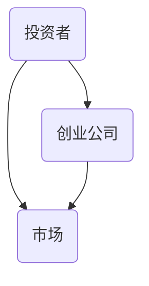
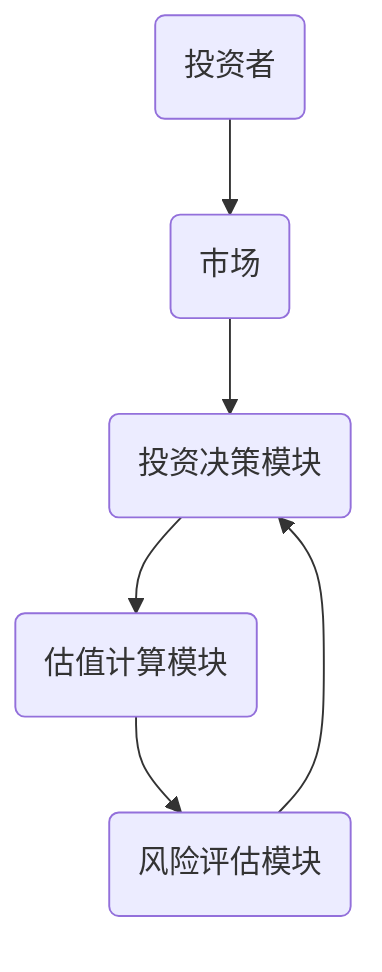
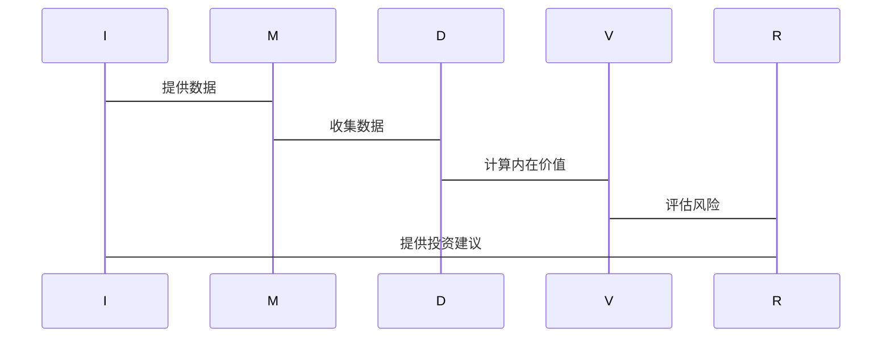

                 


# 《格雷厄姆特价股票理论在风险投资中的运用》

> 关键词：格雷厄姆投资理论，特价股票，风险投资，价值投资，安全边际

> 摘要：本文系统地探讨了格雷厄姆特价股票理论在风险投资中的应用。通过分析格雷厄姆的投资理念，结合风险投资的特点，提出了一套将格雷厄姆理论应用于创业公司评估和投资决策的方法。文章详细介绍了如何通过安全边际、内在价值等核心概念，构建风险投资的分析框架，并通过实际案例展示了如何在实践中应用这些理论。

---

## 第一部分: 格雷厄姆特价股票理论基础

### 第1章: 格雷厄姆特价股票理论概述

#### 1.1 格雷厄姆投资理论的核心思想

格雷厄姆是价值投资的鼻祖，他提出的核心思想是“安全边际”和“内在价值”。他认为，市场价格波动是不可预测的，而内在价值是可以通过基本面分析确定的。投资者应该寻找市场价格低于内在价值的股票，以确保投资的安全性。

- **安全边际**：安全边际是指市场价格与内在价值之间的差距。当市场价格远低于内在价值时，股票的风险较低，收益较高。
- **内在价值**：内在价值是通过公司基本面分析得出的股票真实价值。格雷厄姆的内在价值公式为：
  $$ V = \frac{E}{4.41} $$
  其中，E是公司的年收益。

#### 1.2 特价股票的定义与特征

特价股票是指市场价格远低于内在价值的股票。其核心特征包括：

- **低估性**：市场价格低于内在价值。
- **稳定性**：公司基本面稳定，具有长期盈利能力。
- **防御性**：在市场波动中，这类股票的风险较低。

#### 1.3 格雷厄姆特价股票理论的数学模型

格雷厄姆提出的内在价值公式和安全边际计算公式为：
$$ V = \frac{E}{4.41} $$
$$ \text{安全边际} = V - P $$

其中，P是市场价格，V是内在价值。

---

### 第2章: 风险投资的基本原理

#### 2.1 风险投资的定义与特点

风险投资是指将资金投入到初创公司，以获得高回报的投资方式。其核心特点包括：

- **高风险**：初创公司失败率较高。
- **高回报**：成功公司可能带来高额回报。
- **长期性**：投资周期较长，通常为5-10年。

#### 2.2 创业公司的估值方法

创业公司的估值方法与传统股票投资有所不同，常用的包括：

- **DCF模型**：通过现金流折现计算公司价值。
- **市盈率分析**：通过比较公司市盈率与行业平均水平。
- **风险调整现值模型**：考虑风险因素调整公司价值。

#### 2.3 格雷厄姆理论在风险投资中的应用

格雷厄姆的安全边际概念在风险投资中具有重要应用。通过寻找那些市场价格远低于内在价值的创业公司，投资者可以降低风险，提高收益。

---

## 第二部分: 格雷厄姆特价股票理论在风险投资中的应用

### 第3章: 格雷厄姆特价股票理论的核心概念与联系

#### 3.1 核心概念原理

- **内在价值**：公司基本面决定的真正价值。
- **市场价值**：市场交易价格，受情绪影响波动较大。
- **安全边际**：市场价格与内在价值的差距，提供保护。

#### 3.2 核心概念属性特征对比表

| 概念       | 属性特征             |
|------------|----------------------|
| 内在价值   | 客观、长期、稳定     |
| 市场价值   | 主观、短期、波动     |
| 安全边际   | 保护投资者的缓冲区   |

#### 3.3 ER实体关系图



### 第4章: 格雷厄姆特价股票

---

## 第三部分: 风险投资中的系统化分析与架构设计

### 第5章: 系统分析与架构设计方案

#### 5.1 问题场景介绍

在风险投资中，投资者需要对创业公司进行全面评估，包括财务状况、市场竞争力、团队能力等。

#### 5.2 项目介绍

本项目旨在构建一个基于格雷厄姆理论的风险投资分析系统，帮助投资者识别低估的创业公司。

#### 5.3 系统功能设计

- **数据收集模块**：收集创业公司的财务数据和市场数据。
- **估值计算模块**：使用格雷厄姆的内在价值公式计算公司价值。
- **风险评估模块**：评估公司风险，确定安全边际。
- **投资决策模块**：基于分析结果做出投资决策。

#### 5.4 系统架构设计



#### 5.5 系统接口设计

- **输入接口**：接收创业公司的财务数据和市场数据。
- **输出接口**：输出公司价值、风险评估和投资建议。

#### 5.6 系统交互序列图



---

## 第四部分: 项目实战

### 第6章: 项目实战

#### 6.1 环境安装

需要安装以下工具：

- Python编程语言
- 数据分析库（如Pandas、NumPy）
- 图形绘制工具（如Matplotlib、Mermaid）

#### 6.2 系统核心实现源代码

以下是基于格雷厄姆理论的风险投资分析系统的Python实现：

```python
import pandas as pd
import numpy as np

def calculate_intrinsic_value(eps):
    return eps / 4.41

def calculate_margin_of_safety(intrinsic_value, market_price):
    return intrinsic_value - market_price

# 示例数据
data = {
    '公司名称': ['公司A', '公司B', '公司C'],
    'EPS': [10, 15, 20],
    '市场价格': [20, 30, 40]
}

df = pd.DataFrame(data)

# 计算内在价值
df['内在价值'] = df['EPS'].apply(lambda x: calculate_intrinsic_value(x))
# 计算安全边际
df['安全边际'] = df['内在价值'].apply(lambda x: calculate_margin_of_safety(x, df['市场价格']))

print(df)
```

#### 6.3 代码应用解读与分析

上述代码展示了如何计算创业公司的内在价值和安全边际。通过对比市场价格和内在价值，投资者可以识别那些具有安全边际的公司，从而做出投资决策。

#### 6.4 实际案例分析

以一家创业公司为例，假设其EPS为15，市场价格为30。计算其内在价值和安全边际：

$$ V = \frac{15}{4.41} ≈ 3.397 $$

$$ \text{安全边际} = 3.397 - 30 = -26.603 $$

由于安全边际为负数，说明该公司的市场价格高于内在价值，不具有投资价值。

#### 6.5 项目小结

通过系统化的分析和实际案例分析，我们可以看到格雷厄姆理论在风险投资中的应用价值。投资者可以通过计算内在价值和安全边际，识别低估的创业公司，降低投资风险。

---

## 第五部分: 总结与展望

### 第7章: 总结与展望

#### 7.1 总结

本文系统地探讨了格雷厄姆特价股票理论在风险投资中的应用。通过分析格雷厄姆的投资理念，结合风险投资的特点，提出了一套将格雷厄姆理论应用于创业公司评估和投资决策的方法。

#### 7.2 展望

未来，随着人工智能和大数据技术的发展，投资者可以通过更精确的模型和算法，进一步优化格雷厄姆理论在风险投资中的应用，提高投资效率和收益。

#### 7.3 最佳实践 tips

- **长期投资**：格雷厄姆的投资理念强调长期性，投资者应耐心持有低估的股票。
- **分散投资**：避免过度集中投资，降低风险。
- **持续学习**：市场环境不断变化，投资者需要不断学习和调整策略。

---

## 作者：AI天才研究院/AI Genius Institute & 禅与计算机程序设计艺术/Zen And The Art of Computer Programming

---

通过以上分析，我们可以看到格雷厄姆特价股票理论在风险投资中的应用不仅需要理论支持，还需要系统的分析和实际操作。希望本文能为风险投资者提供有价值的参考和指导。

