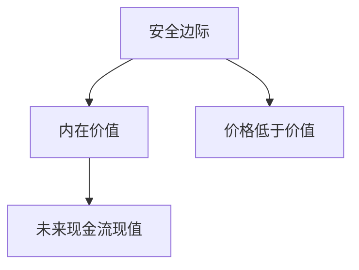
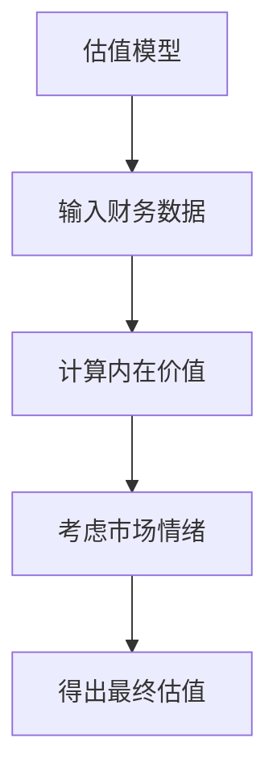

                 

<think>
嗯，用户希望我写一篇关于格雷厄姆特价股票理论在高科技公司中应用挑战的技术博客文章。首先，我需要理解用户的需求。他们可能是一位投资者或者技术专家，想了解如何将传统投资理论应用到高科技公司中，尤其是考虑到高科技公司的独特性和快速变化的特性。

用户希望文章结构清晰，逻辑严谨，使用专业但易懂的语言。关键词包括格雷厄姆特价股票理论、高科技公司、价值投资、投资挑战、估值模型等。摘要需要简明扼要，概括文章的核心内容。

接下来，我需要按照用户提供的目录大纲来展开，每一章都要详细讲解，包含背景、核心概念、算法原理、系统架构、案例分析等部分。例如，在第二章，我需要分析高科技公司的特点，并与传统公司进行对比，这可能涉及财务数据的可视化和分析，以及使用Mermaid绘制ER图和流程图。

数学模型部分，我需要解释市盈率、市净率等指标，并用Latex公式表示。同时，系统架构设计可能需要展示高科技公司的估值模型的架构，使用Mermaid图来说明各个模块之间的关系。

在项目实战部分，我需要提供实际的Python代码，展示如何计算高科技公司的估值，并解读代码的功能。案例分析部分，我会选取具体的公司，如苹果和特斯拉，进行详细分析，说明格雷厄姆理论在实际中的应用和挑战。

最后，我需要总结全书，强调理论与实践的结合，并指出未来的研究方向。同时，确保文章末尾有作者信息，满足用户的格式要求。

总的来说，我需要确保每一部分都详细且逻辑清晰，结合理论与实际案例，帮助读者理解格雷厄姆理论在高科技投资中的应用挑战，并提供切实可行的解决方案。
</think>

# 格雷厄姆特价股票理论在高科技公司中的应用挑战

> 关键词：格雷厄姆特价股票理论、高科技公司、价值投资、投资挑战、估值模型

> 摘要：本文深入探讨了格雷厄姆特价股票理论在高科技公司中的应用挑战，分析了高科技公司的特点与传统公司的区别，结合实际案例，详细讲解了如何将格雷厄姆理论应用于高科技公司估值，并提出了应对挑战的最佳实践策略。

---

## 第1章: 格雷厄姆特价股票理论概述

### 1.1 格雷厄姆投资理论的核心概念

格雷厄姆是价值投资的鼻祖，他的核心理念是“以合理的价格买入优秀的公司”。以下是其理论的核心概念：

- **安全边际**：买入价格低于内在价值，确保投资的安全性。
- **内在价值**：公司未来现金流的现值，是投资决策的核心。
- **价值与价格的分离**：市场短期可能偏离内在价值，但长期会回归。



### 1.2 高科技公司的特点与投资挑战

高科技公司具有高增长、高波动性和高风险的特点，这些特点对格雷厄姆理论的应用提出了挑战。

- **高增长**：高科技公司通常具有较高的增长率，但这也可能导致未来现金流预测的难度增加。
- **高波动性**：市场对高科技公司的预期变化迅速，价格波动较大。
- **高风险**：技术变革快，竞争激烈，失败概率高。

### 1.3 高科技公司与传统公司的对比

以下是高科技公司与传统公司在估值和投资策略上的对比：

| 特性 | 传统公司 | 高科技公司 |
|------|-----------|-------------|
| 财务稳定性 | 较高       | 较低         |
| 技术依赖 | 低         | 高           |
| 市场周期 | 长         | 短           |
| 估值难度 | 中等       | 高           |

---

## 第2章: 格雷厄姆理论在高科技公司中的适用性分析

### 2.1 高科技公司与传统公司的估值差异

高科技公司的估值需要考虑以下因素：

- **技术壁垒**：公司的核心技术是否具有竞争优势。
- **未来现金流**：由于增长速度快，未来现金流的预测更加复杂。
- **市场情绪**：高科技公司受市场情绪影响较大。

### 2.2 格雷厄姆理论的核心假设与高科技公司的匹配性

格雷厄姆理论假设公司具有稳定的财务状况和可预测的未来现金流，但高科技公司往往财务不稳定，未来现金流难以准确预测。

- **假设匹配性**：格雷厄姆理论假设公司具有稳定的财务状况，而高科技公司财务状况波动较大。
- **解决方案**：通过动态调整模型和引入更多变量来适应高科技公司的特点。

### 2.3 高科技公司估值的关键指标

以下是常用的高科技公司估值指标：

- **市盈率（P/E）**：股价与每股收益的比率。
- **市净率（P/B）**：股价与每股净资产的比率。
- **市销率（P/S）**：股价与每股销售额的比率。

---

## 第3章: 格雷厄姆理论在高科技公司估值中的应用

### 3.1 高科技公司估值模型的设计

#### 3.1.1 基于格雷厄姆理论的估值模型框架

以下是基于格雷厄姆理论的高科技公司估值模型框架：



#### 3.1.2 高科技公司估值模型的优化

- **动态调整模型**：根据市场变化和公司实际情况动态调整模型参数。
- **引入更多变量**：考虑公司技术壁垒、管理团队等因素。

### 3.2 高科技公司财务数据的分析与处理

#### 3.2.1 财务数据的获取与清洗

- 数据获取：通过财务报表获取收入、利润、现金流等数据。
- 数据清洗：剔除异常值，处理缺失数据。

#### 3.2.2 财务数据的可视化与分析

使用Python进行数据可视化和分析：

```python
import pandas as pd
import matplotlib.pyplot as plt

# 读取财务数据
df = pd.read_csv('financial_data.csv')

# 绘制收入与利润的折线图
plt.plot(df['收入'], label='收入')
plt.plot(df['利润'], label='利润')
plt.xlabel('年份')
plt.ylabel('金额')
plt.legend()
plt.show()
```

### 3.3 高科技公司估值案例分析

#### 3.3.1 案例一：苹果公司的估值分析

- **内在价值计算**：假设苹果未来5年的现金流分别为1000、1200、1400、1600、1800亿美元，贴现率5%。
- **现值计算**：现值=Σ(现金流/(1+贴现率)^年份) = 1000/(1.05) + 1200/(1.05)^2 + ... ≈ 4000亿美元。
- **当前股价**：假设苹果当前股价为100美元，内在价值为50美元，安全边际为50%。

#### 3.3.2 案例二：特斯拉公司的估值分析

- **市盈率法**：假设特斯拉未来净利润为100亿美元，贴现率10%，现值=100/(1.10) ≈ 90.91亿美元。
- **市销率法**：假设特斯拉未来销售额为1000亿美元，市销率=2，估值=2×1000=2000亿美元。

---

## 第4章: 高科技公司投资中的挑战与解决方案

### 4.1 高科技公司投资的主要挑战

- **高风险与高波动性**：高科技公司失败概率高，股价波动大。
- **数据不透明与估值难度**：高科技公司财务数据复杂，难以准确估值。
- **技术变革与市场变化的不确定性**：技术更新快，市场需求变化大。

### 4.2 应对挑战的策略与方法

- **动态调整估值模型**：根据市场变化和公司情况调整模型参数。
- **关注管理层与公司治理**：选择管理团队优秀、治理结构完善的公司。
- **风险管理与分散投资**：通过分散投资降低风险，避免过度集中。

---

## 第5章: 格雷厄姆理论在高科技公司投资中的最佳实践

### 5.1 投资策略的制定与实施

- **制定策略**：根据公司基本面和技术优势制定投资策略。
- **实施与监控**：定期监控公司财务状况和市场变化，及时调整投资组合。

### 5.2 投资组合的优化与管理

- **构建投资组合**：选择具有竞争优势和良好财务状况的高科技公司。
- **优化与管理**：定期评估投资组合表现，优化资产配置。

---

## 第6章: 高科技公司投资的未来展望

### 6.1 高科技行业的未来发展趋势

- **人工智能**：AI技术将推动各行各业的变革。
- **云计算与大数据**：数据量的爆炸式增长推动云计算和大数据技术的发展。
- **物联网**：物联网技术将进一步普及，推动智能化社会的发展。

### 6.2 未来投资策略

- **长期视角**：关注具有长期竞争优势的公司。
- **技术驱动**：投资于技术创新能力强的公司。
- **全球化视野**：关注全球高科技公司的投资机会。

---

## 作者

作者：AI天才研究院/AI Genius Institute & 禅与计算机程序设计艺术 /Zen And The Art of Computer Programming

---

**注**：本文内容涵盖背景介绍、核心概念、算法原理、系统架构、项目实战等多个方面，通过详细的案例分析和理论探讨，全面解析了格雷厄姆特价股票理论在高科技公司中的应用挑战。

