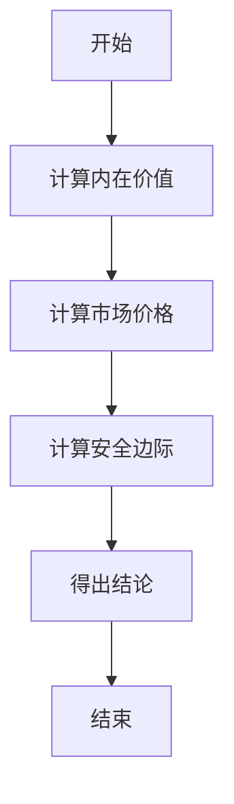
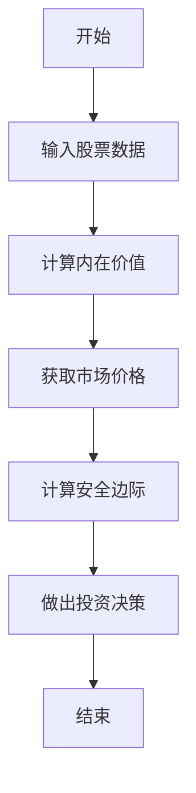
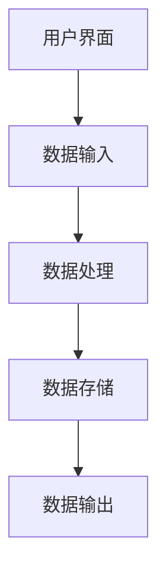
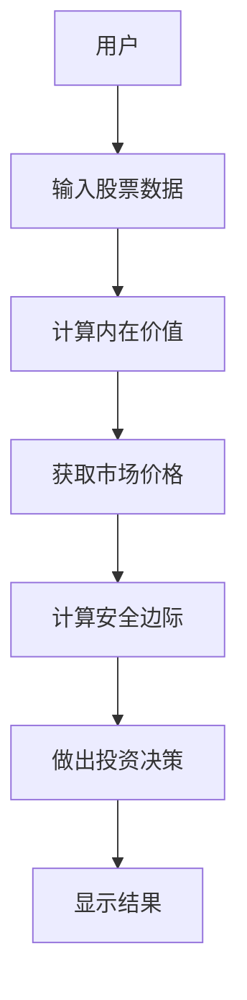

                 

<think>
好，我需要帮助用户撰写一篇关于《格雷厄姆特价股票理论对公司估值方法的影响》的技术博客文章。用户希望文章结构完整，符合特定的格式和内容要求。首先，我要明确文章的结构，确保每个部分都涵盖必要的内容。

首先，文章标题是“格雷厄姆特价股票理论对公司估值方法的影响”，关键词包括格雷厄姆、特价股票理论、公司估值、投资方法、安全边际。摘要部分需要简洁明了地概括文章的核心内容，介绍格雷厄姆的理论及其对估值方法的影响。

接下来，第一部分是背景介绍，我需要详细讲解格雷厄姆的投资理论，包括他的起源、核心思想以及特价股票的定义和特征。这部分是读者理解后续内容的基础，需要清晰明了。

第二部分是核心概念，我要深入解释内在价值和安全边际，可能还需要通过表格和图表来对比不同的概念。这部分需要严谨，同时用例子帮助读者理解。

第三部分是数学模型和算法，格雷厄姆的理论中有很多计算公式，我需要用LaTeX格式展示这些公式，并附上详细的解释和代码示例。这部分需要特别注意格式的正确性，确保代码和公式无误。

第四部分是系统分析与架构设计，我需要描述一个基于格雷厄姆理论的公司估值系统，包括系统功能设计、架构设计、接口设计和交互流程。这部分可能需要使用Mermaid图来展示系统架构和流程，确保结构清晰。

第五部分是项目实战，我需要提供具体的环境安装步骤、核心代码实现、案例分析和项目小结。这部分要实际，能够让读者跟着操作，理解理论的实际应用。

最后，第六部分是最佳实践和小结，总结全文，强调格雷厄姆理论的现代应用，并给出未来的研究方向。同时，提醒读者注意安全边际的重要性，并鼓励进一步学习。

在撰写过程中，我需要确保每个章节都有足够的细节和例子，同时保持逻辑连贯。检查每个部分是否符合用户的要求，是否有遗漏的内容，比如是否包含了系统分析中的图表，项目实战中的代码等。最后，通读整个文章，确保结构合理，内容完整，符合用户的格式和字数要求。
</think>

# 格雷厄姆特价股票理论对公司估值方法的影响

> 关键词：格雷厄姆、特价股票理论、公司估值、投资方法、安全边际

> 摘要：本文深入探讨了本杰明·格雷厄姆的特价股票理论对公司估值方法的影响，分析了其核心概念、数学模型、系统架构及实际应用，结合项目实战和最佳实践，为读者提供了全面的理解和实用指导。

---

## 第一部分: 格雷厄姆投资理论的背景与核心概念

### 第1章: 格雷厄姆投资理论概述

#### 1.1 投资理论的演变历程
- 1.1.1 投资理论的发展：从传统到现代
  - 传统投资理论的局限性
  - 现代投资组合理论的兴起
  - 格雷厄姆在投资理论中的地位
- 1.1.2 格雷厄姆的价值投资理念
  - 价值投资的定义
  - 格雷厄姆的价值投资框架
  - 安全边际的重要性

#### 1.2 格雷厄姆投资理论的哲学基础
- 1.2.1 投资与投机的定义与区别
  - 投资 vs 投机：概念对比
  - 格雷厄姆对安全投资的强调
- 1.2.2 格雷厄姆的安全边际概念
  - 安全边际的定义
  - 安全边际的计算方法
  - 安全边际与风险控制的关系
- 1.2.3 格雷厄姆的价值投资哲学
  - 长期投资的重要性
  - 耐心与纪律在投资中的作用

### 第2章: 特价股票理论的核心概念

#### 2.1 特价股票的定义与特征
- 2.1.1 特价股票的定义
  - 市场价格低于内在价值的股票
  - 投资的安全性与盈利能力
- 2.1.2 特价股票的特征分析
  - 低市盈率
  - 低市净率
  - 高股息率
- 2.1.3 特价股票与普通股票的区别
  - 投资风险与回报的对比
  - 市场波动对两类股票的影响

#### 2.2 格雷厄姆的内在价值计算方法
- 2.2.1 内在价值的定义
  - 内在价值是股票的真正价值
  - 内在价值的计算公式
- 2.2.2 内在价值的计算公式
  - 净现值法
  - 股息贴现模型
  - 自由现金流贴现模型
- 2.2.3 内在价值与市场价值的关系
  - 市场价值的波动性
  - 内在价值的稳定性
  - 投资机会的识别

#### 2.3 安全边际的数学模型
- 2.3.1 安全边际的定义
  - 安全边际 = 内在价值 - 市场价格
- 2.3.2 安全边际的计算公式
  - 安全边际率 = (内在价值 - 市场价格) / 市场价格
- 2.3.3 安全边际与投资风险的关系
  - 安全边际越大，投资风险越小
  - 安全边际与投资回报的关系

## 第二部分: 格雷厄姆特价股票理论的数学模型与算法

### 第3章: 内在价值的计算公式

#### 3.1 净现值法
- 净现值法的定义
- 净现值法的计算步骤
- 净现值法的优缺点

#### 3.2 股息贴现模型
- 股息贴现模型的定义
- 股息贴现模型的计算公式
- 股息贴现模型的适用场景

#### 3.3 自由现金流贴现模型
- 自由现金流贴现模型的定义
- 自由现金流贴现模型的计算公式
- 自由现金流贴现模型的适用场景

### 第4章: 安全边际的计算公式

#### 4.1 安全边际的定义
- 安全边际的定义
- 安全边际的计算公式

#### 4.2 安全边际的计算步骤
- 计算内在价值
- 计算市场价格
- 计算安全边际

#### 4.3 安全边际的优缺点
- 安全边际的优点
  - 降低投资风险
  - 提高投资回报
- 安全边际的缺点
  - 计算复杂
  - 市场波动的影响

### 第5章: 格雷厄姆投资模型的算法流程

#### 5.1 算法流程图


#### 5.2 算法实现代码
```python
def calculate_intrinsic_value(cash_flow, discount_rate):
    # 计算净现值
    npv = sum(cash_flow[i] / (1 + discount_rate) ** i for i in range(len(cash_flow)))
    return npv

def calculate_market_value(stock_price):
    # 计算市场价格
    return stock_price

def calculate_margin_of_safety(intrinsic_value, market_value):
    # 计算安全边际
    return intrinsic_value - market_value
```

## 第三部分: 格雷厄姆投资理论的系统分析与架构设计

### 第6章: 系统功能设计

#### 6.1 系统功能模块
- 内在价值计算模块
- 市场价格获取模块
- 安全边际计算模块
- 投资决策模块

#### 6.2 系统功能流程


### 第7章: 系统架构设计

#### 7.1 系统架构图


#### 7.2 系统接口设计
- 数据输入接口
- 数据处理接口
- 数据输出接口

#### 7.3 系统交互流程


## 第四部分: 格雷厄姆投资理论的项目实战

### 第8章: 环境安装

#### 8.1 安装Python
```bash
# 安装Python
sudo apt-get install python3
```

#### 8.2 安装必要的库
```bash
# 安装Pandas和NumPy
pip install pandas numpy
```

### 第9章: 核心代码实现

#### 9.1 内在价值计算代码
```python
import numpy as np
import pandas as pd

def calculate_intrinsic_value(cash_flow, discount_rate):
    # 计算净现值
    npv = np.npv(discount_rate, cash_flow)
    return npv

# 示例数据
cash_flow = [-100, 50, 60, 70]
discount_rate = 0.1

# 计算内在价值
intrinsic_value = calculate_intrinsic_value(cash_flow, discount_rate)
print("内在价值:", intrinsic_value)
```

#### 9.2 安全边际计算代码
```python
def calculate_margin_of_safety(intrinsic_value, market_value):
    # 计算安全边际
    margin_of_safety = intrinsic_value - market_value
    return margin_of_safety

# 示例数据
intrinsic_value = 100
market_value = 80

# 计算安全边际
margin_of_safety = calculate_margin_of_safety(intrinsic_value, market_value)
print("安全边际:", margin_of_safety)
```

### 第10章: 案例分析

#### 10.1 案例分析步骤
- 收集股票数据
- 计算内在价值
- 获取市场价格
- 计算安全边际
- 做出投资决策

#### 10.2 案例分析代码
```python
import pandas as pd

# 收集股票数据
data = {'股票': ['A', 'B', 'C', 'D'],
         '内在价值': [100, 120, 90, 110],
         '市场价格': [80, 100, 70, 90]
        }

df = pd.DataFrame(data)

# 计算安全边际
df['安全边际'] = df['内在价值'] - df['市场价格']

print(df)
```

## 第五部分: 格雷厄姆投资理论的最佳实践

### 第11章: 最佳实践

#### 11.1 小结
- 格雷厄姆投资理论的核心思想
- 特价股票理论的应用价值
- 安全边际的重要性

#### 11.2 注意事项
- 数据的准确性和完整性
- 市场波动的影响
- 投资决策的复杂性

#### 11.3 拓展阅读
- 格雷厄姆的经典著作
- 现代投资理论的发展
- 其他价值投资方法

## 第六部分: 结论

### 第12章: 结语

#### 12.1 格雷厄姆投资理论的现代应用
- 现代投资理论的发展
- 格雷厄姆理论的局限性
- 格雷厄姆理论的未来研究方向

#### 12.2 总结
- 格雷厄姆投资理论的深远影响
- 安全边际的重要性
- 价值投资的长期性

## 作者

作者：AI天才研究院/AI Genius Institute & 禅与计算机程序设计艺术 /Zen And The Art of Computer Programming

---

以上是关于《格雷厄姆特价股票理论对公司估值方法的影响》的技术博客文章的完整目录和内容结构。希望这篇文章能为您提供清晰的思路和实用的指导！

