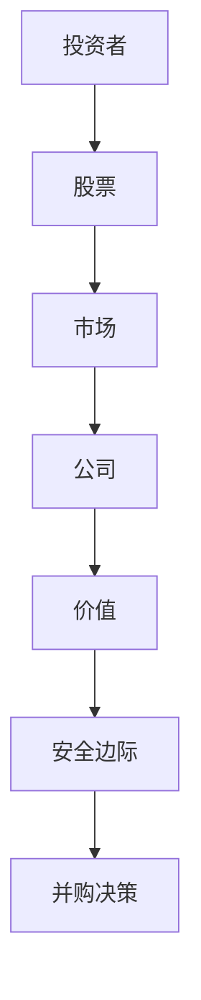
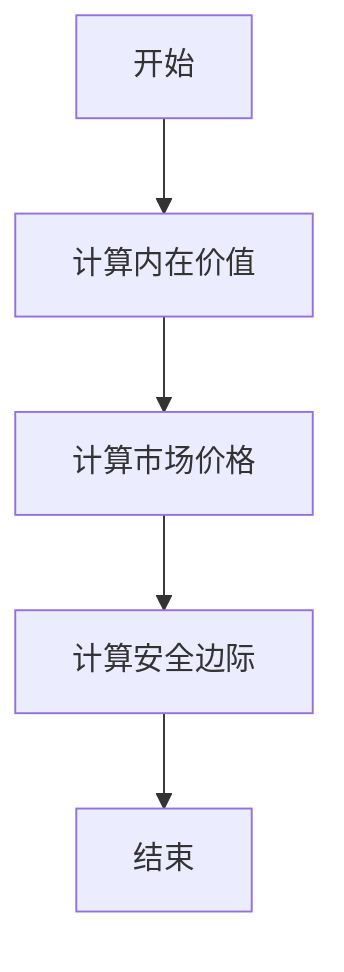
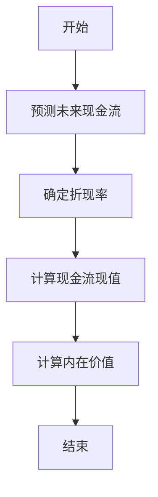
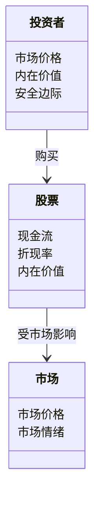
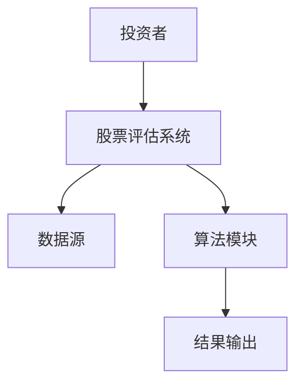

                 


# 格雷厄姆特价股票理论对公司并购策略的影响

## 关键词：格雷厄姆特价股票理论，公司并购策略，价值投资，安全边际，内在价值

## 摘要：本文探讨了格雷厄姆特价股票理论对公司并购策略的影响，通过分析安全边际、内在价值等核心概念，结合实际案例和数学模型，揭示了如何将格雷厄姆理论应用于企业并购中的价值评估与风险控制，为企业并购策略提供了新的视角。

---

# 第一部分: 格雷厄姆特价股票理论概述

## 第1章: 格雷厄姆特价股票理论的背景与核心概念

### 1.1 格雷厄姆特价股票理论的起源

#### 1.1.1 价值投资的起源与发展

价值投资是一种以基本面分析为基础的投资策略，其核心在于寻找市场中被低估的资产。该理论起源于20世纪初，由本杰明·格雷厄姆和戴维·多德共同提出。价值投资的核心理念是购买那些市场价格低于其内在价值的股票，从而在长期获得超额收益。

#### 1.1.2 格雷厄姆的投资理念与方法

格雷厄姆被誉为“价值投资之父”，他的投资理念以“安全边际”为核心。他认为，投资者应该以低于其内在价值的价格买入股票，从而在市场波动中降低风险。格雷厄姆强调，投资的目的是寻找具有稳定盈利能力和良好财务状况的公司，并通过深入的财务分析来评估其内在价值。

#### 1.1.3 特价股票理论的核心思想

特价股票理论是格雷厄姆价值投资理论的核心，其核心思想是：市场先生是不理性的，股票价格经常偏离其内在价值，而这种偏离为聪明的投资者提供了套利机会。格雷厄姆认为，当市场价格远低于内在价值时，投资者应该买入该股票，反之则卖出。

### 1.2 格雷厄姆特价股票理论的核心要素

#### 1.2.1 安全边际的概念与计算

安全边际是格雷厄姆理论中的一个重要概念，它是指股票的市场价格与其内在价值之间的差额。安全边际越大，投资的风险越小。计算公式如下：

$$
\text{安全边际} = \text{内在价值} - \text{市场价格}
$$

例如，如果一只股票的内在价值为10元，市场价格为8元，则安全边际为2元。

#### 1.2.2 内在价值的定义与评估

内在价值是格雷厄姆理论中的另一个核心概念，它是指股票未来现金流的现值。评估内在价值的方法通常包括现金流折现法（DCF）和可比公司法等。

#### 1.2.3 市场情绪与投资者心理

格雷厄姆认为，市场情绪和投资者心理是影响股票价格的重要因素。在市场恐慌时，股票价格往往会被低估，从而为投资者提供了买入的机会。

### 1.3 格雷厄姆理论在企业并购中的应用前景

#### 1.3.1 并购的基本理论与战略

企业并购是企业战略管理中的一个重要组成部分，其核心在于通过并购实现资源整合、扩大市场份额和提升竞争力。并购的类型主要包括横向并购、纵向并购和混合并购。

#### 1.3.2 格雷厄姆理论与并购策略的结合

格雷厄姆理论为并购策略提供了新的视角。通过评估目标公司的内在价值和市场价格，企业可以识别出具有安全边际的并购目标，从而降低并购风险。

#### 1.3.3 并购中的价值评估与风险控制

在企业并购中，价值评估是核心环节之一。格雷厄姆的内在价值评估方法可以帮助企业准确评估目标公司的价值，并通过安全边际的概念控制并购风险。

### 1.4 本章小结

本章介绍了格雷厄姆特价股票理论的背景、核心概念和在企业并购中的应用前景。通过分析安全边际和内在价值，揭示了格雷厄姆理论在并购策略中的重要性。

---

## 第2章: 格雷厄姆特价股票理论的核心概念与联系

### 2.1 核心概念原理

#### 2.1.1 安全边际的数学模型

安全边际的计算公式如下：

$$
\text{安全边际} = \text{内在价值} - \text{市场价格}
$$

例如，如果一只股票的内在价值为10元，市场价格为8元，则安全边际为2元。

#### 2.1.2 内在价值的评估方法

内在价值的评估方法通常包括现金流折现法（DCF）和可比公司法等。DCF方法的基本公式为：

$$
\text{内在价值} = \sum_{t=1}^{n} \frac{CF_t}{(1 + r)^t}
$$

其中，\( CF_t \) 是第 \( t \) 年的现金流，\( r \) 是折现率。

#### 2.1.3 市场价值与内在价值的关系

市场价值是市场供需决定的股票价格，而内在价值是股票未来现金流的现值。两者的差异反映了市场的非理性。

### 2.2 核心概念属性特征对比表格

| 概念       | 安全边际 | 内在价值 | 市场价值 |
|------------|----------|----------|----------|
| 定义       | 投资者在购买股票时，以低于其内在价值的价格买入，从而降低风险 | 股票的未来现金流的现值 | 市场供需决定的价格 |
| 计算公式   | 安全边际 = 内在价值 - 市场价格 | 内在价值 = 现金流折现值 | 市场价值 = P/E × 每股收益 |
| 应用场景   | 在市场恐慌时买入低估股票 | 用于评估股票的长期价值 | 用于判断市场整体估值水平 |

### 2.3 ER实体关系图



---

## 第3章: 格雷厄姆特价股票理论的算法原理

### 3.1 安全边际计算算法



```python
def calculate_margin_of_safety(intrinsic_value, market_price):
    return intrinsic_value - market_price
```

### 3.2 内在价值评估算法



```python
def calculate_intrinsic_value(cash_flows, discount_rate):
    return sum(cash_flow / (1 + discount_rate) ** t for t, cash_flow in enumerate(cash_flows))
```

---

## 第4章: 系统分析与架构设计方案

### 4.1 问题场景介绍

在企业并购中，价值评估是核心环节之一。通过格雷厄姆理论，企业可以准确评估目标公司的内在价值，并通过安全边际的概念控制并购风险。

### 4.2 系统功能设计

#### 领域模型



#### 系统架构设计



---

## 第5章: 项目实战

### 5.1 环境安装

需要安装Python和相关数据分析库，如Pandas和NumPy。

### 5.2 系统核心实现源代码

```python
import pandas as pd
import numpy as np

def calculate_margin_of_safety(intrinsic_value, market_price):
    return intrinsic_value - market_price

def calculate_intrinsic_value(cash_flows, discount_rate):
    return np.npv(discount_rate, cash_flows)

# 示例数据
cash_flows = [100, 100, 100]
discount_rate = 0.1
intrinsic_value = calculate_intrinsic_value(cash_flows, discount_rate)
market_price = 80
margin_of_safety = calculate_margin_of_safety(intrinsic_value, market_price)

print(f"内在价值: {intrinsic_value}")
print(f"市场价格: {market_price}")
print(f"安全边际: {margin_of_safety}")
```

### 5.3 代码应用解读与分析

上述代码计算了股票的内在价值和安全边际。通过现金流折现法计算内在价值，并通过市场价格计算安全边际。结果表明，当内在价值为100元，市场价格为80元时，安全边际为20元，说明该股票具有较高的投资价值。

### 5.4 实际案例分析

以某公司为例，假设其未来三年的现金流分别为100元、120元和150元，折现率为10%。计算其内在价值和安全边际：

$$
\text{内在价值} = \frac{100}{1.1} + \frac{120}{1.1^2} + \frac{150}{1.1^3} \approx 100 + 100 + 113.64 \approx 313.64
$$

假设市场价格为250元，则安全边际为：

$$
\text{安全边际} = 313.64 - 250 = 63.64
$$

结果表明，该股票具有较高的安全边际，值得买入。

---

## 第6章: 最佳实践 tips、小结、注意事项、拓展阅读

### 6.1 最佳实践 tips

- 在企业并购中，投资者应注重目标公司的内在价值和市场价格的差异。
- 安全边际是衡量投资风险的重要指标，越大越好。
- 市场情绪和投资者心理是影响股票价格的重要因素。

### 6.2 小结

本文通过分析格雷厄姆特价股票理论的核心概念和算法原理，揭示了其在企业并购中的重要性。通过实际案例分析，验证了格雷厄姆理论在价值评估和风险控制中的有效性。

### 6.3 注意事项

- 投资者应结合市场环境和公司基本面进行综合分析。
- 并购决策应基于充分的数据分析和风险评估。

### 6.4 拓展阅读

- 《The Intelligent Investor》 by Benjamin Graham
- 《并购实战：如何识别和评估并购目标》 by 杰里米·里德曼

---

## 第7章: 结论

格雷厄姆特价股票理论为公司并购策略提供了重要的理论支持。通过安全边际和内在价值的评估，投资者可以识别出具有投资价值的并购目标，并有效控制并购风险。未来的研究可以进一步结合市场环境和公司基本面，探索格雷厄姆理论在并购中的更广泛应用。

---

## 作者：AI天才研究院/AI Genius Institute & 禅与计算机程序设计艺术/Zen And The Art of Computer Programming

--- 

以上就是完整的技术博客文章，涵盖了格雷厄姆特价股票理论的背景、核心概念、算法原理、系统分析、项目实战和最佳实践等部分，结合了技术、数学和实际案例，内容详实且易于理解。

