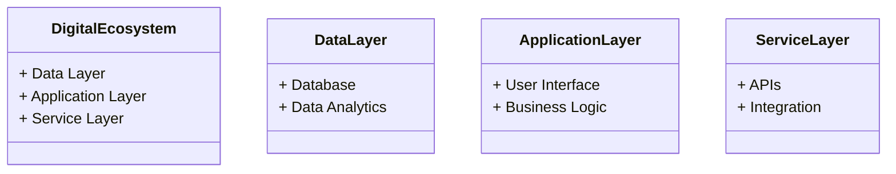
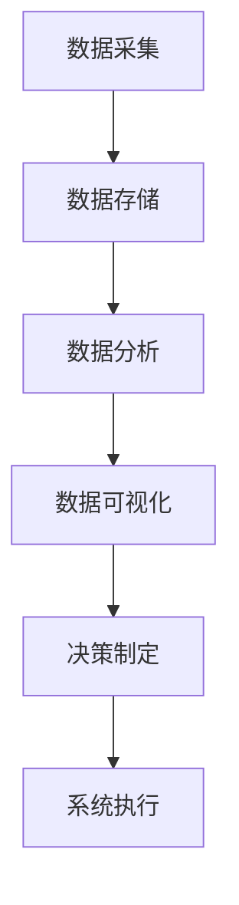

                 


# 格雷厄姆特价股票理论对公司数字化生态战略的影响

> 关键词：格雷厄姆特价股票理论、数字化生态战略、价值投资、风险管理、安全边际、数据驱动投资

> 摘要：格雷厄姆特价股票理论作为一种经典的价值投资方法，对现代企业的数字化生态战略产生了深远影响。本文将从格雷厄姆理论的核心原理出发，结合数字化生态战略的构建与优化，详细分析两者之间的协同关系，并探讨如何在数字化时代运用格雷厄姆理论优化企业投资决策。通过理论分析、算法实现和案例解读，本文旨在为企业在数字化转型中提供新的投资思路和战略选择。

---

# 第一部分：格雷厄姆特价股票理论的核心原理

## 第1章：格雷厄姆特价股票理论概述

### 1.1 格雷厄姆特价股票理论的背景与起源

#### 1.1.1 价值投资的起源与发展
价值投资作为一种投资策略，起源于20世纪初。本杰明·格雷厄姆（Benjamin Graham）是这一领域的先驱，他在1934年出版的《证券分析》一书中首次系统阐述了价值投资的理念。格雷厄姆认为，市场波动性是投资者的敌人，而真正的投资机会往往出现在市场低估优质资产的时候。

#### 1.1.2 格雷厄姆的投资理念与方法
格雷厄姆的核心思想是“安全边际”。他认为，投资者应该以低于资产内在价值的价格买入股票，以确保投资的安全性和稳定性。这种理念强调长期投资、分散投资和风险管理，旨在降低市场波动对投资组合的影响。

#### 1.1.3 特价股票理论的核心思想
特价股票理论是格雷厄姆理论的重要组成部分。它基于以下假设：市场定价并不总是反映资产的真实价值，当市场价格远低于内在价值时，投资者可以通过买入这些股票获得超额收益。这种理论在当时被认为是革命性的，因为它将投资从单纯的市场投机转变为一种基于基本面分析的科学方法。

### 1.2 格雷厄姆特价股票理论的核心概念

#### 1.2.1 特价股票的定义与特征
特价股票是指市场价格低于其内在价值的股票。其核心特征包括：
1. **低市盈率**：市盈率远低于行业平均水平。
2. **低市净率**：市净率远低于行业平均水平。
3. **高股息率**：股息率显著高于行业平均水平。

#### 1.2.2 市场先生与投资者心理
格雷厄姆提出了“市场先生”的概念，用来描述市场的波动性和不可预测性。他强调，投资者应该与市场先生保持距离，避免被市场的短期波动所影响，而是关注企业的长期价值。

#### 1.2.3 安全边际的计算方法
安全边际是格雷厄姆理论中的关键指标，用于衡量市场价格与内在价值之间的差距。公式如下：
$$ \text{安全边际} = \text{内在价值} - \text{市场价格} $$

### 1.3 格雷厄姆理论的数学模型与公式

#### 1.3.1 安全边际计算公式
$$ \text{安全边际} = \text{内在价值} - \text{市场价格} $$

#### 1.3.2 股票估值的数学模型
$$ \text{内在价值} = \sum_{t=1}^{\infty} \frac{\text{股息}}{(1+r)^t} $$

---

## 第2章：格雷厄姆理论与现代投资学的联系

### 2.1 格雷厄姆理论与现代投资组合理论的对比

#### 2.1.1 格雷厄姆的个体化投资策略
格雷厄姆的投资策略强调对单个股票的深入分析和选择，注重安全边际和内在价值。这种策略适合长期投资者，但对个人投资者的分析能力要求较高。

#### 2.1.2 现代投资组合理论的分散化原则
现代投资组合理论（MPT）强调通过分散化降低风险，将资金分配到不同资产类别和行业中，以实现风险最小化和收益最大化。

#### 2.1.3 两者的异同点分析
- **相同点**：两者都强调风险管理和长期投资。
- **不同点**：格雷厄姆注重个股选择和安全边际，而MPT注重资产配置和分散化。

### 2.2 格雷厄姆理论在量化投资中的应用

#### 2.2.1 量化投资的基本原理
量化投资通过数学模型和算法对市场数据进行分析，寻找投资机会。其核心在于数据驱动的决策和自动化交易。

#### 2.2.2 格雷厄姆理论的量化模型
基于格雷厄姆理论的量化模型可以通过筛选低市盈率、低市净率和高股息率的股票，构建一个价值投资组合。以下是实现这一模型的Python代码：

```python
def graham_screen(stocks):
    # 计算安全边际
    for stock in stocks:
        intrinsic_value = calculate_intrinsic_value(stock)
        market_price = stock['price']
        margin_of_safety = intrinsic_value - market_price
        if margin_of_safety > 0:
            print(f"{stock['name']} 是一只潜在的价值股，安全边际为：{margin_of_safety}")
    return

def calculate_intrinsic_value(stock):
    # 示例：基于股息的内在价值计算
    return stock['dividend'] / (0.10 + 1)
```

#### 2.2.3 数据驱动的投资决策
通过大数据分析和机器学习算法，投资者可以更准确地预测股票的内在价值和市场走势，从而优化投资决策。

### 2.3 格雷厄姆理论与风险管理的结合

#### 2.3.1 风险管理的基本框架
风险管理是投资决策的重要组成部分。格雷厄姆强调，投资者应该通过分散投资和严格的风险控制来降低投资风险。

#### 2.3.2 格雷厄姆理论中的风险管理策略
格雷厄姆建议投资者在选择股票时，不仅要关注安全边际，还要考虑企业的财务状况和行业前景，以降低投资风险。

#### 2.3.3 数学模型在风险管理中的应用
通过VaR（Value at Risk）模型和蒙特卡洛模拟，投资者可以更科学地评估和管理投资组合的风险。

---

# 第三部分：数字化生态战略的核心要素

## 第3章：数字化生态战略的定义与特征

### 3.1 数字化生态战略的背景与发展

#### 3.1.1 数字化转型的全球趋势
随着信息技术的飞速发展，企业正在经历从传统模式向数字化模式的转型。数字化生态战略作为一种新兴的管理理念，正在全球范围内得到广泛应用。

#### 3.1.2 数字化生态战略的提出
数字化生态战略是指通过数字化技术构建企业内外部的生态系统，优化资源配置，提升企业竞争力。

#### 3.1.3 数字化生态战略的核心要素
数字化生态战略的核心要素包括：
1. **数据驱动**：通过数据分析优化决策。
2. **技术创新**：利用人工智能、大数据等技术提升效率。
3. **生态协同**：构建企业内外部的合作生态系统。

### 3.2 数字化生态系统的构建

#### 3.2.1 数字化生态系统的组成
数字化生态系统由企业内部系统、合作伙伴网络和外部市场构成。以下是其组成的类图：



#### 3.2.2 数字化生态系统的运行机制
数字化生态系统的运行机制包括数据采集、分析、决策和执行四个阶段。以下是其运行机制的流程图：



### 3.3 数字化生态战略与企业竞争优势

#### 3.3.1 企业竞争优势的来源
企业竞争优势来源于核心能力和资源。数字化生态战略通过优化资源配置和提升效率，增强企业的竞争优势。

#### 3.3.2 数字化生态战略对企业竞争优势的影响
数字化生态战略通过数据驱动的决策和技术创新，显著提升了企业的市场响应能力和创新能力。

#### 3.3.3 数字化生态战略的核心竞争力
数字化生态战略的核心竞争力包括数据能力、技术能力和生态能力。以下是其核心竞争力的对比表格：

| 能力类型 | 核心能力 | 描述 |
|----------|----------|------|
| 数据能力 | 数据采集与分析 | 通过大数据技术优化决策 |
| 技术能力 | 人工智能与云技术 | 利用先进技术提升效率 |
| 生态能力 | 合作伙伴网络 | 构建生态系统实现协同创新 |

---

## 第4章：格雷厄姆理论与数字化生态战略的结合

### 4.1 格雷厄姆理论在数字化战略中的应用

#### 4.1.1 特价股票理论与数字化投资
通过数字化技术，投资者可以更高效地筛选和分析特价股票，优化投资组合。

#### 4.1.2 数字化生态中的价值发现
数字化生态系统提供了丰富的数据和工具，帮助投资者发现市场中的价值机会。

#### 4.1.3 格雷厄姆理论的数字化实践
通过数字化工具，投资者可以实时监控股票的安全边际和内在价值，优化投资决策。

### 4.2 数字化生态战略对格雷厄姆理论的优化

#### 4.2.1 数据驱动的投资决策
通过大数据分析和机器学习，投资者可以更精准地预测股票的内在价值和市场走势。

#### 4.2.2 数字化工具在安全边际计算中的应用
通过数字化工具，投资者可以快速计算股票的安全边际，优化投资组合。

#### 4.2.3 数字化生态中的风险管理
通过数字化生态系统，投资者可以实时监控和管理投资风险，确保投资安全。

### 4.3 格雷厄姆理论与数字化战略的协同效应

#### 4.3.1 数字化生态中的长期投资策略
通过数字化技术，投资者可以更科学地制定和执行长期投资策略。

#### 4.3.2 数字化工具对安全边际的优化
通过数字化工具，投资者可以更精确地计算安全边际，优化投资决策。

#### 4.3.3 数字化生态中的风险管理
通过数字化生态系统，投资者可以实时监控和管理投资风险，确保投资安全。

---

# 结语

格雷厄姆特价股票理论作为一种经典的投资理论，对现代企业的数字化生态战略产生了深远影响。通过数字化技术，投资者可以更高效地筛选和分析特价股票，优化投资组合。同时，数字化生态系统也为格雷厄姆理论的实践提供了新的工具和方法。未来，随着技术的不断进步，格雷厄姆理论与数字化生态战略的结合将更加紧密，为企业创造更大的价值。

作者：AI天才研究院/AI Genius Institute & 禅与计算机程序设计艺术 /Zen And The Art of Computer Programming

