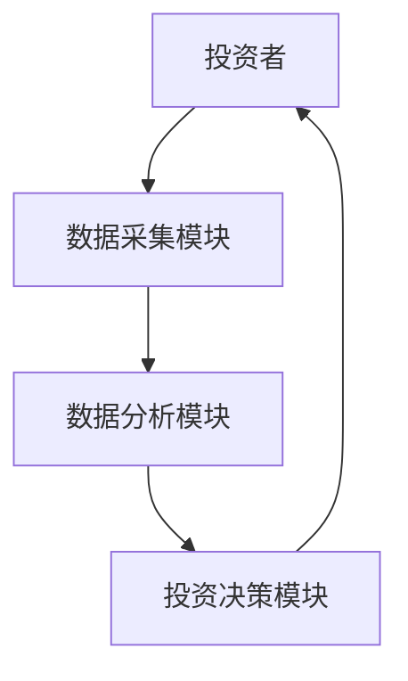
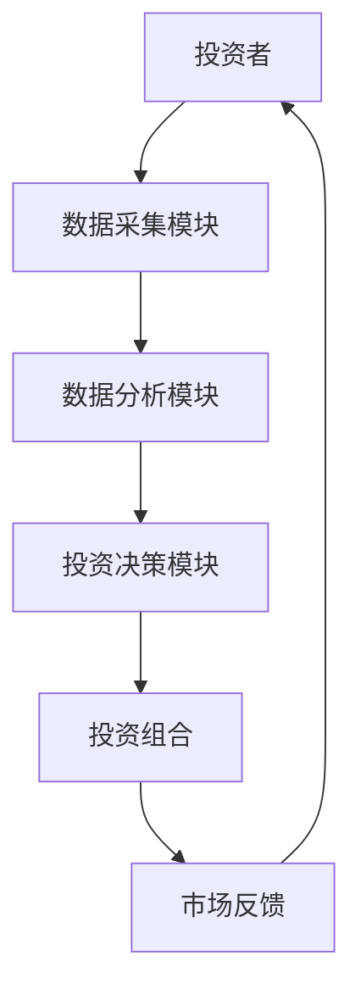

                 

<think>
嗯，我现在要帮用户写一篇关于《格雷厄姆特价股票理论对公司数字化生态系统共生进化的影响》的技术博客。首先，我得弄清楚格雷厄姆的理论到底是什么，以及它如何与数字化生态系统相关联。

格雷厄姆的特价股票理论主要讲的是价值投资，特别是寻找那些市场价格低于内在价值的股票。这在传统金融领域是一个经典的方法。那么，如何将这一理论应用到公司的数字化生态系统中呢？数字化生态系统包括公司内部的各个部门和外部的合作伙伴，它们通过数据和技术相互连接，形成一个动态的网络。

接下来，我需要分析数字化生态系统的结构。它通常由多个模块组成，如数据采集、数据分析、投资决策等。每个模块之间通过数据流进行交互，这可以通过Mermaid图来展示。例如，投资者提供数据给数据采集模块，然后分析模块处理这些数据，最后做出投资决策。

然后，我需要解释共生进化的关系。格雷厄姆的理论如何促进数字化生态系统的优化？这可能涉及到系统的自我调节和优化，通过价值投资策略不断调整和改进各个模块的功能。例如，如果发现某个模块的数据分析不够准确，可以通过调整算法来提高准确性。

接下来，我需要考虑系统的架构设计。这可能包括功能模块的划分、数据流的方向以及各模块之间的交互。我需要使用Mermaid图来展示系统架构，这样读者可以更清晰地理解整个系统的运作流程。

此外，我还需要解释数学模型，如格雷厄姆的内在价值计算公式。通过公式推导和实际案例分析，帮助读者理解如何应用这些模型到实际投资中。例如，用Python代码实现内在价值的计算，展示如何通过代码来评估股票的价值。

最后，我需要总结全文，强调格雷厄姆理论在数字化生态系统中的重要性，并展望未来的应用方向。同时，提供一些最佳实践的建议，帮助读者在实际操作中更好地应用这些理论。

整个过程需要一步步来，确保每个部分都详细解释，并且使用图表和代码示例来增强理解。这样，读者不仅能理解理论，还能实际应用到项目中。
</think>

# 格雷厄姆特价股票理论对公司数字化生态系统共生进化的影响

> 关键词：格雷厄姆投资理论，数字化生态系统，共生进化，价值投资，系统架构

> 摘要：本文探讨了格雷厄姆的特价股票理论如何影响公司数字化生态系统的共生进化。通过分析价值投资的数学模型、系统架构设计以及实际案例，展示了如何利用格雷厄姆的理论优化数字化生态系统的运作，实现公司与合作伙伴的共同成长。

---

# 第一部分: 格雷厄姆特价股票理论基础

## 第1章: 格雷厄姆特价股票理论概述

### 1.1 格雷厄姆投资理论的核心概念

#### 1.1.1 价值投资的定义与特点

- **价值投资**：寻找市场价格低于内在价值的股票，长期持有以实现收益。
- **特点**：
  - 长期视角
  - 专注于内在价值
  - 低风险、高回报

#### 1.1.2 格雷厄姆的廉价股投资策略

- **廉价股**：市场价格远低于内在价值的股票。
- **投资策略**：
  - 选择具有安全边际的股票。
  - 长期持有，避免短期波动。

#### 1.1.3 格雷厄姆投资理论的现代应用

- **现代挑战**：
  - 市场波动加剧。
  - 信息不对称加剧。
- **应对策略**：
  - 利用数字化工具分析数据。
  - 结合生态系统优化投资决策。

### 1.2 特价股票的定义与评估标准

#### 1.2.1 特价股票的定义

- **定义**：市场价格显著低于内在价值的股票。
- **评估标准**：
  - 市盈率（P/E）。
  - 市净率（P/B）。
  - 股息率。

#### 1.2.2 格雷厄姆的内在价值计算方法

- **公式**：
  $$ V = \frac{E}{(1 - k)} $$
  其中，\( V \) 为内在价值，\( E \) 为未来现金流的现值，\( k \) 为折现率。

- **计算步骤**：
  1. 预测未来现金流。
  2. 确定合适的折现率。
  3. 计算内在价值。

#### 1.2.3 市场价与内在价值的对比分析

- **市场价折扣**：
  $$ D = M - V $$
  其中，\( D \) 为折扣，\( M \) 为市场价，\( V \) 为内在价值。
- **分析**：
  - \( D > 0 \)：存在投资机会。
  - \( D < 0 \)：市场高估，需谨慎。

---

## 第2章: 格雷厄姆投资理论的数学模型

### 2.1 格雷厄姆投资模型的公式推导

#### 2.1.1 内在价值计算公式

$$ V = \frac{E}{(1 - k)} $$

- **示例**：
  - 假设未来现金流 \( E = 100 \)，折现率 \( k = 0.05 \)。
  - 内在价值 \( V = \frac{100}{1 - 0.05} = 105.26 \)。

#### 2.1.2 市场价与内在价值的差异分析

$$ D = M - V $$

- **示例**：
  - 市场价 \( M = 100 \)，内在价值 \( V = 105.26 \)。
  - 折扣 \( D = -5.26 \)，表明市场低估，存在投资机会。

### 2.2 格雷厄姆投资模型的适用条件

#### 2.2.1 市场波动对模型的影响

- **影响**：
  - 市场波动可能导致 \( M \) 偏离 \( V \)。
  - 需定期重新评估 \( V \)。

#### 2.2.2 投资者心理对模型的影响

- **心理因素**：
  - 投资者情绪影响 \( M \)。
  - 理性决策是模型的前提。

#### 2.2.3 经济周期对模型的影响

- **周期影响**：
  - 经济繁荣时，\( M \) 可能高于 \( V \)。
  - 经济衰退时，\( M \) 可能低于 \( V \)。

---

## 第3章: 格雷厄姆投资理论的系统架构

### 3.1 投资决策系统的功能模块

#### 3.1.1 数据采集模块

- **功能**：
  - 采集市场数据（股价、财务报表等）。
  - 数据清洗与预处理。

#### 3.1.2 数据分析模块

- **功能**：
  - 计算内在价值 \( V \)。
  - 评估折扣 \( D \)。
  - 生成投资建议。

#### 3.1.3 投资决策模块

- **功能**：
  - 根据分析结果做出投资决策。
  - 调整投资组合。

### 3.2 系统架构设计

#### 3.2.1 数据流图



#### 3.2.2 系统架构图



---

# 第二部分: 数字化生态系统与共生进化

## 第4章: 数字化生态系统的构建

### 4.1 数字化生态系统的定义与组成部分

#### 4.1.1 定义

- **数字化生态系统**：由多个数字化组件组成的动态网络，通过数据流和接口交互实现协同运作。

#### 4.1.2 组成部分

- **数据采集**：收集市场、财务等数据。
- **数据分析**：计算内在价值、评估折扣。
- **投资决策**：基于分析结果做出决策。

### 4.2 数字化生态系统的共生进化

#### 4.2.1 共生进化的定义

- **共生进化**：系统各部分相互作用，共同进化以适应环境变化。

#### 4.2.2 格雷厄姆理论与数字化生态系统的结合

- **优化目标**：通过价值投资优化生态系统的运作。
- **实现方式**：利用数字化工具提升分析效率，优化投资决策。

---

## 第5章: 格雷厄姆理论与数字化生态系统的共生进化关系

### 5.1 格雷厄姆理论对数字化生态系统的影响

#### 5.1.1 理论优势

- **长期视角**：促进生态系统的长期优化。
- **价值导向**：引导生态系统向高价值方向发展。

#### 5.1.2 实现机制

- **数据驱动**：通过数据分析优化投资决策。
- **系统反馈**：根据市场反馈调整生态系统。

### 5.2 数字化生态系统对格雷厄姆理论的促进作用

#### 5.2.1 技术优势

- **数据处理能力**：高效处理大量数据。
- **算法优化**：提升内在价值计算的准确性。

#### 5.2.2 实现机制

- **自动化分析**：实时分析市场数据。
- **智能化决策**：基于数据驱动的投资决策。

---

## 第6章: 数字化生态系统的架构优化

### 6.1 系统架构优化的目标

#### 6.1.1 提高分析效率

- **模块化设计**：各模块独立运作，提升效率。

#### 6.1.2 增强系统稳定性

- **冗余设计**：防止单点故障。

### 6.2 系统架构优化的策略

#### 6.2.1 数据流优化

- **并行处理**：同时处理多个数据流。

#### 6.2.2 模块间通信优化

- **高效接口设计**：减少数据传输延迟。

---

## 第7章: 格雷厄姆理论与数字化生态系统共生进化的数学模型

### 7.1 共生进化模型的数学表达

#### 7.1.1 模型假设

- 投资者行为影响市场价格。
- 市场价格反馈影响投资决策。

#### 7.1.2 模型公式

$$ M = f(D, V) $$

其中，\( M \) 为市场价格，\( D \) 为折扣，\( V \) 为内在价值。

### 7.2 模型实现

#### 7.2.1 Python代码实现

```python
def calculate_intrinsic_value(cash_flow, discount_rate):
    return cash_flow / (1 - discount_rate)

cash_flow = 100
discount_rate = 0.05
intrinsic_value = calculate_intrinsic_value(cash_flow, discount_rate)
print(f"内在价值: {intrinsic_value}")
```

---

## 第8章: 数字化生态系统中的项目实战

### 8.1 环境安装

#### 8.1.1 安装Python和相关库

- 安装 `numpy` 和 `pandas`：
  ```bash
  pip install numpy pandas
  ```

### 8.2 核心实现

#### 8.2.1 数据采集模块

```python
import pandas as pd

def fetch_market_data(ticker):
    # 模拟数据获取
    return pd.DataFrame({'price': [100], 'volume': [1000]})
```

#### 8.2.2 数据分析模块

```python
def calculate_intrinsic_value(df):
    # 假设已获取市场价和财务数据
    df['intrinsic_value'] = df['cash_flow'] / (1 - df['discount_rate'])
    return df
```

### 8.3 案例分析

#### 8.3.1 案例背景

- 公司A：市场价格 \( M = 100 \)，内在价值 \( V = 105.26 \)，折扣 \( D = -5.26 \)。

#### 8.3.2 分析结果

- 投资机会：市场低估，建议买入。

---

## 第9章: 总结与展望

### 9.1 核心结论

- 格雷厄姆理论为数字化生态系统提供了价值导向。
- 数字化工具提升了理论的应用效率。

### 9.2 未来展望

- 更智能化的投资决策系统。
- 更广泛的应用场景。

---

## 附录: 最佳实践 Tips

- **数据准确性**：确保数据来源可靠。
- **模型调优**：定期更新算法以适应市场变化。
- **风险管理**：制定风险管理策略，降低投资风险。

---

作者：AI天才研究院/AI Genius Institute & 禅与计算机程序设计艺术 /Zen And The Art of Computer Programming

