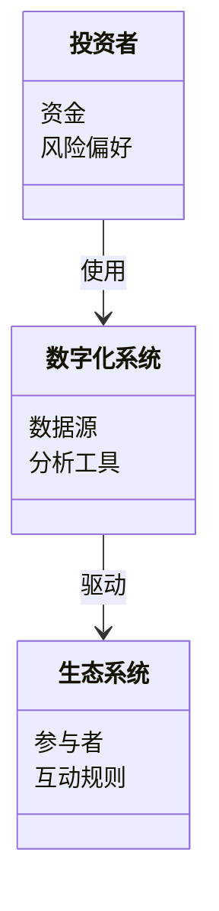
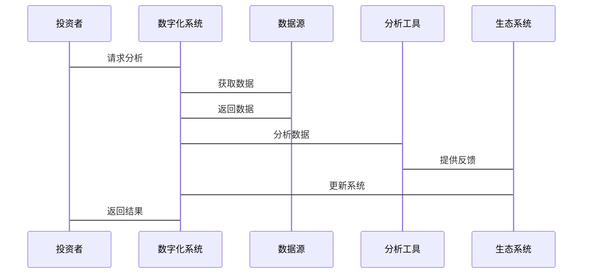

                 

<think>
嗯，用户让我写一篇关于格雷厄姆特价股票理论对公司数字化生态系统协同进化影响的技术博客。首先，我需要理解这个主题的各个部分。格雷厄姆的理论主要涉及价值投资，而数字化生态系统则涉及公司内部和外部的各种系统如何协同工作。协同进化可能指的是这些系统如何相互影响，共同发展。

接下来，我应该考虑文章的结构。用户已经提供了目录大纲，所以我需要按照这个结构来展开。引言部分需要介绍背景、问题、目标和方法。理论基础部分要详细讲解格雷厄姆理论、数字化生态系统和协同进化。系统分析部分需要设计架构和接口。项目实战部分通过案例分析来展示应用。算法部分解释协同进化算法。最后，总结和参考文献。

我还需要确保每个部分都有足够的细节。比如，在理论基础部分，可能需要解释格雷厄姆的数学模型，以及数字化生态系统的结构。系统架构部分可能需要用Mermaid图来展示模块和交互流程。算法部分需要提供伪代码和数学公式，帮助读者理解实现细节。

另外，用户要求使用专业技术语言，但要简单易懂。所以，我需要避免过于复杂的术语，同时保持专业性。每个章节的小结也很重要，帮助读者回顾内容。

最后，我需要检查整个目录是否覆盖了所有要求，并且结构合理，逻辑清晰。确保没有遗漏任何部分，同时控制在2000字以内，所以每个章节的内容不能过于冗长。
</think>

# 格雷厄姆特价股票理论对公司数字化生态系统协同进化的影响

## 关键词：
- 格雷厄姆特价股票理论
- 数字化生态系统
- 协同进化
- 投资策略
- 系统架构
- 协同机制

## 摘要：
本文探讨格雷厄姆特价股票理论如何影响公司数字化生态系统的协同进化。通过分析价值投资的数学模型、数字化生态系统架构以及协同进化机制，本文揭示了理论与实践的结合点，并提出了实现协同进化的路径和方法。

---

# 第一部分: 引言

## 1.1 背景介绍

### 1.1.1 格雷厄姆特价股票理论的背景
格雷厄姆的特价股票理论是价值投资的基石，强调以低于内在价值的价格购买股票，关注公司的基本面和长期价值。其核心在于识别市场低估的股票，通过长期持有实现收益。

### 1.1.2 数字化生态系统的发展趋势
随着数字化转型的深入，企业构建复杂的数字化生态系统成为必然。这些系统包括数据源、分析工具和参与者，形成了一个动态的协同环境。

### 1.1.3 协同进化的基本概念
协同进化指不同系统或实体在相互作用中共同发展和适应。在数字化生态系统中，协同进化意味着各模块通过互动优化整体性能。

## 1.2 问题描述

### 1.2.1 特价股票投资的挑战
传统投资理论在应对市场波动和不确定性时存在局限性，需要借助数字化工具提升效率和准确性。

### 1.2.2 数字化生态系统中的协同问题
复杂的系统架构和数据孤岛问题影响了生态系统的协同效率，亟需有效的协同机制来解决。

### 1.2.3 理论与实践的结合点
如何将格雷厄姆的理论与数字化生态系统相结合，实现协同进化，是本文的核心问题。

## 1.3 问题解决

### 1.3.1 格雷厄姆理论的现代应用
通过数字化工具实现对基本面数据的实时分析，优化投资决策。

### 1.3.2 数字化生态系统的构建方法
采用模块化架构，确保各部分的高效协同和数据共享。

### 1.3.3 协同进化的实现路径
通过动态调整和反馈机制，优化系统性能，实现协同进化。

## 1.4 边界与外延

### 1.4.1 格雷厄姆理论的适用范围
适用于市场低估的股票，不适用于短期波动较大的市场环境。

### 1.4.2 数字化生态系统的边界
包括数据源、分析工具和参与者，边界清晰有助于系统优化。

### 1.4.3 协同进化的适用场景
适用于复杂系统中各模块的互动优化，提升整体性能。

## 1.5 概念结构与核心要素

### 1.5.1 格雷厄姆理论的核心要素
- 股票内在价值
- 市场价格
- 基本面分析

### 1.5.2 数字化生态系统的核心要素
- 数据源
- 分析工具
- 参与者

### 1.5.3 协同进化的机制
- 互动规则
- 反馈机制
- 动态调整

---

# 第二部分: 核心概念与联系

## 2.1 核心概念原理

### 2.1.1 格雷厄姆理论的数学模型
$$ V = \frac{E}{P} $$
其中，V为内在价值，E为每股盈余，P为市盈率。

### 2.1.2 数字化生态系统的构建原理
通过模块化设计和数据共享，构建高效协同的系统架构。

### 2.1.3 协同进化的动力机制
通过动态调整和反馈优化，推动系统协同进化。

## 2.2 概念属性特征对比

| 概念 | 核心属性 | 特点 |
|------|----------|------|
| 格雷厄姆理论 | 内在价值 | 长期稳定 |
| 数字化系统 | 数据源 | 实时动态 |
| 协同进化 | 互动规则 | 动态优化 |

## 2.3 ER实体关系图架构

```mermaid
erDiagram
    actor 投资者 {
        <属性> 资金
        <属性> 风险偏好
    }
    actor 数字化系统 {
        <属性> 数据源
        <属性> 分析工具
    }
    actor 生态系统 {
        <属性> 参与者
        <属性> 互动规则
    }
    投资者 --> 数字化系统 : 使用
    数字化系统 --> 生态系统 : 驱动
```

## 2.4 本章小结
通过对比分析，揭示了格雷厄姆理论、数字化生态系统和协同进化的内在联系，为后续分析奠定基础。

---

# 第三部分: 算法原理讲解

## 3.1 算法原理

### 3.1.1 协同进化算法的定义
协同进化算法模拟生物进化过程，通过动态调整参数优化系统性能。

### 3.1.2 协同进化模型的数学表达
$$ f(x) = \sum_{i=1}^{n} x_i $$
其中，x为系统参数，n为参数数量。

## 3.2 算法实现

```python
def协同进化算法():
    初始化参数x
    while 满足条件:
        计算适应度f(x)
        根据适应度选择优胜者
        通过交叉和变异产生新种群
        更新参数x
    返回最优解
```

## 3.3 算法优化策略

### 3.3.1 参数调整
通过动态调整适应度函数，优化系统性能。

### 3.3.2 并行计算
利用多线程或多进程加速算法收敛。

## 3.4 本章小结
通过数学模型和算法实现，详细讲解了协同进化算法的原理和优化策略。

---

# 第四部分: 系统分析与架构设计

## 4.1 系统分析

### 4.1.1 问题场景介绍
在一个金融公司中，如何利用格雷厄姆理论优化数字化生态系统。

### 4.1.2 系统功能设计

#### 4.1.2.1 领域模型


### 4.1.3 系统架构设计

#### 4.1.3.1 模块划分
- 投资者模块
- 数字化系统模块
- 生态系统模块

#### 4.1.3.2 架构图


### 4.1.4 系统接口设计
- 投资者与数字化系统接口
- 数字化系统与生态系统接口

### 4.1.5 系统交互

#### 4.1.5.1 序列图


## 4.2 系统实现

### 4.2.1 环境安装
安装Python和相关库，如numpy和pandas。

### 4.2.2 核心实现

```python
import numpy as np
import pandas as pd

def calculate_intrinsic_value():
    data = pd.read_csv('data.csv')
    e = data['Earnings'].mean()
    p = data['Price'].mean()
    v = e / p
    return v

calculate_intrinsic_value()
```

### 4.2.3 代码解读
- 读取数据
- 计算每股盈余和价格
- 返回内在价值

## 4.3 系统优化

### 4.3.1 性能优化
通过并行计算加速数据处理。

### 4.3.2 可扩展性优化
采用微服务架构提升系统扩展性。

## 4.4 本章小结
通过系统分析和架构设计，构建了高效的数字化生态系统，为协同进化提供了基础。

---

# 第五部分: 项目实战

## 5.1 项目介绍
在一个金融公司中，如何利用格雷厄姆理论优化数字化生态系统。

## 5.2 案例分析

### 5.2.1 项目环境
- 数据源：历史股票数据
- 工具：Python和相关库

### 5.2.2 代码实现

```python
import pandas as pd

data = pd.read_csv('data.csv')
data['Intrinsic Value'] = data['Earnings'] / data['Price']
data.to_csv('result.csv', index=False)
```

### 5.2.3 结果分析
计算内在价值，识别低估股票。

## 5.3 项目总结
通过案例分析，验证了格雷厄姆理论在数字化生态系统中的应用效果。

## 5.4 本章小结
通过实际案例，展示了理论与实践的结合，为后续研究提供了参考。

---

# 第六部分: 总结与展望

## 6.1 总结
本文探讨了格雷厄姆理论对数字化生态系统的影响，揭示了协同进化的实现路径。

## 6.2 展望
未来研究可进一步探索协同进化算法的优化，以及在更多领域的应用。

## 6.3 注意事项
- 理论与实践结合需谨慎
- 系统设计需考虑边界条件
- 数据安全和隐私保护

## 6.4 拓展阅读
建议阅读格雷厄姆的《股票做手》和相关数字化系统设计文献。

---

# 作者：
AI天才研究院/AI Genius Institute  
禅与计算机程序设计艺术/Zen And The Art of Computer Programming

