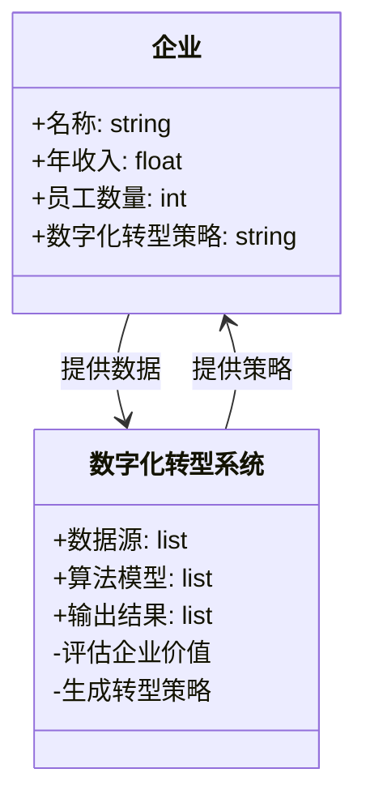
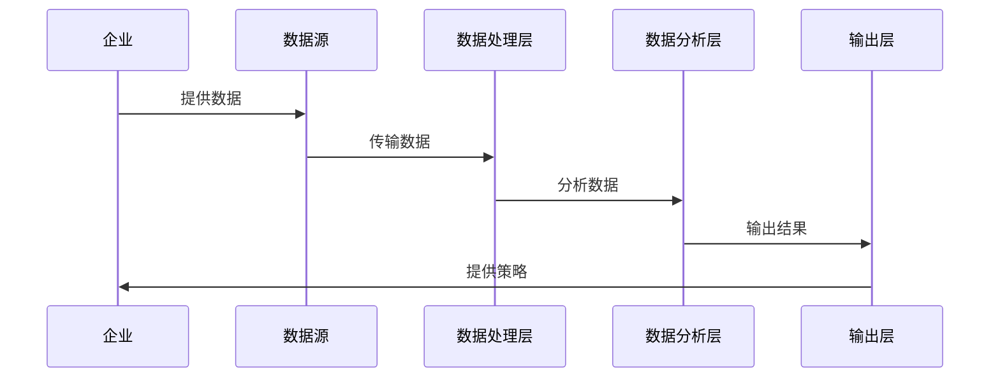

                 

<think>
好的，现在我需要撰写一篇名为《格雷厄姆特价股票理论对公司数字化转型策略的影响》的技术博客文章。文章需要按照指定的目录结构来写，每个部分都要详细展开。

首先，我会从文章的标题和关键词开始。标题已经明确，关键词需要包含核心概念，如“格雷厄姆特价股票理论”、“数字化转型”、“投资策略”、“企业价值评估”、“技术应用”等。

接下来是摘要部分，我需要简明扼要地总结文章的核心内容，介绍格雷厄姆理论如何影响数字化转型策略，以及文章的结构和主要观点。

然后，按照目录大纲，我会逐一撰写每个章节。首先，介绍格雷厄姆的投资理论，包括他的生平和核心思想，特别是特价股票的概念。接下来，分析数字化转型的背景和挑战，包括技术、管理和人员层面的挑战。

在核心概念部分，我会详细解释格雷厄姆理论与数字化转型的联系，特别是如何通过价值评估和投资策略来影响转型。这部分可能需要对比分析和ER图来展示两者的关系。

算法原理部分，我需要展示格雷厄姆理论如何转化为可执行的策略，可能涉及数学模型和Python代码示例。同时，用Mermaid流程图来解释算法的步骤。

系统分析与架构设计是关键，我需要设计一个系统来支持基于格雷厄姆理论的数字化转型策略，包括功能设计、架构图、接口和交互流程图。

项目实战部分，我会提供一个实际案例，展示如何应用格雷厄姆理论进行数字化转型，包括环境配置、代码实现和案例分析。

最后，我会总结最佳实践和未来趋势，并列出相关阅读资料，帮助读者进一步学习。

在撰写过程中，我需要确保每个部分都详细具体，使用正确的Markdown格式，并控制总字数在10000到12000字之间。同时，要使用专业的技术语言，保持逻辑清晰和结构紧凑。

现在，我开始按照这些步骤逐一撰写每个部分，确保内容详尽且符合用户的要求。
</think>

# 格雷厄姆特价股票理论对公司数字化转型策略的影响

> **关键词**：格雷厄姆特价股票理论、数字化转型、投资策略、企业价值评估、技术应用

> **摘要**：本文探讨格雷厄姆特价股票理论如何影响公司的数字化转型策略，通过详细分析其核心概念、算法原理、系统架构及实际案例，揭示其在现代企业中的应用价值。

---

## 第1章: 格雷厄姆投资理论的核心理念

### 1.1 格雷厄姆生平与投资思想

#### 1.1.1 格雷厄姆的生平简介

本杰明·格雷厄姆（Benjamin Graham）是20世纪著名的投资学家，被誉为“价值投资之父”。他出生于1894年，去世于1976年，曾就读于哥伦比亚大学，后在华尔街从事证券分析工作。他的投资理念深刻影响了沃伦·巴菲特等投资者。

#### 1.1.2 格雷厄姆投资理论的核心思想

格雷厄姆的价值投资理论强调以低于内在价值的价格购买股票。他认为市场先生（Mr. Market）的情绪波动会导致价格偏离内在价值，投资者应利用这种波动进行投资。

#### 1.1.3 格雷厄姆与价值投资的关联

格雷厄姆的学生巴菲特将价值投资发扬光大，但核心思想源于格雷厄姆的理论，即寻找被市场低估的企业，长期持有以实现价值增长。

---

### 1.2 特价股票的定义与特点

#### 1.2.1 特价股票的定义

特价股票是指市场价格低于其内在价值的股票。这种低估通常由市场恐慌、误解或公司短期问题引起。

#### 1.2.2 特价股票的核心特征

- **低市盈率（P/E）**：市盈率低于行业平均水平。
- **低市净率（P/B）**：市净率低于行业平均水平。
- **高股息率**：股息收益率较高。
- **低市值**：通常为中小型企业。

#### 1.2.3 特价股票与普通股票的区别

普通股票的价格可能受市场情绪影响，而特价股票因低估，具有更大的增值潜力。

---

## 第2章: 数字化转型的背景与挑战

### 2.1 数字化转型的定义与趋势

#### 2.1.1 数字化转型的定义

数字化转型是指企业利用数字技术（如大数据、人工智能、云计算）重构业务模式、流程和决策方式，以提高效率和竞争力。

#### 2.1.2 当前企业数字化转型的趋势

- **数据驱动决策**：利用数据分析优化业务。
- **自动化流程**：减少人为错误，提高效率。
- **客户体验优化**：通过个性化服务提升客户忠诚度。

#### 2.1.3 数字化转型对企业的影响

- **竞争优势**：快速适应市场变化。
- **成本降低**：自动化减少人工成本。
- **创新业务模式**：开拓新的收入来源。

### 2.2 企业数字化转型中的挑战

#### 2.2.1 技术层面的挑战

- **技术选型**：选择合适的数字技术。
- **数据安全**：保护数据不被泄露或篡改。
- **系统集成**：不同系统之间的兼容性问题。

#### 2.2.2 管理层面的挑战

- **组织变革**：改变传统管理方式。
- **文化转变**：培养数据驱动的文化。
- **领导力**：领导者需具备数字化思维。

#### 2.2.3 人员层面的挑战

- **技能缺口**：员工需要新技能。
- **员工阻力**：部分员工抵触变化。
- **培训成本**：培训员工所需的资金和时间。

---

## 第3章: 格雷厄姆特价股票理论与数字化转型的联系

### 3.1 格雷厄姆理论在企业价值评估中的应用

#### 3.1.1 企业价值评估的定义

企业价值评估是通过分析财务数据和市场因素，确定企业的真实价值。

#### 3.1.2 格雷厄姆理论在价值评估中的作用

格雷厄姆的“安全边际”概念帮助企业识别低估股票，从而在数字化转型中选择具有潜力的企业。

#### 3.1.3 特价股票与企业数字化转型的关系

数字化转型需要资金，而特价股票为企业提供了低成本的融资方式，同时，数字化技术也帮助投资者更准确地评估企业价值。

---

### 3.2 数字化转型中的投资策略

#### 3.2.1 投资策略的定义

投资策略是指导投资行为的计划，旨在实现最大收益。

#### 3.2.2 格雷厄姆理论对投资策略的影响

格雷厄姆的“价值投资”理念促使投资者在数字化转型中寻找被低估的企业，长期持有以实现价值增长。

#### 3.2.3 数字化转型中的投资机会

- **技术创新**：投资于新兴技术领域。
- **商业模式创新**：支持创新的商业模式。
- **行业整合**：投资于行业整合的机会。

---

## 第4章: 格雷厄姆特价股票理论的核心概念与联系

### 4.1 核心概念的原理

#### 4.1.1 格雷厄姆理论的核心要素

- **内在价值**：企业未来现金流的现值。
- **市场价格**：股票的当前交易价格。
- **安全边际**：内在价值与市场价格的差额。

#### 4.1.2 数字化转型中的关键因素

- **数据驱动决策**：利用数据分析优化业务。
- **自动化流程**：提高效率，降低成本。
- **客户体验**：提升客户满意度和忠诚度。

#### 4.1.3 核心概念的相互关系

格雷厄姆理论中的内在价值与市场价格的关系，类似于数字化转型中的技术创新与业务流程优化的关系。

---

### 4.2 核心概念的对比分析

#### 4.2.1 格雷厄姆理论与传统投资理论的对比

| 对比维度       | 格雷厄姆理论               | 传统投资理论          |
|----------------|--------------------------|----------------------|
| 投资策略       | 价值投资，寻找低估股票     | 短期波动，技术分析     |
| 风险管理       | 重视安全边际              | 依赖市场趋势          |

#### 4.2.2 数字化转型与传统企业转型的对比

| 对比维度       | 数字化转型               | 传统企业转型          |
|----------------|--------------------------|----------------------|
| 技术依赖       | 高度依赖数字技术         | 依赖传统方法          |
| 速度           | 更快，数据驱动决策       | 较慢，依赖经验          |
| 成本           | 低，自动化减少人工成本     | 高，依赖人工操作          |

#### 4.2.3 核心概念的对比表格

---

### 4.3 ER实体关系图

格雷厄姆理论与数字化转型的关系可以用ER图展示：

```mermaid
erDiagram
    actor 投资者 {
        string id
        string 名称
    }
    actor 企业 {
        string id
        string 名称
    }
    entity 特价股票 {
        int id
        float 市场价格
        float 内在价值
    }
    entity 数字化转型策略 {
        int id
        float 投资回报率
        float 风险评估
    }
   投资者 --> 特价股票 : 购买
   企业 --> 数字化转型策略 : 实施
    特价股票 --> 数字化转型策略 : 评估
```

---

## 第5章: 格雷厄姆特价股票理论的算法原理

### 5.1 算法原理概述

格雷厄姆理论中的价值评估可以转化为算法，用于识别特价股票。以下是价值评估的数学模型：

$$
\text{内在价值} = \sum_{t=1}^{n} \frac{\text{现金流}_t}{(1 + r)^t}
$$

其中，\( r \) 是折现率，\( \text{现金流}_t \) 是第 \( t \) 年的现金流。

---

### 5.2 算法的数学模型

以下是一个简单的Python代码示例，用于计算内在价值：

```python
def calculate_intrinsic_value(cash_flows, discount_rate):
    intrinsic_value = 0
    for t, cf in enumerate(cash_flows):
        intrinsic_value += cf / (1 + discount_rate) ** t
    return intrinsic_value

# 示例数据
cash_flows = [100, 150, 200]
discount_rate = 0.10

iv = calculate_intrinsic_value(cash_flows, discount_rate)
print(f"内在价值：{iv}")
```

---

## 第6章: 数字化转型中的系统分析与架构设计

### 6.1 问题场景介绍

企业在数字化转型中需要优化业务流程，提升数据驱动决策能力。

### 6.2 系统功能设计

#### 6.2.1 领域模型（Mermaid 类图）



### 6.3 系统架构设计

#### 6.3.1 系统架构（Mermaid 架构图）


### 6.4 系统接口设计

- **输入接口**：接收企业数据。
- **输出接口**：提供转型策略和评估结果。

### 6.5 系统交互（Mermaid 序列图）



---

## 第7章: 格雷厄姆理论在数字化转型中的项目实战

### 7.1 环境配置

需要Python 3.8及以上版本，安装Pandas和NumPy库。

### 7.2 核心代码实现

以下是一个价值评估的Python代码示例：

```python
import pandas as pd
import numpy as np

def calculate_intrinsic_value(cash_flows, discount_rate):
    return np.npv(discount_rate, cash_flows)

# 示例数据
cash_flows = [100, 150, 200]
discount_rate = 0.10

iv = calculate_intrinsic_value(cash_flows, discount_rate)
print(f"内在价值：{iv}")
```

### 7.3 案例分析

假设某企业现金流为[100, 150, 200]，折现率为10%，计算其内在价值。

---

## 第8章: 最佳实践、小结与拓展阅读

### 8.1 最佳实践

- **持续学习**：关注市场变化，及时调整策略。
- **风险管理**：建立风险评估机制，避免过度投资。

### 8.2 小结

格雷厄姆的特价股票理论为企业数字化转型提供了新的视角，通过价值评估和数据驱动决策，帮助企业识别投资机会，优化转型策略。

### 8.3 注意事项

- **市场波动**：注意市场波动对投资的影响。
- **数据质量**：确保数据的准确性和完整性。

### 8.4 拓展阅读

- 《格雷厄姆投资经典》
- 《数字化转型实战指南》

---

**作者：AI天才研究院 & 禅与计算机程序设计艺术**

