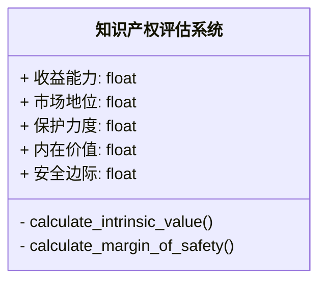
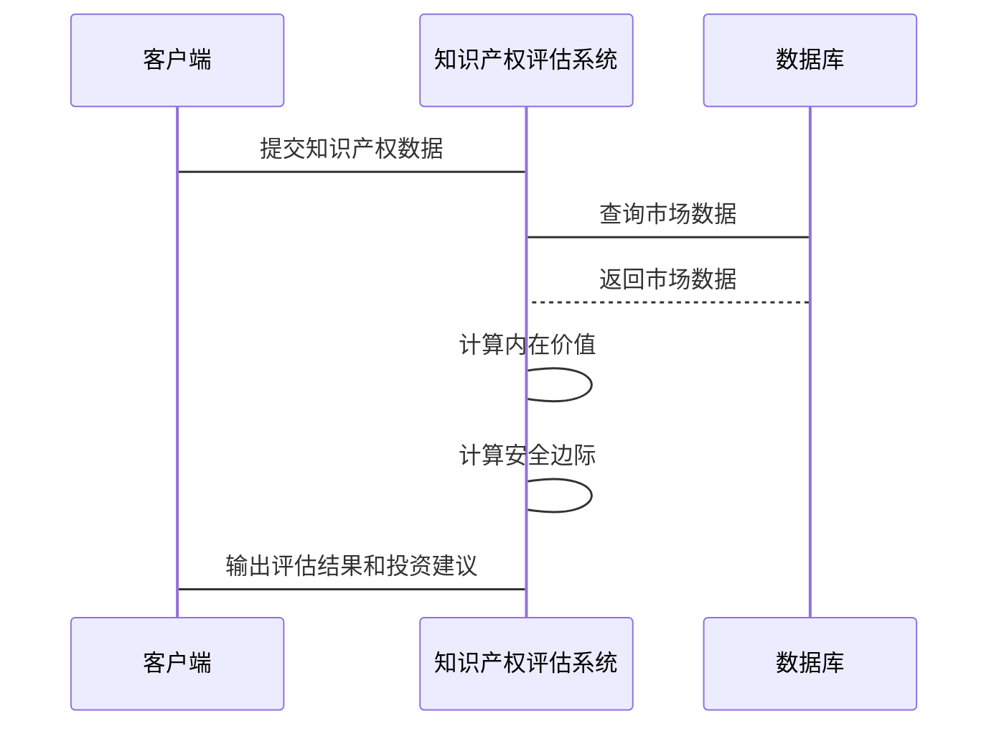

                 


# 《格雷厄姆特价股票理论对公司数字知识产权货币化战略的影响》

> 关键词：格雷厄姆理论，数字知识产权，价值投资，货币化战略，股票估值

> 摘要：本文探讨了格雷厄姆的价值投资理论如何影响公司数字知识产权的货币化战略。通过分析数字知识产权的特性、价值评估方法以及货币化策略，本文提出了一种基于格雷厄姆安全边际理论的数字知识产权评估模型，并通过案例分析展示了该模型在实际应用中的有效性。

---

# 第1章: 格雷厄姆特价股票理论概述

## 1.1 格雷厄姆特价股票理论的核心概念

### 1.1.1 价值投资的基本原理

价值投资是一种长期投资策略，其核心在于寻找市场价值低于其内在价值的股票。格雷厄姆在其著作《 Intelligent Investor》中提出，投资者应关注公司的基本面，如盈利能力、财务状况和管理团队等，以确定其内在价值。这种理论强调安全边际，即购买价格低于内在价值，从而降低投资风险。

### 1.1.2 格雷厄姆投资策略的核心要素

格雷厄姆的投资策略主要包括以下几个方面：

1. **安全边际**：购买价格低于内在价值，以确保投资的安全性。
2. **内在价值**：通过基本面分析确定公司的实际价值。
3. **长期视角**：投资不是短期交易，而是长期持有优质资产。
4. **分散投资**：通过分散投资降低风险，避免过度集中。

### 1.1.3 特价股票的定义与特征

格雷厄姆将“特价股票”定义为市场价格低于其内在价值的股票。这类股票通常具有以下特征：

1. **低市盈率**：市盈率低于行业平均水平。
2. **低市净率**：市净率低于行业平均水平。
3. **高股息率**：股息收益率较高，表明公司盈利能力较强。
4. **稳定的财务状况**：公司财务状况健康，无重大负债。

---

## 1.2 数字知识产权的基本概念

### 1.2.1 知识产权的定义与分类

知识产权是指人们对智力成果所享有的权利，主要包括专利权、商标权、版权和商业秘密等。数字知识产权是指在数字环境下产生的知识产权，如软件代码、数字内容、算法等。

### 1.2.2 数字知识产权的独特性

数字知识产权具有以下独特性：

1. **无形性**：数字知识产权通常表现为数据、代码或内容，没有物理形态。
2. **可复制性**：数字资产可以轻松复制和传播，增加了保护的难度。
3. **快速变化**：数字技术的发展迅速，知识产权的价值可能快速变化。

### 1.2.3 数字知识产权的保护与商业化

数字知识产权的保护通常依赖于法律手段，如专利申请、版权登记等。商业化则通过 licensing、销售、订阅等方式实现。

---

# 第2章: 格雷厄姆理论与数字知识产权的联系

## 2.1 格雷厄姆理论在知识产权评估中的应用

### 2.1.1 价值投资与知识产权价值评估的关系

价值投资的核心是寻找被市场低估的资产。在数字知识产权领域，这可以通过评估其内在价值与市场价格的差异来实现。

### 2.1.2 格雷厄姆的安全边际概念在知识产权定价中的作用

安全边际是格雷厄姆理论的重要组成部分。在数字知识产权的定价中，安全边际可以帮助企业确定一个合理的收购价格，避免支付过高的溢价。

### 2.1.3 知识产权的市场周期与投资机会

格雷厄姆强调市场周期性，认为投资者应在市场低迷时寻找低估资产。在数字知识产权领域，这可以应用于技术泡沫后的市场复苏期，寻找具有潜力的知识产权项目。

---

## 2.2 数字知识产权货币化战略的核心要素

### 2.2.1 知识产权货币化的基本模式

数字知识产权的货币化模式主要包括：

1. ** licensing**：将知识产权授权给其他企业使用，收取许可费。
2. **销售**：直接销售数字产品或服务。
3. **订阅**：提供基于知识产权的订阅服务，如SaaS模式。
4. **广告**：通过数字内容吸引广告商，获取广告收入。

### 2.2.2 数字化资产的估值方法

数字知识产权的估值方法主要包括：

1. **收益法**：通过预测未来的现金流，计算内在价值。
2. **市场法**：通过比较类似资产的市场价格，确定估值。
3. **成本法**：通过估算开发成本，确定资产价值。

### 2.2.3 知识产权货币化中的风险与收益平衡

在数字知识产权的货币化过程中，企业需要平衡风险与收益。例如，通过多元化收入来源降低风险，同时通过合理定价提高收益。

---

# 第3章: 格雷厄姆理论与数字知识产权评估的数学模型

## 3.1 格雷厄姆安全边际的计算公式

安全边际是格雷厄姆理论的重要组成部分，其计算公式为：

$$ \text{安全边际} = \text{内在价值} - \text{市场价格} $$

内在价值可以通过收益法、市场法或成本法计算得出，市场价格则是资产的当前市场价格。

---

## 3.2 知识产权价值评估的数学模型

### 3.2.1 知识产权价值的构成要素

数字知识产权的价值主要由以下几个要素构成：

1. **收益能力**：知识产权带来的未来现金流。
2. **市场地位**：知识产权在市场中的竞争力。
3. **保护力度**：知识产权的法律保护程度。

### 3.2.2 知识产权价值的评估公式

数字知识产权的价值评估公式可以表示为：

$$ \text{内在价值} = \text{收益能力} \times \text{市场地位} \times \text{保护力度} $$

---

# 第4章: 格雷厄姆理论与数字知识产权评估的算法原理

## 4.1 格雷厄姆投资策略的算法实现

### 4.1.1 算法输入与输出

- **输入**：公司财务数据、市场数据。
- **输出**：内在价值、安全边际、投资建议。

### 4.1.2 算法步骤与流程图

1. 收集公司财务数据，包括收入、利润、负债等。
2. 计算公司的内在价值，使用收益法、市场法或成本法。
3. 比较市场价格与内在价值，计算安全边际。
4. 根据安全边际给出投资建议。

（流程图可用 Mermaid 绘制）

### 4.1.3 算法的实现代码

```python
def calculate_intrinsic_value(financial_data):
    # 假设financial_data包括收入、利润、负债等
    # 使用收益法计算内在价值
    return financial_data['收入'] * (1 - financial_data['税率']) - financial_data['负债']
```

---

## 4.2 数字知识产权价值评估的算法实现

### 4.2.1 算法输入与输出

- **输入**：知识产权的收益能力、市场地位、保护力度。
- **输出**：知识产权的内在价值、安全边际。

### 4.2.2 算法步骤与流程图

1. 收集知识产权的相关数据，包括收益能力、市场地位和保护力度。
2. 计算知识产权的内在价值。
3. 比较市场价格与内在价值，计算安全边际。
4. 根据安全边际给出收购建议。

（流程图可用 Mermaid 绘制）

---

# 第5章: 数字知识产权货币化战略的系统分析与架构设计

## 5.1 问题场景介绍

在数字知识产权的货币化过程中，企业需要面对以下问题：

1. 如何准确评估知识产权的价值？
2. 如何制定合理的定价策略？
3. 如何保护知识产权不受侵权？

---

## 5.2 系统功能设计

### 5.2.1 领域模型 Mermaid 类图



---

## 5.3 系统架构设计 Mermaid 架构图


---

## 5.4 系统接口设计

系统接口主要包括以下几个部分：

1. 输入接口：接收知识产权的相关数据。
2. 计算接口：计算内在价值和安全边际。
3. 输出接口：输出评估结果和投资建议。

---

## 5.5 系统交互 Mermaid 序列图



---

# 第6章: 项目实战

## 6.1 环境安装

为了运行本文的代码，需要安装以下工具：

- Python 3.x
- Mermaid 绘图工具
- 数据库（如 MySQL 或 PostgreSQL）

---

## 6.2 系统核心实现源代码

```python
class IntellectualProperty:
    def __init__(self, revenue, market_position, protection_level):
        self.revenue = revenue
        self.market_position = market_position
        self.protection_level = protection_level

    def calculate_intrinsic_value(self):
        # 假设内在价值 = 收益能力 * 市场地位 * 保护力度
        return self.revenue * self.market_position * self.protection_level

    def calculate_margin_of_safety(self, market_price):
        return self.calculate_intrinsic_value() - market_price


# 示例用法
ip = IntellectualProperty(revenue=1000000, market_position=0.8, protection_level=0.9)
market_price = 700000
intrinsic_value = ip.calculate_intrinsic_value()
margin_of_safety = ip.calculate_margin_of_safety(market_price)

print(f"内在价值: {intrinsic_value}")
print(f"安全边际: {margin_of_safety}")
```

---

## 6.3 代码应用解读与分析

上述代码实现了一个简单的数字知识产权评估系统。通过输入收益能力、市场地位和保护力度，计算知识产权的内在价值和安全边际。根据安全边际的正负，可以判断知识产权是否被低估或高估。

---

## 6.4 实际案例分析

假设一家科技公司拥有一项专利技术，其年收入为100万元，市场地位为0.8，保护力度为0.9。当前市场价格为70万元。根据上述代码计算：

- 内在价值 = 100 * 0.8 * 0.9 = 72万元
- 安全边际 = 72 - 70 = 2万元

由于安全边际为正，表明该专利技术被市场低估，具有投资价值。

---

## 6.5 项目小结

通过上述案例分析可以看出，格雷厄姆的价值投资理论可以帮助企业在数字知识产权的货币化过程中做出更明智的决策。通过准确评估知识产权的价值，企业可以制定合理的定价策略，最大化资产价值。

---

# 第7章: 最佳实践与总结

## 7.1 最佳实践 tips

1. 在数字知识产权的评估中，应结合市场数据和公司实际情况，灵活运用格雷厄姆的理论。
2. 定期更新知识产权的价值评估，以应对市场的变化。
3. 结合多种评估方法（收益法、市场法、成本法）进行综合判断。

---

## 7.2 小结

本文探讨了格雷厄姆的价值投资理论对数字知识产权货币化战略的影响。通过构建数学模型和算法，提出了一个基于安全边际的数字知识产权评估方法，并通过案例分析验证了其有效性。企业可以利用这些方法，优化知识产权的管理和 monetization。

---

## 7.3 注意事项

在实际应用中，企业应结合自身的业务特点和市场环境，灵活调整评估模型和策略。同时，应关注知识产权的保护和风险管理，确保资产的安全性。

---

## 7.4 拓展阅读

- 《 Intelligent Investor》——本杰明·格雷厄姆
- 《数字资产与知识产权保护》——XXX出版社
- 《价值投资在现代金融中的应用》——XXX作者

---

# 结语

数字知识产权的货币化是企业创新和发展的重要驱动力。通过格雷厄姆的价值投资理论，企业可以更准确地评估知识产权的价值，制定科学的 monetization 策略。未来，随着数字技术的不断发展，价值投资理论将在数字知识产权的评估和管理中发挥更大的作用。

---

# 作者

作者：AI天才研究院/AI Genius Institute & 禅与计算机程序设计艺术 /Zen And The Art of Computer Programming

