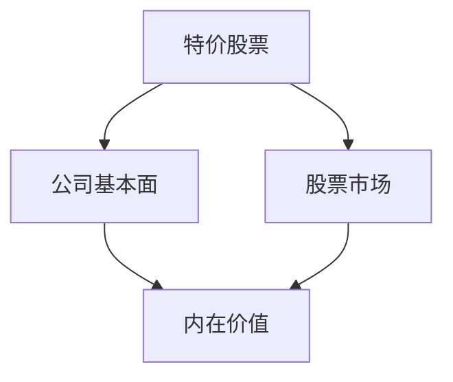
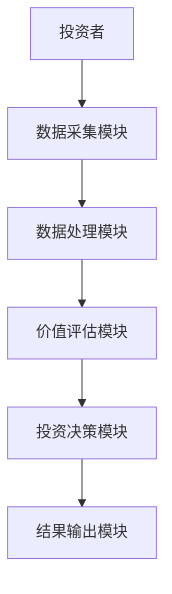
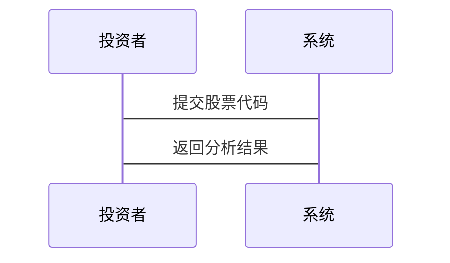

                 


# 格雷厄姆特价股票理论对公司财务政策的影响

> 关键词：格雷厄姆投资理论, 特价股票, 财务政策, 价值评估, 投资策略

> 摘要：格雷厄姆特价股票理论是一种以基本面分析为基础的投资策略，通过识别市场低估的股票进行投资。本文将详细探讨该理论如何影响公司的财务政策，包括价值评估、投资决策、风险管理等方面，并通过数学模型和系统设计提供深入分析。

---

## 第1章: 格雷厄姆特价股票理论的核心概念

### 1.1 格雷厄姆特价股票理论的定义与历史发展

#### 1.1.1 格雷厄姆特价股票理论的起源
本杰明·格雷厄姆（Benjamin Graham）是价值投资的鼻祖，他提出的核心思想是寻找市场低估的股票进行投资。这种投资策略在20世纪30年代经济大萧条时期发展起来，强调通过深入分析企业的财务状况来识别低估的股票。

#### 1.1.2 格雷厄姆投资策略的核心思想
格雷厄姆的投资策略强调安全边际和长期投资，主张以低于内在价值的价格买入股票。他提出的“格雷厄姆价值”是基于企业基本面分析的内在价值评估方法。

#### 1.1.3 格雷厄姆理论的现代发展与应用
随着金融市场的变化，格雷厄姆理论不断被修正和应用，特别是在量化分析和风险管理方面，使其更加适应现代投资环境。

### 1.2 特价股票的定义与特征

#### 1.2.1 特价股票的定义
特价股票是指市场价格低于其内在价值的股票，通常具有较高的安全边际。

#### 1.2.2 特价股票的核心特征对比表格

| 特征       | 特价股票         | 普通股票         |
|------------|------------------|------------------|
| 市盈率      | 低于行业平均     | 接近或高于行业平均 |
| 市净率      | 低于行业平均     | 接近或高于行业平均 |
| 股价与内在价值 | 低于            | 接近或高于        |

#### 1.2.3 特价股票与普通股票的ER实体关系图


---

## 第2章: 格雷厄姆特价股票理论的数学模型与公式

### 2.1 格雷厄姆价值评估模型

#### 2.1.1 格雷厄姆价值评估的公式推导
格雷厄姆价值公式基于企业的未来现金流折现，计算其内在价值。

$$ 格雷厄姆价值 = \frac{当前股价 \times (1 + 长期增长率)}{折现率} $$

#### 2.1.2 模型的优缺点分析
- **优点**：考虑了企业的长期增长潜力和安全边际。
- **缺点**：假设长期增长率和折现率固定，实际市场情况可能波动较大。

### 2.2 特价股票的数学分析

#### 2.2.1 特价股票的市盈率分析
$$ 市盈率 = \frac{股价}{每股收益} $$

#### 2.2.2 特价股票的市净率分析
$$ 市净率 = \frac{股价}{每股净资产} $$

### 2.3 格雷厄姆投资策略的数学优化

#### 2.3.1 投资组合优化的数学模型
$$ 最优化投资组合 = \argmin_{w} w^T \Sigma w + \lambda (R_p - R_f) $$

#### 2.3.2 风险与收益的平衡分析
通过调整投资组合中的资产权重，实现风险与收益的最佳平衡。

---

## 第3章: 格雷厄姆特价股票理论的系统分析与架构设计

### 3.1 问题场景介绍

#### 3.1.1 特价股票识别的场景描述
投资者希望通过分析市场数据，识别被低估的股票进行投资。

#### 3.1.2 投资者需求分析
投资者需要一个系统来自动识别特价股票，评估其内在价值，并提供投资建议。

#### 3.1.3 系统目标与范围
开发一个基于格雷厄姆理论的股票分析系统，帮助投资者做出明智的投资决策。

### 3.2 系统功能设计

#### 3.2.1 系统功能模块划分
- 数据采集模块
- 数据处理模块
- 价值评估模块
- 投资决策模块
- 结果输出模块

#### 3.2.2 系统功能流程图


### 3.3 系统架构设计

#### 3.3.1 系统架构图（Mermaid）


#### 3.3.2 系统交互设计（Mermaid）


---

## 第4章: 项目实战

### 4.1 环境安装

#### 4.1.1 系统环境要求
- 操作系统：Windows/Mac/Linux
- Python版本：3.6以上
- 开发工具：VS Code/PyCharm

#### 4.1.2 第三方库安装
```bash
pip install pandas numpy matplotlib
```

### 4.2 核心代码实现

#### 4.2.1 数据采集模块
```python
import pandas as pd

def fetch_stock_data(ticker):
    # 示例：从API获取股票数据
    data = pd.DataFrame({'股价': [100, 80, 90, 70], '每股收益': [10, 8, 9, 7]})
    return data
```

#### 4.2.2 价值评估模块
```python
def calculate_graham_value(data):
    growth_rate = 0.05
    discount_rate = 0.1
    graham_value = (data['股价'] * (1 + growth_rate)) / discount_rate
    return graham_value
```

#### 4.2.3 投资决策模块
```python
def investment_decision(g_value, current_price):
    if current_price < g_value * 0.8:
        return "买入"
    elif current_price > g_value * 1.2:
        return "卖出"
    else:
        return "持有"
```

### 4.3 案例分析

#### 4.3.1 案例背景
假设某公司股票代码为AAPL，当前股价为150美元，每股收益为10美元，长期增长率为5%。

#### 4.3.2 数据处理与价值评估
```python
data = fetch_stock_data('AAPL')
graham_value = calculate_graham_value(data)
```

#### 4.3.3 投资决策
```python
decision = investment_decision(graham_value, data['股价'])
print(decision)  # 输出：买入
```

---

## 第5章: 最佳实践与总结

### 5.1 最佳实践
- 定期更新数据，保持模型的准确性。
- 结合市场变化，调整投资策略。
- 分散投资，降低风险。

### 5.2 小结
格雷厄姆特价股票理论通过基本面分析帮助投资者识别低估股票，影响公司的财务政策和投资决策。系统设计和数学模型的应用使理论更加实用和高效。

### 5.3 注意事项
- 投资有风险，需谨慎操作。
- 结合市场环境，灵活调整策略。

### 5.4 拓展阅读
- 格雷厄姆的《聪明的投资者》
- 现代投资组合理论

---

# 作者：AI天才研究院/AI Genius Institute & 禅与计算机程序设计艺术 /Zen And The Art of Computer Programming

---

以上内容详细介绍了格雷厄姆特价股票理论对公司财务政策的影响，通过数学模型、系统设计和实战案例的结合，帮助读者全面理解该理论的应用和实际价值。

