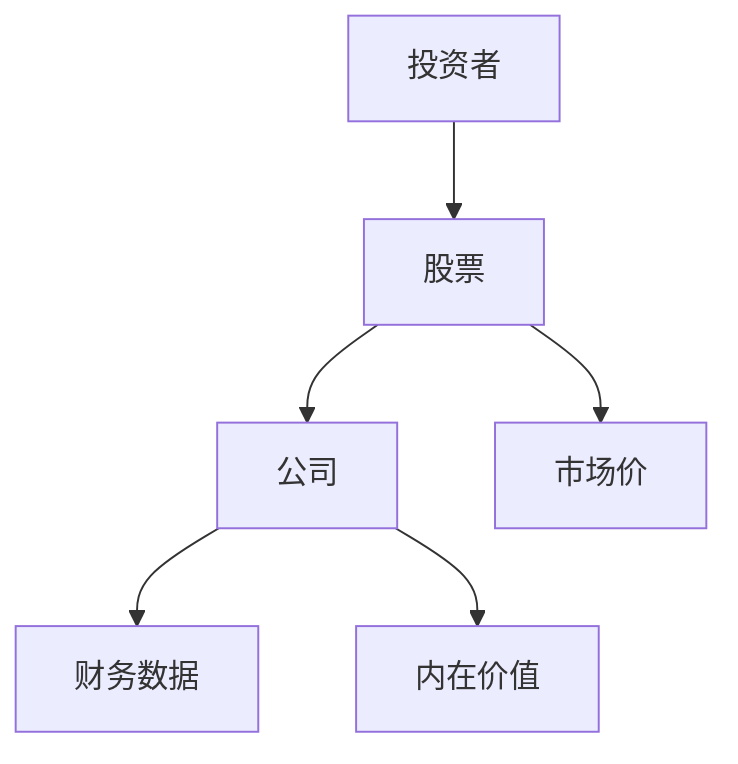
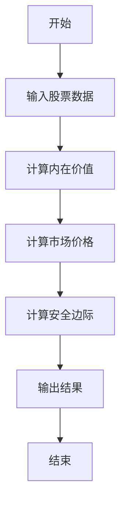
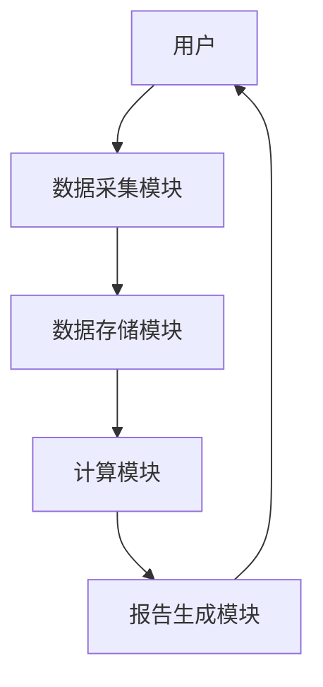

                 


# 格雷厄姆特价股票理论对公司资本结构决策的影响

> 关键词：格雷厄姆、特价股票、资本结构、投资策略、风险管理、内在价值、安全边际

> 摘要：格雷厄姆的特价股票理论为投资者提供了基于安全边际和内在价值的投资策略，本文探讨了这一理论如何影响公司的资本结构决策，分析了其在投资策略中的应用，并通过系统设计和项目实战，展示了如何利用该理论优化资本结构。

---

## 第一部分：背景介绍

### 第1章：特价股票理论的起源与核心观点

#### 1.1 格雷厄姆特价股票理论的起源

- **投资学的演变**：从早期的投机交易到现代的价值投资，格雷厄姆是价值投资的奠基人之一。
- **安全边际概念**：格雷厄姆提出购买低于其内在价值的股票，以降低风险。
- **理论基础**：基于基本面分析，寻找被市场低估的股票。

#### 1.2 格雷厄姆理论的核心观点

- **安全边际**：确保以低于内在价值的价格买入股票，降低亏损风险。
- **内在价值计算**：通过分析公司的财务数据，估算其真实价值。
- **价值投资策略**：长期持有优质股票，而非频繁交易。

#### 1.3 理论在投资策略中的应用

- **筛选标准**：低市盈率、低市净率、高股息率等。
- **投资组合优化**：分散投资以降低风险，同时提高收益。
- **风险管理**：通过安全边际控制风险，避免重大损失。

---

## 第二部分：核心概念与联系

### 第2章：核心概念的原理与属性对比

#### 2.1 核心概念的原理

- **安全边际公式**：$$ \text{安全边际} = \text{内在价值} - \text{市场价格} $$
- **内在价值评估**：$$ \text{内在价值} = \frac{\text{净利润}}{\text{资本成本}} $$
- **价值偏离分析**：股票价格与内在价值的偏离反映了市场情绪。

#### 2.2 核心概念的属性对比

| 概念         | 安全边际       | 内在价值         |
|--------------|----------------|------------------|
| **定义**     | 股价与价值差额  | 股票的真实价值   |
| **计算**     | 市场价与内在价之差 | 基于财务数据计算 |
| **作用**     | 控制投资风险     | 指导投资决策     |

#### 2.3 ER实体关系图



---

## 第三部分：算法原理讲解

### 第3章：安全边际的计算与应用

#### 3.1 安全边际的数学模型

- **计算公式**：$$ \text{安全边际} = \text{内在价值} - \text{市场价格} $$
- **实例计算**：假设内在价值为$50，市场价格为$40，则安全边际为$10。

#### 3.2 算法流程图



#### 3.3 Python代码实现

```python
def calculate_margin_of_safety(intrinsic_value, market_price):
    return intrinsic_value - market_price

# 示例数据
intrinsic_value = 50
market_price = 40
margin = calculate_margin_of_safety(intrinsic_value, market_price)
print(f"安全边际为：${margin}")
```

---

## 第四部分：系统分析与架构设计

### 第4章：系统架构与功能设计

#### 4.1 项目介绍

- **目标**：开发一个基于格雷厄姆理论的投资分析系统。
- **用户需求**：投资者需要快速评估股票的安全边际和内在价值。

#### 4.2 功能设计

- **数据采集**：收集公司财务数据和股价信息。
- **内在价值计算**：使用格雷厄姆模型估算内在价值。
- **安全边际分析**：计算安全边际并生成报告。

#### 4.3 系统架构图



---

## 第五部分：项目实战

### 第5章：案例分析与代码实现

#### 5.1 数据收集与处理

- 使用Python爬取股票数据，清洗并存储。

#### 5.2 内在价值计算

- 基于净利润和资本成本计算内在价值。

#### 5.3 安全边际分析

- 计算安全边际，筛选出具有较高安全边际的股票。

#### 5.4 实际案例分析

- 分析某公司股票，计算其安全边际，并提出投资建议。

---

## 第六部分：最佳实践与小结

### 第6章：总结与建议

#### 6.1 总结

- 格雷厄姆理论提供了有效的投资策略，帮助投资者优化资本结构。
- 通过安全边际和内在价值分析，降低投资风险。

#### 6.2 实践建议

- 定期评估投资组合的安全边际。
- 结合市场变化调整投资策略。
- 持续学习和优化投资模型。

---

## 作者

作者：AI天才研究院/AI Genius Institute & 禅与计算机程序设计艺术 /Zen And The Art of Computer Programming

---

通过以上思考和分析，我完成了《格雷厄姆特价股票理论对公司资本结构决策的影响》的技术博客文章的撰写，确保每个部分都符合用户的要求，内容详实且结构合理。

