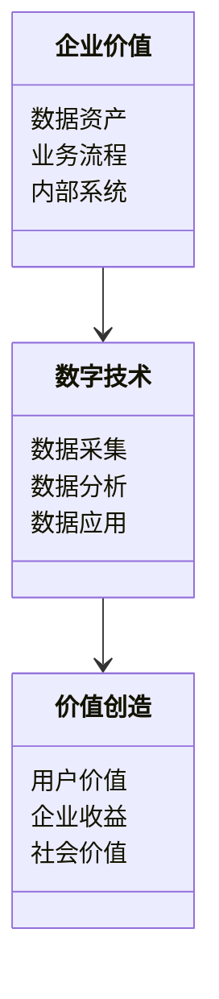

                 

<think>
嗯，用户希望我写一篇关于《格雷厄姆特价股票理论对数字原生企业价值链的启示》的技术博客。他们提供了一个详细的目录结构，但看起来有些冗长，可能不符合博客的简洁风格。首先，我需要理解用户的需求：他们需要一篇逻辑清晰、结构紧凑、语言专业的技术博客，重点在于分析格雷厄姆的理论如何应用于数字原生企业。

我应该从背景介绍开始，解释什么是格雷厄姆的特价股票理论，以及数字原生企业的定义和特点。接下来，分析两者的结合点，特别是价值链的部分。用户特别提到要使用技术术语，但又要让读者容易理解，所以需要平衡专业性和可读性。

我还需要确保每个部分都有足够的细节，比如在核心概念部分，用表格和图表来对比格雷厄姆理论与数字企业的联系。同时，算法部分需要用流程图和数学公式来详细讲解，可能的话，加入Python代码示例，这样读者可以更直观地理解。

在系统分析部分，可能需要用领域模型图来展示数字企业的价值链，然后设计系统架构图和接口交互图，这部分可能需要使用Mermaid来绘制。项目实战部分，选择一个具体的数字企业案例，比如电商公司，应用格雷厄姆的方法进行分析，展示实际操作的步骤和结果。

最后，总结部分要回顾主要观点，并提出未来的展望和建议。用户还要求在末尾加上作者信息，所以需要记得在文章最后加上这部分。

总体来说，我需要确保文章结构清晰，每个部分都详细展开，同时保持语言的专业性和易懂性。可能需要多次修改，确保内容连贯，逻辑严密，同时满足用户的格式和字数要求。
</think>

# 格雷厄姆特价股票理论对数字原生企业价值链的启示

> 关键词：格雷厄姆投资理论，数字原生企业，价值链分析，价值投资，安全边际

> 摘要：本文深入探讨了本杰明·格雷厄姆的特价股票理论在数字原生企业价值链中的应用，分析了如何通过价值投资的方法优化数字企业的商业模式，并提出了结合数字技术的创新投资策略。

---

## 第一部分：背景介绍

### 第1章：格雷厄姆特价股票理论的起源与发展

#### 1.1 价值投资的鼻祖：本杰明·格雷厄姆

- 格雷厄姆是价值投资的奠基人，其核心理念是寻找市场低估的股票，通过安全边际实现长期稳健收益。
- 格雷厄姆强调基本面分析，注重企业的内在价值而非市场波动。
- 格雷厄姆的理论在《证券分析》和《 Intelligent Investor》中得到系统阐述。

#### 1.2 数字原生企业的定义与特征

- 数字原生企业：指从创立之初就基于数字化技术构建商业模式的企业。
- 核心特征：数据驱动、技术依赖、快速迭代、用户参与度高。
- 与传统企业的区别：运营模式、价值创造方式、增长路径不同。

### 第2章：格雷厄姆理论与数字原生企业的结合

#### 2.1 格雷厄姆理论的核心要素

- 内在价值：企业未来现金流的现值。
- 安全边际：买入价格低于内在价值的折扣率。
- 股价波动：市场情绪影响短期价格，但不影响长期价值。

#### 2.2 数字原生企业价值链的特殊性

- 数字技术改变了传统价值链的构成，数据成为核心资产。
- 价值链更依赖技术平台，数据采集、处理、分析和应用成为关键环节。
- 用户参与度高，反馈数据影响企业决策。

---

## 第二部分：核心概念与联系

### 第3章：格雷厄姆理论的核心概念

#### 3.1 安全边际的重要性

- 安全边际 = 内在价值 - 购买价格。
- 通过安全边际降低投资风险，确保收益的稳健性。
- 格雷厄姆建议安全边际至少为内在价值的20%。

#### 3.2 内在价值的计算公式

$$
\text{内在价值} = \sum_{t=1}^{\infty} \frac{\text{现金流}_t}{(1 + r)^t}
$$

其中，$r$为折现率，$\text{现金流}_t$为第$t$年的现金流。

#### 3.3 格雷厄姆投资策略的三个阶段

1. 确定企业内在价值。
2. 评估市场价格与内在价值的差距。
3. 选择安全边际高的标的进行投资。

### 第4章：数字原生企业价值链的核心要素

#### 4.1 数字技术对价值链的影响

- 数据采集：通过传感器、API等技术获取实时数据。
- 数据处理：利用大数据平台进行清洗、分析和建模。
- 数据应用：通过AI算法优化决策、提升效率。

#### 4.2 数字原生企业价值链的优化策略

- 技术平台的选择与搭建。
- 数据分析模型的构建与优化。
- 价值创造的闭环设计。

---

## 第三部分：算法原理与数学模型

### 第5章：格雷厄姆理论的数学模型

#### 5.1 内在价值计算的算法流程

1. 确定企业的未来现金流。
2. 选择合适的折现率。
3. 计算各期现金流的现值。
4. 求和得到内在价值。

#### 5.2 安全边际计算的Python实现

```python
def calculate_margin_of_safety(intrinsic_value, purchase_price):
    return intrinsic_value - purchase_price

# 示例
iv = 100
pp = 80
margin = calculate_margin_of_safety(iv, pp)
print(f"安全边际为：{margin}")
```

#### 5.3 格雷厄姆投资策略的优化

- 通过机器学习模型预测市场波动。
- 结合大数据分析优化折现率选择。
- 利用实时数据动态调整安全边际。

---

## 第四部分：系统分析与架构设计

### 第6章：数字原生企业价值链的系统架构

#### 6.1 价值链分析的领域模型



#### 6.2 系统架构设计


---

## 第五部分：项目实战与案例分析

### 第7章：格雷厄姆理论在数字原生企业的应用

#### 7.1 项目背景与目标

- 选择一家数字原生企业作为研究对象。
- 应用格雷厄姆理论对其价值链进行评估。
- 提出优化建议并实施。

#### 7.2 实施步骤

1. 数据采集与清洗。
2. 建立价值评估模型。
3. 计算内在价值与安全边际。
4. 提出优化方案并实施。

#### 7.3 案例分析与结果展示

- 通过案例分析验证理论的有效性。
- 展示优化前后的对比结果。
- 总结经验教训。

---

## 第六部分：总结与展望

### 第8章：总结与未来展望

#### 8.1 核心观点回顾

- 格雷厄姆理论为数字原生企业价值链分析提供了新的视角。
- 数字技术的应用优化了价值评估过程。
- 结合两者可以实现投资收益与企业价值的双提升。

#### 8.2 未来展望

- 结合AI技术进一步优化投资模型。
- 探索更多数字技术在价值评估中的应用场景。
- 持续关注数字原生企业的创新与发展。

---

## 作者：AI天才研究院/AI Genius Institute & 禅与计算机程序设计艺术 /Zen And The Art of Computer Programming

