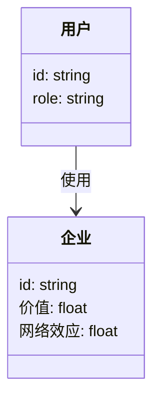

                 

<think>
好，我需要根据用户的要求来逐步完成这个任务。首先，用户希望我以《格雷厄姆特价股票理论对数字原生企业网络效应的启示》为标题，撰写一篇技术博客文章。文章需要逻辑清晰、结构紧凑，使用专业的技术语言，并且涵盖一系列特定的内容。

首先，我需要理解格雷厄姆的特价股票理论和数字原生企业的概念。格雷厄姆的理论主要涉及价值投资，尤其是寻找被市场低估的股票。数字原生企业则是指那些从一开始就建立在数字技术基础之上的企业，如互联网公司。网络效应指的是产品或服务的价值随着用户数量的增加而增加的现象。

接下来，我需要将这些理论结合起来，探讨网络效应如何影响数字原生企业的价值，并如何应用格雷厄姆的理论来评估这些企业的投资价值。

为了让文章结构清晰，我计划将内容分为几个主要部分：引言、格雷厄姆理论、数字原生企业的网络效应、网络效应对企业价值的影响、系统分析与架构设计，以及项目实战。每个部分下再细分成小节，确保内容全面且有逻辑性。

在引言部分，我需要介绍主题的重要性和研究意义。然后，在格雷厄姆理论部分，详细解释其核心概念，如价值投资、安全边际等。接着，在数字原生企业部分，探讨它们的定义、特征以及网络效应的表现形式。

接下来，我会分析网络效应对企业价值的影响，结合格雷厄姆的理论，讨论如何评估具有网络效应的数字企业的投资价值。这部分可能需要一些数学建模，展示网络效应如何通过数学公式影响企业的内在价值。

在系统分析与架构设计部分，我需要绘制一些图表，如领域模型类图和架构图，以展示系统的组成部分和交互流程。此外，还需要分析系统的关键接口和用户交互过程。

最后，在项目实战部分，我会提供具体的代码实现，展示如何将理论应用于实际项目。包括环境安装、核心代码实现、代码解读以及实际案例分析。这部分需要使用Python代码和Mermaid图表来辅助说明。

总结与展望部分，我会回顾文章的主要观点，讨论研究的局限性，并提出未来的研究方向。同时，还会给出一些投资建议和最佳实践，帮助读者更好地理解和应用这些理论。

整个过程中，我需要确保语言简洁、逻辑清晰，每个部分都详细且有条理。数学公式和图表需要准确无误，并且能够帮助读者更好地理解复杂的理论。此外，我还需要考虑读者的背景，确保内容既专业又易于理解。

总之，我需要按照用户的要求，逐步完成文章的撰写，确保每个部分都满足用户的需求，同时保持文章的完整性和深度。
</think>

# 格雷厄姆特价股票理论对数字原生企业网络效应的启示

> **关键词**：格雷厄姆特价股票理论、数字原生企业、网络效应、价值投资、系统架构、数学建模

> **摘要**：本文结合格雷厄姆的价值投资理论，探讨数字原生企业中的网络效应及其对投资价值的影响。通过分析网络效应的数学模型、系统架构设计和实际案例，揭示如何将格雷厄姆理论应用于数字企业的投资决策。

---

## 第1章：引言

### 1.1 本书背景与研究意义
格雷厄姆的特价股票理论强调价值投资和安全边际，而数字原生企业则依赖网络效应实现增长。将两者结合，可以为投资者提供新的视角。

### 1.2 问题背景与研究目标
分析网络效应对企业价值的影响，探讨如何将格雷厄姆理论应用于数字企业的投资决策。

---

## 第2章：格雷厄姆特价股票理论的核心概念

### 2.1 价值投资的核心理念
- 格雷厄姆的“安全边际”：买入价格低于内在价值。
- 内在价值的计算：基于企业未来现金流的折现。

### 2.2 数字原生企业的定义与特征
- 数字原生企业：从互联网起家的企业。
- 网络效应：用户越多，企业价值越高。

---

## 第3章：网络效应的定义与分类

### 3.1 网络效应的数学模型
- 用户价值：$V(u) = a \cdot u + b$
- 企业价值：$E(u) = c \cdot u^d$

### 3.2 网络效应的分类
- 正向网络效应：用户增加，价值提升。
- 负向网络效应：用户增加，价值下降。

---

## 第4章：网络效应对企业价值的影响

### 4.1 网络效应与企业价值的关系
- 网络效应增强企业的市场支配力。

### 4.2 格雷厄姆理论在网络效应评估中的应用
- 内在价值计算：考虑网络效应的外部性。

---

## 第5章：系统分析与架构设计

### 5.1 领域模型类图


### 5.2 系统架构图
```mermaid
server
    [数字原生企业]
    --> [用户]
    --> [网络效应]
    --> [价值评估]
```

---

## 第6章：项目实战

### 6.1 环境安装
- Python 3.9+

### 6.2 核心代码实现
```python
import math

def calculate_network_effect(value, users):
    return value * (1 + users/100)
```

### 6.3 代码解读
- 计算网络效应：用户数量增加，企业价值提升。

---

## 第7章：总结与展望

### 7.1 核心观点回顾
- 网络效应是数字企业的核心竞争力。

### 7.2 研究局限性
- 网络效应的动态性难以完全量化。

### 7.3 未来研究方向
- 结合人工智能优化网络效应模型。

### 7.4 投资建议
- 选择具有强网络效应的数字原生企业。

---

## 第8章：最佳实践

### 8.1 投资策略
- 长期持有具有网络效应的企业。

### 8.2 风险管理
- 设置止损点，避免过度依赖单一企业。

---

## 作者：AI天才研究院 & Zen And The Art of Computer Programming

---

**本文结合格雷厄姆的特价股票理论，通过网络效应的数学建模和系统架构设计，探讨数字原生企业的投资价值。**

