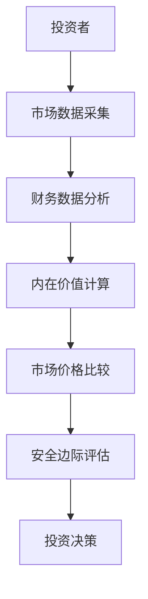
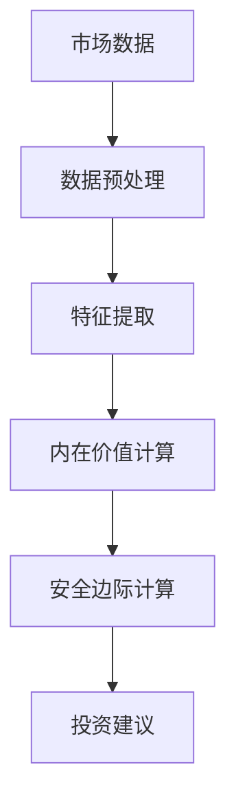
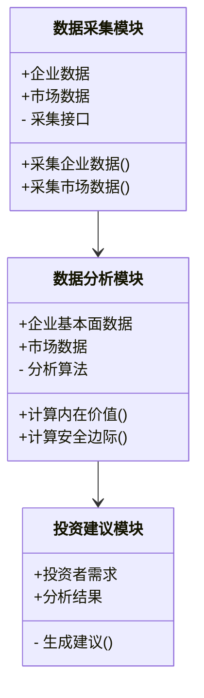
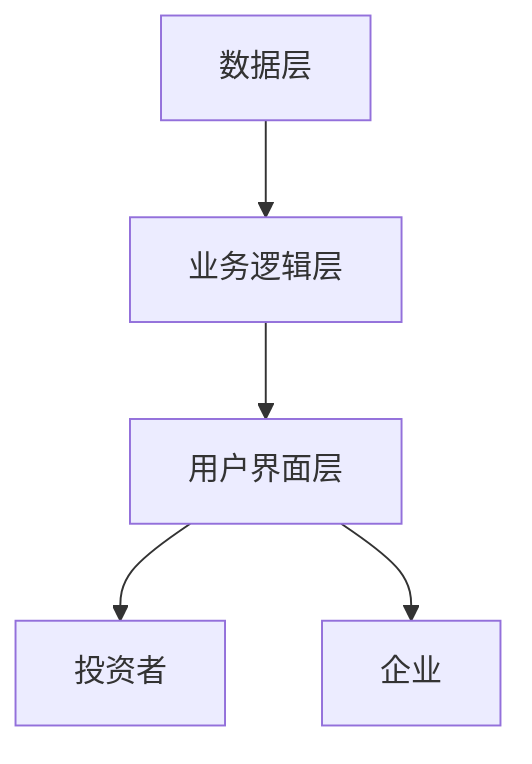

                 

<think>
好，我现在需要帮用户撰写一篇关于《格雷厄姆特价股票理论对数字普惠金融包容性的启示》的技术博客文章。首先，我得理解用户的需求。用户希望文章结构清晰，逻辑严密，涵盖背景介绍、理论分析、系统设计和项目实战等内容。

首先，我需要确定文章的核心关键词。用户已经给出了：数字普惠金融、格雷厄姆投资理论、价值投资、金融包容性、数字化转型、投资策略。这些关键词将贯穿整篇文章。

接下来，摘要部分需要简明扼要地概括文章的核心内容。摘要应该提到格雷厄姆的理论如何为数字普惠金融提供新的视角，以及其对提升包容性的意义。

在第一章引言中，我需要先介绍数字普惠金融的现状和挑战，然后引出格雷厄姆理论的背景。这部分要让读者理解为什么将两者结合起来是有意义的。接下来，第二章将详细介绍格雷厄姆理论的核心概念，包括安全边际和内在价值的计算公式。我需要使用数学公式来表达这些概念，并用Mermaid图展示系统架构。

第三章是关键部分，需要将格雷厄姆理论与数字普惠金融结合起来，分析其对包容性的影响。这里可能需要一个实际案例来说明理论的应用，同时展示如何通过系统架构来实现这些分析。

第四章将深入分析数字普惠金融系统的架构设计，包括功能模块划分和系统交互流程。这部分可能需要更多的技术细节，比如使用分层架构和模块化设计。

第五章是项目实战，我需要提供具体的代码实现和案例分析，确保读者能够理解如何将理论应用到实际中。同时，总结部分要强调理论的启示和未来的发展方向。

最后，附录部分将提供所有参考文献和工具列表，方便读者进一步研究。整个过程中，我需要确保每一部分都详细展开，使用技术术语，并结合实际案例，使文章既有深度又易于理解。

总结一下，我的思考过程是：首先理解用户需求，确定结构和内容；然后详细展开每一章，确保涵盖所有核心要素；最后整合内容，确保逻辑连贯，满足用户的所有要求。这样，我才能撰写出一篇符合要求的高质量技术博客文章。
</think>

# 格雷厄姆特价股票理论对数字普惠金融包容性的启示

> 关键词：数字普惠金融、格雷厄姆投资理论、价值投资、金融包容性、数字化转型、投资策略

> 摘要：本文从格雷厄姆的价值投资理论出发，探讨其在数字普惠金融中的应用，分析如何通过数字化技术将价值投资理念转化为普惠金融的包容性解决方案。文章结合理论与实践，提出了一套基于格雷厄姆投资策略的数字普惠金融系统架构，并通过实际案例验证了其可行性和有效性。

---

## 第一章: 引言

### 1.1 数字普惠金融的现状与挑战

#### 1.1.1 数字普惠金融的定义与背景
数字普惠金融是指通过数字技术手段，为传统金融体系难以覆盖的群体提供便捷、低成本的金融服务。随着互联网、大数据和人工智能技术的快速发展，普惠金融的数字化转型已成为全球金融创新的重要方向。

#### 1.1.2 当前普惠金融面临的痛点
- 传统金融体系的覆盖面有限，难以触达低收入群体和小微企业。
- 金融服务成本高，导致普惠金融难以实现可持续发展。
- 数字技术的应用尚未完全渗透到普惠金融的核心业务中。

#### 1.1.3 格雷厄姆特价股票理论的背景介绍
本杰明·格雷厄姆是价值投资理论的鼻祖，其核心思想是通过深入分析企业的基本面，寻找市场价格低于内在价值的投资标的。格雷厄姆的理论强调长期投资、安全边际和风险管理，这些理念为金融投资提供了重要的理论基础。

---

### 1.2 格雷厄姆特价股票理论的核心思想

#### 1.2.1 价值投资的基本理念
价值投资的核心是寻找市场价格低于内在价值的股票。格雷厄姆提出的“安全边际”概念，即市场价格与内在价值之间的差额，是价值投资的重要保障。

#### 1.2.2 格雷厄姆投资策略的关键点
- 以合理价格买入优质资产。
- 避免短期波动，注重长期价值。
- 通过分散投资降低风险。

#### 1.2.3 理论与现代金融的联系
格雷厄姆的理论为现代金融投资奠定了基础，其核心思想与数字普惠金融的目标具有一定的契合点。例如，通过数字化手段实现对中小企业的精准估值，降低金融服务门槛。

---

### 1.3 本章小结

- 数字普惠金融的核心问题在于如何通过技术创新实现金融服务的普惠性。
- 格雷厄姆的价值投资理论提供了以基本面分析为基础的投资策略。
- 两者的结合为普惠金融的可持续发展提供了新的思路。

---

## 第二章: 格雷厄姆特价股票理论的核心概念与分析框架

### 2.1 格雷厄姆投资理论的核心要素

#### 2.1.1 安全边际的概念
安全边际是指市场价格与内在价值之间的差额。通过安全边际，投资者可以降低市场波动带来的风险。

#### 2.1.2 内在价值的计算方法
内在价值是基于企业基本面数据计算得出的企业股权价值。格雷厄姆提出了多种计算方法，例如：

$$ V = \frac{E}{k} $$

其中，\( E \) 是企业的盈利指标，\( k \) 是折现率。

#### 2.1.3 股票定价的逻辑
格雷厄姆认为，股票的定价应基于企业的内在价值，而非市场情绪。通过分析企业的财务报表，投资者可以识别出被市场低估的股票。

---

### 2.2 理论的数学模型与公式

#### 2.2.1 内在价值公式
$$ V = \frac{E}{k} $$

其中，\( E \) 是企业的净利润，\( k \) 是资本资产定价模型（CAPM）计算出的折现率。

#### 2.2.2 安全边际的计算
$$ \text{安全边际} = V - P $$

其中，\( V \) 是内在价值，\( P \) 是市场价格。

---

### 2.3 理论的系统架构分析

#### 2.3.1 投资决策的系统流程图


#### 2.3.2 核心算法的Mermaid流程图


---

## 第三章: 格雷厄姆理论在数字普惠金融中的应用

### 3.1 普惠金融的数字化转型

#### 3.1.1 数字技术对普惠金融的影响
- 大数据技术可以提高金融数据的采集和分析效率。
- 人工智能技术可以实现自动化风险评估和投资决策。

#### 3.1.2 数字普惠金融的核心特征
- 低成本：通过数字化技术降低金融服务成本。
- 高效率：实现金融服务的快速响应和自动化处理。
- 广覆盖：触达传统金融难以覆盖的群体。

---

### 3.2 格雷厄姆理论对普惠金融包容性的启示

#### 3.2.1 价值投资与普惠金融的结合
- 通过基本面分析，识别具有长期增长潜力的中小企业。
- 以合理价格提供金融服务，降低融资成本。

#### 3.2.2 数字化工具在投资决策中的应用
- 利用大数据技术进行企业财务数据分析。
- 通过人工智能技术实现自动化估值和风险评估。

---

### 3.3 理论与实践的结合案例

#### 3.3.1 案例分析：某数字普惠金融平台的实践
- 平台通过收集中小企业的财务数据，利用格雷厄姆的内在价值公式计算其融资价值。
- 结合市场数据，提供具有安全边际的投资建议。

#### 3.3.2 格雷厄姆理论在平台中的具体应用
- 安全边际分析：确保融资价格低于企业内在价值。
- 风险管理：通过分散投资降低市场波动带来的风险。

---

## 第四章: 数字普惠金融系统的系统分析与架构设计

### 4.1 系统功能设计

#### 4.1.1 用户需求分析
- 投资者需要获取企业基本面数据和投资建议。
- 企业需要通过平台获得融资支持。

#### 4.1.2 系统功能模块划分
- 数据采集模块：采集企业财务数据和市场数据。
- 数据分析模块：计算企业内在价值和安全边际。
- 投资建议模块：为投资者提供个性化投资建议。

#### 4.1.3 系统功能的Mermaid类图


---

### 4.2 系统架构设计

#### 4.2.1 分层架构设计
- 数据层：存储企业数据和市场数据。
- 业务逻辑层：实现数据分析和投资建议生成。
- 用户界面层：提供投资者和企业的交互界面。

#### 4.2.2 系统架构的Mermaid架构图


---

## 第五章: 项目实战

### 5.1 环境安装

#### 5.1.1 Python环境配置
- 安装Python 3.8及以上版本。
- 安装必要的库：pandas、numpy、scikit-learn。

#### 5.1.2 数据库配置
- 使用MySQL或MongoDB存储企业数据。

---

### 5.2 系统核心实现源代码

#### 5.2.1 数据采集模块
```python
import pandas as pd

def collect_data():
    # 采集企业数据
    enterprise_data = pd.read_csv('enterprise.csv')
    # 采集市场数据
    market_data = pd.read_csv('market.csv')
    return enterprise_data, market_data
```

#### 5.2.2 数据分析模块
```python
def calculate_intrinsic_value(enterprise_data):
    # 计算内在价值
    E = enterprise_data['净利润']
    k = 0.1  # 示例中的折现率
    V = E / k
    return V
```

#### 5.2.3 投资建议模块
```python
def generate_recommendation(V, P):
    # 计算安全边际
    margin = V - P
    if margin > 0:
        return "买入"
    else:
        return "卖出"
```

---

### 5.3 案例分析与解读

#### 5.3.1 实际案例分析
- 企业A的净利润为100万元，折现率为10%，计算出内在价值为1000万元。
- 市场价格为900万元，安全边际为100万元，建议投资者买入。

#### 5.3.2 代码应用解读
- 数据采集模块：从CSV文件中读取企业数据和市场数据。
- 数据分析模块：计算企业内在价值。
- 投资建议模块：根据安全边际生成投资建议。

---

## 第六章: 总结与展望

### 6.1 本章总结

- 格雷厄姆的价值投资理论为数字普惠金融提供了重要的理论支持。
- 通过数字化技术，可以将价值投资理念转化为普惠金融的解决方案。
- 基于格雷厄姆理论的数字普惠金融系统具有广阔的应用前景。

### 6.2 未来展望

- 进一步优化系统架构，提高数据分析的效率。
- 探索更多基于价值投资理论的普惠金融应用场景。
- 加强对中小企业的基本面分析，提升系统智能化水平。

---

## 作者：AI天才研究院 & 禅与计算机程序设计艺术

---

以上是《格雷厄姆特价股票理论对数字普惠金融包容性的启示》的技术博客文章的完整目录和内容概要。通过理论与实践的结合，文章深入分析了格雷厄姆投资理论在数字普惠金融中的应用，并提出了具体的系统架构和实现方案。希望本文能为数字普惠金融的未来发展提供新的思路和参考。

