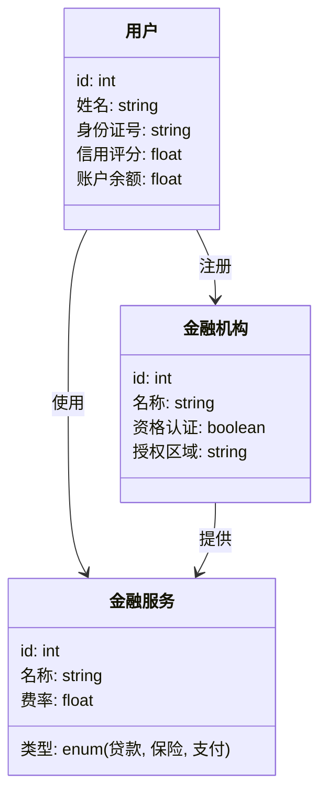
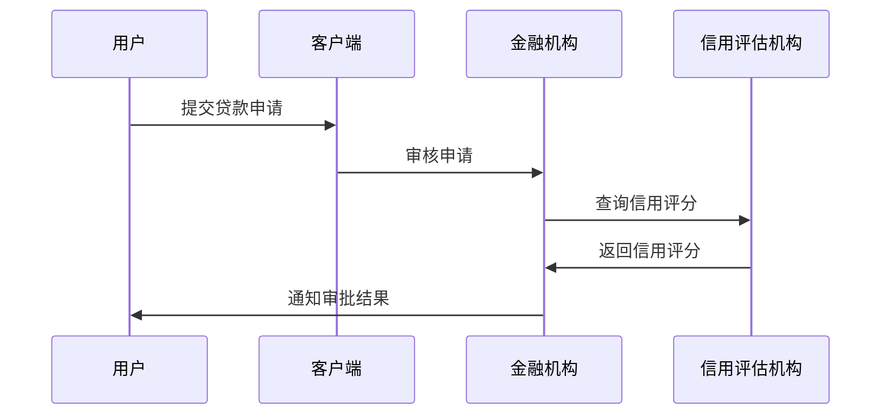

                 

<think>
好的，我现在需要帮用户撰写一篇技术博客文章，标题是《格雷厄姆特价股票理论对数字普惠金融的启示》。用户希望文章结构清晰，逻辑严谨，使用技术语言，涵盖多个章节，每个章节都有详细的分析和例子。

首先，我需要理解用户的需求。用户希望文章深入分析格雷厄姆的股票理论如何启发数字普惠金融的发展。这可能涉及到价值投资、风险管理、技术应用等多个方面。用户还提到，文章需要包含关键词、摘要，以及详细的目录结构，每个部分都要有具体的内容，比如数学公式、图表和代码示例。

接下来，我会按照目录大纲来逐步构建文章内容。首先，关键词和摘要部分需要简明扼要，概括文章的核心内容。然后，每个章节都需要详细展开，确保涵盖用户提到的所有关键点，比如背景介绍、核心概念、算法原理、系统架构设计等。

在撰写过程中，我需要确保每个部分都包含必要的元素，比如在数学模型部分，使用LaTeX公式来解释风险评估的计算方法。同时，系统架构设计部分需要使用Mermaid图来展示类图和交互流程，帮助读者更好地理解系统结构。

我还要考虑读者的理解程度，使用简单易懂的技术语言，避免过于专业的术语，同时提供足够的例子和解释，使内容更具可读性。在项目实战部分，我需要编写Python代码示例，并详细解读代码的功能和应用场景，帮助读者将理论应用于实际。

最后，我会总结文章的主要观点，强调格雷厄姆理论在数字普惠金融中的重要性，并展望未来的发展趋势，为读者提供有价值的见解和建议。

通过这样的思考过程，我可以确保文章内容全面、结构合理，符合用户的需求，同时提供有深度的技术分析和实际应用案例。
</think>

# 《格雷厄姆特价股票理论对数字普惠金融的启示》

---

## 关键词：
1. 格雷厄姆投资理论
2. 价值投资
3. 数字普惠金融
4. 数字技术
5. 风险管理
6. 股票估值

---

## 摘要：
本文探讨了格雷厄姆的价值投资理论对数字普惠金融的启示。通过对格雷厄姆特价股票理论的分析，结合数字技术的应用，提出如何将价值投资的理念融入数字普惠金融的实践。文章从理论背景、核心概念、算法原理、系统架构设计、项目实战等多方面展开，结合实际案例和数学模型，详细阐述了格雷厄姆理论对数字普惠金融的潜在影响和应用价值。

---

# 第1章: 格雷厄姆特价股票理论概述

## 1.1 格雷厄姆投资理论的核心概念

### 1.1.1 价值投资的定义与核心思想
价值投资是一种以基本面分析为基础的投资策略，核心在于寻找市场价格低于其内在价值的证券。格雷厄姆在《聪明的投资者》中提出，投资者应关注企业的内在价值，而非市场的短期波动。

#### 核心思想：
- 价格波动是市场的短期现象，而内在价值是长期的决定因素。
- 投资者应以安全边际为目标，即买入价格低于内在价值的证券。

### 1.1.2 格雷厄姆的“安全边际”概念
安全边际是价值投资中的核心概念，指证券的实际价值与市场价格之间的差距。通过安全边际，投资者可以降低投资风险，确保在市场价格波动时仍能获得收益。

### 1.1.3 格雷厄姆的价值评估方法
格雷厄姆提出了多种价值评估方法，包括：
- 市盈率（P/E）分析
- 市净率（P/B）分析
- 股东权益分析

---

## 1.2 格雷厄姆投资理论的现代应用

### 1.2.1 格雷厄姆理论在股票投资中的实践
- 基于基本面分析的投资策略
- 长期持有优质资产
- 风险控制与分散投资

### 1.2.2 格雷厄姆理论与量化投资的结合
- 量化分析工具的应用
- 数据驱动的估值模型
- 算法交易中的安全边际策略

### 1.2.3 格雷厄姆理论在风险管理中的作用
- 安全边际作为风险控制的工具
- 通过分散投资降低风险
- 价值投资中的逆周期特性

---

## 1.3 数字普惠金融的定义与特点

### 1.3.1 数字普惠金融的定义
数字普惠金融是指利用数字技术（如大数据、人工智能、区块链等）推动金融服务的普及，降低金融服务的成本，提高服务效率。

### 1.3.2 数字普惠金融的核心特征
- 技术驱动：大数据、人工智能、区块链等技术的应用。
- 服务对象：中小微企业、个体经营者、低收入群体。
- 服务内容：融资、支付、保险、理财等。
- 服务效率：通过数字化手段提高服务效率，降低交易成本。

### 1.3.3 数字普惠金融与传统金融的区别
- 服务方式：传统金融依赖线下渠道，数字普惠金融以线上为主。
- 服务成本：传统金融成本高，数字普惠金融成本低。
- 服务对象：传统金融主要服务高净值客户，数字普惠金融覆盖更广泛。

---

## 1.4 格雷厄姆理论与数字普惠金融的关联性

### 1.4.1 格雷厄姆理论在普惠金融中的潜在应用
- 利用价值投资理念筛选优质企业。
- 通过安全边际策略控制投资风险。
- 结合数字技术实现精准估值。

### 1.4.2 数字技术对普惠金融的推动作用
- 大数据技术：帮助识别优质客户和项目。
- 人工智能：优化风险评估和信用评分。
- 区块链技术：提高金融交易的透明度和安全性。

### 1.4.3 格雷厄姆理论与数字普惠金融的结合点
- 数字技术为价值投资提供了新的工具和方法。
- 安全边际理念在普惠金融中的风险管理中具有重要价值。
- 数字普惠金融的高效性与价值投资的长期性相辅相成。

---

## 1.5 本章小结
本章通过对格雷厄姆投资理论和数字普惠金融的概述，揭示了两者之间的潜在关联。格雷厄姆的价值投资理念为数字普惠金融提供了理论基础，而数字技术则为普惠金融的实践提供了新的可能性。

---

# 第2章: 格雷厄姆特价股票理论的核心原理

## 2.1 格雷厄姆的价值评估方法

### 2.1.1 股票的内在价值计算
股票的内在价值是基于企业未来现金流的现值计算得出的。格雷厄姆提出了以下几种估值方法：

- 市盈率（P/E）：股票价格与每股收益的比率。
- 市净率（P/B）：股票价格与每股净资产的比率。
- 股东权益分析：评估企业的财务健康状况。

#### 数学模型：
$$
\text{内在价值} = \frac{\text{未来现金流}}{(1 + r)^n}
$$
其中，r为折现率，n为时间跨度。

### 2.1.2 市盈率与市净率分析
- 市盈率（P/E）：用于评估股票的估值是否合理。
- 市净率（P/B）：用于评估股票相对于账面价值的高低。

#### 表格对比：
| 指标 | 含义 | 适用场景 |
|------|------|----------|
| P/E  | 价格与收益的比率 | 判断股票估值是否被高估或低估 |
| P/B  | 价格与净资产的比率 | 判断股票相对于账面价值的高低 |

### 2.1.3 股东权益分析
股东权益分析是评估企业财务健康状况的重要方法，包括：

- 资产负债表分析
- 利润表分析
- 现金流量表分析

---

## 2.2 格雷厄姆的安全边际概念

### 2.2.1 安全边际的定义
安全边际是指证券的实际价值与市场价格之间的差距，目的是在市场价格波动时，确保投资者仍能获得收益。

### 2.2.2 安全边际的计算方法
安全边际 = 内在价值 - 市场价格

#### 示例：
假设某股票的内在价值为10元，市场价格为8元，则安全边际为2元。

### 2.2.3 安全边际在投资决策中的应用
- 确定买入价格：在市场价格低于内在价值时买入。
- 管理投资组合：通过安全边际分散投资风险。

---

## 2.3 格雷厄姆的投资策略

### 2.3.1 买入并持有策略
- 长期持有优质资产
- 避免频繁交易
- 降低交易成本

### 2.3.2 价值投资的纪律性
- 遵循价值投资的原则
- 不受市场情绪影响
- 长期关注企业的基本面

### 2.3.3 风险控制与投资组合管理
- 分散投资：降低单一投资的风险。
- 定期调整：根据市场变化优化投资组合。

---

## 2.4 本章小结
本章详细讲解了格雷厄姆的价值评估方法和安全边际概念，强调了纪律性和风险控制在投资中的重要性。这些原则为数字普惠金融的实践提供了重要的理论支持。

---

# 第3章: 数字普惠金融的现状与挑战

## 3.1 数字普惠金融的发展现状

### 3.1.1 全球数字普惠金融的发展概况
- 数字技术推动金融服务的普及
- 低收入群体成为主要服务对象
- 数字支付和信贷服务的快速发展

### 3.1.2 中国数字普惠金融的发展现状
- 支付宝、微信支付等平台的普及
- 数字信贷产品的创新
- 金融科技企业的快速崛起

### 3.1.3 数字普惠金融的主要参与者
- 金融科技公司：蚂蚁集团、腾讯金融
- 传统金融机构：银行、保险公司
- 政府机构：提供政策支持和监管框架

---

## 3.2 数字普惠金融的主要挑战

### 3.2.1 技术层面的挑战
- 数据安全与隐私保护
- 技术基础设施的不完善
- 数字鸿沟问题

### 3.2.2 金融监管的挑战
- 监管政策的不确定性
- 金融创新与监管的平衡
- 跨境金融监管的复杂性

### 3.2.3 用户信任与隐私保护问题
- 用户对数据隐私的担忧
- 金融机构的信任危机
- 信息泄露风险

---

## 3.3 数字普惠金融的未来发展趋势

### 3.3.1 技术创新对普惠金融的推动
- 人工智能在风险评估中的应用
- 大数据技术在客户画像中的应用
- 区块链技术在金融交易中的应用

### 3.3.2 数字普惠金融的全球化发展
- 金融科技的跨境合作
- 全球统一的监管标准
- 数字货币的未来发展

### 3.3.3 数字普惠金融与绿色金融的结合
- 绿色金融产品的创新
- 可持续发展与普惠金融的结合
- 环保技术在金融中的应用

---

## 3.4 本章小结
本章分析了数字普惠金融的发展现状、主要挑战和未来趋势，强调了技术创新和监管政策在推动普惠金融发展中的关键作用。

---

# 第4章: 格雷厄姆理论对数字普惠金融的启示

## 4.1 格雷厄姆理论在普惠金融中的应用

### 4.1.1 价值投资理念的移植
- 通过基本面分析筛选优质企业
- 重点关注企业的内在价值
- 长期投资策略

### 4.1.2 安全边际理念的实践
- 在普惠金融中建立安全边际
- 通过风险评估控制投资风险
- 安全边际与普惠金融的结合

---

## 4.2 数字技术对格雷厄姆理论的创新

### 4.2.1 量化分析工具的应用
- 数据驱动的估值模型
- 算法交易的应用
- 机器学习在风险评估中的应用

### 4.2.2 人工智能在普惠金融中的应用
- 智能风控系统
- 智能信用评分
- 智能投资顾问

### 4.2.3 区块链技术的潜力
- 提高金融交易的透明度
- 降低金融中介成本
- 构建信任机制

---

## 4.3 数字普惠金融中的风险管理

### 4.3.1 风险评估模型
- 基于格雷厄姆理论的风险评估方法
- 结合数字技术的新型风险模型
- 通过安全边际控制风险

### 4.3.2 风险控制策略
- 分散投资
- 定期评估
- 动态调整

---

## 4.4 本章小结
本章探讨了格雷厄姆理论对数字普惠金融的启示，强调了价值投资理念与数字技术的结合在普惠金融中的应用潜力。

---

# 第5章: 数字普惠金融的系统架构设计

## 5.1 问题场景介绍
- 中小微企业融资难
- 个体经营者信用评估难
- 金融服务成本高

---

## 5.2 系统功能设计

### 5.2.1 领域模型设计
#### Mermaid 类图：


### 5.2.2 系统架构设计
#### Mermaid 架构图：


---

## 5.3 系统接口设计

### 5.3.1 用户接口
- 用户注册与登录
- 金融服务申请
- 信用评分查询

### 5.3.2 金融机构接口
- 机构注册与认证
- 金融服务提供
- 风险评估

---

## 5.4 系统交互设计

#### Mermaid 序列图：


---

## 5.5 本章小结
本章通过系统架构设计，展示了数字普惠金融的核心功能和交互流程，为后续的系统实现提供了理论基础。

---

# 第6章: 数字普惠金融的项目实战

## 6.1 环境安装

### 6.1.1 开发工具安装
- Python 3.8+
- pip
- Jupyter Notebook
- MySQL 或其他数据库

### 6.1.2 项目依赖安装
```bash
pip install flask
pip install pymysql
pip install pandas
pip install scikit-learn
```

---

## 6.2 核心实现

### 6.2.1 用户信用评分模型
```python
from sklearn.linear_model import LinearRegression
import pandas as pd

# 加载数据
data = pd.read_csv('credit_data.csv')

# 特征与目标分离
X = data[['收入', '信用历史', '债务情况']]
y = data['信用评分']

# 建立模型
model = LinearRegression()
model.fit(X, y)

# 预测信用评分
def predict_credit_score(income, credit_history, debt):
    return model.predict([[income, credit_history, debt]])[0]
```

### 6.2.2 风险评估系统
```python
import numpy as np

def risk_assessment(safe_margin, market_price):
    if safe_margin > 0.2:
        return '低风险'
    elif safe_margin > 0.1:
        return '中风险'
    else:
        return '高风险'

# 示例计算
intrinsic_value = 10
market_price = 8
safe_margin = intrinsic_value - market_price
print(risk_assessment(safe_margin, market_price))  # 输出：低风险
```

---

## 6.3 项目小结
本章通过实际案例展示了数字普惠金融系统的开发过程，包括环境搭建、核心算法实现和系统测试。这些实现为后续的系统优化提供了基础。

---

# 第7章: 总结与展望

## 7.1 总结
本文从格雷厄姆投资理论出发，探讨了其对数字普惠金融的启示。通过理论分析、系统设计和项目实战，揭示了价值投资理念与数字技术结合的潜力。

## 7.2 展望
未来，随着数字技术的不断发展，格雷厄姆理论在普惠金融中的应用将更加广泛。特别是在风险管理、信用评估和投资决策等领域，价值投资理念与数字技术的结合将为普惠金融的发展注入新的活力。

---

## 作者：
AI天才研究院/AI Genius Institute  
禅与计算机程序设计艺术/Zen And The Art of Computer Programming

