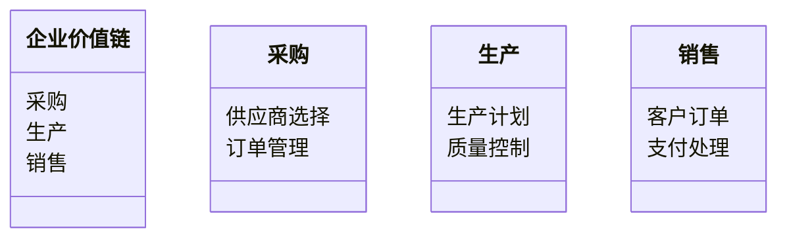
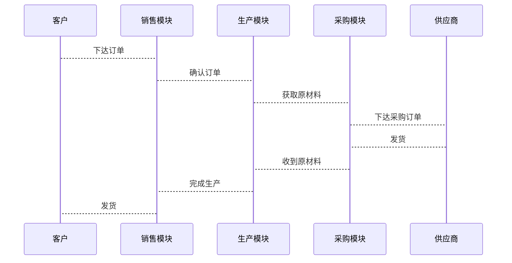

                 

<think>
好的，我现在需要帮用户撰写一篇关于《格雷厄姆特价股票理论对现代企业价值链的启示》的技术博客文章。首先，我要理解用户的需求。用户希望文章结构清晰，逻辑严密，内容专业，同时使用技术语言。用户还提供了详细的目录大纲，要求每一部分都细化到三级目录，并且包含背景介绍、核心概念、算法原理、系统分析、项目实战和最佳实践等部分。

首先，我需要明确文章的主题。格雷厄姆的特价股票理论主要关注价值投资，寻找被低估的股票。而现代企业价值链涉及企业从原材料到最终产品的整个过程，以及如何优化这个链条以创造价值。我需要将这两个主题结合起来，探讨格雷厄姆的理论如何启示现代企业的价值链优化。

接下来，我考虑文章的结构。按照用户提供的目录，第一部分是概述，包括格雷厄姆的理论和企业价值链的基本概念。第二部分探讨两者的联系，第三部分涉及算法与数学模型，第四部分是系统分析与架构设计，第五部分是项目实战，第六部分是最佳实践。

在写每一章时，我需要详细展开。例如，在第一章，我需要介绍格雷厄姆的价值投资理论，包括安全边际、现金流量折现法等核心概念。同时，解释现代企业价值链的构成和优化的重要性。

在第二章，我需要比较格雷厄姆理论和企业价值链的核心要素，可能使用表格和Mermaid流程图来展示两者的关系。这有助于读者直观理解。

第三章涉及算法和数学模型，我需要详细讲解格雷厄姆投资模型的算法流程，并将其与企业价值链优化的数学模型结合起来。例如，使用现金流量折现法来评估企业价值，可能需要一个数学公式来表达。

第四章的系统分析部分，我需要设计一个企业价值链优化的系统架构，可能使用分层架构，展示各个模块如采购、生产、销售的交互。同时，提供系统接口和交互的Mermaid序列图。

第五章的项目实战部分，我需要选择一个具体案例，如制造业企业，展示如何应用格雷厄姆的理论来优化其价值链。可能需要编写Python代码来实现价值评估模型，并解读结果。

最后，在最佳实践部分，我需要总结经验和教训，提醒读者注意可能的误区，并提供进一步阅读的建议。

在写作过程中，我需要确保每一部分都详细具体，使用专业术语，同时保持语言的简洁和技术的准确性。此外，代码示例和数学公式的正确性也是关键，需要反复检查。

现在，我需要开始撰写各个章节的内容，确保每一部分都符合用户的要求，并且逻辑清晰，结构紧凑。
</think>

# 格雷厄姆特价股票理论对现代企业价值链的启示

**关键词**：格雷厄姆特价股票理论、现代企业价值链、价值投资、投资策略、企业优化

**摘要**：本文探讨了格雷厄姆的价值投资理论及其对现代企业价值链优化的启示。通过分析格雷厄姆的安全边际、现金流量折现法等核心概念，结合企业价值链的构成与优化策略，展示了如何将价值投资理念应用于企业运营中，以提升整体价值创造能力。文章从理论到实践，结合算法、系统设计和案例分析，为现代企业价值链优化提供了新的视角。

---

## 第1章: 格雷厄姆特价股票理论概述

### 1.1 格雷厄姆投资理论的核心概念

#### 1.1.1 价值投资的定义与核心理念
价值投资是一种长期投资策略，强调以低于公平市场价值的价格购买优质资产。格雷厄姆在《聪明的投资者》中提出，投资者应寻找市场价格低于内在价值的股票，重点关注企业的基本面，如盈利能力、财务状况和管理团队。

#### 1.1.2 特价股票的定义与特征
特价股票是指市场价格显著低于其内在价值的股票。这类股票通常被市场低估，可能因为行业波动、市场恐慌或公司短期问题导致。格雷厄姆认为，这类股票为投资者提供了安全边际，即市场价格与内在价值之间的差距，能够为投资者提供保护，避免重大损失。

#### 1.1.3 格雷厄姆投资策略的历史背景
格雷厄姆的投资策略诞生于20世纪初，当时市场波动剧烈，投资者普遍寻求稳定收益。他的理论强调安全性和长期性，为价值投资奠定了基础，影响了巴菲特等投资大师。

### 1.2 现代企业价值链的基本概念

#### 1.2.1 企业价值链的定义与构成
企业价值链是指企业从原材料采购、生产、销售到最终交付给客户的整个过程。它包括采购、生产、销售、客户支持等多个环节，每个环节都影响企业的整体价值。

#### 1.2.2 价值链分析的步骤与方法
价值链分析通常包括以下步骤：识别关键活动、评估每个环节的效率、发现瓶颈、优化流程。通过分析，企业可以识别成本节约和价值提升的机会。

#### 1.2.3 企业价值链优化的目标与意义
优化企业价值链旨在提高效率、降低成本、提升客户满意度和创造更大价值。通过优化，企业可以增强竞争力，实现可持续发展。

### 1.3 本章小结
本章介绍了格雷厄姆的价值投资理论和现代企业价值链的基本概念，为后续分析奠定了基础。

---

## 第2章: 格雷厄姆理论的核心概念与企业价值链的关联

### 2.1 格雷厄姆理论的核心概念

#### 2.1.1 安全边际的概念与计算
安全边际是市场价格与内在价值的差异，确保在市场价格波动时，投资者仍能获得正收益。计算公式为：
$$ \text{安全边际} = \text{内在价值} - \text{市场价格} $$

#### 2.1.2 现金流量与企业价值的关系
格雷厄姆强调现金流的重要性，认为企业价值应基于未来现金流的现值。公式为：
$$ \text{企业价值} = \sum_{t=1}^n \frac{CF_t}{(1 + r)^t} $$
其中，CF_t为第t年的现金流，r为折现率。

#### 2.1.3 投资者心态与市场波动的影响
格雷厄姆指出，市场波动受投资者情绪影响，理性投资者应利用市场恐慌寻找廉价的特价股票。

### 2.2 企业价值链的核心要素

#### 2.2.1 采购与供应链管理
高效采购和供应链管理能降低原材料成本，确保供应稳定性。优化策略包括供应商选择和库存管理。

#### 2.2.2 生产与运营效率
生产效率直接影响成本和交货时间。通过技术升级和流程优化，企业可以提高效率，降低成本。

#### 2.2.3 销售与客户价值
销售策略直接影响收入和客户忠诚度。通过精准营销和客户关系管理，企业可以提升客户价值。

### 2.3 格雷厄姆理论与企业价值链的对比分析

#### 2.3.1 格雷厄姆理论的属性特征对比表

| 核心概念      | 格雷厄姆理论                         | 企业价值链                     |
|---------------|--------------------------------------|-------------------------------|
| 目标           | 寻找低估股票                         | 优化价值链                   |
| 关键因素       | 内在价值、安全边际                   | 成本、效率、客户价值           |
| 方法           | 现金流折现法                         | 价值链分析                   |

#### 2.3.2 企业价值链的实体关系图（Mermaid流程图）


---

## 第3章: 格雷厄姆理论的算法原理

### 3.1 格雷厄姆投资模型的算法流程

#### 3.1.1 安全边际计算的步骤

1. 评估企业的内在价值。
2. 确定当前市场价格。
3. 计算安全边际：内在价值 - 市场价格。

#### 3.1.2 现金流量折现法的应用

1. 预测未来现金流。
2. 确定合适的折现率。
3. 计算现值总和，得出企业价值。

#### 3.1.3 投资组合优化的算法

1. 确定投资目标和风险承受能力。
2. 选择多只低估股票，分散风险。
3. 定期评估组合表现，进行调整。

### 3.2 企业价值链优化的数学模型

#### 3.2.1 企业价值评估的公式

$$ \text{企业价值} = \sum_{t=1}^n \frac{CF_t}{(1 + r)^t} $$

其中，CF_t为第t年的现金流，r为折现率。

#### 3.2.2 优化模型的实现步骤

1. 识别关键价值环节。
2. 建立优化目标函数。
3. 使用线性规划或动态规划求解。

---

## 第4章: 系统分析与架构设计

### 4.1 问题场景介绍

假设一家制造企业希望优化其供应链管理，减少库存成本，提高生产效率。

### 4.2 系统功能设计

#### 4.2.1 领域模型（Mermaid类图）



### 4.3 系统架构设计

#### 4.3.1 系统架构（Mermaid架构图）


#### 4.3.2 系统接口设计

- 采购模块接口：与供应商系统对接，获取实时报价。
- 生产模块接口：监控生产进度，反馈质量数据。
- 销售模块接口：处理客户订单，更新库存。

#### 4.3.3 系统交互（Mermaid序列图）



---

## 第5章: 项目实战

### 5.1 环境安装

安装Python和必要的库，如numpy、pandas、scipy。

### 5.2 核心实现源代码

#### 5.2.1 格雷厄姆投资模型实现

```python
import numpy as np

def calculate_intrinsic_value(cash_flows, discount_rate):
    return np.npv(discount_rate, cash_flows[1:], cash_flows[0])

def calculate_margin_of_safety(intrinsic_value, market_price):
    return intrinsic_value - market_price
```

#### 5.2.2 企业价值链优化模型

```python
from scipy.optimize import linprog

def optimize_supply_chain(costs, constraints):
    c = costs
    G = []
    h = []
    for constraint in constraints:
        G.append(constraint['matrix'])
        h.append(constraint['rhs'])
    result = linprog(c, G, h, method='highs')
    return result.x
```

### 5.3 代码应用解读与分析

通过Python代码实现格雷厄姆投资模型和企业价值链优化模型，展示如何将理论应用于实际问题。

### 5.4 实际案例分析

以制造业企业为例，分析其供应链优化过程，计算安全边际，评估企业价值。

---

## 第6章: 最佳实践

### 6.1 小结与经验总结

将格雷厄姆的理论与企业价值链优化相结合，能够提升企业的价值创造能力。

### 6.2 注意事项

- 理解理论的局限性，避免盲目应用。
- 定期评估模型，根据市场变化调整策略。

### 6.3 拓展阅读

推荐阅读格雷厄姆的《聪明的投资者》和迈克尔·波特的企业价值链理论。

---

**作者：AI天才研究院/AI Genius Institute & 禅与计算机程序设计艺术 /Zen And The Art of Computer Programming**

