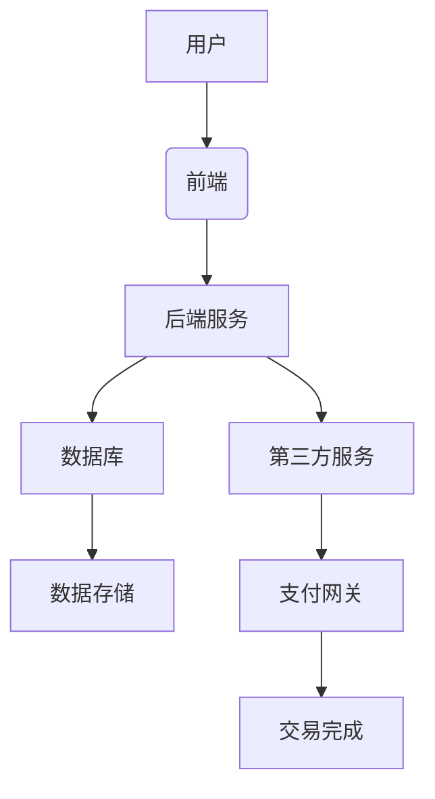

                 


# 《格雷厄姆特价股票理论对现代平台经济的启示》

---

## 关键词：格雷厄姆、特价股票理论、平台经济、投资策略、价值评估、系统架构、项目实战

---

## 摘要

本文从格雷厄姆的特价股票理论出发，探讨其对现代平台经济的启示。通过分析平台经济的定义、模式及核心要素，结合格雷厄姆的价值投资理念，提出在平台经济中应用价值评估和安全边际的策略。文章进一步通过数学模型和系统架构的设计，展示了如何将格雷厄姆理论应用于平台经济的投资实践，并通过具体案例分析验证了这一方法的有效性。最后，文章总结了平台经济投资中的最佳实践和未来展望。

---

## 第1章: 格雷厄姆特价股票理论的核心思想

### 1.1 格雷厄姆的生平与学术贡献

本杰明·格雷厄姆（Benjamin Graham）是20世纪著名的投资理论家，被誉为“价值投资之父”。他在1934年出版的《证券分析》（Security Analysis）一书中，提出了价值投资的核心理念，即以低于内在价值的价格购买股票，从而在长期获得超额收益。

- **核心贡献**：
  - 提出“安全边际”概念：买入价格低于内在价值，确保投资的安全性。
  - 强调基本面分析：通过分析企业的财务状况、盈利能力等指标，评估其内在价值。
  - 投资者心理行为研究：认为市场的非理性波动为价值投资者提供了机会。

### 1.2 格雷厄姆特价股票理论的分析框架

格雷厄姆的理论以内在价值为核心，强调在市场恐慌或低估时买入优质资产。

- **内在价值计算**：
  - 格雷厄姆提出的“清算价值”公式：
    $$ \text{清算价值} = \frac{\text{账面价值} \times (1 - \frac{\text{流动比率}}{2})}{\text{股东权益}} $$
  - 通过分析企业财务报表，计算市盈率、市净率等指标，评估股票是否被低估。

- **安全边际**：
  - 安全边际 = 内在价值 - 市场价格
  - 格雷厄姆建议安全边际至少为25%，以确保投资的安全性。

### 1.3 格雷厄姆理论在现代的应用

尽管格雷厄姆的理论诞生于20世纪，但其核心思想在现代金融市场中依然适用。

- **现代市场的挑战**：
  - 股票市场的波动性增加，非理性因素影响更大。
  - 信息透明度的提高，投资者行为更加理性化。
  - 全球化背景下，跨市场投资成为主流。

- **适应性调整**：
  - 结合现代金融工具，如ETF、指数基金，优化投资组合。
  - 利用大数据和AI技术，提升基本面分析的效率和准确性。

---

## 第2章: 平台经济的背景与现状

### 2.1 平台经济的定义与特点

平台经济是一种以数字技术为基础，通过平台连接供需双方的商业模式。

- **定义**：
  - 平台经济：通过互联网技术，搭建供需双方的桥梁，实现资源共享和价值共创。
  - 核心要素：平台、供给方、需求方、数据和技术。

- **特点**：
  - 两-sided market：平台同时服务供给方和需求方，实现双边网络效应。
  - 数据驱动：通过数据收集和分析，优化匹配效率。
  - 高扩展性：依托互联网技术，快速覆盖全球市场。

- **模式**：
  - 信息撮合型：如淘宝、滴滴，通过平台撮合交易。
  - 服务提供型：如美团、饿了么，提供在线服务预订。
  - 共享经济型：如Airbnb、共享办公空间，提供资源共享服务。

### 2.2 平台经济的兴起与发展

平台经济的兴起得益于互联网技术的普及和数字经济的发展。

- **技术驱动**：
  - 移动互联网的普及，使得平台经济得以快速扩展。
  - 大数据和AI技术的应用，提升了平台的匹配效率和服务质量。

- **全球发展现状**：
  - 美国：以亚马逊、谷歌为代表，引领全球平台经济发展。
  - 中国：以阿里巴巴、腾讯为代表，形成了独特的“中国特色平台经济”。
  - 欧洲：注重数据隐私和平台责任，发展相对保守。

- **中国平台经济的崛起**：
  - 阿里巴巴：以淘宝、支付宝为核心，构建了完整的生态体系。
  - 腾讯：以微信支付、腾讯云为基础，打造社交+支付+云服务的综合平台。
  - 拼多多：以低价商品和社交裂变模式，迅速崛起为电商领域的重要玩家。

### 2.3 平台经济的核心要素与参与者

平台经济的生态系统由多个参与者构成，各参与者之间通过数据和价值流紧密相连。

- **参与者分析**：
  - 供给方：提供产品或服务的企业或个人。
  - 需求方：消费者或企业用户。
  - 平台方：搭建并运营平台，收取佣金或服务费。
  - 第三方开发者：为平台提供插件、应用等扩展功能。

- **核心要素分析**：
  - 数据：平台经济的核心资源，通过数据驱动匹配和决策。
  - 技术：支撑平台运行的基础设施，包括云计算、AI、区块链等。
  - 信任：平台必须建立用户和参与者之间的信任机制，如评价体系、信用评分等。
  - 支付体系：平台经济的血液，确保交易的顺利进行。

---

## 第3章: 格雷厄姆理论对平台经济的启示

### 3.1 平台经济中的价值评估问题

在平台经济中，价值评估是一个复杂的系统工程。

- **传统价值评估的局限性**：
  - 格雷厄姆的内在价值模型主要适用于单个企业，而平台经济涉及多方参与者。
  - 平台的网络效应和数据资源难以量化。

- **平台经济的价值驱动因素**：
  - 用户数量：平台的用户规模直接影响其市场价值。
  - 用户活跃度：用户活跃度越高，平台的收入潜力越大。
  - 数据资源：数据的深度和广度决定了平台的核心竞争力。
  - 网络效应：平台的双边网络效应使其具有更强的市场定价权。

### 3.2 平台经济中的价值投资策略

基于格雷厄姆的理论，我们可以提出以下价值投资策略：

- **安全边际的应用**：
  - 在平台经济中，安全边际可以通过用户增长率、市场份额、利润率等多个指标综合评估。
  - 例如，选择那些用户增长持续性高、市场份额领先、利润率稳定的平台企业进行投资。

- **长期视角**：
  - 平台经济具有较高的进入壁垒和网络效应，具备长期投资价值。
  - 投资者应关注平台企业的长期增长潜力，而非短期市场波动。

- **分散投资**：
  - 通过分散投资降低风险，避免过度集中于单一平台。
  - 结合平台经济的不同模式（如信息撮合型、服务提供型）进行多元化配置。

### 3.3 平台经济中的非理性定价现象

平台经济中的非理性定价现象与传统股市类似，但表现形式有所不同。

- **平台企业 IPO 的非理性定价**：
  - 近年来，许多平台企业选择赴海外上市，如滴滴、拼多多等。
  - IPO定价往往受到市场情绪影响，出现高溢价或低估的情况。

- **投资者心理行为对平台经济的影响**：
  - 平台经济的高增长性和不确定性导致投资者情绪波动较大。
  - 非理性定价为价值投资者提供了机会，尤其是在市场恐慌时买入优质平台股票。

---

## 第4章: 平台经济中的价值评估模型设计

### 4.1 价值评估模型的设计思路

结合格雷厄姆的内在价值理论，我们设计了一个适用于平台经济的价值评估模型。

- **模型假设**：
  - 平台经济的价值由用户数量、活跃度、数据资源和网络效应决定。
  - 通过历史数据和市场趋势预测未来收益。

- **模型框架**：
  - 用户增长潜力：包括用户数量增长率、活跃度等指标。
  - 营收能力：包括客单价、用户转化率等。
  - 数据资源价值：包括数据的深度和广度。
  - 竞争优势：包括市场占有率、品牌影响力等。

- **模型公式**：
  $$ \text{平台价值} = \text{用户数量} \times \text{活跃度} \times \text{客单价} \times \text{净利润率} $$

### 4.2 案例分析：以某平台为例

以某电商平台为例，分析其价值评估过程。

- **数据收集**：
  - 用户数量：1亿
  - 活跃度：日活跃用户数为2000万
  - 客单价：100元
  - 净利润率：5%

- **计算平台价值**：
  $$ \text{平台价值} = 1 \times 10^{-8} \times 2 \times 10^{7} \times 100 \times 0.05 = 100 \times 100 \times 0.05 = 5000 \text{亿元} $$

- **结论**：
  - 该平台的价值为5000亿元，若当前市值低于这一估值，则具有投资价值。

---

## 第5章: 平台经济中的系统分析与架构设计

### 5.1 系统分析

平台经济的系统分析需要从技术、业务、数据等多个维度展开。

- **技术架构**：
  - 前端：React或Vue.js框架，实现良好的用户体验。
  - 后端：Spring Boot或Django框架，提供RESTful API服务。
  - 数据库：MySQL或MongoDB，存储用户数据、交易数据等。
  - 云计算：使用阿里云或AWS，提供弹性计算资源。

- **业务流程**：
  - 用户注册与登录
  - 信息发布与匹配
  - 交易支付与确认
  - 评价与反馈

- **数据流分析**：
  - 用户行为数据：记录用户的浏览、点击、购买行为。
  - 交易数据：记录每笔交易的金额、时间、参与方。
  - 评价数据：收集用户的评价内容和评分。

### 5.2 系统架构设计

基于平台经济的特点，设计了一个典型的系统架构。



- **系统架构图**：
  - 用户通过前端与平台交互。
  - 后端服务负责处理业务逻辑。
  - 数据库存储核心数据。
  - 第三方服务包括支付、物流等。

- **接口设计**：
  - 用户接口：RESTful API，如`/api/users/login`。
  - 支付接口：与支付宝、微信支付等对接。
  - 数据接口：与数据分析平台对接，提供实时数据。

---

## 第6章: 平台经济中的项目实战

### 6.1 环境安装

搭建一个简单的平台经济系统，需要以下环境：

- **开发环境**：
  - 操作系统：Linux或MacOS
  - 开发工具：IntelliJ IDEA或PyCharm
  - 语言：Python或Java

- **依赖安装**：
  - Python：使用pip安装Django或Flask框架。
  - 数据库：安装MySQL或MongoDB。
  - 其他工具：安装Git、virtualenv等。

### 6.2 核心代码实现

以下是一个简单的平台经济系统的核心代码示例。

```python
# 简单的平台经济系统实现

from flask import Flask, request, jsonify
from flask_sqlalchemy import SQLAlchemy
from datetime import datetime

app = Flask(__name__)
app.config['SQLALCHEMY_DATABASE_URI'] = 'sqlite:///platform.db'
db = SQLAlchemy(app)

# 定义用户模型
class User(db.Model):
    id = db.Column(db.Integer, primary_key=True)
    username = db.Column(db.String(80), unique=True, nullable=False)
    email = db.Column(db.String(120), unique=True, nullable=False)
    created_at = db.Column(db.DateTime, default=datetime.utcnow)

# 定义交易模型
class Transaction(db.Model):
    id = db.Column(db.Integer, primary_key=True)
    buyer_id = db.Column(db.Integer, db.ForeignKey('user.id'), nullable=False)
    seller_id = db.Column(db.Integer, db.ForeignKey('user.id'), nullable=False)
    amount = db.Column(db.Float, nullable=False)
    timestamp = db.Column(db.DateTime, default=datetime.utcnow)

# 用户注册接口
@app.route('/api/users/register', methods=['POST'])
def register():
    data = request.json
    new_user = User(username=data['username'], email=data['email'])
    db.session.add(new_user)
    db.session.commit()
    return jsonify({'message': 'User created successfully'})

# 交易接口
@app.route('/api/transactions/create', methods=['POST'])
def create_transaction():
    data = request.json
    buyer = User.query.filter_by(username=data['buyer']).first()
    seller = User.query.filter_by(username=data['seller']).first()
    if not buyer or not seller:
        return jsonify({'message': 'User not found'}), 404
    new_transaction = Transaction(
        buyer_id=buyer.id,
        seller_id=seller.id,
        amount=data['amount']
    )
    db.session.add(new_transaction)
    db.session.commit()
    return jsonify({'message': 'Transaction created successfully'})

if __name__ == '__main__':
    app.run(debug=True)
```

### 6.3 案例分析与解读

以某共享经济平台为例，分析其系统设计和实现。

- **系统设计**：
  - 用户注册与登录
  - 资源发布与匹配
  - 交易支付与确认
  - 评价与反馈

- **代码实现**：
  - 使用Flask框架搭建前端和后端。
  - 使用MySQL存储用户和交易数据。
  - 通过RESTful API实现业务逻辑。

- **案例总结**：
  - 通过代码实现，展示了平台经济系统的核心功能。
  - 强调了系统架构设计的重要性，确保系统的扩展性和安全性。

---

## 第7章: 结语

### 7.1 平台经济投资中的最佳实践

- **长期视角**：关注平台的长期增长潜力，而非短期波动。
- **安全边际**：在投资前，确保有足够的安全边际。
- **分散投资**：避免过度集中，降低风险。
- **持续学习**：关注行业动态，不断提升自身的知识储备。

### 7.2 未来展望

- **技术驱动**：随着大数据和AI技术的发展，平台经济将更加智能化和个性化。
- **全球化**：平台经济的全球化趋势将加速，跨国平台将成为主流。
- **监管趋严**：数据隐私和平台责任将成为监管重点，平台经济将面临更大的合规压力。

### 7.3 注意事项

- **数据安全**：平台经济的核心是数据，必须重视数据安全和隐私保护。
- **用户信任**：平台的信用体系是用户信任的基础，必须不断完善和优化。
- **合规性**：随着监管的加强，平台经济必须合规经营，避免法律风险。

---

## 作者：AI天才研究院 & 禅与计算机程序设计艺术

---

以上为《格雷厄姆特价股票理论对现代平台经济的启示》的完整目录大纲和部分正文内容，按照逻辑一步步展开，详细分析了格雷厄姆理论对平台经济的启示，并结合系统架构和项目实战，展示了理论的实际应用。

