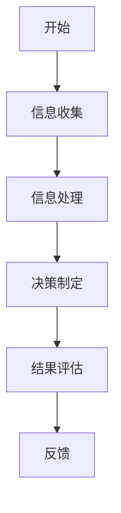
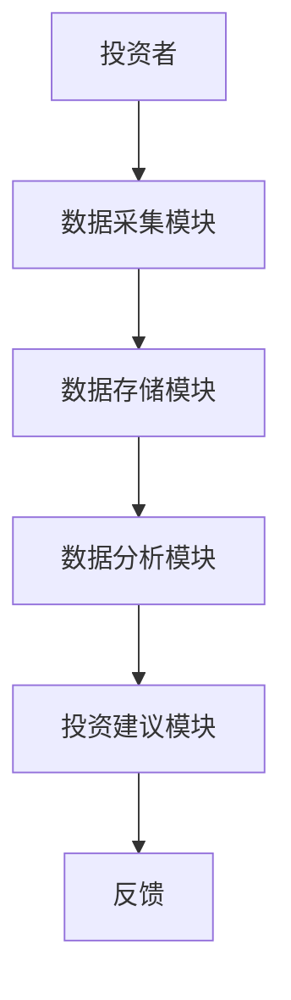

                 


# 格雷厄姆特价股票理论对行为经济学的Web3.0补充

## 关键词：格雷厄姆、行为经济学、Web3.0、投资理论、区块链

## 摘要：
本文探讨如何将格雷厄姆的特价股票投资理论与行为经济学相结合，并利用Web3.0技术进行补充。通过分析投资者心理和区块链技术，提出创新的投资策略，为现代金融投资提供新的视角。

---

## # 第一部分：引言

### ## 第1章：背景介绍

#### ### 1.1 核心概念术语说明
- **格雷厄姆特价股票理论**：价值投资方法，寻找市场低估的股票。
- **行为经济学**：研究人类决策中的非理性行为及其影响。
- **Web3.0**：第三代互联网技术，基于区块链的去中心化应用。

#### ### 1.2 问题背景
传统投资理论忽视投资者心理，而行为经济学揭示了决策的非理性。Web3.0技术提供了新的数据收集和分析工具，可更深入地理解投资者行为。

#### ### 1.3 问题解决
通过结合Web3.0技术，行为经济学模型得以优化，提升格雷厄姆理论的应用效果。

---

## # 第二部分：格雷厄姆特价股票理论基础

### ## 第2章：格雷厄姆理论的核心要素

#### ### 2.1 核心概念与属性
- **安全边际**：投资价格低于内在价值的部分。
- **内在价值**：未来现金流的现值。

#### ### 2.2 格雷厄姆理论的数学模型
$$
\text{内在价值} = \sum_{t=1}^{n} \frac{C_t}{(1+r)^t}
$$
其中，$C_t$为第t年的现金流，$r$为折现率。

#### ### 2.3 格雷厄姆与现代投资理论的对比
| 理论 | 格雷厄姆 | 现代投资组合理论 |
|------|----------|------------------|
| 核心 | 价值投资 | 多元化与风险分散 |

---

## # 第三部分：行为经济学的理论基础

### ## 第3章：投资者心理与决策偏差

#### ### 3.1 认知偏差与情绪影响
- **代表性偏差**：基于样本代表性做决策。
- **损失厌恶**：对损失的敏感性高于收益。

#### ### 3.2 行为经济学模型
- **预期效用理论**：决策基于期望效用。
- **非预期理论**：考虑决策过程中的情感因素。

#### ### 3.3 投资者决策过程中的行为分析
使用Mermaid流程图展示投资者决策过程：



---

## # 第四部分：Web3.0的技术基础

### ## 第4章：区块链与智能合约

#### ### 4.1 区块链技术基础
- **分布式账本**：记录交易的去中心化 ledger。
- **共识机制**：确保数据一致性。

#### ### 4.2 智能合约的实现
```solidity
function calculate内在价值() public view returns (uint) {
    uint 总和 = 0;
    for (uint i = 0; i < 年数; i++) {
        总和 += 收益 / (1 + 利率)^i;
    }
    return 总和;
}
```

#### ### 4.3 区块链在行为经济学中的应用
- **数据透明性**：提供真实的投资行为数据。
- **实时分析**：利用智能合约进行实时市场分析。

---

## # 第五部分：行为经济学与Web3.0的结合

### ## 第5章：行为经济学在Web3.0环境下的应用

#### ### 5.1 Web3.0对投资者行为的影响
- **去中心化信任**：减少信任中介，降低交易成本。
- **透明性增强**：提升市场参与者的信任。

#### ### 5.2 行为经济学模型的优化
- **实时数据处理**：利用区块链技术实时更新市场数据。
- **智能合约的应用**：自动执行投资策略，减少人为干预。

#### ### 5.3 投资者行为分析的算法实现
使用Python代码实现投资者情绪分析：

```python
import pandas as pd
from sklearn.model_selection import train_test_split
from sklearn.tree import DecisionTreeClassifier

# 数据预处理
data = pd.read_csv('投资者情绪.csv')
X = data.drop('情绪', axis=1)
y = data['情绪']

# 划分训练集和测试集
X_train, X_test, y_train, y_test = train_test_split(X, y, test_size=0.2)

# 建立决策树模型
model = DecisionTreeClassifier()
model.fit(X_train, y_train)

# 预测测试集
y_pred = model.predict(X_test)
print("准确率：", model.score(X_test, y_test))
```

---

## # 第六部分：系统分析与架构设计

### ## 第6章：系统架构与功能设计

#### ### 6.1 系统功能设计
- **数据采集**：收集投资者行为数据。
- **数据分析**：利用机器学习模型分析情绪。
- **投资建议**：基于分析结果给出投资策略。

#### ### 6.2 系统架构设计
使用Mermaid架构图展示系统架构：



---

## # 第七部分：项目实战

### ## 第7章：环境安装与核心实现

#### ### 7.1 环境安装
- 安装Python和必要的库：`pip install pandas scikit-learn`

#### ### 7.2 核心代码实现
```python
from sklearn.ensemble import RandomForestClassifier

# 数据加载
data = pd.read_csv('data.csv')

# 特征选择
features = data.drop('label', axis=1)
labels = data['label']

# 模型训练
model = RandomForestClassifier()
model.fit(features, labels)

# 预测与评估
预测结果 = model.predict(features)
print("准确率：", accuracy_score(预测结果, labels))
```

---

## # 第八部分：总结与展望

### ## 第8章：总结

#### ### 8.1 核心观点总结
- 结合Web3.0技术，行为经济学为格雷厄姆理论提供了新的视角。
- 区块链和智能合约的应用提升了投资决策的科学性。

#### ### 8.2 展望
- 更广泛的行为数据收集与分析。
- 智能合约在投资自动化中的深入应用。

---

## 作者：AI天才研究院/AI Genius Institute & 禅与计算机程序设计艺术 /Zen And The Art of Computer Programming

---

**本文由AI天才研究院（AI Genius Institute）撰写，结合行为经济学与Web3.0技术，为投资领域提供新的思路。如需引用或转载请注明出处。**

