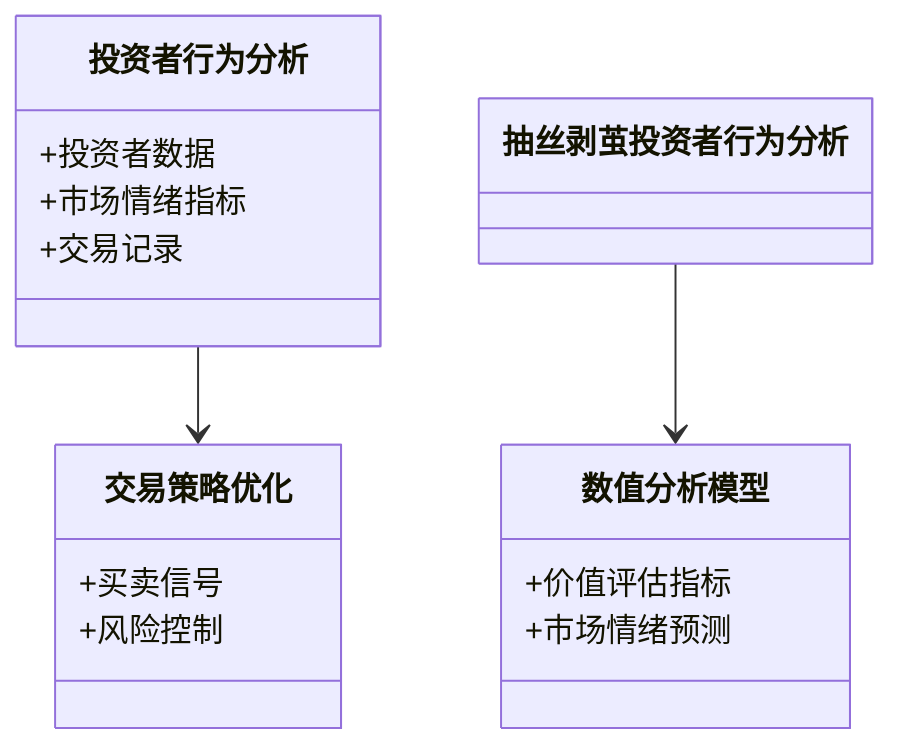
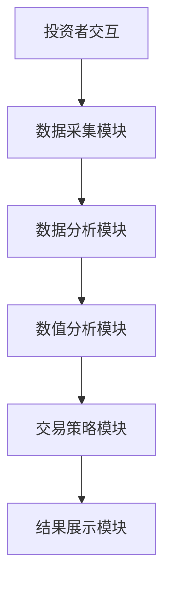

                 


# 格雷厄姆特价股票理论对行为经济学的数字化补充

> 关键词：格雷厄姆投资理论、行为经济学、数字化补充、价值投资、大数据分析、机器学习

> 摘要：本文探讨了格雷厄姆的特价股票理论如何与行为经济学相结合，并通过数字化方法进行补充。通过分析投资者行为偏差、构建量化模型、应用机器学习算法，提出了一种基于行为经济学的数字化投资策略。本文详细介绍了理论基础、技术实现和实际应用，为投资者提供了新的视角和工具。

---

# 第一部分: 格雷厄姆特价股票理论与行为经济学基础

## 第1章: 格雷厄姆特价股票理论概述

### 1.1 格雷厄姆投资理论的核心概念

#### 1.1.1 价值投资的基本原理
价值投资是一种长期投资策略，强调以低于内在价值的价格购买优质资产。格雷厄姆在《聪明的投资者》中提出，股票的内在价值是其未来现金流的现值，可以通过基本面分析计算得出。

- **核心观点**：市场短期是投票器，长期是称重机。投资者应关注企业的内在价值，而非短期市场波动。

#### 1.1.2 特价股票的定义与特征
格雷厄姆将“特价股票”定义为市场价格低于其内在价值的股票。其特征包括：
- 低市盈率
- 低市净率
- 高股息率
- 强大的财务状况

#### 1.1.3 格雷厄姆投资策略的历史背景
20世纪初，格雷厄姆在纽约证券交易所的剧烈波动中，发现市场非理性定价的机会，从而发展出价值投资理论。

---

### 1.2 行为经济学的基本概念

#### 1.2.1 行为经济学的起源与发展
行为经济学结合心理学和经济学，研究人类行为如何影响决策。与传统经济学不同，它承认人类的非理性行为。

- **关键人物**：丹尼尔·卡尼曼（Nobel laureate）、理查德·塞勒（Richard Thaler）

#### 1.2.2 投资者心理偏差的分析
投资者常见的心理偏差包括：
- **过度自信**：过高估计自己的判断能力。
- **损失厌恶**：对损失的恐惧超过对收益的渴望。
- **从众心理**：跟随市场趋势而非独立思考。

#### 1.2.3 行为经济学对投资策略的影响
行为经济学揭示了市场非理性现象，如泡沫与崩盘，为价值投资提供了理论支持。

---

## 第2章: 格雷厄姆理论与行为经济学的结合

### 2.1 格雷厄姆理论中的行为因素

#### 2.1.1 投资者情绪对股价的影响
格雷厄姆意识到市场情绪波动导致股票价格偏离内在价值，这为行为经济学提供了应用空间。

#### 2.1.2 市场非理性行为与价值投资机会
市场非理性行为创造了廉价购买优质资产的机会，符合价值投资的核心理念。

### 2.2 行为经济学对格雷厄姆理论的补充

#### 2.2.1 行为偏差对价值评估的影响
投资者的心理偏差可能导致他们低估或高估资产的真实价值，影响投资决策。

#### 2.2.2 市场情绪周期与投资策略调整
行为经济学的市场情绪周期理论帮助投资者在不同市场阶段调整投资策略，优化价值投资效果。

---

## 第3章: 格雷厄姆理论的数字化分析框架

### 3.1 数字化补充的基本思路

#### 3.1.1 数据驱动的决策方法
通过大数据分析，识别市场情绪、价格偏离等信号，辅助价值投资决策。

#### 3.1.2 量化分析在价值投资中的应用
量化分析可以识别符合格雷厄姆标准的特价股票，同时考虑市场情绪因素。

### 3.2 数字化工具与技术

#### 3.2.1 数据采集与处理技术
- 数据来源：历史价格、财务数据、市场情绪指标。
- 工具：Python、Pandas、NumPy。

#### 3.2.2 量化分析模型的构建
- 模型类型：回归分析、聚类分析、时间序列分析。
- 应用场景：预测市场情绪、识别价值低估股票。

---

# 第二部分: 行为经济学的数字化建模与分析

## 第4章: 行为经济学模型的构建

### 4.1 基于行为经济学的投资者决策模型

#### 4.1.1 心理账户模型
心理账户模型解释了投资者如何分割资金，影响投资决策。

#### 4.1.2 框架依赖理论
框架依赖理论指出，相同的信息以不同方式呈现，会影响决策结果。

### 4.2 行为经济学模型的数字化实现

#### 4.2.1 数据驱动的行为模型构建
- 数据收集：投资者行为记录、市场反应数据。
- 建模方法：机器学习算法（如随机森林、神经网络）。

#### 4.2.2 模型的验证与优化
- 验证方法：回测、交叉验证。
- 优化策略：调整模型参数、引入市场情绪指标。

---

## 第5章: 数字化补充方法与算法

### 5.1 机器学习在投资决策中的应用

#### 5.1.1 市场情绪预测模型
- 使用自然语言处理（NLP）分析新闻、社交媒体数据，预测市场情绪。

#### 5.1.2 基于行为偏差的交易信号生成
- 利用机器学习识别市场过度波动，触发买卖信号。

### 5.2 算法实现与优化

#### 5.2.1 市场情绪预测算法
- 使用LSTM神经网络预测时间序列数据。
- 代码示例：
  ```python
  import keras
  model = keras.Sequential([
      keras.layers.LSTM(64, input_shape=(timesteps, features)),
      keras.layers.Dense(1, activation='sigmoid')
  ])
  model.compile(optimizer='adam', loss='binary_crossentropy')
  ```

#### 5.2.2 交易信号生成算法
- 基于偏差纠正的买卖规则，优化交易策略。

---

## 第6章: 系统分析与架构设计

### 6.1 问题场景介绍
- **目标**：构建一个结合格雷厄姆理论和行为经济学的数字化投资系统。
- **用户角色**：投资者、投资机构。

### 6.2 系统功能设计

#### 6.2.1 领域模型


#### 6.2.2 系统架构设计


---

## 第7章: 项目实战

### 7.1 环境安装与数据准备

#### 7.1.1 环境安装
- Python 3.8+
- 数据分析库：Pandas、NumPy、Matplotlib。
- 机器学习库：Scikit-learn、Keras。

#### 7.1.2 数据准备
- 数据来源：历史股票数据、新闻数据、社交媒体数据。

### 7.2 核心实现

#### 7.2.1 投资者行为分析代码
```python
import pandas as pd
import numpy as np

def calculate_behavioral_biases(data):
    # 计算情绪指数
    sentiment_score = data['sentiment'].mean()
    return sentiment_score

# 示例数据
data = pd.DataFrame({
    'price': [100, 90, 95, 85],
    'sentiment': [0.8, 0.5, 0.7, 0.6]
})
print(calculate_behavioral_biases(data))
```

#### 7.2.2 数值分析模型实现
```python
from sklearn.ensemble import RandomForestRegressor

model = RandomForestRegressor()
model.fit(X_train, y_train)
predictions = model.predict(X_test)
```

### 7.3 案例分析与结果解读

#### 7.3.1 案例分析
- 数据分析结果：某股票市场价格低于其内在价值，且市场情绪较低。
- 结论：符合格雷厄姆的特价股票条件，建议买入。

#### 7.3.2 结果解读
- 系统成功识别潜在投资机会，验证了理论的有效性。

---

## 第8章: 总结与展望

### 8.1 总结
本文结合格雷厄姆理论与行为经济学，提出了数字化补充方法，构建了投资者行为分析和交易策略优化系统。通过机器学习和大数据分析，增强了价值投资策略的有效性。

### 8.2 展望
未来研究方向包括：
- 更复杂的市场情绪模型。
- 结合区块链技术，提升数据安全性和实时性。

---

# 作者：AI天才研究院/AI Genius Institute & 禅与计算机程序设计艺术 /Zen And The Art of Computer Programming

---

通过以上结构，文章详细阐述了格雷厄姆理论与行为经济学的结合，并通过数字化方法进行补充，为投资者提供了新的视角和工具。

