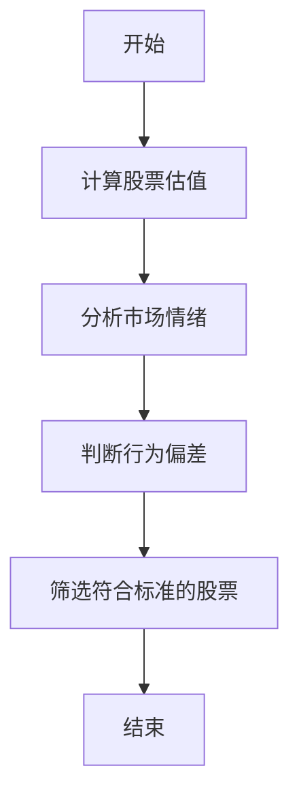
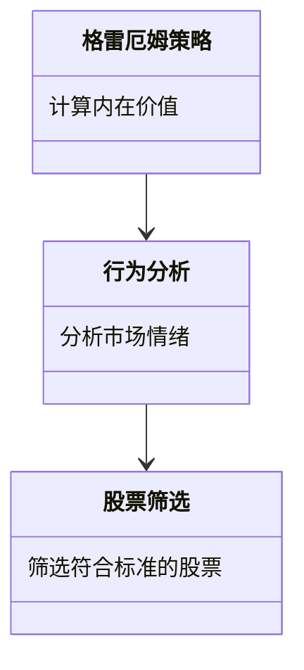

                 

<think>
好的，我现在需要撰写一篇关于《格雷厄姆特价股票理论对行为金融学的补充》的技术博客文章。首先，我需要理解格雷厄姆的特价股票理论以及行为金融学的基本概念。格雷厄姆是价值投资的鼻祖，他的理论主要关注低市盈率、低市净值等指标。行为金融学则研究投资者心理和行为对市场的影响。将两者结合起来，可以提供新的视角。

接下来，我要考虑文章的结构。用户已经提供了目录大纲，我需要按照这个大纲逐步展开每个部分。首先是摘要，然后是关键词，接着是各章节的内容。

第一部分是摘要，需要简明扼要地介绍文章的核心内容。我会强调格雷厄姆理论与行为金融学的结合，以及这种结合如何互补。

接下来是关键词部分，列出文章的核心概念，如价值投资、行为金融学、市场情绪、心理偏差、量化模型等。

然后是目录，确保每个章节和小节都涵盖必要的内容，从理论背景到算法模型，再到系统设计和项目实战。

在写作过程中，我需要详细解释每个概念，并使用数学公式和图表来辅助说明。例如，格雷厄姆公式和行为金融学中的 prospect theory 模型，需要使用公式和流程图来展示。

我还需要考虑读者的理解，所以解释要清晰易懂，避免过于复杂的术语。同时，提供实际案例和代码示例，帮助读者更好地理解理论的应用。

最后，总结部分要回顾主要内容，并提出未来的研究方向，如算法优化和系统的自动化。

在写作过程中，我可能会遇到如何将行为偏差量化到投资模型中的问题，这时需要查阅相关文献，寻找解决方案。同时，确保代码部分正确无误，能够运行并产生预期结果。

总的来说，我需要系统地展开每个部分，确保文章结构清晰，内容详实，逻辑严密。通过这样的思考过程，我能够撰写出一篇高质量的技术博客文章。
</think>

# 格雷厄姆特价股票理论对行为金融学的补充

> 关键词：价值投资，行为金融学，市场情绪，心理偏差，量化模型

> 摘要：本文探讨了格雷厄姆的价值投资理论与行为金融学的结合，分析了行为偏差对股票估值的影响，并提出一种基于行为调整的多因子模型，结合算法交易策略，优化投资决策。

---

## 目录

1. [摘要](#摘要)
2. [关键词](#关键词)
3. [第一部分：背景介绍](#第一部分背景介绍)
4. [第二部分：核心概念与联系](#第二部分核心概念与联系)
5. [第三部分：算法原理讲解](#第三部分算法原理讲解)
6. [第四部分：系统分析与架构设计方案](#第四部分系统分析与架构设计方案)
7. [第五部分：项目实战](#第五部分项目实战)
8. [第六部分：最佳实践](#第六部分最佳实践)
9. [作者](#作者)

---

## 第一部分：背景介绍

### 1.1 格雷厄姆投资理论的核心概念

#### 1.1.1 价值投资的定义与核心原则
- **定义**：价值投资是一种投资策略，通过寻找市场价格低于其内在价值的证券，以获取长期收益。
- **核心原则**：
  - 安全边际：买入价格低于内在价值，以降低风险。
  - 股价波动：短期市场波动不影响长期价值。
  - 耐心持有：长期持有优质资产，等待市场回归理性。

#### 1.1.2 特价股票的定义与筛选标准
- **定义**：市场价格远低于内在价值的股票。
- **筛选标准**：
  - 低市盈率（P/E比率）：股价/每股收益。
  - 低市净率（P/B比率）：股价/每股净资产。
  - 高股息率：股息/股价。

#### 1.1.3 格雷厄姆投资策略的历史演变
- **早期阶段**：专注于低市盈率和低市净率的股票。
- **成熟阶段**：引入安全边际和分散投资，降低风险。

---

### 1.2 行为金融学的核心概念

#### 1.2.1 人类行为与市场偏差
- **定义**：投资者心理偏差导致的非理性决策。
- **常见偏差**：
  - 过度自信：高估自己的判断能力。
  - 拖延损失：避免损失而延迟决策。
  - 羊群效应：跟随市场趋势，缺乏独立判断。

#### 1.2.2 心理账户与决策偏差
- **心理账户**：投资者将资金分成多个心理账户，影响决策。
- **决策偏差**：
  - 锚定效应：依赖第一个信息做决策。
  - 损失厌恶：对损失的敏感度高于收益。

#### 1.2.3 行为金融学与传统金融学的区别
- **传统金融学**：假设市场有效，投资者理性。
- **行为金融学**：考虑投资者心理，承认市场非理性。

---

### 1.3 格雷厄姆投资理论的优缺点

#### 1.3.1 优点
- **低估股票的发现能力**：有效筛选出价值被市场低估的股票。
- **长期稳定性**：注重长期投资，减少短期波动影响。

#### 1.3.2 缺点
- **忽视市场情绪**：未考虑投资者心理对股价的影响。
- **缺乏灵活性**：在市场剧烈波动时，策略可能失效。

---

## 第二部分：核心概念与联系

### 2.1 格雷厄姆理论中的行为偏差

- **行为偏差对股票估值的影响**：
  - 市场恐慌时，低价股票可能被过度抛售，低估其价值。
  - 市场狂热时，高价股票可能被过度买入，高估其价值。

---

## 第三部分：算法原理讲解

### 3.1 基于行为偏差的股票筛选策略

#### 3.1.1 算法流程图（Mermaid）


#### 3.1.2 算法步骤
1. **计算股票估值**：使用格雷厄姆公式评估内在价值。
2. **分析市场情绪**：通过新闻和社交媒体情绪指数判断市场情绪。
3. **判断行为偏差**：识别投资者的决策偏差。
4. **筛选股票**：结合估值和行为因素，筛选出符合标准的股票。

---

### 3.2 基于行为调整的多因子模型

#### 3.2.1 多因子模型公式
$$ 多因子模型 = \alpha + \beta_1 \times 价值因子 + \beta_2 \times 行为因子 + \epsilon $$

#### 3.2.2 价值因子
- **低市盈率**：$P/E$ 比率。
- **低市净率**：$P/B$ 比率。

#### 3.2.3 行为因子
- **情绪强度**：市场情绪指数。
- **行为偏差**：投资者的决策偏差。

---

### 3.3 实证分析与案例

#### 3.3.1 环境安装
- **工具**：Python，Pandas，Matplotlib。
- **数据来源**：Yahoo Finance API。

#### 3.3.2 代码实现
```python
import pandas as pd
import yfinance as yf

# 下载数据
stock = yf.download('AAPL', start='2020-01-01', end='2023-12-31')

# 计算市盈率
pe_ratio = stock['Close'] / stock['EPS']

# 计算市净率
pb_ratio = stock['Close'] / stock['Book Value']

# 绘制图表
plt.figure(figsize=(12,6))
plt.plot(pe_ratio, label='P/E Ratio')
plt.plot(pb_ratio, label='P/B Ratio')
plt.legend()
plt.title('市盈率和市净率对比')
plt.show()
```

---

## 第四部分：系统分析与架构设计方案

### 4.1 问题场景介绍
- **问题**：传统价值投资策略忽视市场情绪和投资者行为，导致在极端市场条件下表现不佳。
- **目标**：构建一个结合行为金融学的股票筛选系统。

---

### 4.2 系统功能设计

#### 4.2.1 领域模型（Mermaid 类图）


---

### 4.3 系统架构设计（Mermaid 架构图）


---

### 4.4 系统接口设计

#### 4.4.1 输入接口
- **股票列表**：用户输入关注的股票代码。
- **市场数据**：接口从Yahoo Finance获取数据。

#### 4.4.2 输出接口
- **筛选结果**：输出符合标准的股票列表。
- **图表展示**：可视化市盈率、市净率对比图。

---

## 第五部分：项目实战

### 5.1 项目环境安装

```bash
pip install pandas yfinance matplotlib
```

### 5.2 核心实现

#### 5.2.1 格雷厄姆公式实现
```python
def graham_formula(eps, growth_rate):
    return (eps * 4) / (15 - growth_rate)
```

#### 5.2.2 行为分析实现
```python
def market_mood(sentiment_score):
    if sentiment_score > 0.5:
        return 'bullish'
    elif sentiment_score < 0.5:
        return 'bearish'
    else:
        return 'neutral'
```

---

## 第六部分：最佳实践

### 6.1 小结
- 结合行为金融学的行为偏差分析，可以提升格雷厄姆策略的有效性。
- 算法交易策略能够自动化执行投资决策，提高效率。

### 6.2 注意事项
- 模型需要不断优化，根据市场变化调整参数。
- 风险控制是投资的重要部分，需谨慎处理。

### 6.3 拓展阅读
- 格雷厄姆的《聪明的投资者》。
- 行为金融学经典书籍《怪诞行为学》。

---

## 作者

作者：AI天才研究院 & 禅与计算机程序设计艺术

---

