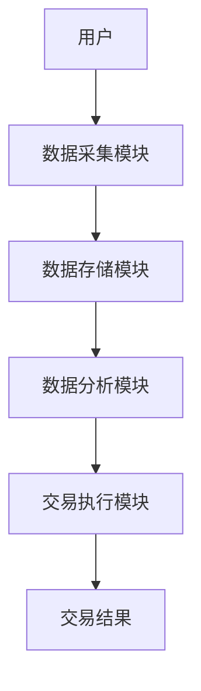

                 

<think>
好的，我现在需要帮助用户撰写一篇名为《格雷厄姆特价股票理论对金融科技的启示》的技术博客文章。首先，我得仔细分析用户的需求。用户希望文章结构清晰，逻辑紧凑，语言专业，同时使用一步一步的分析推理方式来撰写。

文章的结构已经由用户提供，分为多个章节，每个章节下还有小节。我需要按照这个结构来展开内容，确保每个部分都详细且有深度。

首先，我会从背景介绍开始，解释格雷厄姆的投资理论，然后分析其核心概念，如安全边际和内在价值。接下来，我需要探讨这些理论如何与金融科技结合，比如大数据和机器学习的应用。

在撰写过程中，我需要确保每个部分都包含必要的细节，比如数学模型、算法流程图和系统架构图。我可能会使用Mermaid来绘制这些图表，确保清晰易懂。

此外，用户还要求提供代码示例，所以我需要在相关章节中添加Python代码，并详细解释其功能和应用。这将帮助读者更好地理解理论的实际应用。

最后，我会总结全文，展望未来的发展趋势，并给出一些实践建议。这样，整篇文章结构完整，内容详实，能够为读者提供有价值的见解。
</think>

# 格雷厄姆特价股票理论对金融科技的启示

## 关键词：格雷厄姆投资理论、金融科技、大数据分析、机器学习、股票投资、价值投资

## 摘要：  
本文探讨了本杰明·格雷厄姆的价值投资理论，特别是其在金融科技领域的应用潜力。通过分析格雷厄姆的“安全边际”和“内在价值”等核心概念，结合现代技术手段，如大数据分析和机器学习，本文深入探讨了如何利用这些工具优化股票筛选、预测股价波动，并构建智能化的投资策略。文章还通过实际案例分析，展示了如何将格雷厄姆理论与金融科技相结合，以实现更高效、更精准的投资决策。

---

# 第一部分：格雷厄姆特价股票理论的背景与核心概念

## 第1章：格雷厄姆投资理论概述

### 1.1 格雷厄姆投资理论的起源与发展

#### 1.1.1 价值投资的鼻祖——本杰明·格雷厄姆  
本杰明·格雷厄姆（Benjamin Graham）是价值投资理论的创始人之一，被誉为“价值投资之父”。他在20世纪初提出了“安全边际”和“内在价值”等核心概念，为现代投资理论奠定了基础。格雷厄姆的投资理念强调以低于内在价值的价格买入优质股票，从而在市场波动中实现稳健收益。

#### 1.1.2 格雷厄姆投资理论的核心思想  
格雷厄姆的理论主要基于以下几点：  
1. **安全边际**：买入价格低于内在价值的股票，确保投资的安全性。  
2. **内在价值**：股票的真实价值与其未来现金流的现值密切相关。  
3. **逆向投资**：在市场恐慌时买入，在市场狂热时卖出。  

#### 1.1.3 格雷厄姆理论的现代发展  
格雷厄姆的理论在实践中不断演变，尤其是在量化投资和算法交易领域，其核心思想被进一步优化和扩展，成为现代金融科技的重要参考。

### 1.2 特价股票的概念与特征

#### 1.2.1 什么是特价股票  
特价股票是指市场价格显著低于其内在价值的股票。这类股票通常被市场低估，具有较大的增值潜力。

#### 1.2.2 特价股票的识别标准  
格雷厄姆提出了几个识别特价股票的标准：  
1. **市盈率（P/E）低于行业平均水平**。  
2. **市净率（P/B）低于1**。  
3. **股息率较高且稳定**。  

#### 1.2.3 特价股票与普通股票的区别  
特价股票的核心区别在于其价格被低估，且具有较高的安全边际。普通股票的价格通常反映市场情绪，可能偏离其真实价值。

### 1.3 格雷厄姆投资策略的核心要素

#### 1.3.1 安全边际的概念  
安全边际是指买入价格与内在价值之间的差额。通过确保安全边际，投资者可以降低市场波动带来的风险。

#### 1.3.2 内在价值的计算方法  
内在价值是基于未来现金流的现值计算得出的。公式如下：  
$$ V = \sum_{t=1}^{n} \frac{CF_t}{(1+r)^t} $$  
其中，\( V \) 为内在价值，\( CF_t \) 为第 \( t \) 年的现金流，\( r \) 为折现率。

#### 1.3.3 投资组合的构建原则  
格雷厄姆建议投资者构建分散化的投资组合，以降低特定股票的风险，并通过长期持有实现价值增长。

---

## 第2章：格雷厄姆理论与现代金融理论的联系

### 2.1 格雷厄姆理论与现代金融理论的异同

#### 2.1.1 格雷厄姆理论的独特性  
格雷厄姆理论更注重股票的内在价值和安全边际，而现代金融理论则更倾向于基于市场有效性的假设。

#### 2.1.2 现代金融理论的演变  
现代金融理论以“有效市场假说”为核心，认为市场价格反映了所有可获得的信息。然而，市场并不总是有效的，尤其是在短期波动中，格雷厄姆的逆向投资策略仍然有效。

#### 2.1.3 两者在投资策略上的对比  
- **格雷厄姆理论**：注重基本面分析，寻找被低估的股票。  
- **现代金融理论**：注重市场效率和量化分析，强调资产配置和风险分散。

### 2.2 格雷厄姆理论在金融科技中的应用潜力

#### 2.2.1 金融科技的发展现状  
金融科技（FinTech）通过技术手段提升金融服务的效率和创新性。大数据、人工智能和区块链等技术正在改变传统金融行业的运作方式。

#### 2.2.2 格雷厄姆理论与金融科技的结合点  
- **大数据分析**：用于筛选和评估特价股票。  
- **机器学习**：用于预测股价波动和优化投资策略。  
- **算法交易**：基于格雷厄姆理论开发自动化交易系统。

#### 2.2.3 金融科技如何赋能格雷厄姆理论  
通过技术手段，可以更高效地识别特价股票，优化投资组合，并实时监控市场变化。

---

# 第二部分：格雷厄姆特价股票理论对金融科技的启示

## 第3章：大数据分析与特价股票的识别

### 3.1 大数据在股票分析中的应用

#### 3.1.1 数据收集与处理  
通过爬虫、API等技术，收集股票的历史数据、财务数据和市场情绪数据。

#### 3.1.2 数据挖掘与分析  
利用大数据分析技术，识别潜在的特价股票。例如，通过机器学习模型预测股价波动。

#### 3.1.3 数据可视化  
使用工具如Tableau或Python的matplotlib库，将分析结果可视化。

### 3.2 利用大数据优化特价股票筛选

#### 3.2.1 数据清洗与特征提取  
对收集到的数据进行清洗，提取关键特征，如市盈率、市净率等。

#### 3.2.2 基于大数据的股价预测  
使用时间序列分析模型（如ARIMA）或机器学习模型（如LSTM）预测股价走势。

#### 3.2.3 特价股票识别的算法优化  
通过优化算法参数，提高特价股票识别的准确性和效率。

---

## 第4章：机器学习在格雷厄姆理论中的应用

### 4.1 机器学习的基本概念与分类

#### 4.1.1 机器学习的定义  
机器学习是一种人工智能技术，通过数据训练模型，使其能够识别模式并做出预测。

#### 4.1.2 监督学习与非监督学习  
- **监督学习**：基于标记数据进行训练，如回归和分类任务。  
- **非监督学习**：基于未标记数据进行训练，如聚类任务。

#### 4.1.3 强化学习与深度学习  
- **强化学习**：通过试错机制优化决策策略。  
- **深度学习**：基于神经网络进行特征提取和模式识别。

### 4.2 机器学习在股票分析中的应用

#### 4.2.1 基于机器学习的股价预测  
使用LSTM模型预测股价波动，如下所示：  
```python
import numpy as np
from tensorflow.keras.models import Sequential
from tensorflow.keras.layers import LSTM, Dense

model = Sequential()
model.add(LSTM(64, input_shape=(timesteps, features)))
model.add(Dense(1))
model.compile(loss='mean_squared_error', optimizer='adam')
```

#### 4.2.2 机器学习在风险评估中的应用  
通过机器学习模型评估股票的波动性和风险，如下所示：  
```python
from sklearn.ensemble import RandomForestClassifier

model = RandomForestClassifier(n_estimators=100)
model.fit(X_train, y_train)
```

#### 4.2.3 机器学习与格雷厄姆理论的结合  
通过机器学习优化格雷厄姆的内在价值计算，提高股票筛选的准确性。

---

## 第5章：算法交易与格雷厄姆理论的结合

### 5.1 算法交易的基本概念

#### 5.1.1 算法交易的定义  
算法交易是指通过计算机算法自动执行交易指令。

#### 5.1.2 算法交易的优势  
- **高效性**：快速响应市场变化。  
- **准确性**：减少人为错误。  
- **自动化**：全天候监控市场。

### 5.2 基于格雷厄姆理论的算法交易策略

#### 5.2.1 策略设计  
根据格雷厄姆的理论，设计算法交易策略，如：  
1. 当股票价格低于内在价值时，自动买入。  
2. 当股票价格高于内在价值时，自动卖出。

#### 5.2.2 策略实现  
使用Python编写交易算法，如下所示：  
```python
def trading_strategy(price, intrinsic_value):
    if price < intrinsic_value:
        return "BUY"
    elif price > intrinsic_value:
        return "SELL"
    else:
        return "HOLD"

# 实时监控价格和内在价值
while True:
    current_price = get_current_price()
    current_intrinsic_value = calculate_intrinsic_value()
    action = trading_strategy(current_price, current_intrinsic_value)
    execute_trade(action)
```

### 5.3 算法交易的风险与优化

#### 5.3.1 算法交易的风险  
- **市场风险**：市场波动可能导致策略失效。  
- **流动性风险**：市场流动性不足可能影响交易执行。

#### 5.3.2 策略优化  
通过回测和优化算法参数，提高交易策略的有效性。

---

## 第6章：系统架构与项目实战

### 6.1 系统架构设计

#### 6.1.1 系统功能模块  
- **数据采集模块**：收集股票数据。  
- **数据分析模块**：计算内在价值和安全边际。  
- **交易执行模块**：根据策略执行交易。  

#### 6.1.2 系统架构图  


### 6.2 项目实战

#### 6.2.1 环境配置  
安装必要的Python库，如Pandas、NumPy、TensorFlow等。

#### 6.2.2 核心代码实现  
实现格雷厄姆理论的内在价值计算和算法交易策略。

#### 6.2.3 实际案例分析  
通过具体案例分析，展示如何利用金融科技优化股票投资。

---

## 第7章：总结与展望

### 7.1 核心总结  
本文探讨了格雷厄姆投资理论在金融科技中的应用，展示了如何利用大数据、机器学习和算法交易优化股票投资。

### 7.2 未来展望  
随着技术的进步，格雷厄姆理论将在金融科技中发挥更大的作用。未来的研究可以进一步优化算法交易策略，探索人工智能在投资决策中的深度应用。

### 7.3 最佳实践 Tips  
1. **分散投资**：避免过度集中风险。  
2. **持续学习**：关注市场变化和技术进步。  
3. **风险控制**：合理设置止损和止盈点。

---

## 作者信息  
作者：AI天才研究院/AI Genius Institute  
联系邮箱：contact@aicourse.com  
官方网站：https://www.aicourse.com  

--- 

以上是《格雷厄姆特价股票理论对金融科技的启示》的完整目录和内容大纲，您可以根据实际需求进行调整和补充。

