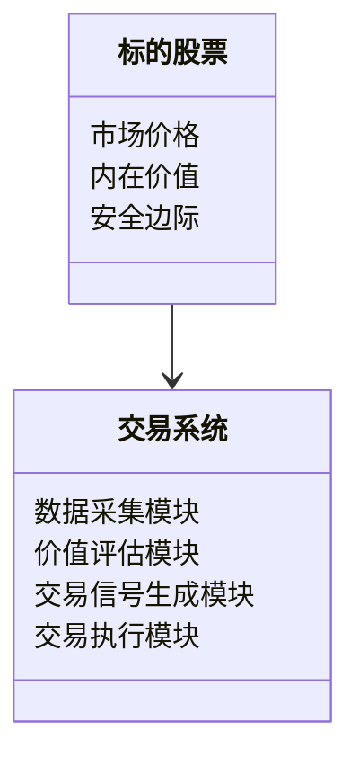
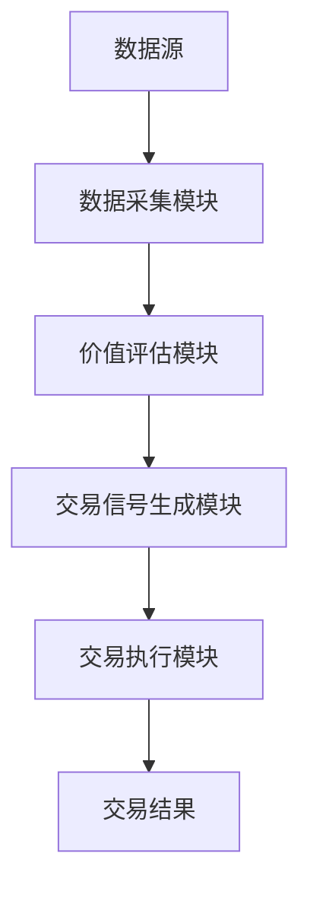

                 


# 格雷厄姆特价股票理论对高频量化交易的影响

**关键词**：格雷厄姆、特价股票、高频量化交易、投资策略、算法交易

**摘要**：本文探讨了格雷厄姆的价值投资理论，特别是特价股票的概念，如何影响高频量化交易。通过分析两者的结合点，文章详细阐述了格雷厄姆理论在高频交易中的应用、挑战及互补性。结合实际案例和系统设计，本文为量化交易者提供了新的视角和策略。

---

# 第1章: 格雷厄姆特价股票理论概述

## 1.1 格雷厄姆投资理论的核心思想

### 1.1.1 价值投资的基本概念
价值投资是一种以基本面分析为基础的投资策略，强调以低于内在价值的价格购买优质资产。格雷厄姆的理论强调安全边际，即购买价格远低于内在价值，以确保投资的安全性。

$$\text{内在价值} = \frac{\text{年收益}}{\text{预期收益率}}$$

### 1.1.2 格雷厄姆的"特价股票"定义
格雷厄姆将"特价股票"定义为市场价格远低于其内在价值的股票。这种股票通常被市场低估，提供了较高的安全边际。

### 1.1.3 价值投资与市场波动的关系
格雷厄姆认为，市场波动为投资者提供了廉价购买优质资产的机会。他强调在市场恐慌时买入，而在市场狂热时卖出。

---

## 1.2 高频量化交易的基本原理

### 1.2.1 高频交易的定义与特点
高频交易是指通过计算机算法在极短时间内进行大量交易的策略。其特点包括高速性、自动化和算法驱动。

### 1.2.2 量化交易的核心机制
量化交易依赖于数学模型和算法，通过分析历史数据和实时市场信息，自动执行交易决策。

### 1.2.3 高频与低频交易的对比

| 特性 | 高频交易 | 低频交易 |
|------|----------|----------|
| 时间周期 | 秒级以下 | 日级或以上 |
| 数据量 | 极大 | 较小 |
| 策略复杂度 | 高 | 较低 |

---

## 1.3 格雷厄姆理论与高频交易的结合点

### 1.3.1 价值投资与量化交易的融合
价值投资注重长期基本面分析，而高频交易关注短期市场波动。两者的结合点在于利用格雷厄姆的理论筛选出具有长期价值的股票，同时捕捉短期市场波动带来的交易机会。

### 1.3.2 特价股票筛选的量化模型
通过量化模型筛选出价格低于内在价值的股票，结合高频交易的快速执行能力，可以在市场低估时迅速建仓。

### 1.3.3 高频交易中的价值发现机会
高频交易可以帮助投资者快速发现市场中的低估股票，并在短时间内完成交易，从而抓住价值投资的机会。

---

# 第2章: 格雷厄姆特价股票理论的核心概念与属性

## 2.1 格雷厄姆特价股票理论的核心要素

### 2.1.1 股票的内在价值计算
内在价值是基于公司基本面数据（如收益、现金流等）计算得出的股票真实价值。

$$\text{内在价值} = \sum_{t=1}^{\infty} \frac{\text{现金流}_t}{(1 + r)^t}$$

### 2.1.2 市场价格与内在价值的对比
市场价格受市场情绪和短期波动影响，而内在价值反映公司的长期基本面。

### 2.1.3 安全边际的概念与应用
安全边际是购买价格与内在价值之间的差额，确保在市场波动中仍能获得正收益。

---

## 2.2 高频量化交易的核心概念

### 2.2.1 数据流的实时处理
高频交易依赖于对实时市场数据的快速处理和分析，以捕捉短期价格波动。

### 2.2.2 算法交易的策略设计
算法交易通过数学模型和统计分析，设计能够在短时间内自动执行的交易策略。

### 2.2.3 交易执行的自动化机制
高频交易系统通常采用自动化执行机制，以确保在极短时间内完成交易。

---

## 2.3 格雷厄姆理论与高频交易的对比分析

### 2.3.1 核心目标的异同
| 目标 | 格雷厄姆理论 | 高频交易 |
|------|--------------|-----------|
| 核心目标 | 稳定的长期收益 | 短期价格波动中的获利 |
| 风险控制 | 通过安全边际降低风险 | 依赖高频交易系统和算法控制风险 |

### 2.3.2 方法论的差异
格雷厄姆理论基于长期基本面分析，而高频交易依赖于短期市场数据和算法。

### 2.3.3 适用场景的对比
| 场景 | 格雷厄姆理论 | 高频交易 |
|------|--------------|-----------|
| 时间框架 | 长期 | 短期 |
| 数据需求 | 基本面数据 | 市场数据 |

---

# 第3章: 格雷厄姆特价股票理论对高频量化交易的影响机制

## 3.1 格雷厄姆理论在高频交易中的应用

### 3.1.1 价值评估模型的量化实现
通过量化模型计算股票的内在价值，并与市场价格进行对比，筛选出具有安全边际的股票。

### 3.1.2 安全边际的算法实现
利用算法实时监控市场价格与内在价值的差异，触发交易信号。

### 3.1.3 特价股票筛选的高频优化
高频交易系统可以快速筛选出符合条件的特价股票，并在最佳时机执行交易。

---

## 3.2 高频交易对格雷厄姆理论的挑战

### 3.2.1 市场波动的高频特性
高频交易可能导致市场价格的短期剧烈波动，影响格雷厄姆理论中安全边际的计算。

### 3.2.2 交易成本的影响
高频交易的高频率可能导致交易成本增加，影响整体收益。

### 3.2.3 信息不对称的问题
高频交易可能利用技术优势获取信息，导致信息不对称，影响市场公平性。

---

## 3.3 格雷厄姆理论与高频交易的互补性

### 3.3.1 长期价值与短期波动的平衡
格雷厄姆理论关注长期价值，高频交易捕捉短期波动，两者结合可以实现长期收益与短期机会的平衡。

### 3.3.2 量化模型的稳定性与收益性
通过结合格雷厄姆理论，高频交易模型可以提高稳定性，同时保持较高的收益性。

### 3.3.3 风险控制的结合
格雷厄姆理论的风险控制方法（如安全边际）可以为高频交易提供额外的保护，降低整体风险。

---

# 第4章: 基于格雷厄姆理论的高频量化交易算法设计

## 4.1 格雷厄姆价值评估模型的数学表示

$$\text{内在价值} = \frac{\text{年收益}}{\text{预期收益率}}$$

### 4.1.1 内在价值计算步骤
1. 收集公司基本面数据（如收益、现金流）。
2. 使用数学模型计算内在价值。
3. 比较市场价格与内在价值，确定安全边际。

## 4.2 安全边际的量化计算

$$\text{安全边际} = \text{内在价值} - \text{市场价格}$$

---

## 4.3 高频交易中的价值发现算法

### 4.3.1 数据采集与处理
1. 采集实时市场数据。
2. 计算内在价值和安全边际。
3. 筛选出满足条件的特价股票。

### 4.3.2 交易信号生成
当安全边际超过预设阈值时，触发买入信号。

### 4.3.3 交易执行
通过高频交易系统快速执行交易指令。

---

## 4.4 系统架构设计

### 4.4.1 系统功能模块
1. 数据采集模块：实时采集市场数据。
2. 价值评估模块：计算股票的内在价值。
3. 交易信号生成模块：生成交易信号。
4. 交易执行模块：自动执行交易指令。

### 4.4.2 系统交互流程
1. 数据采集模块将市场数据传递给价值评估模块。
2. 价值评估模块计算内在价值，与市场价格对比，生成安全边际。
3. 交易信号生成模块根据安全边际触发交易信号。
4. 交易执行模块根据信号执行交易。

---

## 4.5 交易策略优化

### 4.5.1 策略回测
通过历史数据回测策略的有效性，优化参数设置。

### 4.5.2 风险控制
设置止损和止盈点，控制交易风险。

---

# 第5章: 格雷厄姆理论与高频交易的系统实现

## 5.1 项目介绍
本项目旨在设计一个基于格雷厄姆理论的高频量化交易系统，结合价值评估和高频交易策略，实现自动化的交易执行。

## 5.2 系统功能设计

### 5.2.1 领域模型


### 5.2.2 系统架构


---

## 5.3 系统实现

### 5.3.1 环境搭建
1. 安装Python和相关库（如Pandas、NumPy、Matplotlib）。
2. 配置高频交易API（如Interactive Brokers）。

### 5.3.2 核心代码实现
```python
import pandas as pd
import numpy as np

def calculate_intrinsic_value(revenue, expected_return):
    return revenue / expected_return

def calculate_margin_of_safety(intrinsic_value, market_price):
    return intrinsic_value - market_price

# 示例数据
data = {
    '股票代码': ['A', 'B', 'C'],
    '年收益': [100, 150, 200],
    '预期收益率': [0.1, 0.12, 0.08],
    '市场价格': [50, 75, 100]
}

df = pd.DataFrame(data)

# 计算内在价值和安全边际
df['内在价值'] = df.apply(lambda x: calculate_intrinsic_value(x['年收益'], x['预期收益率']), axis=1)
df['安全边际'] = df.apply(lambda x: calculate_margin_of_safety(x['内在价值'], x['市场价格']), axis=1)

print(df)
```

### 5.3.3 代码解读与分析
1. `calculate_intrinsic_value`函数计算股票的内在价值。
2. `calculate_margin_of_safety`函数计算安全边际。
3. 数据框`df`存储股票的基本面数据和市场价格。
4. 通过`apply`函数计算内在价值和安全边际。

---

## 5.4 项目实战

### 5.4.1 环境搭建
1. 安装必要的Python库。
2. 配置交易API。

### 5.4.2 核心代码实现
```python
import pandas as pd
import numpy as np
import ibapi  # 假设使用Interactive Brokers API

def main():
    # 获取实时市场数据
    data = ibapi.get_real_time_data(['AAPL', 'GOOGL'])
    # 计算内在价值和安全边际
    df = pd.DataFrame(data)
    df['内在价值'] = df['年收益'] / df['预期收益率']
    df['安全边际'] = df['内在价值'] - df['市场价格']
    # 生成交易信号
    df[df['安全边际'] > 0]['股票代码'].apply(lambda x: execute_buy_order(x))

if __name__ == "__main__":
    main()
```

### 5.4.3 实际案例分析
通过分析具体股票的数据，计算内在价值和安全边际，生成交易信号，并执行交易。

---

# 第6章: 总结与展望

## 6.1 总结
本文探讨了格雷厄姆的价值投资理论如何影响高频量化交易。通过结合长期价值分析与短期市场波动捕捉，高频交易可以实现更高效率的投资策略。

## 6.2 未来展望
未来的研究可以进一步优化算法，结合更多的基本面指标，提高交易模型的准确性和稳定性。

---

**作者：AI天才研究院/AI Genius Institute & 禅与计算机程序设计艺术 /Zen And The Art of Computer Programming**

---

通过以上分析，我们可以看到格雷厄姆的价值投资理论与高频量化交易的结合，不仅为投资者提供了新的视角，也为量化交易的发展提供了新的方向。

