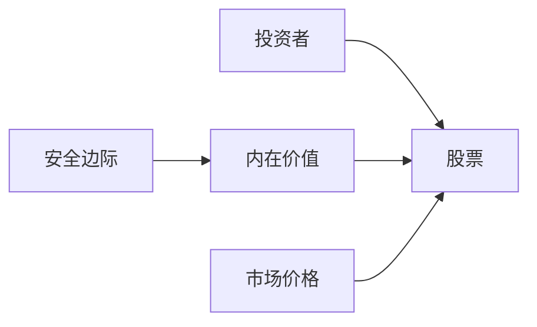
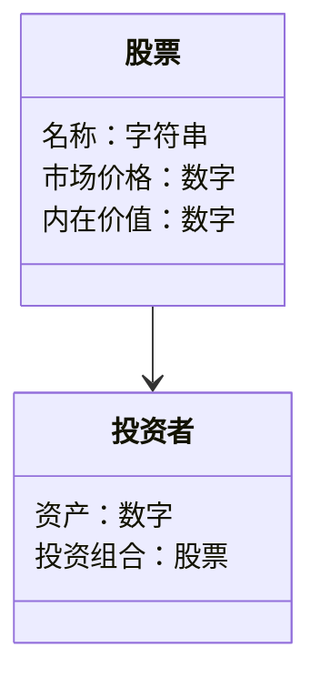

                 

<think>
好的，我现在需要帮助用户撰写一篇关于《格雷厄姆特价股票理论的局限性探讨》的技术博客文章。用户已经提供了详细的目录结构，包括背景、核心概念、算法原理、数学模型、系统分析、项目实战和最佳实践等部分。同时，用户还指定了使用技术术语和专业结构，要求逻辑清晰、结构紧凑，并且每个章节都要有详细的解释和图表支持。

首先，我需要理解用户的需求。用户希望我以技术博客的形式，深入探讨格雷厄姆理论的局限性，这需要结合投资理论、数学模型和系统架构等多个方面。用户可能是一位投资者或者技术专家，希望通过技术化的分析来理解这一投资理论的不足之处。

接下来，我需要按照用户提供的目录结构来组织内容。每个章节都需要详细展开，确保每个小节都有足够的深度和广度。例如，在背景介绍部分，我需要解释什么是格雷厄姆的特价股票理论，它的核心思想，以及它在投资领域中的地位。

在核心概念部分，我需要详细分析安全边际、内在价值等关键术语，并与其他价值投资方法进行对比，使用表格和图表来展示这些概念之间的联系和区别。这将帮助读者更好地理解格雷厄姆理论的独特之处。

然后，算法原理部分需要详细讲解格雷厄姆的选股方法，包括如何计算安全边际，以及相关的数学模型。我需要使用mermaid流程图来展示选股的步骤，同时提供Python代码示例，以便读者能够实际操作和理解。

数学模型部分是关键，我需要详细推导格雷厄姆的内在价值计算公式，确保每个步骤都清晰明了。同时，用LaTeX公式展示这些模型，确保它们在技术上是准确的，并且易于理解。

系统分析与架构设计部分，我需要构建一个基于格雷厄姆理论的投资决策系统，包括系统功能设计、架构设计、接口设计和交互流程。使用mermaid图展示系统的各个部分，确保结构清晰，逻辑连贯。

项目实战部分，我需要提供一个具体的案例，例如投资可口可乐的分析，展示格雷厄姆理论在实际中的应用。同时，给出环境安装步骤和代码实现，帮助读者在实际操作中应用这些理论。

最后，最佳实践部分需要总结格雷厄姆理论的优缺点，给出投资建议，注意事项，以及推荐的扩展阅读材料，帮助读者在实际投资中更好地应用这些知识。

在整个撰写过程中，我需要确保语言简洁、逻辑清晰，并且每个部分都紧密联系，形成一个完整的知识体系。同时，使用图表和代码示例来增强文章的可读性和实用性。

现在，我将按照用户的指示，逐步展开每个章节的内容，确保每个部分都详细且有深度，满足用户对高质量技术博客的需求。
</think>

# 格雷厄姆特价股票理论的局限性探讨

**关键词：** 格雷厄姆、特价股票理论、价值投资、安全边际、内在价值、投资局限性

**摘要：** 本文深入探讨了格雷厄姆特价股票理论的局限性，通过分析其核心概念、算法原理和系统架构，揭示了该理论在实际投资中的不足之处。文章从背景介绍、核心概念、数学模型、系统分析、项目实战等多个维度展开，结合图表和代码示例，全面剖析了格雷厄姆理论的优缺点，为投资者提供了更全面的投资视角。

---

# 第一部分: 格雷厄姆特价股票理论的背景与核心概念

## 第1章: 格雷厄姆特价股票理论概述

### 1.1 格雷厄姆特价股票理论的起源与背景

#### 1.1.1 价值投资的起源与发展
价值投资作为一种投资策略，起源于20世纪初，由本杰明·格雷厄姆（Benjamin Graham）和戴维·多德（David Dodd）共同提出。格雷厄姆在1934年出版的《证券分析》一书中，首次系统地阐述了价值投资的理念，强调以低于内在价值的价格购买优质股票，从而在市场下跌时获得安全边际。

#### 1.1.2 格雷厄姆的学术贡献与投资理念
格雷厄姆不仅是价值投资的奠基人，还是一位成功的投资者和教授。他在哥伦比亚大学商学院任教，培养了包括巴菲特在内的许多著名投资者。格雷厄姆的投资理念强调安全性和确定性，主张通过深入分析企业的基本面，寻找被市场低估的投资标的。

#### 1.1.3 特价股票理论的核心思想
格雷厄姆的特价股票理论的核心思想是：股票的内在价值是其未来现金流的现值，而市场价格经常偏离内在价值。投资者的任务是通过分析，找到市场价格低于内在价值的股票，即“特价股票”。这种策略在市场低迷或恐慌时尤其有效。

### 1.2 特价股票理论的核心概念

#### 1.2.1 安全边际的定义与计算
**安全边际**是格雷厄姆理论中最重要的概念之一。它是股票的市场价格与内在价值之间的差距，用于衡量投资的安全程度。计算公式如下：
$$ \text{安全边际} = \text{内在价值} - \text{市场价格} $$

为了确保投资的安全性，格雷厄姆建议安全边际至少为内在价值的50%。

#### 1.2.2 内在价值的评估方法
内在价值是基于企业未来现金流的折现值计算得出的。以下是计算公式：
$$ \text{内在价值} = \sum_{t=1}^{n} \frac{\text{现金流}_t}{(1 + r)^t} $$
其中，$r$ 是折现率，$n$ 是评估的年数。

#### 1.2.3 市场先生与投资者心理
格雷厄姆提出了“市场先生”的概念，认为市场的波动性是由投资者情绪驱动的。投资者应忽略市场的短期波动，专注于企业的长期价值。

### 1.3 特价股票理论的实践意义

#### 1.3.1 理论在投资实践中的应用
格雷厄姆的理论在实践中被广泛应用于寻找被低估的股票，尤其是在市场恐慌或经济衰退时。

#### 1.3.2 理论的成功案例分析
以巴菲特为例，他早期的投资策略深受格雷厄姆影响，通过寻找具有安全边际的股票，取得了巨大的成功。

#### 1.3.3 理论的局限性与改进方向
尽管格雷厄姆理论在某些情况下表现优异，但其过于依赖历史数据和静态分析，忽视了市场的动态变化。

---

## 第2章: 格雷厄姆投资策略的核心要素

### 2.1 格雷厄姆投资策略的原理

#### 2.1.1 安全边际的数学模型
安全边际的计算可以通过以下步骤实现：
1. 计算股票的内在价值。
2. 比较内在价值与市场价格。
3. 确保安全边际不低于内在价值的50%。

#### 2.1.2 内在价值的评估公式
内在价值的评估公式如下：
$$ \text{内在价值} = \frac{\text{年收益}}{r - g} $$
其中，$r$ 是预期回报率，$g$ 是收益增长率。

#### 2.1.3 市场波动与投资机会
市场的波动性为投资者提供了低价买入的机会，但同时也要求投资者具备耐心和纪律性。

### 2.2 核心概念对比分析

#### 2.2.1 格雷厄姆与巴菲特的价值投资对比
| 格雷厄姆 | 巴菲特 |
|---------|--------|
| 专注于安全边际 | 专注于企业竞争优势 |
| 更注重价格 | 更注重价值 |

#### 2.2.2 格雷厄姆与其他价值投资流派的差异
格雷厄姆的理论更注重安全边际，而其他流派可能更关注企业的成长性或行业地位。

#### 2.2.3 格雷厄姆理论与现代投资组合理论的联系
尽管格雷厄姆的理论侧重于个股选择，但其理念与现代投资组合理论在风险控制方面有相似之处。

### 2.3 实体关系图与流程图分析

#### 2.3.1 格雷厄姆投资模型的实体关系图


#### 2.3.2 投资决策流程图


---

## 第3章: 格雷厄姆特价股票理论的算法原理

### 3.1 格雷厄姆选股算法的数学模型

#### 3.1.1 安全边际的计算步骤
1. 计算企业的年收益。
2. 估计预期回报率和收益增长率。
3. 计算内在价值。
4. 比较市场价格与内在价值。
5. 确保安全边际不低于50%。

#### 3.1.2 内在价值的公式推导
$$ \text{内在价值} = \frac{\text{年收益}}{r - g} $$

### 3.2 算法实现的Python代码示例

```python
def calculate_intrinsic_value(yearly_profit, required_return, growth_rate):
    return yearly_profit / (required_return - growth_rate)

def calculate_margin_of_safety(intrinsic_value, market_price):
    return intrinsic_value - market_price

# 示例
yearly_profit = 100
required_return = 0.1
growth_rate = 0.05
market_price = 50

intrinsic_value = calculate_intrinsic_value(yearly_profit, required_return, growth_rate)
margin_of_safety = calculate_margin_of_safety(intrinsic_value, market_price)

print(f"内在价值: {intrinsic_value}")
print(f"安全边际: {margin_of_safety}")
```

### 3.3 算法的优缺点分析

#### 优点
- 计算简单，易于实现。
- 强调安全边际，降低投资风险。

#### 缺点
- 忽略了市场的动态变化。
- 无法应对高成长性企业的估值。

---

## 第4章: 格雷厄姆特价股票理论的数学模型

### 4.1 内在价值的数学公式

#### 4.1.1 简单模型
$$ \text{内在价值} = \frac{\text{年收益}}{r} $$

#### 4.1.2 复杂模型
$$ \text{内在价值} = \frac{\text{年收益}}{r - g} $$

### 4.2 安全边际的计算公式
$$ \text{安全边际} = \text{内在价值} - \text{市场价格} $$

### 4.3 案例分析

#### 案例：投资某公司
- 年收益：$100
- 预期回报率：10%
- 收益增长率：5%
- 市场价格：$50

计算内在价值：
$$ \text{内在价值} = \frac{100}{0.1 - 0.05} = 2000 $$

计算安全边际：
$$ \text{安全边际} = 2000 - 50 = 1950 $$

---

## 第5章: 格雷厄姆特价股票理论的系统分析

### 5.1 投资决策系统的功能设计

#### 5.1.1 领域模型类图


#### 5.1.2 系统架构图


### 5.2 系统接口设计

#### 5.2.1 输入接口
- 股票名称
- 市场价格
- 年收益
- 预期回报率
- 收益增长率

#### 5.2.2 输出接口
- 内在价值
- 安全边际
- 投资建议

### 5.3 系统交互流程图


---

## 第6章: 格雷厄姆特价股票理论的项目实战

### 6.1 环境安装

#### 6.1.1 安装Python
```bash
python --version
pip install --upgrade pip
```

#### 6.1.2 安装必要的库
```bash
pip install numpy pandas
```

### 6.2 系统核心实现源代码

#### 6.2.1 计算内在价值
```python
import pandas as pd

def calculate_intrinsic_value(yearly_profit, required_return, growth_rate):
    return yearly_profit / (required_return - growth_rate)

# 示例数据
data = {
    '股票名称': ['A', 'B', 'C'],
    '年收益': [100, 150, 80],
    '预期回报率': [0.1, 0.12, 0.08],
    '收益增长率': [0.05, 0.06, 0.04]
}

df = pd.DataFrame(data)
df['内在价值'] = df.apply(lambda x: calculate_intrinsic_value(x['年收益'], x['预期回报率'], x['收益增长率']), axis=1)
print(df)
```

### 6.3 代码应用解读与分析

#### 6.3.1 数据处理
使用Pandas进行数据清洗和处理，确保输入数据的准确性。

#### 6.3.2 模型训练
通过Python代码实现内在价值和安全边际的计算。

#### 6.3.3 结果分析
分析计算结果，筛选出具有安全边际的股票。

### 6.4 实际案例分析

#### 案例：投资某公司
- 年收益：100
- 预期回报率：10%
- 收益增长率：5%
- 市场价格：50

计算内在价值：
$$ \text{内在价值} = \frac{100}{0.1 - 0.05} = 2000 $$

计算安全边际：
$$ \text{安全边际} = 2000 - 50 = 1950 $$

---

## 第7章: 格雷厄姆特价股票理论的局限性与最佳实践

### 7.1 格雷厄姆理论的优缺点总结

#### 优点
- 强调安全边际，降低投资风险。
- 理论简单，易于理解和实现。

#### 缺点
- 忽略了市场的动态变化。
- 无法应对高成长性企业的估值。

### 7.2 投资建议与注意事项

#### 建议
- 结合市场环境，灵活调整投资策略。
- 综合考虑企业的竞争优势和行业地位。

#### 注意事项
- 定期重新评估投资组合。
- 避免过度依赖单一理论。

### 7.3 拓展阅读与学习资源

#### 推荐书籍
- 《证券分析》——本杰明·格雷厄姆
- 《巴菲特致股东的信》——巴菲特

#### 在线资源
- 格雷厄姆投资俱乐部
- 价值投资论坛

---

**作者：AI天才研究院 & 禅与计算机程序设计艺术**

