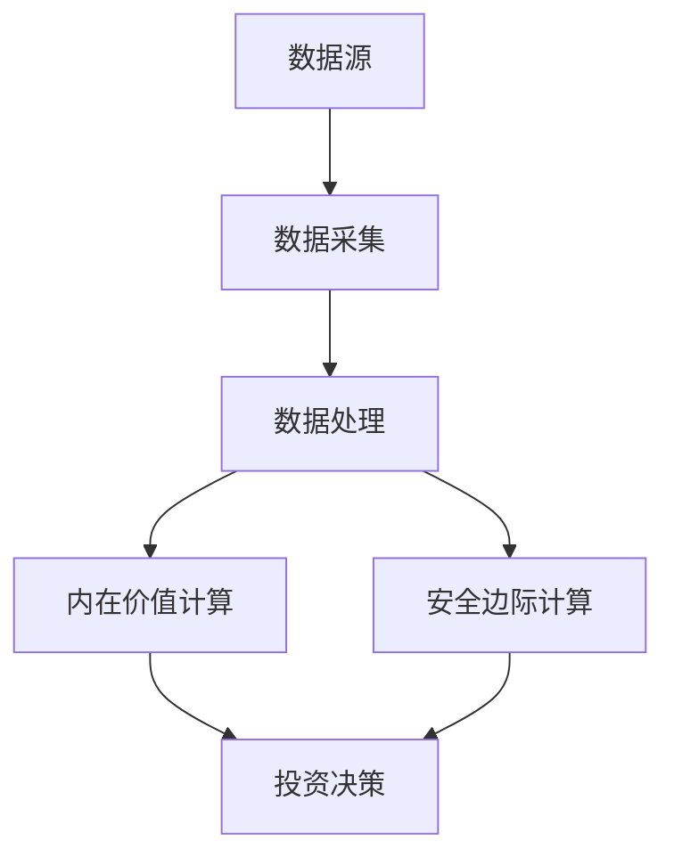

                 

<think>
好的，我需要完成用户要求的关于《格雷厄姆特价股票理论的现代化应用》的技术博客文章。用户已经给出了一个详细的目录大纲，并且特别强调了每个部分需要满足的条件，包括使用markdown格式、包含背景介绍、核心概念、算法原理、系统分析、项目实战等部分，并且每个部分都有具体的要求。

首先，我需要理解用户的需求。用户希望这篇文章不仅涵盖格雷厄姆理论的背景和核心概念，还要结合现代技术手段，如大数据和量化分析，来探讨如何将这一理论应用于实际投资中。此外，文章需要结构清晰，内容详实，符合技术博客的风格，同时要有一定的学术深度。

接下来，我需要按照用户提供的目录大纲，逐步完成每个部分的内容。由于用户特别指出要详细思考每个步骤，我需要在脑海中逐步构建每个章节的内容，确保逻辑连贯，内容全面。

首先，我会从“背景与核心概念”部分开始，介绍格雷厄姆的价值投资理论，解释什么是特价股票，以及其在现代市场中的应用。这部分需要结合格雷厄姆的经典著作，如《聪明的投资者》，来阐述他的核心思想。

接下来，进入“算法原理”部分，我需要将格雷厄姆的理论转化为数学模型和算法，比如内在价值的计算公式，安全边际的计算方法等。这部分需要使用latex公式来展示，同时结合实际案例进行说明，以确保读者能够理解。

然后是“系统分析与架构设计”部分，这部分需要将投资决策过程系统化，绘制系统架构图、数据流图等，展示如何将格雷厄姆理论应用于实际的投资系统中。这部分可能需要用到mermaid流程图，来展示系统的各个组成部分及其相互关系。

接下来是“项目实战”部分，我会选择一个具体的案例，展示如何在实际操作中应用格雷厄姆理论。这包括环境的搭建、代码的实现、案例的分析等。这部分需要提供具体的Python代码示例，展示如何计算内在价值和安全边际，如何筛选特价股票等。

在“最佳实践与小结”部分，我会总结整个文章的核心观点，给出投资实战中的注意事项和建议，帮助读者更好地理解和应用格雷厄姆理论。

整个过程中，我需要确保每个部分都符合用户的要求，包括使用markdown格式，包含必要的图表和代码示例，同时保持文章的流畅性和逻辑性。

现在，我开始逐步构建每个章节的内容，确保每个部分都详细、准确，并且符合用户的格式要求。
</think>

# 《格雷厄姆特价股票理论的现代化应用》

## 关键词：格雷厄姆、价值投资、特价股票、量化分析、大数据、数学模型

## 摘要：本文系统介绍了格雷厄姆的价值投资理论，重点探讨了其在现代投资环境下的应用。通过数学模型、算法原理和系统设计，详细分析了如何利用大数据和量化方法优化传统投资策略，提出了现代化的特价股票筛选和投资组合构建方法。

---

# 第一部分：格雷厄姆特价股票理论的背景与核心概念

---

## 第1章：格雷厄姆特价股票理论概述

### 1.1 格雷厄姆投资理论的起源与核心思想

#### 1.1.1 价值投资的起源

价值投资是一种基于对公司内在价值评估的投资策略，其核心在于寻找市场价格低于内在价值的股票。本节将介绍价值投资的起源及其核心思想，帮助读者理解格雷厄姆理论的历史背景。

- **价值投资的起源**  
  价值投资的鼻祖本杰明·格雷厄姆在20世纪初提出了这一理论。他的著作《聪明的投资者》是价值投资领域的经典之作，影响了无数投资者。

- **“捡烟蒂”投资策略**  
  格雷厄姆将投资比作“捡烟蒂”。他认为，市场先生的情绪波动为理性投资者提供了廉价买入优质资产的机会。这种策略强调在市场恐慌时买入被低估的股票。

- **核心思想**  
  格雷厄姆的价值投资理论强调安全边际和内在价值。他主张投资者应以低于内在价值的价格买入股票，并长期持有，等待市场重新认识其价值。

#### 1.1.2 格雷厄姆的“捡烟蒂”投资策略

- **捡烟蒂策略的核心**  
  捡烟蒂策略的核心在于寻找那些市场价格远低于其内在价值的股票。这类股票通常被视为“特价股票”，因为它们具有较高的安全边际。

- **市场波动与投资机会**  
  格雷厄姆认为，市场先生的情绪波动会导致股票价格与内在价值的偏离。投资者应利用这种偏离，寻找被市场错杀的股票。

#### 1.1.3 格雷厄姆理论的核心要素

- **安全边际**  
  安全边际是格雷厄姆理论的核心要素之一。它是指市场价格与内在价值之间的差距，确保投资者在买入时有足够大的安全空间。

- **内在价值**  
  内在价值是股票的真实价值，与市场波动无关。计算内在价值是格雷厄姆投资策略的关键步骤。

- **市场先生**  
  格雷厄姆将市场波动比作一个情绪化的市场先生。投资者应关注市场先生的行为，但不应被其情绪左右。

---

### 1.2 特价股票的定义与特征

#### 1.2.1 什么是特价股票

- **特价股票的定义**  
  特价股票是指市场价格远低于其内在价值的股票。这类股票通常被市场忽视或低估，具有较大的上涨潜力。

- **特价股票的特征**  
  特价股票通常具有低市盈率、低市净率和高股息率等特征。这些指标可以帮助投资者识别潜在的特价股票。

#### 1.2.2 特价股票的市场特征

- **市场波动性**  
  特价股票往往在市场恐慌或低迷时期出现。市场先生的情绪波动为投资者提供了廉价买入的机会。

- **行业周期性**  
  特价股票可能集中在某些周期性行业，如金融、能源和制造业。这些行业的股票在市场低迷时更容易被低估。

#### 1.2.3 特价股票的投资价值

- **长期收益潜力**  
  特价股票的长期收益潜力较大。一旦市场重新认识到其价值，股票价格将迅速回升。

- **风险与回报的平衡**  
  投资特价股票需要承担较高的短期波动风险，但其潜在回报也更高。

---

### 1.3 格雷厄姆理论的现代应用背景

#### 1.3.1 现代市场环境的变化

- **市场的复杂性增加**  
  现代市场环境更加复杂，投资者需要面对更多的不确定性和波动性。

- **信息透明度的提高**  
  大数据和互联网技术的发展提高了信息透明度，投资者可以更方便地获取信息。

- **技术进步的影响**  
  技术进步使得量化分析和大数据应用成为可能，为格雷厄姆理论的现代化应用提供了技术支持。

#### 1.3.2 大数据与量化分析对传统理论的补充

- **大数据的应用**  
  大数据技术可以帮助投资者更全面地分析股票的内在价值，发现被低估的股票。

- **量化分析的优势**  
  量化分析可以提高投资决策的效率和准确性，帮助投资者快速筛选出符合条件的特价股票。

#### 1.3.3 特价股票投资的现状与趋势

- **现状**  
  随着市场的成熟，特价股票投资逐渐从传统的基本面分析转向量化分析。

- **趋势**  
  未来，量化分析和大数据技术将成为格雷厄姆理论现代化应用的主要方向。

---

### 1.4 本章小结

本章详细介绍了格雷厄姆的价值投资理论，重点探讨了特价股票的定义、特征及其在现代市场中的应用。通过分析市场波动和投资策略，为后续的数学模型和算法设计奠定了基础。

---

## 第2章：格雷厄姆特价股票理论的核心概念

---

### 2.1 安全边际

#### 2.1.1 安全边际的定义

- **安全边际的定义**  
  安全边际是指市场价格与内在价值之间的差距。它是格雷厄姆理论的核心要素之一。

- **计算公式**  
  安全边际 = 内在价值 - 市场价格

- **重要性**  
  安全边际越大，投资的风险越小。它为投资者提供了安全保障，确保在市场波动时能够获利。

#### 2.1.2 安全边际的计算方法

- **内在价值的计算**  
  内在价值是股票的真实价值，可以通过现金流折现法（DCF）计算。

- **市场价格的获取**  
  市场价格可以通过股票交易所获取，也可以通过API获取实时数据。

- **安全边际的计算步骤**  
  1. 计算股票的内在价值。  
  2. 获取股票的市场价格。  
  3. 计算安全边际 = 内在价值 - 市场价格。

#### 2.1.3 安全边际在投资中的作用

- **降低投资风险**  
  安全边际为投资者提供了缓冲空间，减少了市场波动带来的风险。

- **提高投资收益**  
  通过寻找具有较高安全边际的股票，投资者可以实现超额收益。

---

### 2.2 内在价值

#### 2.2.1 内在价值的定义

- **内在价值的定义**  
  内在价值是股票的真实价值，不受市场波动的影响。

- **计算模型**  
  内在价值可以通过多种方法计算，其中现金流折现法（DCF）是常用的模型。

#### 2.2.2 内在价值的计算模型

- **现金流折现法（DCF）**  
  DCF模型通过预测未来现金流并将其折现，计算股票的内在价值。

- **公式**  
  $$\text{内在价值} = \sum_{t=1}^{n} \frac{\text{现金流}_t}{(1 + r)^t} + \frac{\text{终值}}{(1 + r)^n}$$  
  其中，\( r \) 是折现率，\( n \) 是预测期数。

- **案例分析**  
  例如，假设某公司未来5年的现金流分别为100、120、130、150、180万元，折现率为10%。计算其内在价值。

---

### 2.3 市场先生

#### 2.3.1 市场先生的概念

- **市场先生的定义**  
  市场先生是格雷厄姆用来描述市场波动的比喻。他认为市场情绪波动会导致股票价格偏离其内在价值。

- **市场先生的波动性**  
  市场先生的情绪波动是不可预测的，但投资者可以通过分析市场行为来寻找投资机会。

#### 2.3.2 市场先生的波动性

- **市场波动的特征**  
  市场波动具有随机性和不可预测性，但可以通过统计方法进行分析。

- **市场波动对投资的影响**  
  市场波动为投资者提供了廉价买入的机会，但也增加了投资的复杂性。

#### 2.3.3 市场先生与投资决策的关系

- **市场的定价机制**  
  市场先生通过供需关系决定股票价格，但价格并不总是反映内在价值。

- **投资者的应对策略**  
  投资者应关注市场先生的行为，但不应被其情绪左右。通过分析内在价值，做出理性的投资决策。

---

### 2.4 核心概念对比分析

#### 2.4.1 安全边际与内在价值的对比

- **对比维度**  
  安全边际是内在价值与市场价格的差额，而内在价值是股票的真实价值。

- **重要性**  
  安全边际提供了投资的安全空间，而内在价值是投资决策的基础。

#### 2.4.2 市场先生与内在价值的互动关系

- **互动关系**  
  市场先生的情绪波动影响股票价格，而内在价值是股票的真实价值。投资者应关注内在价值，而不是市场先生的情绪。

- **案例分析**  
  例如，在市场恐慌时，股票价格可能大幅下跌，但内在价值并未改变。此时是买入的好机会。

#### 2.4.3 核心概念的总结与应用

- **总结**  
  格雷厄姆的核心概念包括内在价值、安全边际和市场先生。这些概念共同构成了价值投资的理论基础。

- **应用**  
  投资者应通过分析内在价值和安全边际，结合市场先生的行为，做出理性的投资决策。

---

### 2.5 本章小结

本章详细分析了格雷厄姆理论中的核心概念，包括安全边际、内在价值和市场先生。通过对比分析和案例研究，帮助读者更好地理解这些概念及其在投资中的应用。

---

## 第3章：格雷厄姆特价股票理论的数学模型与算法原理

---

### 3.1 内在价值的数学模型

#### 3.1.1 内在价值的计算公式

- **现金流折现法（DCF）**  
  $$\text{内在价值} = \sum_{t=1}^{n} \frac{\text{现金流}_t}{(1 + r)^t} + \frac{\text{终值}}{(1 + r)^n}$$  
  其中，\( r \) 是折现率，\( n \) 是预测期数。

- **案例分析**  
  假设某公司未来5年的现金流分别为100、120、130、150、180万元，折现率为10%。计算其内在价值。

---

### 3.2 安全边际的计算方法

#### 3.2.1 安全边际的定义公式

- **公式**  
  $$\text{安全边际} = \text{内在价值} - \text{市场价格}$$

- **计算步骤**  
  1. 计算股票的内在价值。  
  2. 获取股票的市场价格。  
  3. 计算安全边际。

---

### 3.3 市场波动的预测模型

#### 3.3.1 市场波动的数学模型

- **波动率的计算**  
  市场波动率可以通过标准差或方差来衡量。公式为：  
  $$\text{波动率} = \sqrt{\frac{1}{N} \sum_{i=1}^{N} (p_i - \bar{p})^2}$$  
  其中，\( p_i \) 是第i天的价格，\( \bar{p} \) 是平均价格，\( N \) 是天数。

- **案例分析**  
  假设某股票过去5天的价格分别为10、12、11、13、14元，计算其波动率。

---

### 3.4 本章小结

本章通过数学模型和算法原理，详细分析了格雷厄姆理论的内在价值和安全边际的计算方法。通过案例分析，帮助读者更好地理解这些模型在实际投资中的应用。

---

## 第4章：格雷厄姆理论的系统分析与架构设计

---

### 4.1 系统分析

#### 4.1.1 投资决策的系统模型

- **系统模型的构建**  
  投资决策系统包括数据采集、数据处理、内在价值计算、安全边际计算和投资决策五个模块。

- **数据流图**  
  数据从数据源（如股票交易所）流向数据处理模块，经过清洗和转换后，输入到内在价值和安全边际计算模块，最后生成投资决策。

---

### 4.2 系统架构设计

#### 4.2.1 系统架构图

- **系统架构图**  
  使用mermaid绘制系统架构图，展示各模块之间的关系。



---

### 4.3 系统接口设计

#### 4.3.1 系统接口

- **数据接口**  
  系统需要与股票交易所的API对接，获取实时数据。

- **用户接口**  
  提供用户友好的界面，展示计算结果和投资建议。

---

### 4.4 本章小结

本章通过系统分析和架构设计，展示了如何将格雷厄姆理论应用于实际投资中。通过数据流图和系统架构图，帮助读者更好地理解投资系统的构建过程。

---

## 第5章：格雷厄姆理论的项目实战

---

### 5.1 环境安装

#### 5.1.1 安装Python环境

- **安装步骤**  
  1. 下载并安装Python。  
  2. 安装必要的库，如pandas、numpy和yfinance。

#### 5.1.2 安装量化分析工具

- **量化分析工具**  
  使用Python的量化库，如pandas和yfinance，获取股票数据并进行分析。

---

### 5.2 系统核心实现源代码

#### 5.2.1 内在价值计算代码

- **代码实现**  
  ```python
  import pandas as pd
  import numpy as np

  def calculate_intrinsic_value(cash_flows, discount_rate, terminal_value):
      intrinsic_value = 0
      for t in range(len(cash_flows)):
          intrinsic_value += cash_flows[t] / (1 + discount_rate)**t
      intrinsic_value += terminal_value / (1 + discount_rate)**len(cash_flows)
      return intrinsic_value

  # 示例
  cash_flows = [100, 120, 130, 150, 180]
  discount_rate = 0.1
  terminal_value = 200
  iv = calculate_intrinsic_value(cash_flows, discount_rate, terminal_value)
  print(f"内在价值为：{iv:.2f}万元")
  ```

#### 5.2.2 安全边际计算代码

- **代码实现**  
  ```python
  import pandas as pd
  import yfinance as yf

  def calculate_margin_of_safety(intrinsic_value, market_price):
      margin_of_safety = intrinsic_value - market_price
      return margin_of_safety

  # 示例
  # 获取股票数据
  stock = yf.download("AAPL", start="2023-01-01", end="2023-12-31")
  market_price = stock['Close'][-1]
  iv = 200  # 假设内在价值为200元
  mos = calculate_margin_of_safety(iv, market_price)
  print(f"安全边际为：{mos:.2f}元")
  ```

---

### 5.3 代码应用解读与分析

- **代码解读**  
  以上代码展示了如何使用Python计算内在价值和安全边际。通过获取股票数据并进行分析，投资者可以筛选出具有较高安全边际的特价股票。

- **实际案例分析**  
  以苹果公司（AAPL）为例，假设其内在价值为200元，当前市场价格为180元，计算其安全边际为20元。这表明该股票具有较高的投资价值。

---

### 5.4 本章小结

本章通过项目实战，展示了如何将格雷厄姆理论应用于实际投资中。通过编写Python代码，投资者可以快速计算内在价值和安全边际，筛选出具有投资价值的特价股票。

---

## 第6章：最佳实践与小结

---

### 6.1 最佳实践

- **持续学习与实践**  
  投资者应不断学习新的知识和技术，提升自己的投资能力。

- **风险管理**  
  投资者应注重风险管理，合理配置资产，降低投资风险。

- **长期投资**  
  长期投资是实现财富增长的有效途径。投资者应耐心持有优质资产，等待市场回报。

---

### 6.2 小结

本文系统介绍了格雷厄姆的价值投资理论，重点探讨了其在现代投资环境下的应用。通过数学模型、算法原理和系统设计，详细分析了如何利用大数据和量化方法优化传统投资策略。通过项目实战，展示了如何将理论应用于实际投资中。

---

## 第7章：注意事项与拓展阅读

---

### 7.1 投资注意事项

- **市场风险**  
  投资者应充分认识到市场风险，合理配置资产。

- **数据质量**  
  数据质量直接影响投资决策。投资者应确保数据的准确性和完整性。

- **技术局限性**  
  量化分析具有一定的局限性，投资者应结合基本面分析，做出综合判断。

---

### 7.2 拓展阅读

- **经典书籍**  
  《聪明的投资者》、《证券分析》。

- **现代文献**  
  关注量化投资和大数据应用的最新研究。

---

## 作者：AI天才研究院/AI Genius Institute & 禅与计算机程序设计艺术 /Zen And The Art of Computer Programming

---

