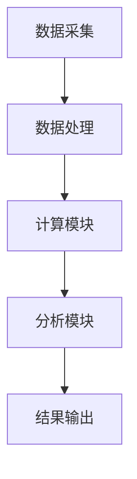
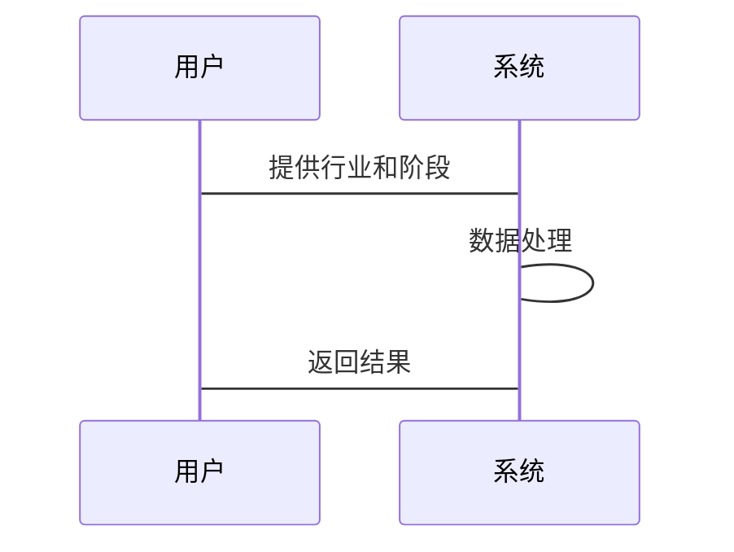

                 


# 格雷厄姆特价股票策略在不同产业集群生命周期的效果

## 关键词：格雷厄姆策略，产业集群，生命周期，股票估值，价值投资

## 摘要：本文探讨了格雷厄姆的价值投资策略在不同产业集群生命周期中的应用效果，分析了其在初创期、成长期、成熟期和衰退期的适用性，结合数学模型和实例，总结了策略在不同阶段的优势与挑战。

---

# 第1章: 格雷厄姆特价股票策略与产业集群生命周期的背景介绍

## 1.1 格雷厄姆特价股票策略的核心概念

### 1.1.1 价值投资的基本原理

价值投资强调购买被市场低估的股票，通过分析企业的内在价值，寻找安全边际。格雷厄姆的策略注重企业的基本面，如低市盈率、低市净率、高股息率等。

### 1.1.2 格雷厄姆特价股票的定义与特点

格雷厄姆特价股票是指市场价格远低于其内含价值的股票。其特点包括：低估值、高安全边际、稳定收益。

### 1.1.3 产业集群生命周期的概念与阶段划分

产业集群生命周期分为初创期、成长期、成熟期和衰退期，每个阶段企业的增长潜力和风险不同。

## 1.2 格雷厄姆策略与产业集群生命周期的结合

### 1.2.1 产业集群生命周期对股票投资的影响

不同生命周期阶段的企业面临不同的市场环境和风险，影响股票估值。

### 1.2.2 格雷厄姆策略在产业集群不同阶段的应用

策略在不同阶段的应用重点不同，如初创期注重成长潜力，衰退期注重低估值。

### 1.2.3 产业集群生命周期与股票估值的关系

生命周期阶段影响企业估值，格雷厄姆策略需根据阶段调整。

## 1.3 本章小结

本章介绍了格雷厄姆策略和产业集群生命周期的基本概念，为后续分析打下基础。

---

# 第2章: 格雷厄姆特价股票策略的核心概念与联系

## 2.1 格雷厄姆策略的数学模型与公式

### 2.1.1 现价与内含价值的计算公式

$$ V = \frac{E}{1 + r} $$

其中，\( V \) 是内含价值，\( E \) 是未来现金流，\( r \) 是折现率。

### 2.1.2 安全边际的计算方法

$$ \text{安全边际} = \text{内含价值} - \text{市场价格} $$

## 2.2 产业集群生命周期的阶段分析

### 2.2.1 初创期：产业集群的形成阶段

企业风险高，增长潜力大，适合寻找具有高成长性的股票。

### 2.2.2 成长期：产业集群的快速发展阶段

企业收入增长快，适合使用PEG指标评估。

### 2.2.3 成熟期：产业集群的稳定阶段

收入增长放缓，适合低市盈率股票。

### 2.2.4 衰退期：产业集群的衰退阶段

企业收入下降，适合寻找价值被低估的股票。

## 2.3 格雷厄姆策略与产业集群生命周期的关系

### 2.3.1 不同生命周期阶段的股票估值特点

不同阶段的企业估值关键指标不同，需灵活调整。

### 2.3.2 格雷厄姆策略在不同阶段的应用策略

如初创期注重PEG，衰退期注重低市净率。

## 2.4 核心概念对比分析

下表展示了格雷厄姆策略和产业集群生命周期的对比：

| 特性         | 格雷厄姆策略                        | 产业集群生命周期                   |
|--------------|------------------------------------|----------------------------------|
| 核心指标     | 市盈率、市净率、股息率             | 收入增长率、利润率、就业率       |
| 适用阶段     | 初创期：高增长                     | 成熟期：稳定                     |
| 风险因素     | 市场波动、企业盈利下降             | 产业萎缩、政策变化               |

### 2.4.1 ER实体关系图

```mermaid
entity Enterprise {
    id: integer
    name: string
    industry: string
    lifecycle_stage: string
    market_price: float
    intrinsic_value: float
}

entity LifecycleStage {
    id: integer
    name: string
    characteristics: string
    risk_level: integer
}
```

---

# 第3章: 格雷厄姆策略在产业集群生命周期中的算法原理

## 3.1 格雷厄姆策略的算法流程

### 3.1.1 算法步骤

1. 数据采集：收集企业财务数据。
2. 计算内含价值。
3. 计算安全边际。
4. 与市场价格比较。
5. 选择低估股票。

### 3.1.2 实例分析

某制造企业的数据：

$$ V = \frac{100}{1 + 0.1} = 90.91 $$

市场价格为80，安全边际为10.91，属于低估股票。

## 3.2 产业集群生命周期的阶段分析算法

### 3.2.1 生命周期阶段判断

根据收入增长率和利润率判断企业所处阶段。

## 3.3 综合应用算法

结合两个算法，确定股票在不同阶段的适用性。

---

# 第4章: 格雷厄姆策略在产业集群生命周期中的系统分析与架构设计

## 4.1 系统功能设计

### 4.1.1 系统模块

1. 数据采集模块。
2. 计算模块。
3. 分析模块。

### 4.1.2 功能流程

数据采集 → 计算 → 分析 → 输出结果。

## 4.2 系统架构设计



## 4.3 接口设计

### 4.3.1 数据接口

```python
def get_data(industry, stage):
    # 返回企业数据
```

## 4.4 交互流程



---

# 第5章: 格雷厄姆策略在产业集群生命周期中的项目实战

## 5.1 环境安装

安装必要的库，如Pandas、NumPy。

## 5.2 核心代码实现

```python
def calculate_intrinsic_value(enterprise_value, growth_rate):
    return enterprise_value / (1 + growth_rate)
```

## 5.3 案例分析

以某个产业集群为例，分析不同阶段的投资策略。

---

# 第6章: 格雷厄姆策略在产业集群生命周期中的最佳实践

## 6.1 总结

格雷厄姆策略在不同阶段的应用效果显著，但需灵活调整。

## 6.2 注意事项

数据质量、模型假设、市场变化等需注意。

## 6.3 拓展阅读

推荐相关书籍和论文。

---

# 作者：AI天才研究院 & 禅与计算机程序设计艺术

