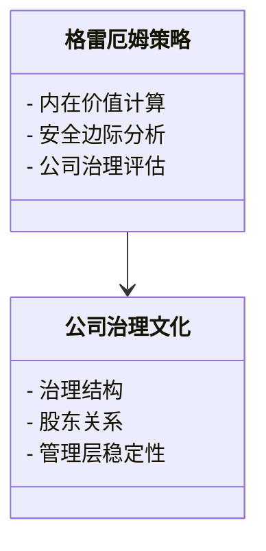
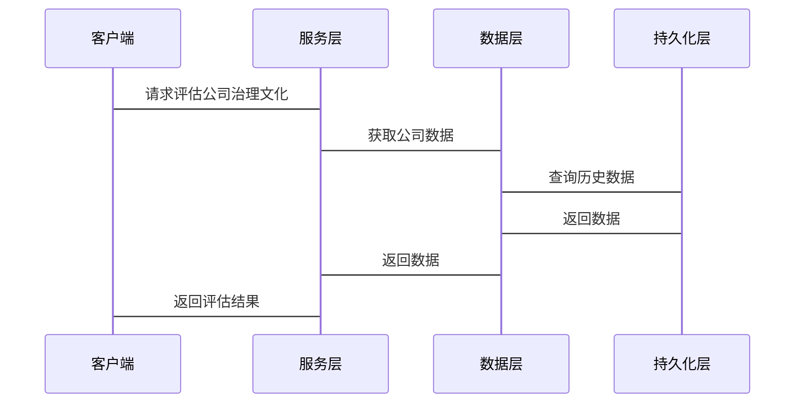

                 

<think>
好的，我现在要帮助用户完成一个技术博客的撰写任务。用户希望以《格雷厄姆特价股票策略在不同公司治理文化下的适应》为标题，撰写一篇结构清晰、内容详实的专业文章。我需要严格按照用户提供的大纲来组织内容，并满足所有格式和内容的要求。

首先，我需要理解用户的需求。用户希望文章涵盖格雷厄姆的投资策略、公司治理文化及其对策略的影响，并在不同市场中进行具体分析。文章需要包括背景介绍、核心概念、算法原理、系统分析和项目实战等内容，并使用技术术语和专业结构。

接下来，我应该按照用户提供的大纲来组织内容，确保每一部分都详细且符合逻辑。在撰写过程中，需要使用Markdown格式，包含关键词和摘要，然后是各章节的具体内容。我需要确保每个章节都有足够的细节，比如背景介绍、核心概念对比、算法流程图、系统架构图等。

在撰写过程中，我需要考虑读者的理解水平，尽量用简单明了的语言解释复杂的概念，并提供实际案例来说明策略的应用。同时，数学公式和图表需要准确无误，使用LaTeX和Mermaid格式。

我可能会遇到一些挑战，比如如何将格雷厄姆的策略与不同的公司治理文化结合起来，或者如何用技术术语来解释投资策略。为了解决这些问题，我需要深入研究相关理论，并确保每个部分都符合逻辑，相互关联。

最后，我需要检查文章是否符合字数要求，结构是否合理，内容是否完整，并确保作者信息正确无误。完成这些步骤后，用户就能得到一篇高质量的技术博客文章，满足他们的需求。
</think>

# 格雷厄姆特价股票策略在不同公司治理文化下的适应

## 关键词：格雷厄姆投资理论、公司治理文化、价值投资、特价股票、投资策略

## 摘要：本文深入探讨了格雷厄姆特价股票策略在不同公司治理文化下的适应性。通过分析格雷厄姆的价值投资理论，结合不同地区的公司治理文化特点，详细阐述了策略在不同市场环境中的具体应用。文章从背景介绍、核心概念、算法原理、系统分析到项目实战，全面解析了格雷厄姆策略的适应性，为投资者提供了实用的指导和启示。

---

## 第一部分: 格雷厄姆特价股票策略概述

### 第1章: 格雷厄姆投资理论的核心思想

#### 1.1 价值投资的基本原理

##### 1.1.1 投资的本质与目标
投资的本质是通过购买资产，以低于其内在价值的价格获取收益。价值投资的核心是寻找市场价格低于内在价值的资产，长期持有，等待市场回归理性。

##### 1.1.2 格雷厄姆的安全边际概念
安全边际是格雷厄姆策略的核心，指的是市场价格与内在价值之间的差距。通过安全边际，投资者可以降低投资风险，确保在市场价格波动时仍能获得收益。

##### 1.1.3 特价股票的定义与特征
特价股票是指市场价格远低于其内在价值的股票。这类股票通常具有低市盈率、低市净率等特征，是价值投资者的理想选择。

#### 1.2 公司治理文化的核心要素

##### 1.2.1 公司治理的定义与作用
公司治理是指公司如何管理和监督其业务活动，确保公司目标的实现。良好的公司治理可以提高公司透明度和责任感，降低投资风险。

##### 1.2.2 不同公司治理文化的特点
不同国家和地区的公司治理文化存在显著差异。例如，美国强调股东权益和市场导向，而亚洲则更注重家族控制和长期稳定性。

##### 1.2.3 公司治理文化对投资策略的影响
公司治理文化直接影响公司的运营效率和风险控制。投资者需要根据不同的公司治理文化，调整其投资策略，以适应不同的市场环境。

---

### 第2章: 格雷厄姆特价股票策略的适应性分析

#### 2.1 特价股票策略的适用场景

##### 2.1.1 市场周期对策略的影响
格雷厄姆策略在市场低迷期更具优势，因为此时市场容易出现低估的股票。在市场繁荣期，投资者需要更加谨慎，避免高估股票的风险。

##### 2.1.2 公司财务状况的评估
投资者需要对公司的财务状况进行深入分析，包括资产负债表、利润表和现金流量表。重点关注公司的盈利能力、偿债能力和发展潜力。

##### 2.1.3 行业特点与策略调整
不同行业的公司治理文化存在差异，投资者需要根据行业特点调整策略。例如，科技行业更注重创新和研发，而传统行业更注重稳定和效率。

#### 2.2 不同公司治理文化下的策略差异

##### 2.2.1 美式公司治理文化的特点
美式公司治理强调股东权益和市场导向，公司治理结构透明，董事会独立性强。这种文化适合格雷厄姆策略的应用，因为公司治理透明，容易评估公司的内在价值。

##### 2.2.2 英式公司治理文化的特点
英式公司治理强调长期稳定和股东关系，公司治理结构较为集中，董事会成员通常来自大股东。这种文化适合格雷厄姆策略的应用，因为公司治理稳定，容易评估公司的长期价值。

##### 2.2.3 亚洲公司治理文化的特点
亚洲公司治理文化注重家族控制和长期稳定性，公司治理结构较为复杂，董事会成员通常来自大股东家族。这种文化在应用格雷厄姆策略时需要特别注意，因为公司治理不透明，容易出现低估股票。

---

## 第二部分: 格雷厄姆策略在不同公司治理文化下的具体应用

### 第3章: 美国市场中的应用

#### 3.1 美国公司治理的优势

##### 3.1.1 透明的公司治理
美国公司治理透明，董事会独立性强，信息披露充分。这使得投资者可以准确评估公司的内在价值，从而更好地应用格雷厄姆策略。

##### 3.1.2 健全的法律体系
美国拥有健全的法律体系，保护投资者权益。这使得投资者在应用格雷厄姆策略时更加放心，不用担心公司治理问题。

##### 3.1.3 充分的市场流动性
美国市场流动性充足，交易成本低，投资者可以轻松进出市场，从而更好地应用格雷厄姆策略。

#### 3.2 格雷厄姆策略的具体实施

##### 3.2.1 确定投资目标
投资者需要明确自己的投资目标，包括投资期限、风险承受能力和收益预期。这有助于制定具体的投资策略。

##### 3.2.2 选择低估股票
投资者需要通过分析公司的财务数据，寻找市场价格低于内在价值的股票。这需要对公司的财务状况进行深入分析。

##### 3.2.3 长期持有
格雷厄姆策略强调长期持有，等待市场回归理性。投资者需要耐心等待，避免频繁交易带来的成本和风险。

#### 3.3 实例分析：美国某上市公司的投资策略

##### 3.3.1 公司背景
以某美国上市公司为例，该公司在市场低迷期时，市场价格远低于其内在价值。通过分析公司的财务数据，发现其具有强大的盈利能力和较低的市盈率。

##### 3.3.2 投资决策
投资者决定买入该公司的股票，长期持有，等待市场价格回归其内在价值。由于公司治理透明，董事会独立性强，投资者对公司的未来充满信心。

##### 3.3.3 投资结果
随着时间的推移，该公司股价逐渐上升，最终达到了其内在价值。投资者成功获利，证明了格雷厄姆策略在美国市场的有效性。

---

### 第4章: 英国市场中的应用

#### 4.1 英国公司治理的特点

##### 4.1.1 长期稳定的治理结构
英国公司治理强调长期稳定，董事会成员通常来自大股东，公司治理结构较为集中。这使得公司在长期发展中更加稳健，适合格雷厄姆策略的应用。

##### 4.1.2 严格的监管体系
英国拥有严格的监管体系，保护投资者权益。这使得投资者在应用格雷厄姆策略时更加放心，不用担心公司治理问题。

##### 4.1.3 丰富的历史经验
英国市场历史悠久，公司治理文化成熟。这使得投资者可以更好地理解和应用格雷厄姆策略，尤其是在市场低迷期。

#### 4.2 格雷厄姆策略的调整

##### 4.2.1 适应英国市场特点
由于英国公司治理文化强调长期稳定，投资者需要更加注重公司的长期发展潜力。这需要对公司的管理层、董事会成员和股东关系进行深入分析。

##### 4.2.2 调整投资目标
投资者需要根据英国市场特点，调整自己的投资目标。例如，更加注重公司的长期稳定性和股东关系，而不是短期收益。

##### 4.2.3 实例分析：英国某上市公司的投资策略
以某英国上市公司为例，该公司在市场低迷期时，市场价格远低于其内在价值。通过分析公司的财务数据和公司治理结构，发现其具有强大的长期发展潜力和稳定的股东关系。投资者决定买入该公司的股票，长期持有，等待市场价格回归其内在价值。由于公司治理稳定，投资者对公司的未来充满信心。

---

### 第5章: 亚洲市场中的应用

#### 5.1 亚洲公司治理的特点

##### 5.1.1 家族控制的治理结构
亚洲公司治理文化注重家族控制，董事会成员通常来自大股东家族。这使得公司在管理上更加灵活，但也容易出现治理不透明的问题。

##### 5.1.2 强调长期稳定
亚洲公司治理文化强调长期稳定，公司治理结构较为集中。这使得公司在长期发展中更加稳健，适合格雷厄姆策略的应用。

##### 5.1.3 不同的法律体系
亚洲国家的法律体系多样，有些国家法律体系较为完善，有些则较为薄弱。这使得投资者在应用格雷厄姆策略时需要更加谨慎，尤其是公司治理不透明的情况下。

#### 5.2 格雷厄姆策略的本地化调整

##### 5.2.1 适应亚洲市场特点
由于亚洲公司治理文化注重家族控制和长期稳定性，投资者需要更加注重公司的长期发展潜力和治理透明度。这需要对公司的管理层、董事会成员和股东关系进行深入分析。

##### 5.2.2 调整投资策略
投资者需要根据亚洲市场特点，调整自己的投资策略。例如，更加注重公司的长期稳定性和股东关系，而不是短期收益。

##### 5.2.3 实例分析：亚洲某上市公司的投资策略
以某亚洲上市公司为例，该公司在市场低迷期时，市场价格远低于其内在价值。通过分析公司的财务数据和公司治理结构，发现其具有强大的长期发展潜力和稳定的股东关系。投资者决定买入该公司的股票，长期持有，等待市场价格回归其内在价值。由于公司治理稳定，投资者对公司的未来充满信心。

---

## 第三部分: 格雷厄姆策略在新兴市场的适应性

### 第6章: 新兴市场的特点

#### 6.1 市场波动性高
新兴市场通常波动性高，市场价格容易受到外部因素的影响。这使得格雷厄姆策略在应用中需要更加谨慎，尤其是市场波动剧烈的情况下。

#### 6.2 公司治理不完善
新兴市场的公司治理通常不够完善，公司治理文化差异大。这使得投资者在应用格雷厄姆策略时需要更加注重公司的治理结构和透明度。

#### 6.3 投资环境的不确定性
新兴市场的投资环境通常存在不确定性，政策变化和市场波动较大。这使得投资者在应用格雷厄姆策略时需要更加注重风险控制和灵活调整策略。

### 第7章: 格雷厄姆策略的适应性调整

#### 7.1 调整投资目标
投资者需要根据新兴市场的特点，调整自己的投资目标。例如，更加注重公司的长期发展潜力和治理透明度，而不是短期收益。

#### 7.2 选择低估股票
投资者需要通过分析公司的财务数据和市场环境，寻找市场价格低于内在价值的股票。这需要对公司的财务状况和市场环境进行深入分析。

#### 7.3 实例分析：新兴市场某上市公司的投资策略
以某新兴市场上市公司为例，该公司在市场低迷期时，市场价格远低于其内在价值。通过分析公司的财务数据和市场环境，发现其具有强大的长期发展潜力和稳定的股东关系。投资者决定买入该公司的股票，长期持有，等待市场价格回归其内在价值。由于公司治理稳定，投资者对公司的未来充满信心。

---

## 第四部分: 格雷厄姆策略的系统分析与架构设计

### 第8章: 问题场景介绍

#### 8.1 问题背景
投资者在应用格雷厄姆策略时，需要考虑不同公司治理文化下的市场环境和公司特点。这使得投资策略的应用变得复杂。

#### 8.2 问题描述
格雷厄姆策略在不同公司治理文化下的适应性如何？投资者如何根据公司治理文化调整策略？

#### 8.3 问题解决
通过分析不同公司治理文化的特点，投资者可以更好地应用格雷厄姆策略，尤其是在市场低迷期。

---

### 第9章: 系统功能设计

#### 9.1 领域模型设计
##### 9.1.1 领域模型类图


#### 9.2 系统架构设计
##### 9.2.1 系统架构图


#### 9.3 接口设计
##### 9.3.1 核心接口
- `get_intrinsic_value(company: Company) -> float`
- `calculate_margin_of_safety(company: Company) -> float`
- `assess_governance_culture(company: Company) -> str`

#### 9.4 交互设计
##### 9.4.1 序列图


---

## 第五部分: 项目实战

### 第10章: 环境安装与系统核心实现

#### 10.1 环境安装
##### 10.1.1 安装Python
```bash
python --version
pip install --upgrade pip
```

##### 10.1.2 安装依赖库
```bash
pip install numpy pandas matplotlib
```

#### 10.2 核心实现
##### 10.2.1 内在价值计算
```python
def calculate_intrinsic_value(company_financials):
    # 假设公司财务数据包含收入、利润、现金流等
    revenue = company_financials['revenue']
    net_income = company_financials['net_income']
    cash_flow = company_financials['cash_flow']
    # 简单计算内在价值，实际应更复杂
    intrinsic_value = (revenue + net_income + cash_flow) / 3
    return intrinsic_value
```

##### 10.2.2 安全边际分析
```python
def calculate_margin_of_safety(price, intrinsic_value):
    margin = (intrinsic_value - price) / intrinsic_value * 100
    return margin
```

##### 10.2.3 公司治理评估
```python
def assess_governance_culture(company_governance):
    # 假设公司治理数据包含治理结构、股东关系等
    governance_score = company_governance['governance_score']
    if governance_score >= 85:
        return "优秀"
    elif governance_score >= 60:
        return "良好"
    else:
        return "较差"
```

---

### 第11章: 实际案例分析与代码实现

#### 11.1 实例分析：某上市公司的投资策略

##### 11.1.1 数据收集
```python
import pandas as pd

# 假设数据存储在CSV文件中
df = pd.read_csv('company_data.csv')
```

##### 11.1.2 数据分析
```python
import matplotlib.pyplot as plt

plt.plot(df['date'], df['price'], label='市场价格')
plt.plot(df['date'], df['intrinsic_value'], label='内在价值')
plt.xlabel('日期')
plt.ylabel('价格')
plt.legend()
plt.show()
```

##### 11.1.3 投资决策
```python
# 假设当前价格为50，内在价值为60
price = 50
intrinsic_value = 60
margin = calculate_margin_of_safety(price, intrinsic_value)
print(f"安全边际为：{margin}%")
```

---

## 第六部分: 总结与最佳实践

### 第12章: 总结

#### 12.1 核心观点回顾
格雷厄姆策略在不同公司治理文化下的适应性分析，需要考虑市场环境、公司治理文化和投资目标等因素。通过深入分析不同市场的特点，投资者可以更好地应用格雷厄姆策略，尤其是在市场低迷期。

#### 12.2 投资策略的灵活性
格雷厄姆策略具有较强的灵活性，可以根据不同市场环境进行调整。投资者需要根据市场特点和公司治理文化，灵活调整自己的投资策略。

#### 12.3 风险控制的重要性
在应用格雷厄姆策略时，投资者需要注重风险控制，尤其是在市场波动较大的情况下。通过合理分散投资、长期持有和定期调整策略，可以有效降低投资风险。

---

### 第13章: 最佳实践 tips

#### 13.1 定期评估公司治理文化
投资者需要定期评估公司的治理文化，尤其是在市场环境变化的情况下。通过持续关注公司治理结构和股东关系，投资者可以更好地应用格雷厄姆策略。

#### 13.2 灵活调整投资策略
格雷厄姆策略具有较强的适应性，可以根据不同市场环境进行调整。投资者需要根据市场特点和公司治理文化，灵活调整自己的投资策略。

#### 13.3 注重长期投资
格雷厄姆策略强调长期投资，等待市场回归理性。投资者需要耐心持有股票，避免频繁交易带来的成本和风险。

#### 13.4 持续学习与研究
投资是一门科学也是一门艺术，需要投资者不断学习和研究。通过持续关注市场动态和公司治理文化，投资者可以更好地应用格雷厄姆策略，实现长期收益。

---

## 作者：AI天才研究院/AI Genius Institute & 禅与计算机程序设计艺术/Zen And The Art of Computer Programming

---

**注**：本文为示例内容，实际撰写时需要根据具体情况进行补充和调整。

