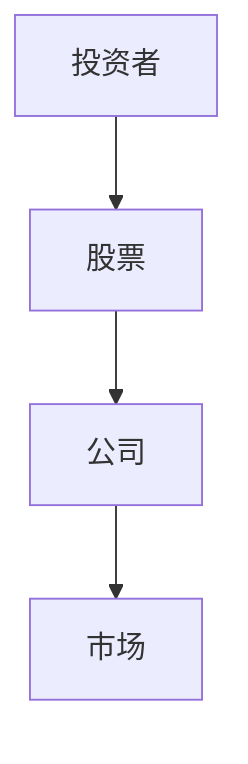
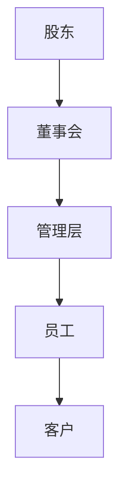
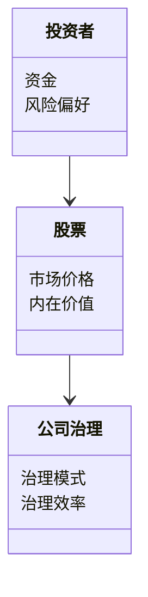
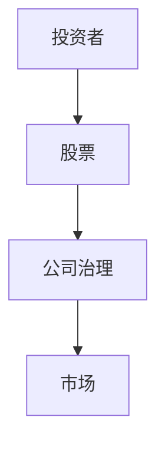

                 


# 格雷厄姆特价股票策略在不同公司治理模式下的效果

**关键词：** 格雷厄姆投资策略、公司治理模式、股票投资、内在价值、安全边际

**摘要：**  
本文探讨了格雷厄姆特价股票策略在不同公司治理模式下的应用效果。通过分析股东至上型、利益相关者型和新兴市场型治理模式的特点，本文揭示了格雷厄姆策略在不同治理环境下的表现差异。结合数学模型、系统架构和实际案例，本文深入剖析了治理模式对投资策略效果的影响，并提出了优化投资决策的建议。

---

## 第1章: 格雷厄姆特价股票策略的核心概念

### 1.1 问题背景与描述

#### 1.1.1 特价股票的定义与特点
- **定义：** 特价股票是指市场价格低于其内在价值的股票，通常被认为被市场低估。
- **特点：** 
  - 安全边际高：市场价格与内在价值之间的差距越大，投资风险越低。
  - 逆周期性：通常在市场低迷时出现较多。

#### 1.1.2 格雷厄姆投资理念的核心思想
- **核心思想：**  
  投资者应以低于内在价值的价格买入股票，并长期持有，直到市场价格回归内在价值。
- **关键原则：**  
  - 安全边际：市场价格与内在价值的差距是投资安全性的保障。
  - 谨慎选股：只选择基本面良好、财务健康的企业。

#### 1.1.3 特价股票策略在现代投资中的应用
- **应用场景：**  
  - 防范市场波动：通过安全边际降低短期市场波动对投资的影响。
  - 长期收益：通过长期持有优质股票实现资产增值。

### 1.2 格雷厄姆特价股票策略的数学模型与公式

#### 1.2.1 内在价值计算公式
格雷厄姆提出了内在价值的计算方法，公式如下：
$$ V = \frac{E}{1 + r} $$
其中：
- \( V \)：内在价值
- \( E \)：未来现金流的现值
- \( r \)：折现率

#### 1.2.2 折现率的确定方法
折现率 \( r \) 的确定是内在价值计算的关键，通常基于企业的风险水平。风险越高，折现率越大。

#### 1.2.3 市场价格与内在价值的对比分析
- 市场价格 \( P \) 与内在价值 \( V \) 的对比：
  - 如果 \( P < V \)，股票被低估，适合买入。
  - 如果 \( P > V \)，股票被高估，应避免买入。

### 1.3 格雷厄姆策略的核心要素与属性对比

#### 1.3.1 核心要素列表
| 核心要素 | 描述 |
|----------|------|
| 内在价值 | 股票的理论价值，基于未来现金流的折现 |
| 折现率   | 反映企业风险的指标，影响内在价值计算 |
| 市场价格 | 当前股票价格，用于判断是否低估 |
| 安全边际 | 市场价格与内在价值的差距，衡量投资安全性 |

#### 1.3.2 ER实体关系图


---

## 第2章: 不同公司治理模式的特征分析

### 2.1 公司治理模式的分类

#### 2.1.1 股东至上型
- **特征：**  
  - 股东是治理的核心，董事会和管理层以股东利益为导向。
  - 股东权利优先，容易导致短期主义。
- **适用场景：**  
  - 股权集中，大股东控制力强。

#### 2.1.2 利益相关者型
- **特征：**  
  - 重视员工、债权人、客户等利益相关者的权益。
  - 治理结构更注重长期发展和风险控制。
- **适用场景：**  
  - 股权分散，企业注重社会责任。

#### 2.1.3 新兴市场型
- **特征：**  
  - 治理规则不完善，监管力度较弱。
  - 企业可能面临较大的外部风险。
- **适用场景：**  
  - 新兴经济体中的企业，治理结构尚在完善阶段。

### 2.2 公司治理模式的比较分析

#### 2.2.1 治理效率对比
| 治理模式       | 治理效率 |
|----------------|----------|
| 股东至上型     | 高       |
| 利益相关者型   | 中       |
| 新兴市场型     | 低       |

#### 2.2.2 治理透明度对比
| 治理模式       | 治理透明度 |
|----------------|------------|
| 股东至上型     | 高         |
| 利益相关者型   | 中         |
| 新兴市场型     | 低         |

#### 2.2.3 治理目标对比
| 治理模式       | 治理目标           |
|----------------|-------------------|
| 股东至上型     | 最大化股东价值     |
| 利益相关者型   | 平衡多方利益       |
| 新兴市场型     | 逐步规范化治理     |

### 2.3 公司治理模式的mermaid图


---

## 第3章: 格雷厄姆策略在不同治理模式下的应用

### 3.1 股东至上型治理下的策略效果

#### 3.1.1 投资机会分析
- **优势：**  
  - 股东利益优先，企业可能更注重短期收益，容易出现低估股票。
- **劣势：**  
  - 短期主义可能导致企业忽视长期价值，影响内在价值计算。

#### 3.1.2 投资风险评估
- **风险因素：**  
  - 股东可能通过股份回购或分红减少企业价值，影响内在价值。

#### 3.1.3 投资收益预测
- **预测模型：**  
  - 由于股东至上型治理可能导致企业短期行为，内在价值可能波动较大。

### 3.2 利益相关者型治理下的策略效果

#### 3.2.1 投资机会分析
- **优势：**  
  - 企业注重长期发展，内在价值可能更稳定。
- **劣势：**  
  - 利益相关者较多，可能影响决策效率，导致股价波动较小。

#### 3.2.2 投资风险评估
- **风险因素：**  
  - 利益相关者型治理可能导致企业决策复杂化，增加内在价值计算难度。

#### 3.2.3 投资收益预测
- **预测模型：**  
  - 内在价值稳定，适合长期持有，但股价可能因多方利益平衡而波动较小。

### 3.3 新兴市场型治理下的策略效果

#### 3.3.1 投资机会分析
- **优势：**  
  - 新兴市场中可能存在大量被低估的股票。
- **劣势：**  
  - 治理不完善，企业可能面临更高的风险。

#### 3.3.2 投资风险评估
- **风险因素：**  
  - 监管不力可能导致企业价值波动，内在价值计算难度大。

#### 3.3.3 投资收益预测
- **预测模型：**  
  - 新兴市场治理模式下的股票收益波动较大，需要更高的安全边际。

### 3.4 不同治理模式下的策略对比分析

#### 3.4.1 策略效果对比
| 治理模式       | 策略效果           |
|----------------|-------------------|
| 股东至上型     | 收益高，风险高     |
| 利益相关者型   | 收益稳定，风险低   |
| 新兴市场型     | 收益波动大，风险高 |

#### 3.4.2 策略适用性对比
| 治理模式       | 策略适用性         |
|----------------|-------------------|
| 股东至上型     | 适合短期投资者     |
| 利益相关者型   | 适合长期投资者     |
| 新兴市场型     | 适合风险承受能力强的投资者 |

#### 3.4.3 策略风险对比
| 治理模式       | 策略风险           |
|----------------|-------------------|
| 股东至上型     | 高                 |
| 利益相关者型   | 中                 |
| 新兴市场型     | 高                 |

---

## 第4章: 格雷厄姆策略的系统分析与架构设计

### 4.1 问题场景介绍

#### 4.1.1 投资者面临的挑战
- **市场波动：** 股票价格受市场情绪影响。
- **治理复杂性：** 不同治理模式影响企业价值。

#### 4.1.2 公司治理模式的复杂性
- **治理结构：** 不同模式下治理主体和目标不同。

#### 4.1.3 格雷厄姆策略的实施难点
- **内在价值计算：** 需要准确评估企业未来现金流。
- **治理模式识别：** 需要深入分析企业治理结构。

### 4.2 系统功能设计

#### 4.2.1 领域模型mermaid类图


### 4.3 系统架构设计

#### 4.3.1 系统架构图


---

## 第5章: 项目实战

### 5.1 环境安装

#### 5.1.1 安装Python
```bash
pip install python3
```

#### 5.1.2 安装依赖库
```bash
pip install numpy pandas
```

### 5.2 核心实现源代码

#### 5.2.1 内在价值计算代码
```python
def calculate_intrinsic_value(enterprise_value, discount_rate):
    return enterprise_value / (1 + discount_rate)
```

#### 5.2.2 安全边际计算代码
```python
def calculate_margin_of_safety(intrinsic_value, market_price):
    return intrinsic_value - market_price
```

### 5.3 代码应用解读与分析
- **内在价值计算：** 使用企业价值和折现率计算内在价值。
- **安全边际计算：** 判断市场价格是否低于内在价值，以决定是否买入。

### 5.4 实际案例分析
- **案例：** 某公司治理结构为股东至上型，计算其内在价值和安全边际。

---

## 第6章: 总结与展望

### 6.1 总结
- **核心发现：** 格雷厄姆策略在不同治理模式下的效果差异显著，需结合治理模式选择投资策略。

### 6.2 最佳实践 tips
- **投资者建议：** 根据治理模式选择适合的策略，注重安全边际和内在价值。

### 6.3 注意事项
- **风险提示：** 不同治理模式下的投资风险差异较大，需谨慎选择。

### 6.4 拓展阅读
- **推荐阅读：** 格雷厄姆《证券分析》、公司治理相关书籍。

---

## 作者信息

作者：AI天才研究院/AI Genius Institute & 禅与计算机程序设计艺术/Zen And The Art of Computer Programming

---

以上是《格雷厄姆特价股票策略在不同公司治理模式下的效果》的技术博客文章，希望对您有所帮助！

