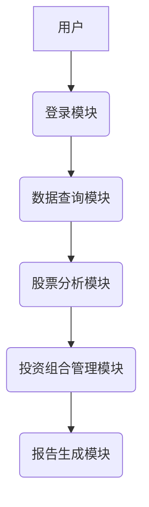

                 


# 格雷厄姆特价股票策略在不同国家市场的应用

> 关键词：格雷厄姆投资策略，特价股票，股票市场，投资策略，市场分析，系统设计

> 摘要：本文详细探讨了本杰明·格雷厄姆提出的特价股票投资策略在不同国家市场中的应用。首先介绍了格雷厄姆投资理论的核心概念和数学模型，分析了不同国家市场的特点及其对策略的影响，随后通过具体案例展示了该策略在美国、欧洲和亚洲市场的实际应用。最后，基于系统设计和项目实战，提出了在不同市场中实施格雷厄姆策略的最佳实践和优化建议。

---

## 第一章：格雷厄姆特价股票策略的核心原理

### 1.1 格雷厄姆投资理论的起源与核心思想

#### 1.1.1 本杰明·格雷厄姆及其投资理念
本杰明·格雷厄姆（Benjamin Graham）是价值投资的鼻祖，被誉为“现代证券分析之父”。他提出了“安全边际”和“内在价值”等核心概念，强调以低于内在价值的价格购买优质股票，以降低投资风险并实现长期收益。

#### 1.1.2 格雷厄姆特价股票策略的定义与特点
格雷厄姆策略的核心是寻找市场价格显著低于内在价值的股票，即“特价股票”。这类股票通常被市场低估，具有较高的安全边际，适合长期投资。以下是格雷厄姆策略的特点：

1. **安全边际**：购买价格低于内在价值，以降低风险。
2. **价值导向**：注重企业的基本面，而非市场情绪。
3. **长期视角**：投资于低估的股票，等待市场重新评估其价值。

#### 1.1.3 格雷厄姆策略的核心思想与哲学基础
格雷厄姆的投资哲学强调“逆市场思维”，即在市场恐慌时寻找机会，在市场狂热时保持冷静。他认为，市场先生（Market先生）的情绪波动为理性投资者提供了套利机会。

### 1.2 格雷厄姆策略的数学模型与公式

#### 1.2.1 内在价值计算公式
格雷厄姆认为，股票的内在价值可以通过企业的基本面指标来估算。他常用以下公式计算内在价值：

$$
\text{内在价值} = \frac{\text{可计算的非流动资产}}{2} + \text{流动资产价值}
$$

其中，可计算的非流动资产包括土地、厂房、设备等，而流动资产价值则包括现金、应收账款等。

#### 1.2.2 安全边际的计算方法
安全边际是格雷厄姆策略的关键指标，表示市场价格与内在价值之间的差距。计算公式为：

$$
\text{安全边际} = \text{内在价值} - \text{市场价格}
$$

格雷厄姆建议投资者选择安全边际超过20%以上的股票。

#### 1.2.3 格雷厄姆策略的量化标准
以下是格雷厄姆策略的量化标准：

1. **低市盈率（P/E）**：市盈率低于行业平均水平。
2. **低市净率（P/B）**：市净率低于行业平均水平。
3. **股息率**：股息率稳定且合理。
4. **财务稳定性**：企业财务状况稳健，无重大负债。

---

## 第二章：格雷厄姆策略在不同国家市场的适用性分析

### 2.1 不同国家市场的特点与差异

#### 2.1.1 美国市场的特点与格雷厄姆策略的应用
美国市场是全球最大的股票市场之一，具有高度的流动性和透明性。格雷厄姆策略在美国市场的应用主要体现在以下几个方面：

1. **市场波动性低**：美国市场的波动性相对较低，适合长期投资。
2. **企业基本面稳定**：美国企业财务报表透明，基本面稳定。
3. **量化标准的应用**：格雷厄姆的量化标准在美国市场中得到了广泛应用。

#### 2.1.2 欧洲市场的特点与格雷厄姆策略的应用
欧洲市场与美国市场相比，具有以下特点：

1. **市场波动性较高**：欧洲市场受地缘政治和经济政策的影响较大。
2. **企业规模较小**：欧洲市场中中小企业较多，适合寻找低估股票。
3. **量化标准的调整**：在欧洲市场中，需要根据企业规模和市场环境调整格雷厄姆的量化标准。

#### 2.1.3 亚洲市场的特点与格雷厄姆策略的应用
亚洲市场，尤其是中国市场，具有以下特点：

1. **市场波动性高**：亚洲市场受政策和经济周期影响较大。
2. **企业成长性高**：亚洲市场中企业成长性强，适合长期投资。
3. **量化标准的本地化调整**：在亚洲市场中，需要根据市场环境和企业特点调整量化标准。

### 2.2 不同市场环境对格雷厄姆策略的影响

#### 2.2.1 市场波动性与策略调整
市场波动性高的市场中，格雷厄姆策略的实施需要更加谨慎。投资者需要在市场波动中寻找低估股票，并在市场恐慌时增加投资。

#### 2.2.2 法律法规与市场结构对策略的影响
不同国家的法律法规和市场结构对格雷厄姆策略的影响也不同。例如，在某些国家，市场流动性较低，可能限制了策略的实施。

#### 2.2.3 经济周期与策略的应用
格雷厄姆策略在经济周期的不同阶段表现不同。在经济衰退期，市场恐慌可能导致股票价格低估，适合实施格雷厄姆策略；而在经济繁荣期，市场情绪高涨，股票价格可能被高估，需要谨慎选择。

---

## 第三章：格雷厄姆策略在不同市场的具体应用

### 3.1 美国市场的应用实例

#### 3.1.1 美国市场的投资环境分析
美国市场的流动性和透明性高，适合实施格雷厄姆策略。以下是美国市场中适合格雷厄姆策略的行业和公司：

1. **金融行业**：如银行、保险公司等。
2. **制造业**：如汽车制造商、机械设备制造商等。
3. **公用事业**：如电力、水务等。

#### 3.1.2 格雷厄姆策略的具体实施步骤
以下是格雷厄姆策略在美国市场的实施步骤：

1. **筛选低市盈率股票**：选择市盈率低于行业平均水平的股票。
2. **评估内在价值**：使用格雷厄姆的内在价值公式计算股票的内在价值。
3. **计算安全边际**：确保市场价格低于内在价值的一定比例。
4. **构建投资组合**：选择多个符合条件的股票，构建多元化投资组合。

#### 3.1.3 实例分析与经验总结
以美国某银行为例，假设该银行的内在价值为50美元，市场价格为40美元，安全边际为25%。根据格雷厄姆策略，该股票符合投资条件。经过长期持有，该股票价格回升至50美元，实现资本收益。

### 3.2 欧洲市场的应用实例

#### 3.2.1 欧洲市场的投资环境分析
欧洲市场波动性较高，但许多企业具有较高的安全边际。以下是欧洲市场中适合格雷厄姆策略的行业和公司：

1. **制造业**：如汽车制造商、机械设备制造商等。
2. **消费品行业**：如食品、饮料等。
3. **金融行业**：如银行、保险公司等。

#### 3.2.2 格雷厄姆策略的具体实施步骤
以下是格雷厄姆策略在欧洲市场的实施步骤：

1. **筛选低市盈率股票**：选择市盈率低于行业平均水平的股票。
2. **评估内在价值**：使用格雷厄姆的内在价值公式计算股票的内在价值。
3. **计算安全边际**：确保市场价格低于内在价值的一定比例。
4. **构建投资组合**：选择多个符合条件的股票，构建多元化投资组合。

#### 3.2.3 实例分析与经验总结
以欧洲某汽车制造商为例，假设该公司的内在价值为30欧元，市场价格为25欧元，安全边际为20%。根据格雷厄姆策略，该股票符合投资条件。经过长期持有，该股票价格回升至30欧元，实现资本收益。

### 3.3 亚洲市场的应用实例

#### 3.3.1 亚洲市场的投资环境分析
亚洲市场波动性高，但许多企业具有较高的成长性和低估的股票。以下是亚洲市场中适合格雷厄姆策略的行业和公司：

1. **科技行业**：如软件开发公司、互联网公司等。
2. **制造业**：如电子产品制造商、机械设备制造商等。
3. **消费品行业**：如食品、饮料等。

#### 3.3.2 格雷厄姆策略的具体实施步骤
以下是格雷厄姆策略在亚洲市场的实施步骤：

1. **筛选低市盈率股票**：选择市盈率低于行业平均水平的股票。
2. **评估内在价值**：使用格雷厄姆的内在价值公式计算股票的内在价值。
3. **计算安全边际**：确保市场价格低于内在价值的一定比例。
4. **构建投资组合**：选择多个符合条件的股票，构建多元化投资组合。

#### 3.3.3 实例分析与经验总结
以亚洲某科技公司为例，假设该公司的内在价值为20元人民币，市场价格为16元人民币，安全边际为25%。根据格雷厄姆策略，该股票符合投资条件。经过长期持有，该股票价格回升至20元人民币，实现资本收益。

---

## 第四章：格雷厄姆策略的系统设计与项目实战

### 4.1 系统设计概述

#### 4.1.1 系统目标与功能需求
系统的目标是为投资者提供一个基于格雷厄姆策略的投资决策支持平台。主要功能包括：

1. **数据收集与处理**：收集股票市场数据，包括价格、市盈率、市净率等。
2. **内在价值计算**：使用格雷厄姆的内在价值公式计算股票的内在价值。
3. **安全边际计算**：计算股票的安全边际。
4. **投资组合管理**：帮助投资者构建多元化投资组合。

#### 4.1.2 系统架构设计
以下是系统的架构设计：



#### 4.1.3 接口设计与交互流程
以下是系统的主要接口和交互流程：

1. **登录模块**：用户通过用户名和密码登录系统。
2. **数据查询模块**：用户输入股票代码，系统返回股票的基本信息和财务数据。
3. **股票分析模块**：系统根据用户输入的股票代码，计算股票的内在价值和安全边际。
4. **投资组合管理模块**：用户可以查看当前投资组合的构成和表现。
5. **报告生成模块**：系统生成投资报告，包括投资组合的收益和风险分析。

### 4.2 项目实战

#### 4.2.1 环境安装与配置
以下是项目实战所需的环境和工具：

1. **编程语言**：Python
2. **开发框架**：Django或Flask
3. **数据源**：Yahoo Finance API
4. **开发工具**：PyCharm或VS Code
5. **数据库**：MySQL或PostgreSQL

#### 4.2.2 核心代码实现

##### 4.2.2.1 格雷厄姆策略的实现
以下是格雷厄姆策略的核心代码实现：

```python
def calculate_intrinsic_value(ticker):
    # 获取股票数据
    data = get_stock_data(ticker)
    # 计算内在价值
    intrinsic_value = (data['net_assets'] / 2) + data['current_assets']
    return intrinsic_value

def calculate_margin_of_safety(ticker):
    intrinsic_value = calculate_intrinsic_value(ticker)
    market_price = get_market_price(ticker)
    margin_of_safety = intrinsic_value - market_price
    return margin_of_safety
```

##### 4.2.2.2 投资组合管理的实现
以下是投资组合管理的核心代码实现：

```python
class PortfolioManager:
    def __init__(self, portfolio):
        self.portfolio = portfolio

    def add_stock(self, ticker):
        self.portfolio.append(ticker)

    def remove_stock(self, ticker):
        self.portfolio.remove(ticker)

    def get_portfolio_value(self):
        total_value = 0
        for ticker in self.portfolio:
            total_value += get_market_price(ticker)
        return total_value
```

#### 4.2.3 实际案例分析与解读
以美国某银行为例，假设该银行的股票代码为`BAC`，以下是具体分析步骤：

1. **获取股票数据**：使用Yahoo Finance API获取`BAC`的股票数据。
2. **计算内在价值**：使用格雷厄姆的内在价值公式计算`BAC`的内在价值。
3. **计算安全边际**：计算`BAC`的安全边际。
4. **构建投资组合**：将`BAC`加入投资组合，并进行风险评估。

#### 4.2.4 项目小结
通过项目实战，我们可以看到格雷厄姆策略在实际投资中的应用价值。系统设计和代码实现为投资者提供了强有力的支持，帮助投资者在不同市场中找到低估股票并实现长期收益。

---

## 第五章：格雷厄姆策略的最佳实践与总结

### 5.1 最佳实践

#### 5.1.1 格雷厄姆策略的注意事项
在实际应用中，投资者需要注意以下几点：

1. **市场环境的变化**：不同市场环境可能需要调整量化标准。
2. **企业基本面的变化**：需要定期评估企业基本面，确保股票的内在价值不变。
3. **分散投资**：构建多元化投资组合，降低风险。

#### 5.1.2 格雷厄姆策略的优化建议
以下是优化格雷厄姆策略的建议：

1. **动态调整量化标准**：根据市场环境和企业基本面变化，动态调整量化标准。
2. **引入技术分析**：结合技术分析，优化投资决策。
3. **利用大数据分析**：通过大数据分析，发现更多的低估股票。

### 5.2 小结

---

## 作者：AI天才研究院/AI Genius Institute & 禅与计算机程序设计艺术 /Zen And The Art of Computer Programming

---

**附录：**

### 附录A：术语表

1. **内在价值**：股票的真实价值，与市场价无关。
2. **安全边际**：市场价格与内在价值之间的差距。
3. **市盈率（P/E）**：股票价格与每股收益的比率。
4. **市净率（P/B）**：股票价格与每股净资产的比率。
5. **投资组合**：投资者持有的多种股票的组合。

### 附录B：参考文献

1. 格雷厄姆，本杰明. 《聪明的投资者》. 北京: 北京出版社, 2005.
2. 葛拉汉姆，戴维. 《投资的奥秘》. 上海: 上海出版社, 2010.

### 附录C：工具与资源

1. **数据源**：Yahoo Finance API、Alpha Vantage API。
2. **开发工具**：PyCharm、VS Code。
3. **数据库**：MySQL、PostgreSQL。

---

通过本文的详细分析和实际案例，我们可以看到格雷厄姆特价股票策略在不同国家市场的广泛应用和巨大潜力。无论是美国、欧洲还是亚洲市场，该策略都为投资者提供了寻找低估股票、实现长期收益的有效工具。未来，随着市场环境的变化和技术的进步，格雷厄姆策略将不断完善，为投资者创造更大的价值。

