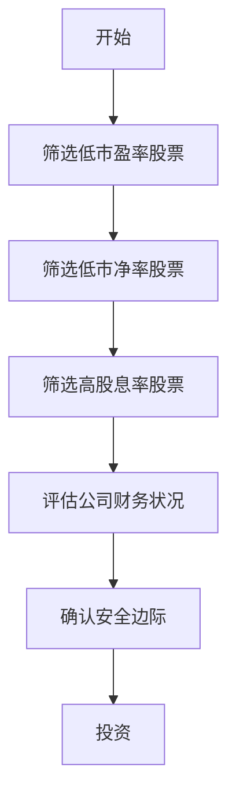
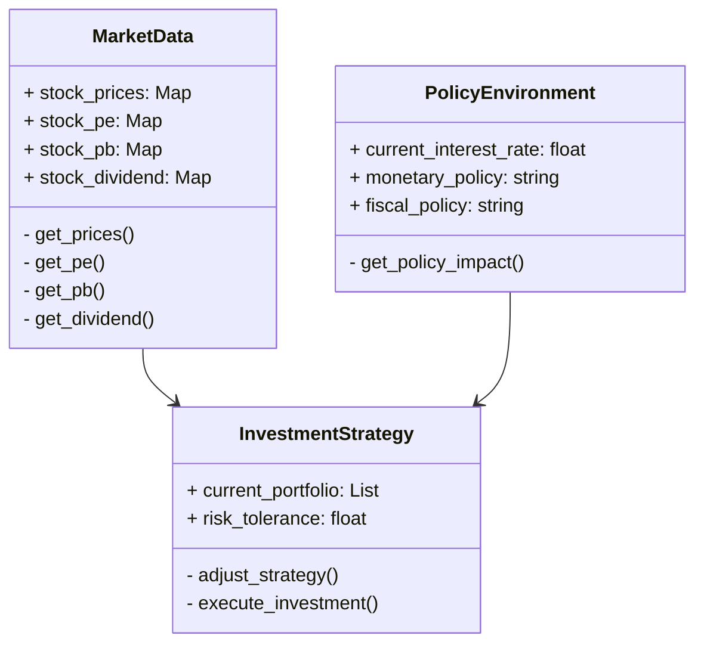
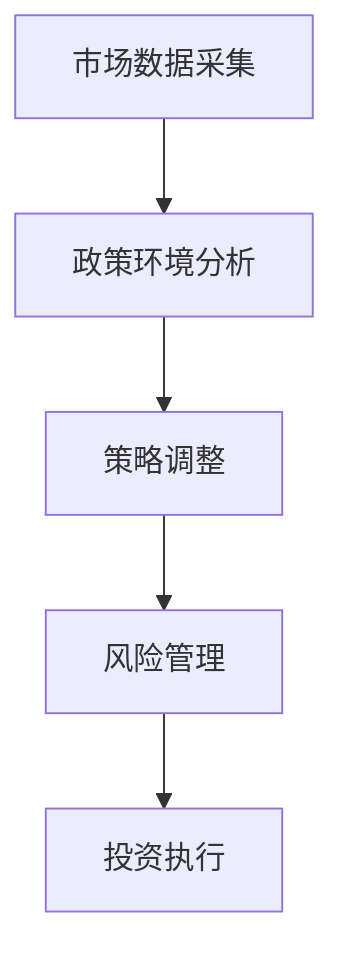
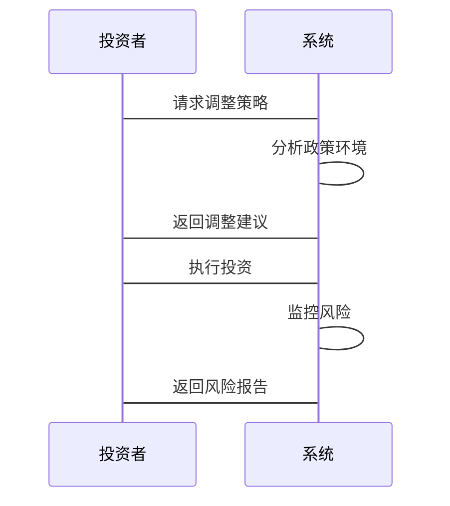

                 

# 格雷厄姆特价股票策略在不同央行政策环境下的调整

**关键词**：格雷厄姆策略、央行政策、股票投资、风险管理、价值投资、系统架构、动态调整

**摘要**：本文系统分析了格雷厄姆特价股票策略在不同央行政策环境下的调整方法。首先介绍了格雷厄姆策略的基本理论，包括其核心概念、数学模型和财务报表分析的关键指标。接着分析了央行政策对股市的影响，包括货币政策工具、政策周期对市场的影响。然后详细探讨了如何在不同政策环境下调整格雷厄姆策略，包括指标筛选、风险管理模型和动态调整方法。通过实际案例分析，结合系统架构设计，构建了格雷厄姆策略在不同政策环境下的投资框架，并总结了最佳实践和未来展望。

---

## 第一部分: 格雷厄姆特价股票策略的基本理论

### 第1章: 格雷厄姆特价股票策略的核心概念

#### 1.1 格雷厄姆投资理念概述

##### 1.1.1 价值投资的起源与发展
价值投资的起源可以追溯到本杰明·格雷厄姆（Benjamin Graham）在20世纪初的理论。格雷厄姆是现代价值投资的鼻祖，他的投资理念强调以低于内在价值的价格购买股票，以规避风险并追求长期稳定的投资回报。

格雷厄姆的理论在《 Intelligent Investor》一书中得到了详细阐述。他认为，股票不仅仅是价格波动的金融工具，更是公司的一部分所有权。因此，投资者应该以企业的角度来看待投资，寻找那些具有稳定盈利能力和较低估值的公司。

##### 1.1.2 格雷厄姆策略的核心思想
格雷厄姆策略的核心思想是“安全边际”。他主张以低于内在价值的价格购买股票，以确保即使市场出现波动，投资者也能获得稳定的收益。他强调，投资者应该关注企业的基本面，包括财务状况、盈利能力、行业地位等，而不是市场的短期波动。

##### 1.1.3 特价股票的定义与特征
特价股票是指那些市场价格低于其内在价值的股票。这类股票通常具有以下特征：
- 低市盈率（P/E ratio）：市盈率低于行业平均水平。
- 低市净率（P/B ratio）：市净率低于行业平均水平。
- 高股息率（Dividend Yield）：股息率高于行业平均水平。
- 稳定的盈利能力：过去几年的盈利情况稳定，且没有重大财务风险。

##### 1.1.4 格雷厄姆策略的决策树模型
格雷厄姆策略的决策树模型可以帮助投资者系统地筛选出符合条件的特价股票。以下是格雷厄姆策略的决策树模型示例：

#### 1.2 格雷厄姆策略的数学模型

##### 1.2.1 格雷厄姆的内在价值公式
格雷厄姆提出了内在价值（Intrinsic Value）的计算公式：

$$ V = \frac{E}{PE} \times P $$

其中：
- \( V \) 为内在价值
- \( E \) 为公司 earnings（盈利）
- \( PE \) 为市盈率
- \( P \) 为市场价格

##### 1.2.2 市盈率与市净率的对比分析
市盈率（P/E）和市净率（P/B）是衡量股票价值的两个重要指标。以下是两者的对比分析：

| 指标 | 定义 | 适用场景 |
|------|------|----------|
| P/E  | 市价与每股收益的比率 | 适用于盈利稳定的公司 |
| P/B  | 市价与每股净资产的比率 | 适用于资产密集型行业 |

##### 1.2.3 格雷厄姆策略的核心要素
格雷厄姆策略的核心要素包括：
- **财务报表分析**：关注公司的收入、利润、现金流等指标。
- **企业盈利能力**：评估公司的盈利能力是否稳定且可持续。
- **安全边际**：确保购买价格低于内在价值。
- **风险管理**：分散投资，降低市场波动对投资组合的影响。

---

### 第2章: 央行政策对股市的影响

#### 2.1 央行政策工具与市场反应

##### 2.1.1 利率政策对股市的影响
利率政策是央行影响股市的重要工具之一。以下是利率政策对股市的影响：

- **降低利率**：降低贷款成本，刺激企业投资和消费，推动经济增长，进而推高股市。
- **提高利率**：增加贷款成本，抑制企业投资和消费，可能导致经济增长放缓，股市下跌。

##### 2.1.2 货币政策对股市的传导机制
货币政策通过以下机制影响股市：
1. **影响企业融资成本**：降低利率会降低企业的融资成本，增加投资，推动股市上涨。
2. **影响市场流动性**：增加货币供应量会提高市场流动性，推高股价。
3. **影响通货膨胀预期**：过高的货币供应可能导致通货膨胀，进而影响股市。

##### 2.1.3 财政政策对股市的间接影响
财政政策通过以下方式影响股市：
1. **政府支出增加**：增加政府支出可以刺激经济，推高股市。
2. **税收政策**：降低企业税和资本利得税可以增加企业的盈利能力和投资者的收益，推动股市上涨。

#### 2.2 不同政策周期下的市场表现

##### 2.2.1 货币宽松周期的市场特征
在货币宽松周期，央行通常会降低利率和增加货币供应量，导致以下市场特征：
- **股市上涨**：企业融资成本降低，投资增加，推动股市上涨。
- **债券收益率下降**：债券收益率下降，资金流向股市，进一步推高股市。

##### 2.2.2 货币紧缩周期的市场特征
在货币紧缩周期，央行通常会提高利率和减少货币供应量，导致以下市场特征：
- **股市下跌**：企业融资成本增加，投资减少，股市下跌。
- **债券收益率上升**：债券收益率上升，资金从股市流向债券市场，进一步打压股市。

##### 2.2.3 综合政策周期的市场表现
综合政策周期是指央行同时运用多种政策工具对市场进行调节。在综合政策周期下，市场表现取决于政策工具的组合和力度。

---

### 第3章: 格雷厄姆策略在不同央行政策环境下的调整

#### 3.1 格雷厄姆策略的核心调整原则

##### 3.1.1 保持安全边际的动态调整
在不同的央行政策环境下，投资者需要动态调整安全边际。以下是动态调整的步骤：

1. **评估当前政策环境**：分析当前的利率、货币政策和财政政策。
2. **调整安全边际**：根据政策环境调整安全边际，确保购买价格低于内在价值。
3. **定期评估**：定期评估市场环境和政策变化，及时调整安全边际。

##### 3.1.2 灵活应对政策变化的策略
投资者需要灵活应对政策变化，以下是一些应对策略：
- **分散投资**：通过分散投资降低政策变化对投资组合的影响。
- **动态调整持仓**：根据政策变化及时调整持仓，避免过度集中在某一个行业或公司。
- **关注政策信号**：密切关注央行的政策信号，提前做好准备。

##### 3.1.3 风险管理与收益平衡的优化
在不同政策环境下，投资者需要在风险管理与收益之间找到平衡点。以下是优化方法：
- **设定止损点**：在投资组合中设定止损点，避免亏损过大。
- **动态调整仓位**：根据市场环境和政策变化，动态调整仓位，平衡风险与收益。

#### 3.2 格雷厄姆策略的指标筛选与权重调整

##### 3.2.1 市盈率的动态调整公式
在不同政策环境下，市盈率的动态调整公式如下：

$$ PE_{new} = PE_{original} \times (1 + \alpha \times \text{政策影响系数}) $$

其中：
- \( PE_{new} \) 为调整后的市盈率
- \( PE_{original} \) 为原始市盈率
- \( \alpha \) 为政策影响系数
- \( \text{政策影响系数} \) 为根据当前政策环境确定的系数

##### 3.2.2 市净率的权重调整方法
市净率的权重调整方法如下：
- **低利率环境**：增加市净率的权重，因为低利率环境下资产重的公司更容易获得高估值。
- **高利率环境**：降低市净率的权重，因为高利率环境下资产重的公司可能面临更高的融资成本。

##### 3.2.3 股息率的动态评估标准
股息率的动态评估标准如下：
- **低利率环境**：股息率的重要性增加，因为低利率环境下债券收益率下降，投资者更倾向于追求股息收益。
- **高利率环境**：股息率的重要性降低，因为高利率环境下债券收益率上升，投资者可能更倾向于投资债券。

#### 3.3 格雷厄姆策略的数学模型优化

##### 3.3.1 基于政策环境的内在价值模型
在不同政策环境下，内在价值的计算公式如下：

$$ V_{new} = V_{original} \times (1 + \beta \times \text{政策影响系数}) $$

其中：
- \( V_{new} \) 为调整后的内在价值
- \( V_{original} \) 为原始内在价值
- \( \beta \) 为政策影响系数

##### 3.3.2 风险管理模型的优化
以下是风险管理模型的优化方法：
1. **设定止损点**：根据市场环境和政策变化，设定合理的止损点。
2. **分散投资**：通过分散投资降低单一资产的风险。
3. **动态调整持仓**：根据市场变化和政策调整，及时调整持仓。

---

## 第四部分: 系统化的投资框架与实践

### 第4章: 系统化投资框架的设计与实现

#### 4.1 项目介绍与系统功能设计

##### 4.1.1 项目介绍
本项目旨在构建一个基于格雷厄姆策略的系统化投资框架，能够根据不同央行政策环境下的市场变化，动态调整投资策略。

##### 4.1.2 系统功能设计
系统功能设计包括以下几个方面：
1. **市场数据采集**：采集股票市场数据，包括价格、市盈率、市净率等。
2. **政策环境分析**：分析当前政策环境，包括利率、货币政策和财政政策。
3. **策略调整**：根据政策环境调整格雷厄姆策略，动态调整投资组合。
4. **风险管理**：实时监控投资组合的风险，设定止损点和止盈点。
5. **投资执行**：根据调整后的策略执行投资操作。

##### 4.1.3 领域模型（mermaid 类图）
以下是领域模型的 mermaid 类图：

#### 4.2 系统架构设计与实现

##### 4.2.1 系统架构设计（mermaid 架构图）
以下是系统架构设计的 mermaid 架构图：

##### 4.2.2 系统接口设计
系统接口设计包括以下几个方面：
1. **市场数据接口**：提供市场数据的接口，包括股票价格、市盈率、市净率等。
2. **政策环境接口**：提供政策环境的接口，包括利率、货币政策和财政政策。
3. **策略调整接口**：提供策略调整的接口，包括调整安全边际和动态调整持仓。
4. **风险管理接口**：提供风险管理的接口，包括设定止损点和止盈点。

##### 4.2.3 系统交互设计（mermaid 序列图）
以下是系统交互设计的 mermaid 序列图：

---

## 第五部分: 结论与展望

### 第5章: 结论与展望

#### 5.1 研究总结
本文系统分析了格雷厄姆特价股票策略在不同央行政策环境下的调整方法。通过理论分析和案例研究，提出了在不同政策环境下动态调整策略的具体方法，并构建了系统化的投资框架。

#### 5.2 未来展望
未来的研究可以进一步深化以下几个方面：
1. **复杂政策环境下的策略调整**：研究在复杂政策环境下的策略调整方法，包括多政策工具同时作用的情况。
2. **人工智能在策略调整中的应用**：研究如何利用人工智能技术优化策略调整过程，提高投资效率。
3. **风险管理模型的优化**：进一步优化风险管理模型，提高投资组合的风险控制能力。

---

## 作者：AI天才研究院/AI Genius Institute & 禅与计算机程序设计艺术 /Zen And The Art of Computer Programming

