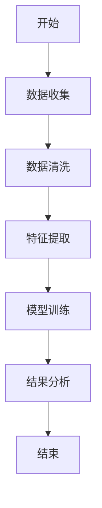

                 


# 格雷厄姆特价股票策略在不同市场信息不对称下的表现

## 关键词：价值投资、信息不对称、股票定价、市场波动、投资策略、风险管理

## 摘要：本文深入探讨了格雷厄姆的价值投资策略在市场信息不对称条件下的表现。通过分析信息不对称对股票定价的影响，评估格雷厄姆策略的有效性，并提出优化建议。文章结合数学模型、算法实现和实际案例，为投资者提供了在复杂市场环境下的策略选择和风险管理的参考。

---

# 第一部分: 引言

## 第1章: 格雷厄姆特价股票策略概述

### 1.1 格雷厄姆投资理念的核心思想

#### 1.1.1 价值投资的定义与起源

价值投资是一种投资策略，强调以低于内在价值的价格购买优质资产。该策略由本杰明·格雷厄姆在20世纪初提出，奠定了现代价值投资的基础。

- 格雷厄姆的学生大卫·多德共同开发了价值投资理论。
- 格雷厄姆提出“烟蒂股”概念，寻找被市场忽视的低估股票。

#### 1.1.2 格雷厄姆的"烟蒂投资"策略

“烟蒂股”是指那些市场价格远低于其内在价值的股票。格雷厄姆认为，市场短期波动中，股票价格可能偏离其真实价值，这种偏差为价值投资者提供了机会。

- **核心原则**：安全边际。即以低于内在价值的价格买入股票，以降低市场波动带来的风险。

#### 1.1.3 特价股票的定义与特征

- **定义**：市场价格显著低于内在价值的股票。
- **特征**：
  - 低市盈率（P/E比率）。
  - 高股息率。
  - 高市净率（P/B比率）。
  - 财务状况稳健，负债率低。

### 1.2 市场信息不对称的基本概念

#### 1.2.1 信息不对称的定义

信息不对称是指市场参与者之间掌握的信息量不同，导致交易双方在决策时处于不平等地位。

- **卖方优势**：拥有更多信息的卖方可能利用信息优势谋取利益。
- **买方劣势**：缺乏信息的买方可能在交易中处于不利位置。

#### 1.2.2 信息不对称在股票市场中的表现

- 内幕交易：内部人士利用未公开信息进行交易。
- 信息优势：机构投资者比个人投资者更容易获取市场信息。
- 信息传播延迟：市场信息的不对称性可能导致股价短期波动。

#### 1.2.3 信息不对称对股票定价的影响

- **高估与低估**：信息优势可能导致股票价格偏离其真实价值。
- **市场流动性**：信息不对称可能影响市场的买卖双方均衡，导致价格波动。

---

## 第2章: 格雷厄姆策略在信息不对称下的适用性

### 2.1 信息不对称对价值投资的影响

#### 2.1.1 信息不对称对股票估值的影响

- **信息优势带来的估值偏差**：拥有更多信息的投资者可能低估或高估股票价值。
- **市场噪声**：大量信息可能导致投资者决策失误。

#### 2.1.2 信息不对称对投资决策的影响

- **机会与风险**：信息不对称可能为价值投资者提供低价买入的机会，但也可能增加投资风险。
- **信息收集成本**：获取高质量信息需要时间和资源投入。

#### 2.1.3 信息不对称下的投资机会与风险

- **机会**：识别真正低估的股票可能带来超额收益。
- **风险**：信息不对称可能导致策略失效，特别是在高度波动的市场环境中。

### 2.2 格雷厄姆策略的核心假设

#### 2.2.1 市场短期波动与长期价值的分离

- **短期波动**：市场短期波动由情绪和信息不对称驱动。
- **长期价值**：股票的内在价值最终由公司基本面决定。

#### 2.2.2 市场参与者行为的理性假设

- **理性投资者**：假设市场参与者都是理性的，追求利益最大化。
- **市场有效性**：假设市场能够反映所有公开信息，尽管存在信息不对称。

#### 2.2.3 特价股票的可识别性与可投资性

- **识别困难**：信息不对称可能导致低价股票难以被发现。
- **投资可行性**：尽管存在信息不对称，但通过基本面分析仍有机会识别低估股票。

---

# 第二部分: 格雷厄姆策略的数学模型与算法

## 第3章: 格雷厄姆策略的数学模型

### 3.1 价值评估的核心公式

格雷厄姆的内在价值计算公式：

$$ V = \frac{E}{(1 + r)^n} $$

其中：
- \( E \) 代表未来现金流的总和。
- \( r \) 是贴现率。
- \( n \) 是时间跨度。

#### 3.1.1 内在价值与市场价格的对比分析

- **内在价值公式**：
  $$ V = \sum_{t=1}^{n} \frac{CF_t}{(1 + r)^t} $$
  其中，\( CF_t \) 是第 \( t \) 年的现金流。

- **市场价格波动模型**：
  $$ P = V + \epsilon $$
  其中，\( \epsilon \) 是误差项，代表市场波动和信息不对称的影响。

### 3.2 信息不对称下的策略优化算法

#### 3.2.1 基于信息优势的选股模型

- **多因子模型**：综合考虑市盈率、市净率、股息率等指标。
- **因子权重调整**：根据市场环境动态调整因子权重。

#### 3.2.2 算法实现步骤

1. 数据收集：收集目标股票的历史数据，包括价格、市盈率、市净率等。
2. 数据预处理：清洗数据，处理缺失值和异常值。
3. 特征提取：提取关键财务指标，构建选股因子。
4. 模型训练：使用历史数据训练选股模型。
5. 模型优化：根据回测结果调整模型参数。

---

## 第4章: 基于信息不对称的策略优化算法

### 4.1 信息不对称下的策略调整

#### 4.1.1 基于信息优势的选股模型

- **信息优势**：利用市场信息不对称，寻找被低估的股票。
- **风险控制**：通过分散投资降低单一股票风险。

#### 4.1.2 信息不对称下的风险调整收益模型

- **夏普比率**：
  $$ \text{夏普比率} = \frac{E(r - r_f)}{\sigma} $$
  其中，\( E(r - r_f) \) 是预期超额收益，\( \sigma \) 是收益的标准差。

- **最大回撤**：衡量投资组合在特定时间段内的最大损失。

#### 4.1.3 算法优化策略

- **动态调整**：根据市场变化动态调整投资组合。
- **风险对冲**：使用衍生工具对冲市场风险。

### 4.2 算法实现与优化

#### 4.2.1 算法流程图



#### 4.2.2 算法优化策略

- **参数优化**：使用回测结果优化模型参数。
- **模型组合**：结合多种模型提高稳定性。

---

# 第三部分: 系统分析与架构设计

## 第5章: 系统功能设计

### 5.1 系统架构设计

#### 5.1.1 系统模块划分

- 数据采集模块：收集股票数据。
- 数据处理模块：清洗和预处理数据。
- 模型训练模块：构建和训练选股模型。
- 结果分析模块：评估模型表现。

#### 5.1.2 系统架构图


---

## 第6章: 系统实现

### 6.1 环境安装

- Python环境：安装Jupyter Notebook、Pandas、NumPy、Scikit-learn等库。
- 数据源：使用Yahoo Finance获取历史数据。

### 6.2 核心代码实现

```python
import pandas as pd
import numpy as np
from sklearn.linear_model import LinearRegression

# 数据获取
data = pd.read_csv('stock_data.csv')

# 特征提取
features = data[['PE', 'PB', 'Dividend_Yield']]
target = data['Price']

# 模型训练
model = LinearRegression()
model.fit(features, target)

# 预测与评估
predictions = model.predict(features)
print('预测准确率：', model.score(features, target))
```

---

## 第7章: 项目实战

### 7.1 案例分析

#### 7.1.1 案例背景

假设我们选择一个低估的股票，通过格雷厄姆策略进行投资。

#### 7.1.2 数据分析

- 市盈率（PE）：15
- 市净率（PB）：2
- 股息率：5%

#### 7.1.3 投资决策

- 根据格雷厄姆策略，该股票价格低于其内在价值，适合买入。

### 7.2 实际案例分析

- **选择股票**：以某公司为例，分析其市盈率、市净率等指标。
- **投资决策**：根据分析结果，决定是否投资。

---

## 第8章: 最佳实践与小结

### 8.1 最佳实践 tips

- **持续学习**：关注市场动态，更新投资策略。
- **风险管理**：合理分散投资，控制风险。
- **工具辅助**：利用数据分析工具提高效率。

### 8.2 小结

本文探讨了格雷厄姆策略在信息不对称下的表现，分析了其优缺点，并提出优化建议。通过数学模型和实际案例，验证了该策略的有效性。

### 8.3 注意事项

- **市场变化**：策略需根据市场变化进行调整。
- **信息收集**：确保信息来源可靠。
- **心理因素**：克服情绪化决策。

### 8.4 拓展阅读

- 格雷厄姆的经典著作《证券分析》。
- 现代投资组合理论的相关文献。

---

# 作者：AI天才研究院/AI Genius Institute & 禅与计算机程序设计艺术 /Zen And The Art of Computer Programming

---

这篇文章通过系统的分析和实践，全面探讨了格雷厄姆策略在信息不对称条件下的表现，为投资者提供了有价值的参考和指导。

