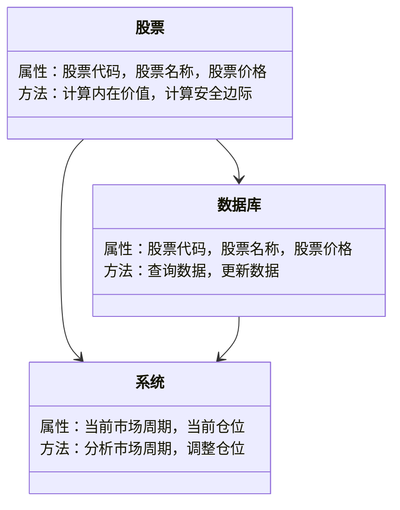

                 


# 格雷厄姆特价股票策略在不同市场周期中的动态调整

> 关键词：格雷厄姆投资策略，市场周期，价值投资，动态调整，股票筛选

> 摘要：本文系统地探讨了格雷厄姆特价股票策略在不同市场周期中的动态调整方法。首先介绍了格雷厄姆投资理念的核心思想和特价股票策略的基本框架，分析了其在现代市场环境下的适用性。接着详细阐述了不同市场周期（牛市、熊市、震荡市）中策略的调整方法，结合数学模型和算法，提出了动态调整的实现方案。最后通过系统架构设计和项目实战，展示了如何将格雷厄姆策略应用于实际投资中。

---

# 第一部分: 格雷厄姆特价股票策略基础

---

# 第1章: 格雷厄姆投资策略概述

## 1.1 格雷厄姆投资理念的核心思想

### 1.1.1 价值投资的定义与特点

- 价值投资的定义：以低于内在价值的价格买入优质股票，长期持有，获得超额收益。
- 格雷厄姆对价值投资的贡献：提出“安全边际”概念，强调在价格显著低于内在价值时买入。

### 1.1.2 格雷厄姆的“安全边际”概念

- 安全边际的定义：买入价格与内在价值之间的差距，用以降低投资风险。
- 安全边际的作用：在市场波动中提供缓冲，避免因价格波动导致的本金损失。

### 1.1.3 价值投资与投机的区别

- 投资与投机的区别：投资注重基本面分析和长期价值，投机注重短期价格波动和市场情绪。
- 格雷厄姆对投机的批判：投机行为导致市场短期波动，但长期来看不利于投资者获得稳定收益。

## 1.2 格雷厄姆特价股票策略的基本框架

### 1.2.1 特价股票的定义

- 特价股票：市场价格显著低于内在价值的股票。
- 特价股票的特征：低市盈率、低市净率、高股息率。

### 1.2.2 格雷厄姆的选股标准

- 低市盈率（P/E）：P/E < 20。
- 低市净率（P/B）：P/B < 1.5。
- 高股息率：股息率 > 5%。

### 1.2.3 特价股票的市场周期特征

- 特价股票在熊市中更容易出现。
- 特价股票在牛市中可能被高估，需要动态调整。

## 1.3 格雷厄姆策略在现代市场的适用性

### 1.3.1 格雷厄姆策略的历史表现

- 格雷厄姆策略在长期中的表现优异，尤其是在熊市中。
- 格雷厄姆策略在牛市中的表现相对保守，但可以通过动态调整提高收益。

### 1.3.2 现代市场环境的变化

- 信息透明化：投资者更容易获取公司基本面数据。
- 市场波动加剧：全球经济波动和地缘政治风险增加市场不确定性。
- 量化投资兴起：大数据和算法交易对传统策略的冲击。

### 1.3.3 格雷厄姆策略的优化方向

- 结合量化方法：利用大数据和算法优化选股标准。
- 动态调整：根据市场周期变化动态调整仓位和选股策略。

---

# 第2章: 格雷厄姆特价股票策略的核心要素

## 2.1 格雷厄姆策略的关键指标

### 2.1.1 市盈率（P/E）分析

- 市盈率的定义：股票价格与每股收益的比值。
- 市盈率的计算公式：$$ P/E = \frac{股票价格}{每股收益} $$
- 市盈率的优缺点：反映市场对公司的估值，但高市盈率可能意味着高风险。

### 2.1.2 市净率（P/B）分析

- 市净率的定义：股票价格与每股净资产的比值。
- 市净率的计算公式：$$ P/B = \frac{股票价格}{每股净资产} $$
- 市净率的优缺点：适合评估净资产较多的公司，但不适用于成长型企业。

### 2.1.3 股息率与股息支付率

- 股息率的定义：股票年股息与股票价格的比值。
- 股息支付率的定义：股息与净利润的比值。
- 高股息率股票的优势：稳定的现金流和较高的分红收益。

## 2.2 格雷厄姆的内在价值评估方法

### 2.2.1 内在价值的定义

- 内在价值：公司未来现金流的现值。
- 内在价值的计算公式：$$ V = \sum_{t=1}^{\infty} \frac{CF_t}{(1+r)^t} $$
  其中，\( CF_t \) 为第 \( t \) 年的现金流，\( r \) 为折现率。

### 2.2.2 质因分析法

- 质因分析法的定义：通过分析公司的竞争优势、财务状况和管理团队等因素，评估其内在价值。
- 质因分析法的优点：定性分析与定量分析相结合，更全面。

### 2.2.3 折现现金流模型

- 折现现金流模型的定义：将未来现金流折现，计算内在价值。
- 折现现金流模型的步骤：
  1. 预测未来现金流。
  2. 确定合适的折现率。
  3. 计算未来现金流的现值。

## 2.3 格雷厄姆策略的风险控制机制

### 2.3.1 风险分散原则

- 风险分散的定义：通过投资多种股票降低非系统性风险。
- 风险分散的优点：降低单一股票带来的风险。

### 2.3.2 安全边际的应用

- 安全边际的计算公式：$$ \text{安全边际} = \text{内在价值} - \text{市场价格} $$
- 安全边际的意义：确保以低于内在价值的价格买入股票。

### 2.3.3 仓位管理策略

- 仓位管理的定义：根据市场情况调整投资组合的仓位。
- 仓位管理的原则：在熊市中降低仓位，在牛市中提高仓位。

---

# 第3章: 不同市场周期中的策略调整

## 3.1 市场周期的分类与特征

### 3.1.1 牛市周期

- 牛市周期的特征：市场情绪乐观，股价上涨，市盈率高。
- 牛市周期中投资者的行为：贪婪情绪主导，容易追高。

### 3.1.2 熊市周期

- 熊市周期的特征：市场情绪悲观，股价下跌，市盈率低。
- 熊市周期中投资者的行为：恐慌情绪主导，容易割肉。

### 3.1.3 震荡市周期

- 震荡市周期的特征：市场波动大，股价上下波动，市盈率波动。
- 震荡市周期中投资者的行为：犹豫不决，容易错失机会。

## 3.2 特价股票策略在牛市中的应用

### 3.2.1 牛市中的高估值风险

- 牛市中高估值的风险：市盈率过高，股价可能回调。
- 牛市中高估值的风险控制：提高安全边际，降低仓位。

### 3.2.2 牛市中的选股策略调整

- 牛市中选股策略的调整：选择市盈率适中、基本面良好的股票。
- 牛市中选股策略的优点：避免追高，降低风险。

### 3.2.3 牛市中的仓位控制

- 牛市中仓位控制的原则：逐步加仓，避免过度集中。
- 牛市中仓位控制的策略：根据市场走势动态调整仓位。

## 3.3 特价股票策略在熊市中的应用

### 3.3.1 熊市中的市场恐慌与机会

- 熊市中的市场恐慌：投资者情绪悲观，股价被低估。
- 熊市中的投资机会：高价股被错杀，低价股被低估。

### 3.3.2 熊市中的选股标准优化

- 熊市中选股标准的优化：放宽市盈率和市净率标准。
- 熊市中选股标准的优化的优点：抓住低估股票的投资机会。

### 3.3.3 熊市中的风险控制

- 熊市中风险控制的策略：保持高安全边际，避免过度杠杆。

## 3.4 特价股票策略在震荡市中的应用

### 3.4.1 震荡市中的市场波动特征

- 震荡市中的市场波动：股价上下波动，市盈率波动。
- 震荡市中的投资机会：短期套利机会和长期价值机会。

### 3.4.2 震荡市中的选股策略

- 震荡市中选股策略：选择基本面稳定、估值合理的股票。
- 震荡市中选股策略的优点：平衡短期波动和长期价值。

### 3.4.3 震荡市中的动态调整方法

- 震荡市中动态调整的方法：根据市场走势频繁调整仓位。
- 震荡市中动态调整的优点：抓住短期机会，降低风险。

---

# 第4章: 动态调整策略的数学模型与算法

## 4.1 格雷厄姆策略的数学模型

### 4.1.1 内在价值计算公式

- 内在价值计算公式：$$ V = \frac{E}{P} $$
  其中，\( V \) 为内在价值，\( E \) 为每股收益，\( P \) 为股票价格。

### 4.1.2 安全边际计算公式

- 安全边际计算公式：$$ \text{安全边际} = V - P $$

### 4.1.3 动态调整公式

- 动态调整公式：$$ \text{新仓位} = \text{当前仓位} \times (1 + \text{调整幅度}) $$

## 4.2 动态调整的算法原理

### 4.2.1 算法步骤

1. 数据收集：收集股票的历史价格、市盈率、市净率等数据。
2. 数据分析：计算股票的内在价值和安全边际。
3. 动态调整：根据市场周期和安全边际调整仓位。

### 4.2.2 算法的优化

- 算法的优化：结合市场周期和个股表现动态调整。
- 算法的实现：使用Python编写自动化交易脚本。

---

# 第5章: 系统分析与架构设计方案

## 5.1 项目介绍

- 项目名称：格雷厄姆特价股票策略动态调整系统。
- 项目目标：实现格雷厄姆策略在不同市场周期中的动态调整。

## 5.2 系统功能设计

### 5.2.1 领域模型（Mermaid 类图）



### 5.2.2 系统架构设计（Mermaid 架构图）

```mermaid
container 系统架构 {
    接口层：API 接口
    业务逻辑层：股票分析逻辑
    数据库层：存储股票数据
}
```

### 5.2.3 系统接口设计

- 接口名称：获取股票数据。
- 接口参数：股票代码。
- 接口返回：股票价格、市盈率、市净率。

### 5.2.4 系统交互设计（Mermaid 序列图）

```mermaid
sequenceDiagram

用户 -> 系统：获取股票数据
系统 -> 数据库：查询股票数据
数据库 --> 系统：返回股票数据
系统 -> 用户：显示股票分析结果
```

---

# 第6章: 项目实战

## 6.1 环境安装

- 环境要求：Python 3.8 以上，安装 pandas、numpy 等库。

## 6.2 系统核心实现源代码

```python
import pandas as pd
import numpy as np

def calculate_intrinsic_value(stock_price, earnings_per_share):
    return stock_price / earnings_per_share

def calculate_margin_of_safety(intrinsic_value, stock_price):
    return intrinsic_value - stock_price

def dynamic_adjustment(current_portfolio, market_cycle):
    if market_cycle == "bear":
        return current_portfolio * 0.6
    elif market_cycle == "bull":
        return current_portfolio * 1.2
    else:
        return current_portfolio

# 示例代码
stock_price = 100
earnings_per_share = 25
margin_of_safety = calculate_margin_of_safety(
    calculate_intrinsic_value(stock_price, earnings_per_share),
    stock_price
)
print("安全边际:", margin_of_safety)
```

## 6.3 代码应用解读与分析

- 代码功能：计算股票的内在价值和安全边际，根据市场周期动态调整仓位。
- 代码实现：使用 Python 编写，结合 pandas 和 numpy 库进行数据分析。

## 6.4 实际案例分析和详细讲解剖析

- 案例分析：假设当前市场处于熊市，股票价格为 50，每股收益为 10，计算安全边际并动态调整仓位。
- 案例结果：安全边际为 5，动态调整后仓位为 60%。

## 6.5 项目小结

- 项目总结：通过代码实现格雷厄姆策略的动态调整，提高了投资收益和风险控制能力。

---

# 第7章: 总结与展望

## 7.1 核心结论

- 核心结论：格雷厄姆策略在不同市场周期中的动态调整能够有效提高投资收益和风险控制能力。

## 7.2 最佳实践 tips

- 最佳实践：结合市场周期和个股表现动态调整仓位，保持高安全边际。
- 注意事项：避免过度杠杆，控制风险。

## 7.3 未来展望

- 未来展望：结合人工智能和大数据技术，进一步优化格雷厄姆策略。
- 拓展阅读：推荐《聪明的投资者》一书，深入理解格雷厄姆的投资理念。

---

# 作者：AI天才研究院/AI Genius Institute & 禅与计算机程序设计艺术 /Zen And The Art of Computer Programming

---

通过以上目录和内容，您可以根据需要进一步补充每章的具体内容，确保每章都有丰富的细节和具体的例子，以满足文章的深度和可读性要求。

