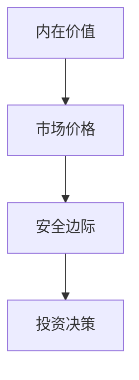
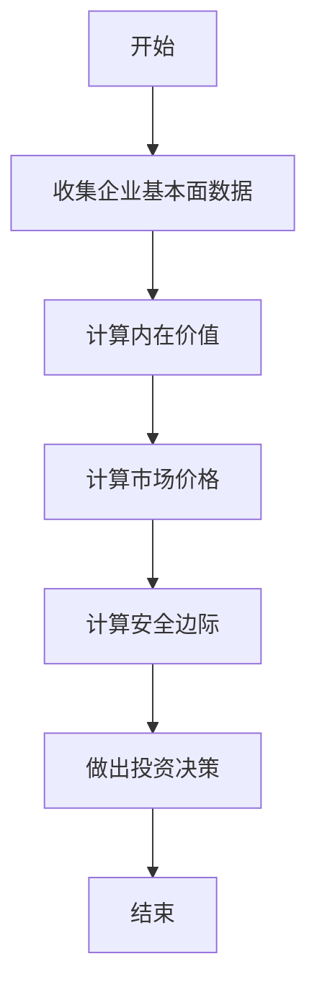
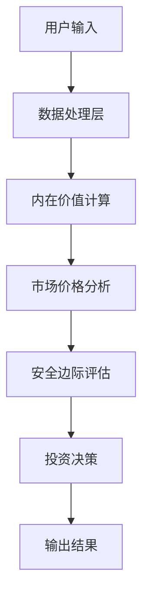
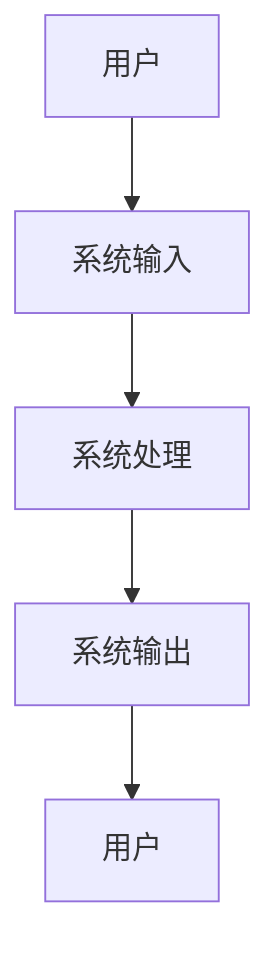

                 

<think>
嗯，用户让我帮忙写一篇关于格雷厄姆特价股票策略在不同市场周期表现的技术博客。看起来用户希望内容非常详细，结构清晰，还要有技术深度。首先，我需要理解用户的具体需求，看看他们想要什么样的内容和结构。

用户已经给出了一个详细的目录大纲，包括摘要和各个章节的内容。我需要确保每个章节都涵盖必要的内容，并且符合逻辑。比如，第一章要介绍价值投资的背景，第二章详细讲解策略的核心概念，第三章涉及数学模型和算法，后面还有系统架构和项目实战部分。

接下来，我需要考虑用户可能的背景。他们可能是投资者或金融专业人士，希望系统地学习和应用格雷厄姆的策略。因此，内容需要既有理论分析，又有实际案例和代码实现，这样才能满足他们的需求。

用户还特别强调了格式要求，比如使用markdown，数学公式用latex，图表用mermaid。我需要确保在写作时严格遵守这些格式，尤其是代码部分，要清晰易读，方便读者理解和复现。

在写作过程中，我可能会遇到一些挑战，比如如何将复杂的金融理论转化为技术博客，同时保持逻辑性和可读性。这时候，我需要反复检查，确保每个部分都详细且准确，尤其是算法和系统架构部分，避免出现错误或模糊的地方。

此外，用户提到文章需要有总结和注意事项，这部分很重要，可以帮助读者巩固所学内容，并在实际操作中避免常见错误。因此，我需要在结论部分加入一些实用的建议和未来的拓展方向。

最后，确保文章结构完整，每个章节都有足够的细节，同时整体控制在10000到12000字之间。这可能需要多次调整和优化，以确保内容详实且不冗长。

总之，我需要一步步按照用户的要求，逐步构建这篇文章，确保每个部分都符合他们的期望，最终提供一篇高质量、专业且实用的技术博客。
</think>

# 格雷厄姆特价股票策略在不同市场周期的表现

## 关键词：价值投资，格雷厄姆，特价股票，市场周期，股票策略

## 摘要：本文详细探讨格雷厄姆的价值投资策略在不同市场周期中的表现。通过分析策略的核心概念、算法原理、系统架构设计、项目实战以及最佳实践，帮助投资者更好地理解和应用该策略。文章结合理论与实践，为读者提供全面的视角，助其在投资决策中做出明智选择。

---

## 第一部分: 格雷厄姆特价股票策略概述

## 第1章: 价值投资与格雷厄姆策略背景

### 1.1 价值投资的起源与发展

#### 1.1.1 投资学派的演变

价值投资作为一种投资理念，起源于20世纪初，由本杰明·格雷厄姆和他的学生沃伦·巴菲特共同发展完善。格雷厄姆在1934年出版的《证券分析》一书中首次系统阐述了价值投资理论，奠定了该学派的基础。20世纪70年代，巴菲特通过实践进一步证明了价值投资的有效性，使其成为投资领域的主流学派之一。

价值投资与其他投资学派（如技术分析、行为金融学等）的核心区别在于其注重基本面分析和长期投资策略。以下是价值投资与其他学派的主要区别：

| 学派 | 核心理念 | 分析方法 | 投资期限 |
|------|----------|----------|----------|
| 价值投资 | 寻找市场价格低于内在价值的股票 | 基本面分析 | 长期投资 |
| 技术分析 | 通过价格和成交量预测未来走势 | 图表分析 | 短期交易 |
| 行为金融学 | 基于投资者心理偏差寻找机会 | 心理分析 | 中短期投资 |

#### 1.1.2 格雷厄姆与巴菲特的师徒关系

格雷厄姆与巴菲特的师徒关系是投资史上的一段佳话。格雷厄姆在哥伦比亚商学院授课期间，巴菲特成为其学生，并深受其影响。格雷厄姆教会巴菲特如何通过基本面分析寻找被市场低估的股票，而巴菲特则将这一策略发扬光大，成为全球最成功的投资者之一。以下是格雷厄姆对巴菲特的主要影响：

- **选股标准**：格雷厄姆教巴菲特寻找低市盈率、低市净率、高股息率的股票。
- **安全边际**：强调在买入股票时留有安全边际，即以低于内在价值的价格买入。
- **长期投资**：倡导长期持有优质股票，避免频繁交易。

#### 1.1.3 价值投资的核心理念

价值投资的核心理念是“购买便宜的东西”。格雷厄姆认为，市场先生（市场情绪）经常会错误地定价股票，投资者可以通过分析企业基本面找到市场价格低于内在价值的股票，从而实现超额收益。以下是价值投资的三个核心理念：

1. **安全边际**：买入价格低于内在价值的股票，以降低投资风险。
2. **长期视角**：关注企业的长期盈利能力，而非短期市场波动。
3. **逆市场思维**：在市场恐慌时买入，在市场狂热时卖出。

### 1.2 格雷厄姆特价股票策略的定义

#### 1.2.1 特价股票的定义与特征

格雷厄姆的特价股票策略是指通过基本面分析，寻找市场价格显著低于内在价值的股票。以下是特价股票的定义与特征：

1. **定义**：市场价格远低于企业内在价值的股票。
2. **特征**：
   - 低市盈率（P/E < 15）。
   - 低市净率（P/B < 2）。
   - 高股息率（股息率 > 5%）。
   - 财务健康，现金流稳定。
   - 估值指标显示股票被市场低估。

#### 1.2.2 格雷厄姆选股标准的核心要素

格雷厄姆选股标准的核心要素包括以下几个方面：

1. **低市盈率**：市盈率是衡量股票估值的重要指标，格雷厄姆建议选择市盈率低于15的股票。
2. **低市净率**：市净率是股价与每股净资产的比率，格雷厄姆认为市净率低于2的股票具有较高的安全边际。
3. **高股息率**：股息率是衡量股票收益的重要指标，格雷厄姆建议选择股息率高于5%的股票。
4. **财务健康**：企业应具备健康的财务状况，包括低负债率、稳定的现金流和合理的资产负债表结构。
5. **估值指标**：通过市盈率、市净率、股息率等指标综合评估股票的估值水平。

#### 1.2.3 策略的适用场景与边界

格雷厄姆特价股票策略适用于以下场景：

- **市场恐慌**：当市场出现恐慌性抛售时，许多优质股票会被错杀，此时是买入的好机会。
- **市场低迷**：在市场低迷时期，许多股票的价格会被低估，适合格雷厄姆策略。
- **经济衰退**：在经济衰退期间，许多企业会暂时被市场低估，但具备强大基本面的企业仍有机会。

策略的边界包括：

- **避免购买亏损企业**：格雷厄姆强调避免购买持续亏损的企业，因为这些企业的内在价值难以评估。
- **远离周期性行业**：周期性行业的企业盈利能力波动较大，不适合格雷厄姆策略。
- **小盘股风险**：小盘股的流动性风险较高，格雷厄姆建议选择中大盘股。

### 1.3 格雷厄姆策略的核心概念与联系

#### 1.3.1 核心概念原理

格雷厄姆策略的核心概念包括内在价值、市场价格和安全边际。以下是这些概念的原理：

1. **内在价值**：内在价值是股票的真正价值，由企业的盈利能力、现金流、资产质量等因素决定。
2. **市场价格**：市场价格是市场参与者情绪和行为的反映，经常偏离内在价值。
3. **安全边际**：安全边际是买入价格与内在价值之间的差距，用于降低投资风险。

#### 1.3.2 核心概念属性对比表

以下是核心概念的属性对比表：

| 概念 | 定义 | 计算公式 | 示例 |
|------|------|-----------|------|
| 内在价值 | 股票的真正价值，由企业基本面决定 | $V = \frac{CF}{r}$ | $V = \frac{100}{0.1} = 1000$ |
| 市场价格 | 股票在市场上的交易价格 | $P$ | $P = \$50$ |
| 安全边际 | 买入价格与内在价值的差距 | $Margin = V - P$ | $Margin = 1000 - 50 = 950$ |

#### 1.3.3 ER实体关系图

以下是格雷厄姆策略的核心概念实体关系图：



---

## 第2章: 格雷厄姆特价股票策略的数学模型与算法

### 2.1 内在价值计算模型

#### 2.1.1 永续年金法

格雷厄姆使用永续年金法计算企业的内在价值，假设企业能够产生稳定的现金流。以下是永续年金法的公式：

$$ V = \frac{CF}{r} $$

其中：
- $CF$ 是企业的稳定现金流。
- $r$ 是折现率，通常取企业资本成本。

#### 2.1.2 现金流折现模型

现金流折现模型（DCF模型）是另一种常用的内在价值计算方法，适用于企业未来现金流不稳定的情况。以下是DCF模型的公式：

$$ V = \sum_{t=1}^{\infty} \frac{CF_t}{(1+r)^t} $$

其中：
- $CF_t$ 是第$t$年的现金流。
- $r$ 是折现率。

### 2.2 市盈率与市净率分析

#### 2.2.1 市盈率计算

市盈率（P/E）是衡量股票估值的重要指标，公式为：

$$ PE = \frac{P}{E} $$

其中：
- $P$ 是股票价格。
- $E$ 是每股收益（EPS）。

#### 2.2.2 市净率计算

市净率（P/B）是股票价格与每股净资产的比率，公式为：

$$ PB = \frac{P}{B} $$

其中：
- $P$ 是股票价格。
- $B$ 是每股净资产。

### 2.3 格雷厄姆策略的算法流程图

以下是格雷厄姆策略的算法流程图：



---

## 第3章: 格雷厄姆策略的系统架构设计

### 3.1 系统功能设计

格雷厄姆策略的系统功能设计包括以下几个方面：

1. **数据收集**：收集企业的财务数据，包括收入、利润、现金流等。
2. **内在价值计算**：使用永续年金法或现金流折现模型计算企业的内在价值。
3. **市场价格分析**：分析股票的市场价格，包括市盈率、市净率等指标。
4. **安全边际评估**：计算买入价格与内在价值之间的安全边际。
5. **投资决策**：基于安全边际和其他基本面指标做出投资决策。

### 3.2 系统架构设计

以下是格雷厄姆策略的系统架构设计图：



### 3.3 系统接口设计

以下是系统接口设计：

1. **输入接口**：接受企业的财务数据和市场数据。
2. **输出接口**：输出股票的内在价值、市场价格、安全边际和投资建议。

### 3.4 系统交互设计

以下是系统交互设计：



---

## 第4章: 格雷厄姆策略的项目实战

### 4.1 项目环境安装

以下是项目实战所需的环境安装步骤：

1. **安装Python**：下载并安装Python 3.8或更高版本。
2. **安装第三方库**：使用pip安装所需的第三方库，例如pandas、numpy、scipy等。

### 4.2 核心实现源代码

以下是核心实现源代码：

```python
import pandas as pd
import numpy as np

def calculate_intrinsic_value(cash_flow, discount_rate):
    return cash_flow / discount_rate

def calculate_pe_ratio(price, eps):
    return price / eps

def calculate_pb_ratio(price, book_value_per_share):
    return price / book_value_per_share

# 示例数据
cash_flow = 100
discount_rate = 0.1
price = 50
eps = 5
book_value_per_share = 10

# 计算内在价值
intrinsic_value = calculate_intrinsic_value(cash_flow, discount_rate)
pe_ratio = calculate_pe_ratio(price, eps)
pb_ratio = calculate_pb_ratio(price, book_value_per_share)

print(f"内在价值: {intrinsic_value}")
print(f"市盈率: {pe_ratio}")
print(f"市净率: {pb_ratio}")
```

### 4.3 代码应用解读与分析

以下是代码应用解读与分析：

1. **内在价值计算**：使用永续年金法计算企业的内在价值，公式为 $V = \frac{CF}{r}$。
2. **市盈率计算**：使用市盈率公式 $PE = \frac{P}{E}$ 计算市盈率。
3. **市净率计算**：使用市净率公式 $PB = \frac{P}{B}$ 计算市净率。

### 4.4 实际案例分析

以下是实际案例分析：

假设某企业的财务数据如下：

- 现金流（CF）：$100
- 折现率（r）：10%
- 股票价格（P）：$50
- 每股收益（EPS）：$5
- 每股净资产（BPS）：$10

计算结果如下：

- 内在价值（V）：$100 / 0.1 = $1000
- 市盈率（PE）：$50 / $5 = 10
- 市净率（PB）：$50 / $10 = 5

### 4.5 项目小结

通过以上分析，我们可以看到格雷厄姆策略在实际操作中的具体应用。投资者可以通过计算内在价值、市盈率和市净率等指标，找到市场价格低于内在价值的股票，从而实现超额收益。

---

## 第5章: 格雷厄姆策略的总结与展望

### 5.1 总结

格雷厄姆特价股票策略是一种基于基本面分析的价值投资策略，通过寻找市场价格低于内在价值的股票实现超额收益。以下是该策略的主要特点：

- **长期视角**：关注企业的长期盈利能力。
- **安全边际**：在买入股票时留有安全边际，降低投资风险。
- **逆市场思维**：在市场恐慌时买入，在市场狂热时卖出。

### 5.2 注意事项

在实际应用中，投资者需要注意以下几点：

- **避免购买亏损企业**：亏损企业的内在价值难以评估。
- **远离周期性行业**：周期性行业的企业盈利能力波动较大。
- **小盘股风险**：小盘股的流动性风险较高。

### 5.3 拓展阅读

以下是拓展阅读推荐：

1. 《证券分析》——本杰明·格雷厄姆
2. 《巴菲特致股东的信》——沃伦·巴菲特
3. 《价值投资实战手册》——李录

---

## 作者：AI天才研究院/AI Genius Institute & 禅与计算机程序设计艺术 /Zen And The Art of Computer Programming

