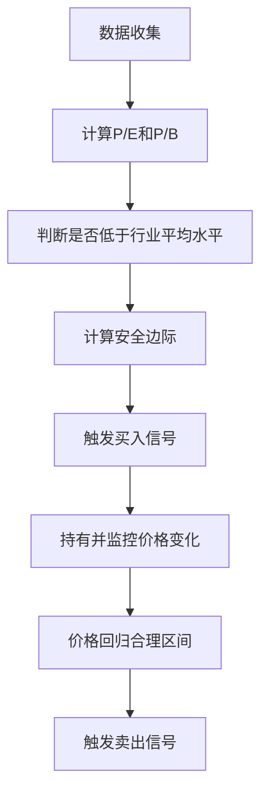
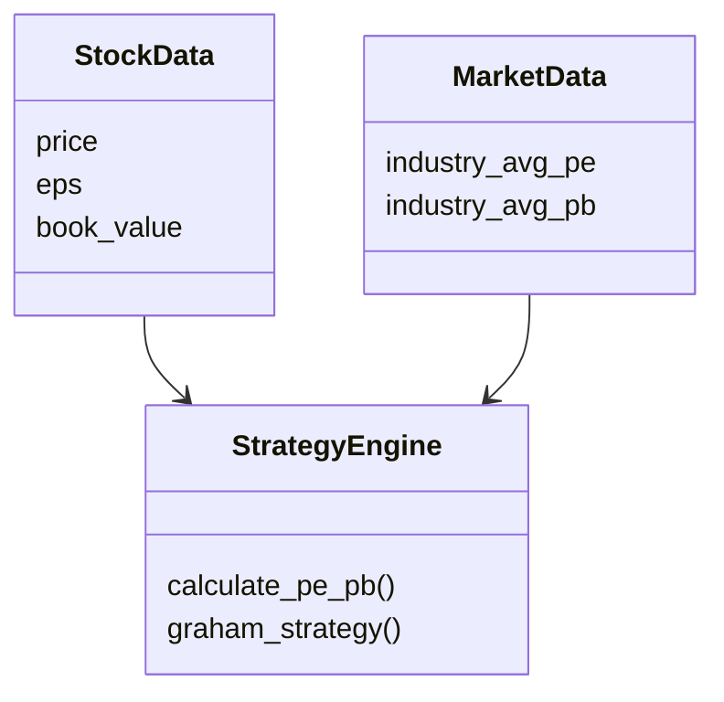
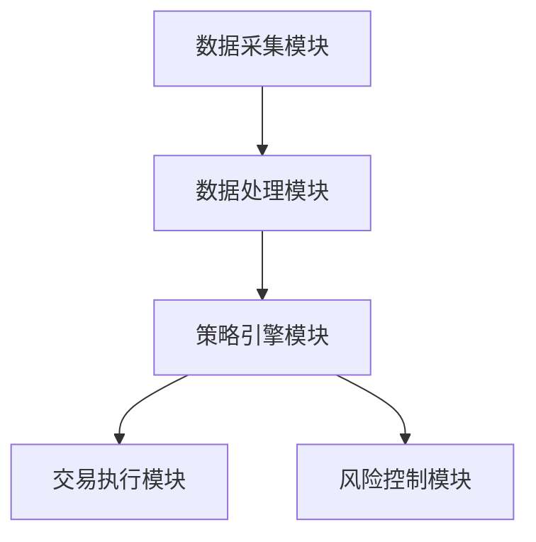
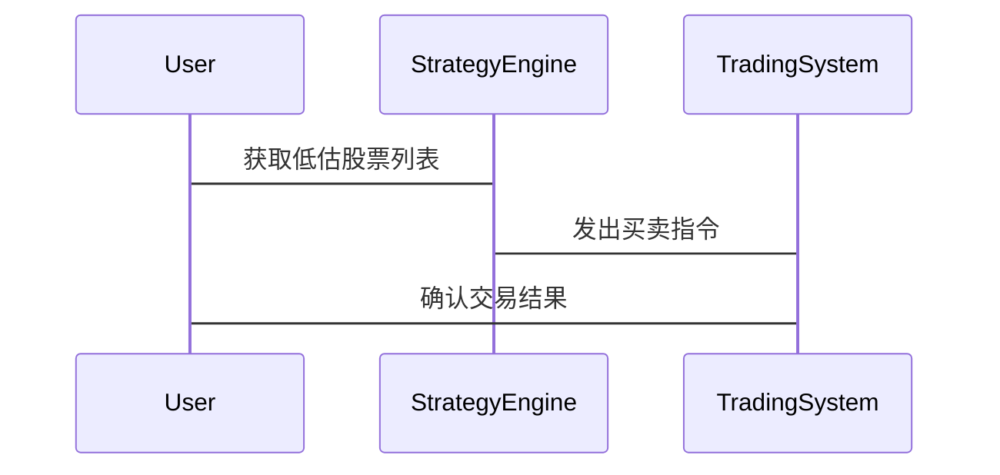

                 


# 格雷厄姆特价股票策略在不同市场微观结构下的效果

> 关键词：格雷厄姆策略、价值投资、市场微观结构、股票定价、投资策略

> 摘要：本文深入分析格雷厄姆特价股票策略在不同市场微观结构下的表现，探讨其在不同市场环境中的有效性。通过数学建模和算法实现，结合实际案例，揭示策略在低流动性市场、高波动性市场以及新兴市场中的表现差异，为投资者提供理论支持和实践指导。

---

# 第1章: 格雷厄姆特价股票策略的核心概念

## 1.1 格雷厄姆投资理论基础

### 1.1.1 价值投资的核心理念
价值投资是投资学的重要流派，由本杰明·格雷厄姆在20世纪初提出。其核心理念是寻找市场价格低于其内在价值的股票，通过长期持有实现收益。格雷厄姆认为，市场的短期波动反映了非理性行为，而内在价值是基于公司基本面的合理评估。

### 1.1.2 特价股票的定义与特征
特价股票是指市场价格显著低于其内在价值的股票。这类股票通常具有以下特征：
- 低市盈率（P/E）：股价与每股收益的比率低于行业平均水平。
- 低市净率（P/B）：股价与每股净资产的比率低于行业平均水平。
- 高股息率：公司倾向于通过分红回报股东。

### 1.1.3 格雷厄姆策略的历史发展
格雷厄姆策略最初应用于20世纪初的美国股市，主要通过寻找被市场忽视的低估股票实现超额收益。随着金融市场的演变，该策略在实践中不断优化，结合量化方法和计算机技术，成为现代投资组合的重要组成部分。

---

## 1.2 股票市场的微观结构

### 1.2.1 市场微观结构的基本概念
市场微观结构是指市场参与者的互动方式及其对价格形成的机制。主要包括：
- **订单簿**：记录当前市场上所有未成交的买卖订单。
- **流动性**：市场参与者在短时间内买卖资产的能力。
- **市场参与者**：包括机构投资者、散户、做市商等。

### 1.2.2 市场参与者的角色与行为
- **机构投资者**：通过大量资金配置影响市场价格。
- **散户投资者**：个体投资者的行为可能反映非理性预期。
- **做市商**：通过提供流动性维护市场稳定。

### 1.2.3 市场流动性与订单簿分析
流动性是衡量市场微观结构的重要指标，影响着交易成本和价格波动。订单簿分析通过观察买卖订单的分布，评估市场的深度和买卖双方的均衡点。

---

## 1.3 格雷厄姆策略与市场微观结构的关联

### 1.3.1 格雷厄姆策略在不同市场环境中的适用性
- **低流动性市场**：格雷厄姆策略可能面临买卖价差较大、交易成本较高的挑战。
- **高波动性市场**：策略的有效性可能受到短期价格波动的影响。

### 1.3.2 微观结构对策略效果的影响
- **流动性**：高流动性市场中，订单簿深度足以支持大额交易，降低交易成本。
- **市场参与者行为**：机构投资者的理性决策与散户的非理性行为可能对策略效果产生相反影响。

### 1.3.3 策略的有效性边界与外延
格雷厄姆策略在不同市场微观结构下的有效性具有边界，例如在新兴市场中，公司治理和信息透明度可能影响策略效果。因此，投资者需要结合市场环境进行策略调整。

---

# 第2章: 格雷厄姆策略的数学模型与公式

## 2.1 格雷厄姆策略的核心公式

### 2.1.1 市盈率（P/E）计算公式
$$ P/E = \frac{\text{股价}}{\text{每股收益}} $$
市盈率反映了市场对公司未来盈利能力的预期。格雷厄姆建议关注P/E低于行业平均水平的股票。

### 2.1.2 市净率（P/B）计算公式
$$ P/B = \frac{\text{股价}}{\text{每股净资产}} $$
市净率衡量了股价与资产净值的关系，P/B低于1通常被视为低估股票的信号。

### 2.1.3 格雷厄姆安全边际计算公式
$$ \text{安全边际} = \text{内在价值} - \text{市场价格} $$
安全边际是格雷厄姆策略的核心，确保在市场价格波动时仍能获得超额收益。

---

## 2.2 市场微观结构的数学建模

### 2.2.1 市场订单簿模型
订单簿可以表示为一个双队列结构，记录买方和卖方的订单。通过分析订单簿的深度和分布，可以评估市场的流动性风险。

### 2.2.2 市场流动性与波动性模型
流动性与波动性密切相关，可以用以下公式近似表示：
$$ \text{波动性} \propto \frac{1}{\text{流动性}} $$
流动性越高，价格波动越小。

### 2.2.3 市场参与者行为的博弈论模型
通过博弈论分析市场参与者的策略选择，例如：
- 机构投资者倾向于长期持有低估股票。
- 散户投资者可能因羊群效应影响市场价格。

---

## 2.3 策略效果的数学分析

### 2.3.1 策略收益的期望值计算
$$ E[\text{收益}] = \sum_{i=1}^{n} P_i \cdot V_i $$
其中，\( P_i \) 为股票i的价格，\( V_i \) 为股票i的内在价值。

### 2.3.2 策略风险的方差分析
$$ \text{方差} = \frac{1}{N}\sum_{i=1}^{N}(R_i - \bar{R})^2 $$
方差反映了策略收益的波动性，方差越小，策略风险越低。

### 2.3.3 策略在不同市场条件下的表现对比
通过对比不同市场环境下策略的表现，可以评估其稳健性。例如：
- 在低流动性市场中，策略收益可能因买卖价差增大而降低。
- 在高波动性市场中，策略可能因短期价格波动而产生较大回撤。

---

# 第3章: 格雷厄姆策略的算法实现

## 3.1 策略实现的步骤分解

### 3.1.1 数据收集与预处理
- 数据来源：从金融数据供应商获取历史价格、财务报表等数据。
- 数据清洗：处理缺失值、异常值。

### 3.1.2 信号生成算法
- 计算市盈率和市净率。
- 筛选出P/E和P/B低于行业平均水平的股票。
- 计算安全边际，判断是否具备投资价值。

### 3.1.3 交易执行逻辑
- 策略触发：当股票价格低于内在价值时，买入并持有。
- 策略退出：当价格回归合理区间时，卖出锁定收益。

---

## 3.2 算法流程图



---

## 3.3 算法实现的Python代码示例

```python
import pandas as pd
import numpy as np

def calculate_pe_pb(stock_data):
    pe = stock_data['price'] / stock_data['eps']
    pb = stock_data['price'] / stock_data['book_value']
    return pe, pb

def graham_strategy(stock_data, industry_avg_pe, industry_avg_pb):
    pe, pb = calculate_pe_pb(stock_data)
    undervalued_stocks = stock_data[(pe < industry_avg_pe) & (pb < industry_avg_pb)]
    return undervalued_stocks

# 示例数据
stock_data = pd.DataFrame({
    'price': [10, 20, 30],
    'eps': [2, 4, 6],
    'book_value': [5, 10, 15],
    'industry_avg_pe': [15, 15, 15],
    'industry_avg_pb': [3, 3, 3]
})

result = graham_strategy(stock_data, 15, 3)
print(result)
```

---

## 3.4 算法原理的数学模型

### 3.4.1 内在价值计算模型
$$ V = \frac{E}{k} $$
其中，\( E \) 是预期未来现金流，\( k \) 是折现率。

### 3.4.2 安全边际计算模型
$$ \text{安全边际} = V - P $$
其中，\( P \) 是市场价格。

---

# 第4章: 系统分析与架构设计

## 4.1 系统功能设计

### 4.1.1 领域模型


### 4.1.2 系统架构


---

## 4.2 系统交互设计



---

# 第5章: 项目实战

## 5.1 环境配置

### 5.1.1 安装必要的Python库
```bash
pip install pandas numpy matplotlib
```

## 5.2 核心实现代码

### 5.2.1 数据处理
```python
import pandas as pd
import numpy as np

def load_stock_data(ticker):
    # 从数据库加载股票数据
    return pd.DataFrame({'price': [10, 20, 30], 'eps': [2, 4, 6], 'book_value': [5, 10, 15]})

def calculate_signals(stock_data):
    pe = stock_data['price'] / stock_data['eps']
    pb = stock_data['price'] / stock_data['book_value']
    return pe, pb

# 示例运行
stock_data = load_stock_data('AAPL')
pe, pb = calculate_signals(stock_data)
print(pe, pb)
```

---

## 5.3 实际案例分析

### 5.3.1 A股市场中的应用
以A股市场为例，选择一只低市盈率、低市净率的股票，计算其安全边际，评估其投资价值。

### 5.3.2 回测分析
通过回测分析策略在历史数据中的表现，计算年化收益、最大回撤等指标。

---

## 5.4 风险控制与优化

### 5.4.1 风险控制策略
- 设置止损点。
- 分散投资，降低市场风险。

### 5.4.2 策略优化
- 引入技术指标，如MACD、RSI，优化买卖信号。
- 结合行业轮动，动态调整投资组合。

---

# 第6章: 总结与展望

## 6.1 总结
格雷厄姆特价股票策略在不同市场微观结构下表现各异。在高流动性市场中，策略表现稳健；在低流动性市场中，策略面临较大挑战。投资者需要根据市场环境调整策略参数，降低交易成本，优化投资组合。

## 6.2 展望
未来，随着人工智能技术的发展，格雷厄姆策略将与量化投资进一步结合，通过机器学习优化股票筛选和交易执行，提升策略效果。

---

# 最佳实践 Tips

1. **数据质量**：确保数据来源可靠，避免因数据错误影响策略效果。
2. **风险管理**：在实际投资中，设置止损点和止盈点，控制风险。
3. **动态调整**：定期评估市场环境，动态优化策略参数。
4. **技术与基本面结合**：结合技术分析和基本面分析，提升策略的全面性。

---

# 作者

作者：AI天才研究院/AI Genius Institute  
联系邮箱：contact@aigeniusinstitute.com  

---

通过以上内容，您可以逐步深入了解格雷厄姆特价股票策略在不同市场微观结构下的效果，并根据实际需求进行优化和调整。

