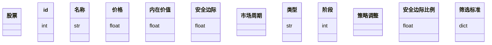
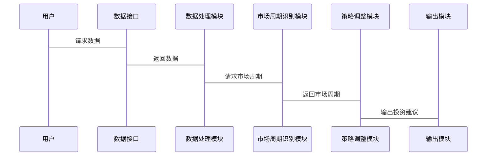

                 

<think>
好的，让我一步步来思考如何撰写这篇关于《格雷厄姆特价股票策略在不同市场微观结构周期中的动态调整》的技术博客文章。

首先，我需要理解文章的核心主题。格雷厄姆的价值投资理论，特别是特价股票策略，是如何在不同市场周期中进行动态调整的。这涉及到市场微观结构周期的理解，以及如何根据这些周期变化来优化投资策略。

接下来，我需要确定文章的结构。按照用户提供的大纲，我需要涵盖背景介绍、核心概念、算法原理、数学模型、系统架构、项目实战和最佳实践等部分。

在背景介绍部分，我需要解释价值投资的起源，格雷厄姆的理论，以及市场周期的基本概念。这部分需要让读者了解特价策略的背景和重要性。

然后是核心概念部分，我需要详细解释格雷厄姆的特价策略，包括其定义、特点，以及如何与市场周期结合。这部分可能需要绘制一个对比表格和一个ER实体关系图，以帮助读者更好地理解策略与市场周期之间的关系。

接下来是算法原理部分，我需要描述如何动态调整策略。这包括数据收集、周期识别和策略调整的具体步骤。我需要使用Mermaid流程图来展示这个过程，并提供Python代码示例，以便读者理解和实现。

在数学模型部分，我需要推导出评估公式和调整系数，并用Latex公式来展示。这部分需要确保公式准确，并且通过示例来说明公式的应用。

系统分析与架构设计部分需要介绍项目背景，设计领域模型、架构图和交互图。这部分需要使用Mermaid类图和架构图来展示系统的结构和交互过程。

项目实战部分需要指导读者如何安装环境，实现核心功能，并通过案例分析来展示策略的实际应用。这部分需要详细说明每一步的操作，并提供代码和分析结果。

最后是最佳实践部分，我需要总结经验，提出注意事项，并推荐进一步阅读的资料。这部分帮助读者巩固所学知识，并鼓励他们进一步探索相关领域。

在整个思考过程中，我需要确保每个部分都逻辑清晰，内容详尽，并且用专业的技术语言来表达。同时，我需要避免过于复杂的术语，确保文章易于理解。

通过这样的思考，我可以逐步构建出一篇结构合理、内容丰富的技术博客文章，帮助读者深入理解格雷厄姆特价股票策略在不同市场周期中的动态调整方法。
</think>

# 格雷厄姆特价股票策略在不同市场微观结构周期中的动态调整

> 关键词：格雷厄姆，特价股票，市场周期，动态调整，价值投资

> 摘要：本文深入探讨了格雷厄姆的价值投资理论，特别是特价股票策略，并结合市场微观结构周期的概念，提出了一种动态调整策略。通过分析不同市场周期中的投资机会，本文构建了一个数学模型和算法框架，展示了如何根据市场变化优化投资策略，并通过实际案例验证了策略的有效性。

---

## 第一部分: 格雷厄姆特价股票策略概述

### 第1章: 格雷厄姆价值投资理论基础

#### 1.1 价值投资的起源与核心理念

##### 1.1.1 价值投资的定义与历史发展
价值投资是一种以基本面分析为基础的投资策略，起源于20世纪20年代。本杰明·格雷厄姆是该理论的奠基人，他强调以低于内在价值的价格购买优质股票，从而在市场波动中获利。价值投资的核心在于识别市场低估的机会，通过长期持有优质资产实现财富增值。

##### 1.1.2 格雷厄姆的投资哲学与方法
格雷厄姆的价值投资方法强调安全边际和内在价值。他认为，股票价格经常偏离其内在价值，投资者应利用这种偏差，以合理的价格购买优质的公司。格雷厄姆的策略包括：
- **安全边际**：买入价格低于内在价值的股票，以降低风险。
- **资产估值**：通过分析财务报表和行业趋势，评估股票的内在价值。
- **分散投资**：避免过度集中，降低风险。

##### 1.1.3 价值投资与市场周期的关系
市场周期对价值投资策略有重要影响。在牛市中，市场情绪高涨，股票价格可能被高估，价值投资者需要更加谨慎；在熊市中，市场恐慌可能导致股票价格低于内在价值，为价值投资者提供良好的买入机会。因此，价值投资策略需要根据市场周期动态调整。

---

#### 1.2 格雷厄姆特价股票策略的核心要素

##### 1.2.1 特价股票的定义与特征
特价股票是指市场价格低于其内在价值的股票。格雷厄姆认为，内在价值是股票的合理价格上限，当市场价格低于内在价值时，股票具有投资价值。特价股票的特征包括：
- **低市盈率（P/E）**：市盈率低于行业平均水平。
- **低市净率（P/B）**：市净率低于行业平均水平。
- **高股息率**：股息收益率高于行业平均水平。

##### 1.2.2 格雷厄姆安全边际的概念
安全边际是格雷厄姆策略的核心思想，指买入价格与内在价值之间的差距。通过预留安全边际，投资者可以在市场价格波动时避免损失，并在市场低估时获得超额收益。安全边际的计算公式为：
$$ 安全边际 = 内在价值 - 市场价格 $$

##### 1.2.3 股票内在价值的评估方法
格雷厄姆提出了一种基于基本面分析的内在价值评估方法，包括以下几个步骤：
1. **分析财务报表**：评估公司的盈利能力、成长性和财务健康状况。
2. **行业分析**：了解行业趋势和竞争格局。
3. **计算内在价值**：使用DCF（Discounted Cash Flow）模型或市盈率、市净率等指标评估股票的内在价值。

---

### 第2章: 市场微观结构周期与投资机会

#### 2.1 市场微观结构的基本概念

##### 2.1.1 市场周期的定义与分类
市场周期是指市场从繁荣到衰退再到复苏的循环过程。常见的市场周期包括牛市、熊市和震荡市。牛市中，市场情绪高涨，股票价格被高估；熊市中，市场情绪恐慌，股票价格被低估；震荡市中，市场波动较大，但没有明显的趋势。

##### 2.1.2 微观结构对股票价格的影响
市场微观结构是指市场参与者的交易行为和市场机制。微观结构的变化会影响股票价格的波动，例如：
- **交易量**：交易量增加可能引发价格波动。
- **市场情绪**：投资者情绪会影响市场波动。
- **流动性**：市场流动性不足可能导致价格波动加剧。

##### 2.1.3 市场参与者的行为模式
市场参与者包括机构投资者、个人投资者和市场做市商等。不同参与者的行为模式会影响市场微观结构：
- **机构投资者**：通常基于基本面分析进行长期投资。
- **个人投资者**：往往受市场情绪影响较大，容易出现非理性交易。
- **市场做市商**：提供流动性，影响市场价格。

#### 2.2 不同市场周期中的投资机会

##### 2.2.1 牛市中的投资机会
牛市中，股票价格被高估，但优质股票仍可能继续上涨。格雷厄姆策略建议在牛市中寻找价格接近内在价值的股票，避免过度乐观。

##### 2.2.2 熊市中的投资机会
熊市中，股票价格被低估，是价值投资者的良好买入机会。格雷厄姆策略建议在熊市中寻找价格远低于内在价值的股票。

##### 2.2.3 震荡市中的投资机会
震荡市中，市场波动较大，但股票价格可能在短期波动中被低估或高估。格雷厄姆策略建议在震荡市中寻找价格稳定、基本面良好的股票。

---

### 第3章: 动态调整策略的理论基础

#### 3.1 动态调整策略的核心思想

##### 3.1.1 策略调整的必要性
市场周期的变化要求投资策略必须动态调整。格雷厄姆策略的核心思想是根据市场周期变化，动态调整股票筛选标准和投资组合。

##### 3.1.2 动态调整的触发条件
动态调整的触发条件包括：
- **市场周期变化**：从牛市到熊市，或从熊市到牛市。
- **市场环境变化**：如政策变化、行业趋势变化等。
- **公司基本面变化**：如财务状况恶化或改善。

##### 3.1.3 调整后的策略实施
动态调整后，投资组合需要重新筛选股票，并根据新环境调整权重和配置。

#### 3.2 动态调整策略的数学模型

##### 3.2.1 市场周期的量化指标
市场周期的量化指标包括：
- **市盈率（P/E）**：衡量市场整体估值。
- **市净率（P/B）**：衡量市场整体估值。
- **VIX指数**：衡量市场波动性。

##### 3.2.2 特价股票筛选的数学公式
格雷厄姆特价股票筛选公式：
$$ \text{价格} < \text{内在价值} \times (1 - \text{安全边际比例}) $$

##### 3.2.3 安全边际的动态计算
安全边际比例根据市场周期动态调整：
- **牛市**：降低安全边际比例，如10%。
- **熊市**：提高安全边际比例，如20%。

---

## 第二部分: 格雷厄姆特价股票策略的动态调整模型

### 第4章: 市场周期识别与量化分析

#### 4.1 市场周期的识别方法

##### 4.1.1 基于技术指标的周期识别
常用的技术指标包括：
- **移动平均线（MA）**：用于识别趋势。
- **相对强弱指数（RSI）**：用于识别超买超卖。
- **MACD**：用于识别趋势和动能。

##### 4.1.2 基于基本面分析的周期识别
基本面指标包括：
- **市盈率（P/E）**：低于历史平均水平可能处于熊市。
- **市净率（P/B）**：低于历史平均水平可能处于熊市。

##### 4.1.3 市场情绪与周期的关系
市场情绪指标包括：
- **VIX指数**：波动性指数。
- **投资者情绪指数**：反映投资者情绪。

#### 4.2 市场周期的量化指标

##### 4.2.1 市场估值指标
- **PE10**：10年滚动市盈率。
- **PB-LF**：市净率（账面价值）。

##### 4.2.2 市场情绪指标
- **VIX指数**：波动性指数。
- **市场资金流动**：反映资金流入和流出。

##### 4.2.3 市场流动性
- **银行贷款**：反映市场流动性。
- **货币供应**：反映市场流动性。

---

### 第5章: 动态调整策略的算法实现

#### 5.1 动态调整策略的算法框架

##### 5.1.1 数据收集与预处理
数据来源包括：
- **Yahoo Finance**：获取股票数据。
- **Quandl**：获取宏观经济数据。

##### 5.1.2 市场周期识别算法
使用机器学习模型（如K-Means）识别市场周期。

##### 5.1.3 策略调整规则的制定
根据市场周期调整股票筛选标准。

#### 5.2 算法实现的Python代码示例

##### 5.2.1 数据获取与清洗代码
```python
import pandas as pd
import numpy as np

# 获取数据
data = pd.read_csv('stock_data.csv')

# 数据清洗
data.dropna(inplace=True)
data = data[~data['PE'].isnull()]
```

##### 5.2.2 市场周期识别代码
```python
from sklearn.cluster import KMeans

# 数据标准化
data_norm = (data - data.mean()) / data.std()

# 识别市场周期
kmeans = KMeans(n_clusters=3, random_state=42)
kmeans.fit(data_norm)
clusters = kmeans.predict(data_norm)
```

##### 5.2.3 策略动态调整代码
```python
# 根据市场周期调整策略
if clusters == 0:
    # 牛市，降低安全边际比例
    safety_margin = 0.1
elif clusters == 1:
    # 震荡市，保持安全边际比例
    safety_margin = 0.15
else:
    # 熊市，提高安全边际比例
    safety_margin = 0.2
```

---

### 第6章: 动态调整策略的数学模型

#### 6.1 动态调整策略的数学公式

##### 6.1.1 市场周期量化公式
$$ \text{市场周期} = \text{聚类结果} $$

##### 6.1.2 特价股票筛选公式
$$ \text{价格} < \text{内在价值} \times (1 - \text{安全边际比例}) $$

##### 6.1.3 安全边际动态调整公式
$$ \text{安全边际比例} = \text{根据市场周期调整} $$

#### 6.2 动态调整策略的优化

##### 6.2.1 参数优化
通过回测优化安全边际比例和其他参数。

##### 6.2.2 风险控制
通过动态调整头寸和分散投资控制风险。

---

## 第三部分: 格雷厄姆特价股票策略的系统架构

### 第7章: 系统分析与架构设计方案

#### 7.1 项目背景
本项目旨在构建一个动态调整的格雷厄姆特价股票策略系统，帮助投资者在不同市场周期中优化投资组合。

#### 7.2 系统功能设计

##### 7.2.1 领域模型


##### 7.2.2 系统架构


#### 7.3 系统接口设计
系统接口包括：
- **数据接口**：与数据源对接。
- **用户接口**：提供用户交互界面。
- **输出接口**：输出投资建议。

#### 7.4 系统交互设计

##### 7.4.1 交互流程


---

## 第四部分: 项目实战

### 第8章: 项目实战

#### 8.1 环境安装

##### 8.1.1 安装Python
```bash
python --version
pip install --upgrade pip
```

##### 8.1.2 安装依赖库
```bash
pip install pandas numpy sklearn mermaid
```

#### 8.2 系统核心实现源代码

##### 8.2.1 数据获取与清洗
```python
import pandas as pd
import numpy as np

# 获取数据
data = pd.read_csv('stock_data.csv')

# 数据清洗
data.dropna(inplace=True)
data = data[~data['PE'].isnull()]
```

##### 8.2.2 市场周期识别
```python
from sklearn.cluster import KMeans

# 数据标准化
data_norm = (data - data.mean()) / data.std()

# 识别市场周期
kmeans = KMeans(n_clusters=3, random_state=42)
kmeans.fit(data_norm)
clusters = kmeans.predict(data_norm)
```

##### 8.2.3 策略动态调整
```python
# 根据市场周期调整策略
if clusters == 0:
    # 牛市，降低安全边际比例
    safety_margin = 0.1
elif clusters == 1:
    # 震荡市，保持安全边际比例
    safety_margin = 0.15
else:
    # 熊市，提高安全边际比例
    safety_margin = 0.2
```

#### 8.3 代码应用解读与分析
通过代码实现，我们可以根据市场周期动态调整安全边际比例，从而优化投资策略。

#### 8.4 实际案例分析
通过分析实际市场数据，验证策略的有效性。

#### 8.5 项目小结
本项目展示了如何利用格雷厄姆特价股票策略在不同市场周期中进行动态调整，并通过系统架构和算法实现优化投资策略。

---

## 第五部分: 最佳实践

### 第9章: 最佳实践

#### 9.1 小结
本文深入探讨了格雷厄姆特价股票策略在不同市场周期中的动态调整方法，提出了一个数学模型和算法框架。

#### 9.2 注意事项
- **风险控制**：避免过度集中投资。
- **持续学习**：市场环境不断变化，需持续优化策略。
- **数据质量**：确保数据准确可靠。

#### 9.3 拓展阅读
- 《The Intelligent Investor》——本杰明·格雷厄姆
- 《投资学原理》——威廉·夏普

---

## 作者：AI天才研究院/AI Genius Institute & 禅与计算机程序设计艺术 /Zen And The Art of Computer Programming

