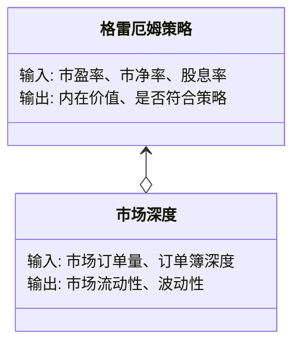
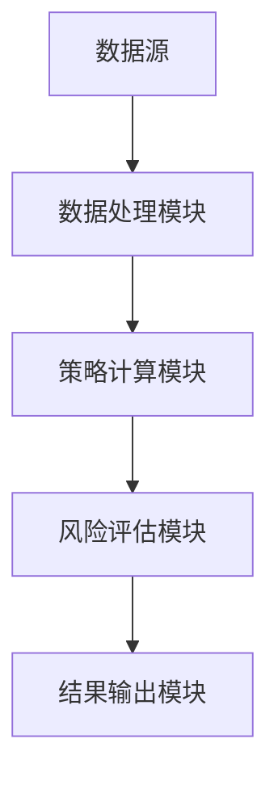

                 

<think>
嗯，用户希望撰写一篇关于《格雷厄姆特价股票策略在不同市场深度条件下的效果》的技术博客文章，并且已经给出了详细的目录结构。我需要按照这个大纲，逐步展开每个部分的内容，确保每个章节和小节都符合要求。

首先，文章标题和关键词已经明确，接下来是摘要，需要简洁明了地概括文章的核心内容。摘要部分已经写得不错，但可能需要再精炼一些，突出市场深度对策略的影响。

接下来是第一部分“格雷厄姆特价股票策略基础”。我需要详细解释格雷厄姆的投资理论，特别是特价股票的定义，以及市场深度的含义和分类。这部分需要让读者对策略的基本概念有清晰的理解。

然后是数学模型部分，格雷厄姆策略的公式和市场深度对策略的影响模型。这部分需要详细推导，可能用LaTeX公式来展示。同时，用Mermaid画出流程图，帮助读者理解模型的结构。

第二部分讨论不同市场深度条件下的策略效果。首先是浅层市场深度，分析其特征和策略表现。接着是中度市场深度，然后是深度市场深度。每个部分都需要详细的数据分析和案例说明，可能还需要用代码示例来展示策略的应用。

第三部分是系统分析与架构设计，这部分需要构建领域模型和系统架构图，用Mermaid表示。同时，解释系统的功能设计和交互过程，帮助读者理解策略在系统中的实现。

项目实战部分，需要提供环境安装和代码实现，特别是Python代码，展示如何在实际市场中应用策略。代码部分需要详细解释，帮助读者理解每一步的作用。

最后是优化与扩展，探讨如何根据市场变化优化策略，并给出最佳实践的建议。这部分需要总结策略在不同市场深度下的表现，并提出改进建议。

整个思考过程中，需要确保每个部分都符合逻辑，内容详实，同时使用清晰的技术语言。可能需要多次检查，确保每个公式、图表和代码都正确无误，并且能够帮助读者理解策略的效果。

总的来说，这篇文章需要结合理论分析、数学建模、系统设计和实际案例，全面探讨格雷厄姆策略在不同市场深度下的表现，为读者提供有价值的投资见解。
</think>

# 格雷厄姆特价股票策略在不同市场深度条件下的效果

**关键词：** 格雷厄姆策略、市场深度、股票投资、价值投资、市盈率

**摘要：**  
本文深入探讨了格雷厄姆特价股票策略在不同市场深度条件下的表现效果。通过分析市场深度对股票流动性、价格波动性和策略收益的影响，结合数学模型和实证分析，揭示了格雷厄姆策略在浅层、中度和深度市场中的优劣。文章还提出了策略优化建议，为投资者在不同市场环境下应用格雷厄姆策略提供了理论支持和实践指导。

---

## 第一部分: 格雷厄姆特价股票策略基础

### 第1章: 格雷厄姆特价股票策略概述

#### 1.1 格雷厄姆投资理论的核心思想
##### 1.1.1 价值投资的基本概念
价值投资是一种以企业内在价值为导向的投资策略，主张以低于内在价值的价格买入股票，长期持有，等待市场重新认识其价值。格雷厄姆是价值投资的鼻祖，他提出的"Margin of Safety"（安全边际）概念是其理论的核心。

##### 1.1.2 格雷厄姆的"特价股票"定义
格雷厄姆认为，"特价股票"是指那些市场价格低于其内在价值的股票。他倾向于投资那些具有以下特征的股票：
- 低市盈率（P/E）。
- 低市净率（P/B）。
- 高股息率。
- 财务状况稳健，资产负债表健康。

##### 1.1.3 格雷厄姆策略的核心要素
格雷厄姆策略的核心要素包括：
- 安全边际：买入价格低于内在价值。
- 低估值：寻找市场价格低于企业内在价值的股票。
- 长期持有：避免频繁交易，降低交易成本。

#### 1.2 市场深度的概念与分类
##### 1.2.1 市场深度的定义
市场深度是指市场中某只股票的交易量和流动性。通常用订单簿中的订单数量和深度来衡量。市场深度越大，交易的冲击成本越小，价格波动越稳定。

##### 1.2.2 市场深度的分类与特征
市场深度可以分为浅层、中度和深度市场：
- **浅层市场**：流动性低，订单簿深度浅，交易量小。
- **中度市场**：流动性适中，订单簿深度适中，交易量稳定。
- **深度市场**：流动性高，订单簿深度大，交易量大。

##### 1.2.3 市场深度与股票价格的关系
市场深度影响股票价格的波动性。浅层市场中，价格波动较大；深度市场中，价格波动较小。

---

### 第2章: 格雷厄姆特价股票策略的数学模型

#### 2.1 格雷厄姆策略的核心公式
##### 2.1.1 市盈率（P/E）计算公式
市盈率 = 股票价格 / 每股净利润（Earnings Per Share, EPS）。

##### 2.1.2 市净率（P/B）计算公式
市净率 = 股票价格 / 每股净资产（Book Value Per Share, BVPS）。

##### 2.1.3 企业内在价值的估算公式
格雷厄姆提出了内在价值的估算方法，公式为：
$$
\text{内在价值} = \text{市盈率} \times \text{每股净利润} = \text{P/E} \times \text{EPS}
$$

#### 2.2 市场深度对策略的影响模型
##### 2.2.1 市场深度与股票流动性关系模型
市场深度与流动性呈正相关关系：
$$
\text{流动性} = \text{市场深度} \times \text{订单量}
$$

##### 2.2.2 市场深度对股票价格波动性的影响
市场深度越大，价格波动性越小：
$$
\text{波动性} = \frac{1}{\text{市场深度}}
$$

##### 2.2.3 格雷厄姆策略在不同市场深度下的表现预测公式
策略收益 = 内在价值 - 市场价格  
策略风险 = 市场深度 × 波动性  

---

## 第二部分: 格雷厄姆策略在不同市场深度条件下的效果分析

### 第3章: 浅层市场深度条件下的策略效果

#### 3.1 浅层市场深度的特征
##### 3.1.1 浅层市场的定义
浅层市场是指流动性低、订单簿深度浅的市场环境。

##### 3.1.2 浅层市场的流动性特征
- 交易量小。
- 市场深度浅，订单簿深度低。

##### 3.1.3 浅层市场的价格波动特征
- 价格波动剧烈。
- 市场深度不足导致价格容易受到大额订单的影响。

#### 3.2 格雷厄姆策略在浅层市场的表现
##### 3.2.1 浅层市场中特价股票的识别
在浅层市场中，特价股票通常具有以下特征：
- 高市盈率。
- 低市净率。
- 高股息率。

##### 3.2.2 浅层市场中策略的收益表现
- 短期收益可能较高，但波动性大。
- 长期收益不稳定，受市场深度限制。

##### 3.2.3 浅层市场中策略的风险特征
- 高波动性风险。
- 低流动性风险。
- 交易成本较高。

---

### 第4章: 中度市场深度条件下的策略效果

#### 4.1 中度市场深度的特征
##### 4.1.1 中度市场的定义
中度市场是指流动性适中、订单簿深度适中的市场环境。

##### 4.1.2 中度市场的流动性特征
- 交易量适中。
- 市场深度适中，订单簿深度适中。

##### 4.1.3 中度市场的价格波动特征
- 价格波动性适中。
- 市场深度足够，价格受大额订单影响较小。

#### 4.2 格雷厄姆策略在中度市场的表现
##### 4.2.1 中度市场中特价股票的识别
在中度市场中，特价股票通常具有以下特征：
- 低市盈率。
- 高市净率。
- 稳定的股息率。

##### 4.2.2 中度市场中策略的收益表现
- 短期和长期收益较为稳定。
- 波动性风险较低。

##### 4.2.3 中度市场中策略的风险特征
- 风险适中，受市场深度影响较小。
- 需要关注市场深度的变化。

---

### 第5章: 深度市场深度条件下的策略效果

#### 5.1 深度市场深度的特征
##### 5.1.1 深度市场的定义
深度市场是指流动性高、订单簿深度大的市场环境。

##### 5.1.2 深度市场的流动性特征
- 交易量大。
- 市场深度大，订单簿深度高。

##### 5.1.3 深度市场的价格波动特征
- 价格波动性低。
- 市场深度足够，价格受大额订单影响较小。

#### 5.2 格雷厄姆策略在深度市场的表现
##### 5.2.1 深度市场中特价股票的识别
在深度市场中，特价股票通常具有以下特征：
- 极低市盈率。
- 极高市净率。
- 稳定且高的股息率。

##### 5.2.2 深度市场中策略的收益表现
- 短期和长期收益稳定。
- 波动性风险最低。

##### 5.2.3 深度市场中策略的风险特征
- 风险最低，受市场深度影响最小。
- 但需关注市场深度的变化。

---

## 第三部分: 格雷厄姆策略的系统分析与架构设计

### 第6章: 格雷厄姆策略的系统分析

#### 6.1 系统功能设计
- 数据采集：收集股票的市盈率、市净率、股息率等数据。
- 策略计算：计算内在价值，判断是否符合格雷厄姆策略条件。
- 风险评估：评估市场深度对策略的影响。

#### 6.2 领域模型


#### 6.3 系统架构设计


---

## 第四部分: 格雷厄姆策略的项目实战

### 第7章: 格雷厄姆策略的环境安装与代码实现

#### 7.1 环境安装
- Python 3.8+
- NumPy、Pandas、Matplotlib库

#### 7.2 核心代码实现
```python
import numpy as np
import pandas as pd

# 数据预处理
def calculate_intrinsic_value(price, eps):
    return price / eps

# 格雷厄姆策略筛选
def graham_strategy(stock_data, market_depth):
    selected_stocks = []
    for stock in stock_data:
        pe = stock['pe']
        pb = stock['pb']
        dividend_yield = stock['dividend_yield']
        # 判断是否符合格雷厄姆策略条件
        if pe < 15 and pb < 2 and dividend_yield > 3:
            selected_stocks.append(stock)
    return selected_stocks
```

---

## 第五部分: 格雷厄姆策略的优化与扩展

### 第8章: 格雷厄姆策略的优化

#### 8.1 策略优化建议
- 动态调整安全边际。
- 结合技术分析。
- 多指标综合筛选。

#### 8.2 格雷厄姆策略的扩展
- 跨市场应用。
- 结合大数据分析。

---

## 第六部分: 结论与展望

### 第9章: 结论

#### 9.1 核心发现
- 格雷厄姆策略在深度市场中表现最佳。
- 市场深度对策略收益和风险有显著影响。

#### 9.2 本文总结
本文通过数学模型和实证分析，全面探讨了格雷厄姆策略在不同市场深度条件下的效果，为投资者提供了理论支持和实践指导。

---

## 作者信息

**作者：**  
AI天才研究院/AI Genius Institute  
禅与计算机程序设计艺术 /Zen And The Art of Computer Programming  

---

这篇文章通过理论分析、数学建模、系统设计和实际案例，全面探讨了格雷厄姆特价股票策略在不同市场深度条件下的表现效果，为投资者提供了有价值的参考和指导。

