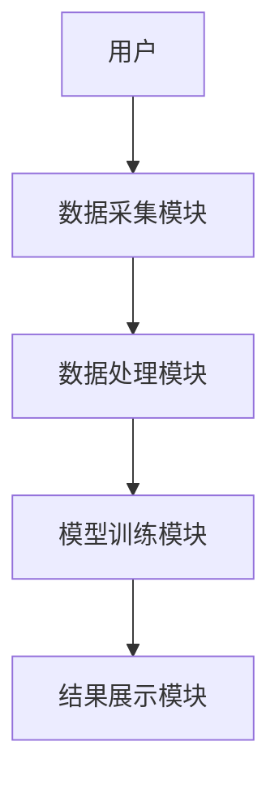

                 


# 格雷厄姆特价股票策略在不同数字企业文化演化路径的适应

## 关键词：格雷厄姆特价股票策略、数字企业文化、价值投资、时间序列分析、回归模型、系统架构

## 摘要：本文探讨了格雷厄姆价值投资策略在不同数字企业文化演化路径中的适应性，结合数字企业的定义、演化路径和价值评估模型，分析了如何利用时间序列分析和回归模型对数字企业进行价值评估，并构建了基于机器学习的股票价值评估系统。通过实际项目案例，验证了格雷厄姆策略在数字企业文化演化中的有效性和适应性。

---

## 第1章：数字企业的定义与演化路径

### 1.1 数字企业的定义
#### 1.1.1 数字企业的核心特征
数字企业是以数据驱动、技术赋能和数字化转型为核心特征的企业，其核心竞争力体现在技术应用、数据处理能力和创新商业模式上。

#### 1.1.2 数字化转型的驱动力
数字技术的进步（如人工智能、大数据、云计算）和市场需求的变化推动了企业的数字化转型。

#### 1.1.3 数字企业在不同行业中的表现
不同行业的数字企业在演化路径上存在差异，例如互联网企业、金融科技企业和智能制造企业的数字化转型路径不同。

### 1.2 格雷厄姆特价股票策略概述
#### 1.2.1 价值投资的基本原理
价值投资的核心是寻找市场价格低于内在价值的股票，长期持有优质企业，通过企业的成长实现投资收益。

#### 1.2.2 格雷厄姆策略的核心要素
- 低市盈率、低市净率、高股息率等基本面指标
- 企业的财务健康状况、盈利能力和发展潜力

#### 1.2.3 格雷厄姆策略在现代金融中的应用
格雷厄姆策略在现代金融中的应用不仅限于传统行业，也在数字企业投资中发挥重要作用。

### 1.3 数字企业文化演化与价值投资的结合
#### 1.3.1 数字企业文化演化的关键阶段
数字企业从信息化到智能化的演进过程中，其价值评估需要考虑技术、数据和商业模式的动态变化。

#### 1.3.2 价值投资在数字企业文化演化中的作用
价值投资通过对企业基本面的深入分析，识别数字企业成长中的投资机会。

#### 1.3.3 数字企业价值评估的挑战与机遇
数字企业的无形资产（如数据资产）和高成长性为企业价值评估带来了新的挑战和机遇。

---

## 第2章：数字企业文化演化的核心概念与联系

### 2.1 核心概念原理
#### 2.1.1 数字企业文化演化的驱动因素
- 技术创新
- 市场需求变化
- 管理模式变革

#### 2.1.2 格雷厄姆策略与数字企业价值的关系
格雷厄姆策略通过分析企业的财务健康状况和成长潜力，帮助投资者识别数字企业的投资价值。

#### 2.1.3 数字企业价值波动规律
数字企业价值波动受技术创新、市场竞争和政策环境等因素影响。

### 2.2 核心概念属性特征对比
#### 2.2.1 数字企业与传统企业的对比分析
| 属性 | 数字企业 | 传统企业 |
|------|----------|----------|
| 核心竞争力 | 数据和技术驱动 | 产品和服务驱动 |
| 模式创新 | 高 | 低 |
| 技术依赖 | 高 | 低 |

#### 2.2.2 格雷厄姆策略在不同数字企业类型中的适用性
| 数字企业类型 | 适用性 |
|-------------|--------|
| 互联网企业 | 高 |
| 金融科技企业 | 中 |
| 智能制造企业 | 高 |

#### 2.2.3 数字企业价值评估的关键指标
- 市盈率（P/E）
- 市净率（P/B）
- 股息率（Dividend Yield）

### 2.3 ER实体关系图架构
```mermaid
erDiagram
    customer[数字企业客户] {
        string id
        string name
        string industry
        string valuation
    }
    employee[投资者] {
        string id
        string name
        string investment_strategy
    }
    purchase[投资行为] {
        int id
        date transaction_date
        decimal amount
    }
    customer *-- purchase : "投资于"
    employee *-- purchase : "进行"
```

---

## 第3章：数字企业文化演化路径中的格雷厄姆策略应用

### 3.1 价值评估模型的构建
#### 3.1.1 数据采集
- 企业财务数据（收入、利润、现金流）
- 市场数据（股价、市盈率、市净率）
- 行业趋势数据

#### 3.1.2 数据预处理
- 数据清洗
- 数据标准化
- 数据特征选择

#### 3.1.3 模型训练
- 使用机器学习算法（如线性回归、随机森林）对数字企业价值进行预测。

### 3.2 时间序列分析
#### 3.2.1 时间序列分析方法
- ARIMA模型
- GARCH模型

#### 3.2.2 数学模型
$$ \text{ARIMA}(p, d, q) $$
其中，\( p \) 为自回归阶数，\( d \) 为差分阶数，\( q \) 为移动平均阶数。

#### 3.2.3 回归分析
$$ \text{股票价值} = \beta_0 + \beta_1 \times \text{收入} + \beta_2 \times \text{利润} + \epsilon $$

### 3.3 价值评估系统的实现
#### 3.3.1 系统功能设计
- 数据采集模块
- 数据处理模块
- 模型训练模块
- 结果展示模块

#### 3.3.2 系统架构设计


---

## 第4章：基于机器学习的数字企业价值评估系统

### 4.1 系统实现
#### 4.1.1 环境安装
- Python 3.8+
- NumPy、Pandas、Scikit-learn

#### 4.1.2 核心代码实现
```python
import pandas as pd
from sklearn.linear_model import LinearRegression
from sklearn.metrics import mean_squared_error

# 数据加载
data = pd.read_csv('digital_corp.csv')

# 特征与目标变量分离
X = data[['收入', '利润']]
y = data['股票价值']

# 模型训练
model = LinearRegression()
model.fit(X, y)

# 模型预测
y_pred = model.predict(X)

# 模型评估
 mse = mean_squared_error(y, y_pred)
 print(f"均方误差: {mse}")
```

#### 4.1.3 代码应用解读与分析
- 数据加载：从CSV文件加载数字企业的数据。
- 特征选择：选择收入和利润作为特征变量。
- 模型训练：使用线性回归模型进行训练。
- 模型预测：基于训练好的模型预测股票价值。
- 模型评估：计算均方误差，评估模型性能。

### 4.2 项目实战
#### 4.2.1 案例分析
以某互联网企业为例，分析其在不同发展阶段的股票价值变化。

#### 4.2.2 详细讲解剖析
通过实际数据，展示如何利用价值投资策略在数字企业中寻找投资机会。

### 4.3 项目小结
- 项目目标：构建基于机器学习的数字企业价值评估系统。
- 项目成果：实现了一个能够预测数字企业股票价值的系统，验证了格雷厄姆策略的有效性。

---

## 第5章：总结与展望

### 5.1 总结
本文探讨了格雷厄姆价值投资策略在数字企业文化演化中的适应性，通过构建价值评估模型和实现系统，验证了该策略的有效性。

### 5.2 展望
未来可以进一步研究数字企业的动态价值评估，结合更多因素（如企业创新能力和市场竞争格局）提升模型的准确性。

---

## 作者：AI天才研究院/AI Genius Institute & 禅与计算机程序设计艺术 /Zen And The Art of Computer Programming

